# Part 3 — Spring & Spring Boot Ecosystem

> **Sprint allocation:** Week 2 (solo — biggest 🔴 Part). **Budget: ~10-12 hrs.**

## 3 Spring & Spring Boot — topic inventory

| # | Topic | Tags | Tier | Time | Done | Partial | Grilling | Visit Again | Notes | Resources |
|---|-------|------|------|------|------|---|----------|-------------|-------|-----------|
| 1 | IoC container, beans, scopes (singleton, prototype, request, session) | 🔴 💼 | M | 45 min | [x] | [ ] | [ ] | [ ] | Done after quick revision | 📖 `spring/spring_core/ioc_container/index.md` · 💻 `spring/spring_core/ioc_container/exercise/index.md` |
| 2 | Dependency injection — constructor vs field vs setter | 🔴 💼 | L | 50 min | [x] | [ ] | [ ] | [ ] | Done after quick revision | 📖 `spring/spring_core/dependency_injection/index.md` · 💻 `spring/spring_core/dependency_injection/exercise/index.md` |
| 3 | Bean lifecycle — @PostConstruct, @PreDestroy, BeanPostProcessor | 🔴 💼 | M | 1 hr 20 min | [x] | [ ] | [ ] | [ ] | Done after quick revision | 📖 `spring/spring_core/bean_lifecycle/index.md` · 💻 `spring/spring_core/bean_lifecycle/exercise/index.md` |
| 4 | Auto-configuration — how it actually works (@EnableAutoConfiguration, conditions) | 🔴 💼 | D | 1.5 hrs | [x] | [ ] | [ ] | [ ] | Done after quick revision | 📖 `spring_boot/auto_configuration/index.md` · 💻 `spring_boot/auto_configuration/exercise/index.md` |
| 5 | MVC — DispatcherServlet, handler mapping, controller, view resolution | 🔴 💼 | D | 1.5 hrs | [x] | [ ] | [ ] | [ ] | Done after quick revision | 📖 `spring/spring_web/mvc/index.md` · 💻 `spring/spring_web/mvc/exercise/index.md` |
| 6 | REST — @RestController, @RequestBody, @PathVariable, validation | 🔴 💼 | MP | 1.5 hrs | [x] | [ ] | [ ] | [ ] | Done after quick revision | 📖 `spring/spring_web/rest/index.md` · 💻 `spring/spring_web/rest/exercise/index.md` |
| 7 | Exception handling — @ExceptionHandler, @ControllerAdvice, ResponseEntity | 🔴 💼 | MP | 1.5 hrs | [x] | [ ] | [ ] | [ ] | Done after quick revision | 📖 `spring/spring_web/exception_handling/index.md` · 💻 `spring/spring_web/exception_handling/exercise/index.md` |
| 8 | Repository hierarchy — CrudRepository, JpaRepository | 🔴 💼 | M | 1 hr | [x] | [ ] | [ ] | [ ] | Done after quick revision | 📖 `spring/spring_data/jpa_repository/index.md` · 💻 `spring/spring_data/jpa_repository/exercise/index.md` |
| 9 | Derived queries, @Query (JPQL), native queries | 🔴 💼 | MP | 1.5 hrs | [x] | [ ] | [ ] | [ ] | Done after quick revision | 📖 `spring/spring_data/derived_queries/index.md` · 💻 `spring/spring_data/derived_queries/exercise/index.md` |
| 10 | Transactions — @Transactional propagation, isolation, rollback rules | 🔴 💼 | D | 1.5 hrs | [x] | [ ] | [ ] | [ ] | Done after quick revision | 📖 `spring/spring_core/transactions/index.md` · 💻 `spring/spring_core/transactions/exercise/index.md` |
| 11 | Entity lifecycle — transient, managed, detached, removed | 🔴 💼 | MP | 1.5 hrs | [ ] | [x] | [ ] | [ ] | Partial: page exists; needs one quick personal revision | 📖 `spring/spring_data/entity_lifecycle/index.md` · 💻 `spring/spring_data/entity_lifecycle/exercise/index.md` |
| 12 | Lazy vs eager — N+1 problem and fixes (JOIN FETCH, @EntityGraph) | 🔴 💼 | D | 1.5 hrs | [ ] | [x] | [ ] | [ ] | Partial: page exists; needs one quick personal revision | 📖 `spring/spring_data/jpa_lazy_eager/index.md` · 💻 `spring/spring_data/jpa_lazy_eager/exercise/index.md` |
| 13 | AOP — proxies, JDK vs CGLIB, common pitfalls (self-invocation) | 🔴 💼 | D | 1.5 hrs | [ ] | [ ] | [ ] | [ ] |  | 📖 Baeldung "Comparing JDK Proxy vs CGLIB" + Spring AOP reference · 💻 Warm-up: @Around aspect that logs method timing on annotated methods (20 min) |
| 14 | SecurityFilterChain (modern config style) | 🟠 💼 🔐 | MP | 1.5 hrs | [ ] | [x] | [ ] | [ ] | Partial: page exists; needs one quick personal revision | 📖 `spring/spring_security/security_filter_chain/index.md` · 💻 `spring/spring_security/security_filter_chain/exercise/index.md` |
| 15 | Authorization — method security, @PreAuthorize, SpEL | 🟠 💼 🔐 | MP | 1.5 hrs | [ ] | [x] | [ ] | [ ] | Partial: page exists; needs one quick personal revision | 📖 `spring/spring_security/authorization/index.md` · 💻 `spring/spring_security/authorization/exercise/index.md` |
| 16 | JWT validation, JWK Set, custom claims | 🟠 💼 🔐 | MP | 1 hr | [ ] | [x] | [ ] | [ ] | Partial: page exists; needs one quick personal revision | 📖 `spring/spring_security/jwt_validation/index.md` · 💻 `spring/spring_security/jwt_validation/exercise/index.md` |
| 17 | Starter ecosystem | 🟠 💼 | M | 1 hr 15 min | [x] | [ ] | [ ] | [ ] | Done after quick revision | 📖 `spring_boot/starters/index.md` · 💻 `spring_boot/starters/exercise/index.md` |
| 18 | Actuator — health, info, metrics, env, custom endpoints | 🟠 💼 | MP | 1.5 hrs | [x] | [ ] | [ ] | [ ] | Done after quick revision | 📖 `spring_boot/actuator/index.md` · 💻 `spring_boot/actuator/exercise/index.md` |
| 19 | Feign / OpenFeign — declarative HTTP clients, interceptors, error decoders, retryers | 🟠 💼 | MP | 1 hr | [ ] | [x] | [ ] | [ ] | Partial: page exists; needs one quick personal revision | 📖 `spring/spring_cloud/feign/index.md` · 💻 `spring/spring_cloud/feign/exercise/index.md` |
| 20 | Authentication providers, UserDetailsService | 🟠 💼 🔐 | MP | 1 hr | [ ] | [x] | [ ] | [ ] | Partial: page exists; needs one quick personal revision | 📖 `spring/spring_security/authentication_providers/index.md` · 💻 `spring/spring_security/authentication_providers/exercise/index.md` |
| 21 | @Async + thread-context propagation — MDC, tenant context, SecurityContext across async boundaries; TaskDecorator pattern | 🟠 💼 🎯 | MP | 1.5 hrs | [ ] | [x] | [ ] | [ ] | Partial: page exists; needs one quick personal revision | 📖 `spring/spring_core/async_mdc/index.md` · 💻 `spring/spring_core/async_mdc/exercise/index.md` |
| 22 | OAuth2 resource server, OAuth2 client | 🟠 💼 🔐 | MP | 1.5 hrs | [ ] | [x] | [ ] | [ ] | Partial: resource-server page exists; needs one quick personal revision | 📖 `spring/spring_security/o_auth2_resource_server/index.md` · 💻 `spring/spring_security/o_auth2_resource_server/exercise/index.md` |
| 23 | Spring caching abstraction — @Cacheable, @CacheConfig, @CacheEvict, @CachePut; provider adapters (Caffeine, EhCache, Redis) | 🟠 💼 | MP | 1.5 hrs | [ ] | [x] | [ ] | [ ] | Partial: page exists; needs one quick personal revision | 📖 `spring/spring_core/caching/index.md` · 💻 `spring/spring_core/caching/exercise/index.md` |
| 24 | Jackson customization — @JsonView, @JsonIgnore, custom serializers / deserializers, MappingJackson2HttpMessageConverter, Mixins | 🟠 💼 | MP | 1.5 hrs | [x] | [ ] | [ ] | [ ] | Done after quick revision | 📖 `spring/spring_web/jackson/index.md` · 💻 `spring/spring_web/jackson/exercise/index.md` |
| 25 | @Configuration vs @Component, @Bean methods | 🟠 💼 | M | 1 hr 5 min | [ ] | [ ] | [ ] | [ ] |  | 💻 Warm-up: @Configuration with 2 @Bean methods + @ConditionalOnProperty toggle (20 min) |
| 26 | Profiles, @ConditionalOnXxx | 🟠 💼 | M | 1 hr 10 min | [ ] | [ ] | [ ] | [ ] |  | 💻 Warm-up: @Profile("dev") + @Profile("prod") + @ConfigurationProperties POJO loading from yaml (25 min) |
| 27 | Properties — @Value, @ConfigurationProperties, externalized config | 🟠 💼 | M | 1 hr | [ ] | [ ] | [ ] | [ ] |  |  |
| 28 | Embedded servers — Tomcat vs Undertow vs Jetty | 🟠 💼 | M | 1 hr | [ ] | [ ] | [ ] | [ ] |  |  |
| 29 | Boot graceful shutdown | 🟠 💼 | M | 45 min | [ ] | [ ] | [ ] | [ ] |  |  |
| 30 | Testing — @SpringBootTest, @MockBean, slice tests (@WebMvcTest, @DataJpaTest) | 🟠 💼 | MP | 1 hr | [ ] | [ ] | [ ] | [ ] |  | 💻 Warm-up: @WebMvcTest with MockMvc — test one controller endpoint in isolation (20 min) |
| 31 | Filters, interceptors, HandlerMethodArgumentResolver | 🟠 💼 | MP | 1 hr | [ ] | [ ] | [ ] | [ ] |  | 💻 Warm-up: HandlerInterceptor that generates + injects correlationId into MDC (30 min) |
| 32 | Async controllers, DeferredResult, Callable returns | 🟠 💼 | MP | 1.5 hrs | [ ] | [ ] | [ ] | [ ] |  | 💻 Warm-up: @EnableAsync + @Async method returning CompletableFuture (20 min) |
| 33 | Content negotiation | 🟠 💼 | M | 45 min | [ ] | [ ] | [ ] | [ ] |  |  |
| 34 | Pagination, sorting, specifications, Querydsl | 🟠 💼 | MP | 1.5 hrs | [ ] | [ ] | [ ] | [ ] |  |  |
| 35 | Optimistic locking (@Version), pessimistic locking | 🟠 💼 | MP | 1 hr | [ ] | [ ] | [ ] | [ ] |  |  |
| 36 | Multiple datasources, read replicas routing | 🟠 💼 | MP | 1.5 hrs | [ ] | [ ] | [ ] | [ ] |  |  |
| 37 | Resilience4j — circuit breaker, retry, bulkhead, rate limiter (with Feign) | 🟠 💼 | MP | 1.5 hrs | [ ] | [ ] | [ ] | [ ] |  |  |
| 38 | Service discovery — Eureka, Consul, K8s DNS-based | 🟠 💼 | M | 1 hr | [ ] | [ ] | [ ] | [ ] |  |  |
| 39 | Config server, distributed config | 🟠 💼 | M | 45 min | [ ] | [ ] | [ ] | [ ] |  |  |
| 40 | Sleuth / Micrometer tracing | 🟠 💼 | M | 1 hr | [ ] | [ ] | [ ] | [ ] |  |  |
| 41 | Micrometer Observation API — unified metrics + tracing + logging (Spring Boot 3); @Observed, ObservationRegistry, ObservationHandler | 🟠 💼 | MP | 1.5 hrs | [ ] | [ ] | [ ] | [ ] |  |  |
| 42 | CSRF, CORS configuration | 🟠 💼 🔐 | M | 1 hr | [ ] | [ ] | [ ] | [ ] |  |  |
| 43 | @Scheduled — task scheduling, cron expressions, ThreadPoolTaskScheduler, fixedRate vs fixedDelay vs cron | 🟠 💼 | M | 1 hr | [ ] | [ ] | [ ] | [ ] |  | 💻 Warm-up: @Scheduled cron + @Scheduled fixedRate on two methods, observe timing (15 min) |
| 44 | WebClient — reactive non-blocking HTTP client (replacement for RestTemplate for new code); distinct from Feign | 🟠 💼 | MP | 1.5 hrs | [ ] | [ ] | [ ] | [ ] |  | 💻 Warm-up: WebClient GET / POST to httpbin.org with .block() then with subscribe() (20 min) |
| 45 | HttpInterface / declarative HTTP clients (Spring 6+) — @HttpExchange annotations, WebClient-backed; modern Feign replacement | 🟠 💼 | MP | 1.5 hrs | [ ] | [ ] | [ ] | [ ] |  |  |
| 46 | ApplicationContext events, listeners | 🟡 | M | 45 min | [ ] | [ ] | [ ] | [ ] |  |  |
| 47 | DevTools, hot reload | 🟡 | L | 30 min | [ ] | [ ] | [ ] | [ ] |  |  |
| 48 | Spring Boot 3 / Jakarta migration concerns | 🟡 | M | 45 min | [ ] | [ ] | [ ] | [ ] |  |  |
| 49 | WebFlux — when (and when not) to use, reactive contracts | 🟡 | MP | 1.5 hrs | [ ] | [x] | [ ] | [ ] | Partial: WebFlux threading model covered; broader reactive contracts pending | 📖 `spring/spring_web/webflux_threading_model/index.md` |
| 50 | OpenAPI / Swagger generation | 🟡 | M | 45 min | [ ] | [ ] | [ ] | [ ] |  |  |
| 51 | Auditing (@CreatedDate etc.), envers | 🟡 | M | 45 min | [ ] | [ ] | [ ] | [ ] |  |  |
| 52 | Liquibase / Flyway migrations | 🟡 | MP | 1.5 hrs | [ ] | [ ] | [ ] | [ ] |  |  |
| 53 | API Gateway — Spring Cloud Gateway | 🟡 | MP | 1.5 hrs | [ ] | [ ] | [ ] | [ ] |  |  |
| 54 | Spring Cloud Stream (Kafka, RabbitMQ abstractions) | 🟡 | M | 1 hr | [ ] | [ ] | [ ] | [ ] |  |  |
| 55 | Custom authentication filter | 🟡 🔐 | MP | 1.5 hrs | [ ] | [ ] | [ ] | [ ] |  |  |
| 56 | Remember-me, session fixation, headers (HSTS, X-Frame-Options) | 🟡 🔐 | M | 1 hr | [ ] | [ ] | [ ] | [ ] |  |  |
| 57 | Custom converters, AttributeConverter | 🟢 | M | 45 min | [ ] | [ ] | [ ] | [ ] |  |  |

## Time summary

| Scope | Hours (zero baseline) | Weeks @ 10–12 hrs/wk | Actual time |
|-------|-----------------------|----------------------|-------------|
| 🔴 MUST only (Sprint priority — 3-month plan) | ~17.42 hrs | ~1.58 wk | |
| 🔴 + 🟠 HIGH (must + high — senior coverage) | ~56.17 hrs | ~5.11 wk | |
| Full Part (all items including 🟡 + 🟢) | ~68.42 hrs | ~6.22 wk | ~1 hr so far; completed topics are marked in the inventory |

> Spring is your daily tool — expect a large fraction of items to be ✅ Done at Survey time. Actual study time will be a small fraction of these estimates.

## Key diagrams

**Spring bean lifecycle (instantiation → use → destruction):**

```mermaid
flowchart LR
    A[Instantiate bean] --> B[Populate properties / @Autowired DI]
    B --> C[Aware callbacks<br/>BeanNameAware / ApplicationContextAware]
    C --> D[BeanPostProcessor<br/>postProcessBeforeInitialization]
    D --> E["@PostConstruct"]
    E --> F[InitializingBean<br/>afterPropertiesSet]
    F --> G[Custom init-method]
    G --> H[BeanPostProcessor<br/>postProcessAfterInitialization]
    H --> I[Bean ready for use]
    I -.->|context shutdown| J["@PreDestroy"]
    J --> K[DisposableBean.destroy]
    K --> L[Custom destroy-method]
```



> Pop-quiz: which step is where you'd inject AOP proxies? (Answer: BeanPostProcessor.postProcessAfterInitialization — AOP wraps the bean in a proxy here.)

## Frequently asked

1. **Q:** Walk through @Transactional propagation. What's the difference between REQUIRED, REQUIRES_NEW, NESTED, MANDATORY, SUPPORTS, NEVER?
   - **Why asked:** Senior-canonical. REQUIRED (default) joins or creates. REQUIRES_NEW always creates new, suspends existing. NESTED uses savepoints inside parent. MANDATORY requires existing (else error). SUPPORTS uses if exists, runs without otherwise. NEVER forbids transaction. Test deeper: what happens if a REQUIRES_NEW method throws inside a REQUIRED parent?
2. **Q:** AOP self-invocation problem — why does this fail, and how do you fix it?
   ```java
   @Service
   class OrderService {
       public void placeOrder() { this.audit(); }
       @Transactional public void audit() { /* DB write */ }
   }
   ```
   - **Why asked:** Tests proxy mechanism understanding. The `this.audit()` call bypasses the Spring proxy → no transaction. Fixes: (1) inject self via `@Autowired` of OrderService, (2) call through AopContext.currentProxy(), (3) split into two beans, (4) use AspectJ weaving.
3. **Q:** Diagnose and fix an N+1 query in `findAll()` on Order with lazy `List<OrderItem>`.
   - **Why asked:** Production canonical bug. Diagnosis: enable SQL logging, see N+1 selects. Fix: `JOIN FETCH` in JPQL, `@EntityGraph(attributePaths = "items")`, batch fetching `@BatchSize(size=20)`, or convert relationship to eager (rarely right).
4. **Q:** Walk through Spring Boot auto-configuration. How does `@ConditionalOnClass(DataSource.class)` actually work?
   - **Why asked:** Tests under-the-hood knowledge. Auto-configuration classes are listed in `META-INF/spring/org.springframework.boot.autoconfigure.AutoConfiguration.imports` (formerly spring.factories). At startup, each class is evaluated against `@Conditional*` annotations — these check classpath, beans, properties, profiles. Failed conditions = class skipped.
5. **Q:** Why prefer constructor injection over field injection?
   - **Why asked:** Senior style signal. Constructor: immutability (`final` fields), explicit dependencies, testable without Spring, fails-fast at startup if circular. Field: hides dependencies, requires reflection or Spring context for testing, allows circular deps to compile.
6. **Q:** Build a SecurityFilterChain that protects `/api/admin/**` with role ADMIN, allows `/api/public/**` unauthenticated, and validates JWT bearer tokens elsewhere.
   - **Why asked:** Modern Spring Security setup. Tests fluent config style (post Spring Security 6), the deprecation of WebSecurityConfigurerAdapter, and OAuth2 resource server integration.
7. **Q:** When does `@Async` on a method NOT actually run async?
   - **Why asked:** Same proxy gotcha as @Transactional. Self-invocation, private method, called from constructor / @PostConstruct, missing `@EnableAsync`, returning void without exception handler.

## Trick questions / gotchas

1. **Q:** `@Transactional` annotation on a `private` method — does it work?
   - **Gotcha:** Silently no. Spring proxies only intercept public methods (JDK proxies require interfaces; CGLIB subclasses can't override private). The method runs, but without a transaction. Same trap with `@Cacheable`, `@Async`. Fixes: make method public, or use AspectJ weaving.
2. **Q:** Inside `@Transactional` method, you return a lazy-loaded `List<OrderItem>` to the caller. Caller accesses it. What happens?
   - **Gotcha:** `LazyInitializationException` — session closed when transaction ended. Fix: fetch eagerly (`JOIN FETCH`), use `@EntityGraph`, use Open-Session-In-View (controversial), or map to DTO inside the transaction.
3. **Q:** Your JWT validator accepts a token with `alg=none`. Why is this dangerous?
   - **Gotcha:** `alg=none` means "no signature verification." Attacker can forge any payload with no key. Spring Security 5+ rejects this by default; older code or custom validators may not. Always pin the expected algorithm.
4. **Q:** `@MockBean` in a `@SpringBootTest` — what's the perf cost?
   - **Gotcha:** Each unique combination of `@MockBean` causes Spring to refresh the application context. If 20 tests have slightly different mock setups, you create 20 contexts → tests take 5x longer. Standardize mock setups across tests, or use `@MockBean` sparingly. Prefer `@WebMvcTest` slice for controller tests (smaller context).

## Mastery candidates (top 3–5 from this Part — suggestions, not commitments)

- **@Transactional deep dive** (~3 hrs) — propagation, isolation, rollback rules, the self-invocation trap. Interview-canonical AND production-canonical. Build a worked example showing REQUIRED vs REQUIRES_NEW behavior with savepoints.
- **AOP self-invocation problem + workarounds** (~2.5 hrs) — proxy mechanism (JDK vs CGLIB), where proxies break, four fixes. Same mechanism underlies @Cacheable, @Async, @Retryable.
- **N+1 detection + fixes** (~2.5 hrs) — enable Hibernate SQL logging, identify, fix with JOIN FETCH / EntityGraph / batch fetching. Practice on one of your real queries.
- **SecurityFilterChain modern setup** (~3 hrs combined, items 15+16+17) — full auth + authz config in Spring Security 6 style. JWT resource server. Method-level security with @PreAuthorize + SpEL.

## Hands-on exercises (Practice + Advanced)

Warm-up exercises are listed inline in the topic-table Resources column (counted in main Time summary). The longer exercises below are tracked separately.

### Practice — mid-level gotchas (~30-60 min each)

1. **@Transactional propagation experiment** (~60 min) — service A method with `REQUIRED`, calls service B method with `REQUIRES_NEW`. Throw exception in B — observe A still commits. Switch B to `REQUIRED` — observe both rollback. Drives propagation intuition.
2. **AOP self-invocation reproduction** (~45 min) — in one service, `public void outer()` calls `this.inner()` where `inner()` has `@Transactional` or `@Async`. Observe the annotation does NOT take effect. Then fix via self-injection (`@Autowired SelfService self`).
3. **N+1 query — detect with logging, fix with @EntityGraph** (~45 min) — JPA entity with lazy `@OneToMany`. Enable `logging.level.org.hibernate.SQL=DEBUG`. Iterate parents accessing children. Observe N+1. Fix with `@EntityGraph(attributePaths = "children")` on the repository method.
4. **Custom @ExceptionHandler + @ControllerAdvice** (~30 min) — throw a domain exception in controller. Define a `@RestControllerAdvice` mapping it to RFC 7807 Problem Details JSON with proper HTTP status.

### Advanced — senior-grade depth (~60+ min each)

5. **JWT resource server + custom claim authorization** (~90 min) — Spring Security 6 setup. SecurityFilterChain accepts JWT. Custom converter extracts roles from a custom claim. `@PreAuthorize("hasRole('ADMIN')")` on a controller method. Test with a valid token, invalid token, expired token.
6. **Custom HandlerMethodArgumentResolver** (~60 min) — inject a `CurrentUser` object into controller method based on JWT subject. Write the resolver + register via `WebMvcConfigurer`.
7. **Resilience4j circuit breaker around Feign** (~60 min) — Feign client to a flaky downstream. Wrap with Resilience4j `@CircuitBreaker`. Tune failure-rate threshold + open duration. Observe state transitions under sustained errors.

### Hands-on time summary (Practice + Advanced only)

| Tier | Total time | Weeks @ 10–12 hrs/wk | Actual time |
|------|------------|----------------------|-------------|
| Practice (mid-level) | ~3 hrs | ~0.27 wk | |
| Advanced (senior-grade) | ~3.5 hrs | ~0.32 wk | |
| **Combined hands-on (Practice + Advanced)** | **~6.5 hrs** | **~0.6 wk** | |

> Warm-up exercises (counted in main Time summary above) total ~6 hrs 50 min for Part 3 across 18 in-table warm-ups (covers @PostConstruct, BeanPostProcessor, Feign + interceptors, @Configuration / @Bean, @Profile + @ConfigurationProperties, @Around AOP, slice tests, HandlerInterceptor + MDC, @Async, @Async + TaskDecorator context propagation, @Valid validation, Spring caching, Jackson customization, @Scheduled, WebClient, plus original 5).

## Quick recall

**Q. REQUIRED vs REQUIRES_NEW — one-line distinction.**
A. REQUIRED joins the existing transaction if present, else starts new. REQUIRES_NEW always starts a new one, suspending any existing transaction. Inner REQUIRES_NEW rollback does NOT roll back outer REQUIRED unless the exception propagates.

**Q. Constructor injection vs field injection — pick the senior answer.**
A. Constructor — immutable (`final`), explicit deps, testable without Spring, prevents circular deps from compiling, fails-fast at startup.

**Q. JDK dynamic proxy vs CGLIB — when does Spring use each?**
A. JDK proxy when the target implements an interface (proxy implements same interface). CGLIB when no interface (proxy extends target class). CGLIB can't proxy final classes/methods. Spring Boot defaults to CGLIB for everything since 2.x.

**Q. JOIN FETCH for N+1 — what does it produce in SQL?**
A. Single SELECT with JOIN to the lazy collection, eagerly populating it within the query. Avoids the N+1 select-after-select pattern. Caveat: cartesian product if multiple collections joined → use entity graph instead, or paginate carefully.

**Q. How does Spring evaluate @ConditionalOnClass(DataSource.class)?**
A. At context startup, Spring evaluates the condition by checking if `DataSource.class` is present on the classpath via Class.forName. If absent, the auto-configuration class is skipped entirely. Allows graceful degradation when optional libs aren't on the path.

**Q. What's the modern (post-Spring-Security-6) way to configure security?**
A. Define a `@Bean SecurityFilterChain` (no longer extend WebSecurityConfigurerAdapter — deprecated and removed). Fluent API: `http.authorizeHttpRequests(...).oauth2ResourceServer(...).csrf(...).build()`.
