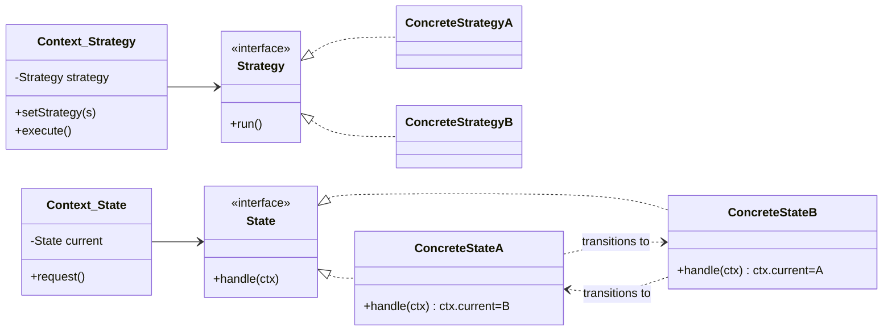
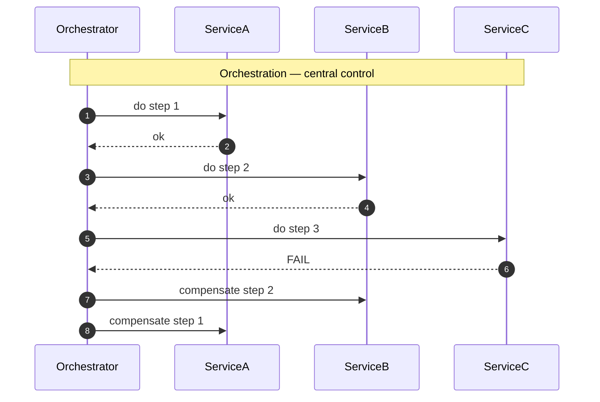
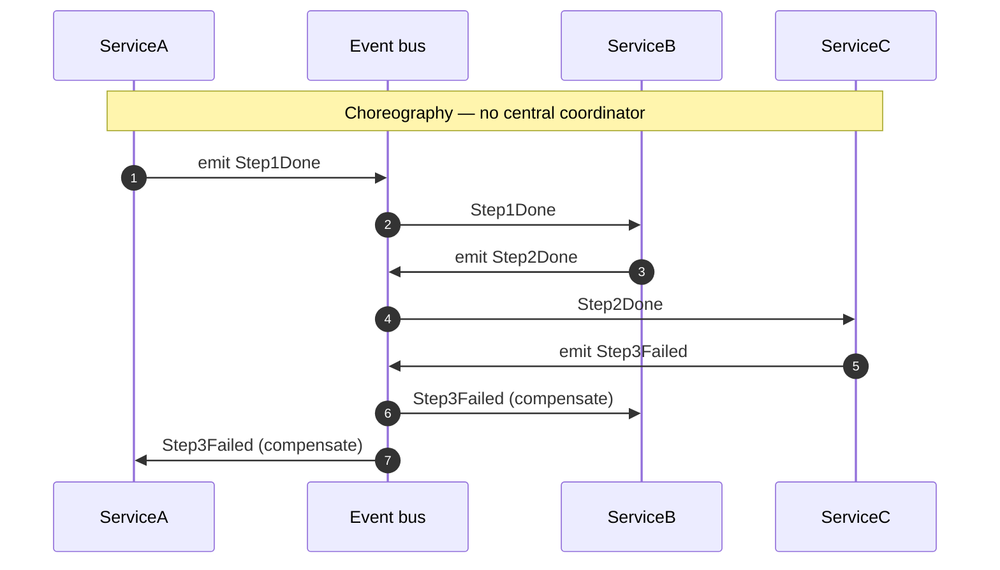

# Part 4 — Design Patterns, LLD & Machine Coding

> **Sprint allocation:** Week 3 (shared with Part 5). **Budget: ~8-10 hrs.**

## 4 Design Patterns, LLD & Machine Coding — topic inventory

> Many topics here are already in flight or completed via your active creational-patterns track + foundations docs. Expect a large fraction to be ✅ Done at Survey time.

| # | Topic | Tags | Tier | Time | Done | Partial | Grilling | Visit Again | Notes | Resources |
|---|-------|------|------|------|------|---|----------|-------------|-------|-----------|
| 1 | Design thinking process — pain → responsibilities → vary/stay → arrows → skeleton → verify (the meta-process behind every pattern) | 🔴 💼 🎯 | M | 1 hr | [ ] | [x] | [ ] | [ ] |  | 📖 Deep-dive: `study_plan/deep_dives/DesignThinkingProcess.md` (6-step process, worked "send a notification" example, 10 common traps, YAGNI / Rule-of-Three layer test, "abstraction shape follows from state", "when *no* pattern fits", checkout review heuristics) |
| 2 | Single Responsibility — what it actually means | 🔴 💼 🎯 | M | 45 min | [x] | [ ] | [ ] | [ ] | Done after quick revision | 📖 `design_patterns/foundations/solid/index.md` · 💻 `design_patterns/foundations/solid/exercise/index.md` |
| 3 | Open/Closed — extension vs modification | 🔴 💼 🎯 | M | 45 min | [x] | [ ] | [ ] | [ ] | Done after quick revision | 📖 `design_patterns/foundations/solid/index.md` · 💻 `design_patterns/foundations/solid/exercise/index.md` |
| 4 | Liskov Substitution | 🔴 💼 🎯 | M | 1 hr | [x] | [ ] | [ ] | [ ] | Done after quick revision | 📖 `design_patterns/foundations/solid/index.md` · 💻 `design_patterns/foundations/solid/exercise/index.md` |
| 5 | Interface Segregation | 🔴 💼 🎯 | M | 45 min | [x] | [ ] | [ ] | [ ] | Done after quick revision | 📖 `design_patterns/foundations/solid/index.md` · 💻 `design_patterns/foundations/solid/exercise/index.md` |
| 6 | Dependency Inversion — vs dependency injection | 🔴 💼 🎯 | M | 1 hr | [x] | [ ] | [ ] | [ ] | Done after quick revision | 📖 `design_patterns/foundations/solid/index.md` · 📖 `design_patterns/foundations/dip_vs_di/index.md` · 💻 `design_patterns/foundations/dip_vs_di/exercise/index.md` |
| 7 | DRY, KISS, YAGNI — and when each is misapplied | 🔴 💼 | M | 45 min | [x] | [ ] | [ ] | [ ] | Done after quick revision | 📖 `design_patterns/foundations/supporting_principles/index.md` · 💻 `design_patterns/foundations/exercise/index.md` |
| 8 | Singleton — and its problems (testability, hidden coupling) | 🔴 🎯 | MP | 1.5 hrs | [x] | [ ] | [ ] | [ ] | Done pre-time-tracking (creational track: 5 variants + thread-safety demo + doc) | 💻 repo demo: `creational/singleton/` · 💻 Warm-up: Singleton three ways (eager / DCL + volatile / Bill Pugh) (20 min) · 📖 Scenarios: `design_patterns/pattern_selection_scenarios/index.md` § Singleton (5 production scenarios: config, logger, pool, session, ID-generator) |
| 9 | Factory Method, Abstract Factory | 🔴 🎯 | MP | 1.5 hrs | [x] | [ ] | [ ] | [ ] | Done pre-time-tracking (simple factory + basic + prod variants, abstract factory; demos + docs) | 💻 repo demos: `creational/factory/`, `creational/abstract_factory/` · 📖 Scenarios: `design_patterns/pattern_selection_scenarios/index.md` § Simple Factory + § Factory Method + § Abstract Factory (15 production scenarios across the three) |
| 10 | Builder — especially for many optional params | 🔴 🎯 | MP | 1.5 hrs | [x] | [ ] | [ ] | [ ] | Done pre-time-tracking (4 variants: basic, Lombok, director, GoF director; demos + docs) | 💻 repo demo: `creational/builder/` (4 variants) · 📖 Scenarios: `design_patterns/pattern_selection_scenarios/index.md` § Builder (5 production scenarios: HTTP request, insurance policy, test data factories, email, SQL) |
| 11 | Adapter | 🔴 🎯 | MP | 1.5 hrs | [ ] | [ ] | [ ] | [ ] |  |  |
| 12 | Decorator | 🔴 🎯 | MP | 1 hr 55 min | [ ] | [ ] | [ ] | [ ] |  | 💻 Warm-up: Coffee with Milk/Sugar decorators — verify composed price/desc (25 min) |
| 13 | Facade | 🔴 🎯 | M | 45 min | [ ] | [ ] | [ ] | [ ] |  |  |
| 14 | Proxy — virtual, remote, protection | 🔴 🎯 | MP | 1.5 hrs | [ ] | [ ] | [ ] | [ ] |  |  |
| 15 | Strategy | 🔴 🎯 | MP | 1 hr 55 min | [x] | [ ] | [ ] | [ ] | Done after quick revision | 💻 Warm-up: PaymentStrategy interface + Card/UPI/Wallet impls (25 min) · 📖 Deep-dive: `design_patterns/pattern_selection/index.md` (Strategy vs Registry vs DI for "one HR, many factories" — 4 exercises) · 📖 Comparison: `design_patterns/behavioral/strategy_vs_template_method/index.md` · 💻 Review drill: `design_patterns/pattern_selection/exercise/index.md` |
| 16 | Observer / Pub-Sub | 🔴 🎯 | MP | 1 hr 55 min | [ ] | [ ] | [ ] | [ ] |  | 💻 Warm-up: minimal EventBus with `subscribe(Class<T>, Consumer<T>)` + publish (25 min) |
| 17 | Template Method | 🔴 🎯 | MP | 1.5 hrs | [x] | [ ] | [ ] | [ ] | Done after quick revision | 📖 Comparison: `design_patterns/behavioral/strategy_vs_template_method/index.md` |
| 18 | State — perfect fit for KYC status machines | 🔴 🎯 | MP | 1.5 hrs | [ ] | [ ] | [ ] | [ ] |  |  |
| 19 | Chain of Responsibility | 🔴 🎯 | MP | 1.5 hrs | [ ] | [ ] | [ ] | [ ] |  |  |
| 20 | Command | 🔴 🎯 | MP | 1.5 hrs | [ ] | [ ] | [ ] | [ ] |  |  |
| 21 | Repository pattern | 🔴 💼 | M | 1 hr | [ ] | [ ] | [ ] | [ ] |  |  |
| 22 | Dependency Injection — incl. `Map<String, T>` auto-injection of all beans implementing an interface (registry-via-DI pattern) | 🔴 💼 | M | 45 min | [x] | [ ] | [ ] | [ ] | Done after quick revision | 📖 `design_patterns/foundations/dip_vs_di/index.md` · 📖 `design_patterns/pattern_selection/index.md` · 📖 `design_patterns/behavioral/strategy_vs_template_method/index.md` |
| 23 | God class, anemic domain model, primitive obsession | 🔴 💼 | M | 1 hr | [x] | [ ] | [ ] | [ ] | Done after quick revision | 📖 `design_patterns/foundations/coupling_cohesion_smells/index.md` · 💻 `design_patterns/foundations/coupling_cohesion_smells/exercise/index.md` |
| 24 | Tight coupling, circular dependencies | 🔴 💼 | M | 45 min | [ ] | [x] | [ ] | [ ] | Partial: coupling spectrum covered; circular dependency specifics pending | 📖 `design_patterns/foundations/coupling_cohesion_smells/index.md` |
| 25 | Composition over inheritance — why | 🔴 💼 | M | 1 hr | [x] | [ ] | [ ] | [ ] | Done after quick revision | 📖 `java/oop/pillars/composition_vs_inheritance/index.md` · 📖 `design_patterns/foundations/solid/index.md` |
| 26 | Saga pattern (orchestration vs choreography) — relevant for multi-service KYC | 🔴 💼 | D | 1.5 hrs | [x] | [ ] | [ ] | [ ] | Expanded with local transactions, compensation, choreography vs orchestration, orchestrator recovery. | 📖 microservices.io — "Pattern: Saga" (~30 min) · 📖 `databases/distributed_transactions/saga/index.md` · 📖 `databases/distributed_transactions/index.md` |
| 27 | Outbox pattern — reliable event publishing | 🔴 💼 | D | 1.5 hrs | [ ] | [x] | [ ] | [ ] | Partial: dual-write problem + outbox table + async publisher/CDC concept covered; implementation pending. | 📖 microservices.io — "Pattern: Transactional outbox" · 📖 `databases/distributed_transactions/index.md` |
| 28 | LLD — Parking Lot | 🔴 🎯 | MP | 1.5 hrs | [x] | [ ] | [ ] | [ ] | Design, exercise, runnable playground, and DB-concurrency extension covered | 📖 `system_design/case_studies/parking_lot/index.md` · 📖 `system_design/case_studies/parking_lot/design/index.md` · 💻 `system_design/case_studies/parking_lot/exercise/index.md` · 📖 `system_design/case_studies/parking_lot/database_concurrency/index.md` |
| 29 | LLD — Splitwise | 🔴 🎯 | MP | 1.5 hrs | [ ] | [ ] | [ ] | [ ] |  |  |
| 30 | LLD — Snake & Ladder / Chess / Tic-Tac-Toe (state + rules) | 🔴 🎯 | MP | 1.5 hrs | [ ] | [ ] | [ ] | [ ] |  |  |
| 31 | LLD — Elevator system | 🔴 🎯 | MP | 1.5 hrs | [ ] | [ ] | [ ] | [ ] |  |  |
| 32 | LLD — LRU / LFU cache | 🔴 🎯 | MP | 1.5 hrs | [ ] | [ ] | [ ] | [ ] |  |  |
| 33 | LLD — Rate limiter (token bucket) | 🔴 🎯 | MP | 1.5 hrs | [ ] | [ ] | [ ] | [ ] |  |  |
| 34 | LLD — Logger with levels | 🔴 🎯 | MP | 1.5 hrs | [ ] | [ ] | [ ] | [ ] |  |  |
| 35 | LLD — In-memory key-value store with TTL | 🔴 🎯 | MP | 1.5 hrs | [ ] | [ ] | [ ] | [ ] |  |  |
| 36 | LLD — ATM / Vending machine (pure state machine) | 🔴 🎯 | MP | 1.5 hrs | [ ] | [ ] | [ ] | [ ] |  |  |
| 37 | LLD — Library management | 🔴 🎯 | MP | 1.5 hrs | [ ] | [ ] | [ ] | [ ] |  |  |
| 38 | LLD — BookMyShow / movie ticket booking (concurrency on seat lock) | 🔴 🎯 | MP | 1.5 hrs | [ ] | [ ] | [ ] | [ ] |  |  |
| 39 | LLD — Notification dispatch system (multi-channel) | 🔴 🎯 | MP | 1.5 hrs | [ ] | [ ] | [ ] | [ ] |  |  |
| 40 | LLD — Job scheduler / cron | 🔴 🎯 | MP | 1.5 hrs | [ ] | [ ] | [ ] | [ ] |  |  |
| 41 | LLD — Online food ordering / ride-sharing core domain | 🔴 🎯 | MP | 1.5 hrs | [ ] | [ ] | [ ] | [ ] |  |  |
| 42 | LLD — Traffic signal control system | 🔴 🎯 | M | 1 hr | [ ] | [ ] | [ ] | [ ] | State transitions, timer events, and pedestrian/priority rules. |
| 43 | LLD — Digital wallet | 🔴 🎯 | MP | 1.5 hrs | [ ] | [ ] | [ ] | [ ] | Accounts, transfers, transaction states, idempotency, and ledger boundary. |
| 44 | Unit of Work | 🟠 💼 | M | 1 hr | [ ] | [ ] | [ ] | [ ] |  |  |
| 45 | LLD — Stack Overflow | 🟠 🎯 | MP | 1.5 hrs | [ ] | [ ] | [ ] | [ ] | Questions, answers, voting, search boundary, and reputation rules. |
| 46 | LLD — Task management system | 🟠 🎯 | M | 1 hr | [ ] | [ ] | [ ] | [ ] | Tasks, assignments, lifecycle, and notifications. |
| 47 | LLD — Car rental system | 🟠 🎯 | MP | 1.5 hrs | [ ] | [ ] | [ ] | [ ] | Fleet availability, reservation, rental lifecycle, and pricing boundary. |
| 48 | LLD — Online auction system | 🟠 🎯 | MP | 1.5 hrs | [ ] | [ ] | [ ] | [ ] | Listings, bids, auction lifecycle, and bid validation. |
| 49 | LLD — Hotel management system | 🟠 🎯 | MP | 1.5 hrs | [ ] | [ ] | [ ] | [ ] | Room inventory, reservations, check-in/out, and pricing boundary. |
| 50 | LLD — Airline management system | 🟠 🎯 | MP | 1.5 hrs | [ ] | [ ] | [ ] | [ ] | Flights, seats, booking, cancellation, and check-in boundary. |
| 51 | LLD — Social network / Facebook | 🟠 🎯 | MP | 1.5 hrs | [ ] | [ ] | [ ] | [ ] | Profiles, connections, posts, feeds, and notifications at object-model scope. |
| 52 | LLD — Restaurant management system | 🟠 🎯 | MP | 1.5 hrs | [ ] | [ ] | [ ] | [ ] | Tables, reservations, orders, kitchen workflow, and billing boundary. |
| 53 | LLD — CricInfo | 🟠 🎯 | MP | 1.5 hrs | [ ] | [ ] | [ ] | [ ] | Match, innings, scorecard, ball events, and commentary model. |
| 54 | LLD — Course registration system | 🟠 🎯 | MP | 1.5 hrs | [ ] | [ ] | [ ] | [ ] | Courses, enrolment, capacity, prerequisites, and waitlist boundary. |
| 55 | LLD — Online stock brokerage | 🟠 🎯 | MP | 1.5 hrs | [ ] | [ ] | [ ] | [ ] | Orders, portfolio, execution boundary, and transaction lifecycle. |
| 56 | LLD — Music streaming service | 🟠 🎯 | MP | 1.5 hrs | [ ] | [ ] | [ ] | [ ] | Catalogue, playlists, playback sessions, and recommendation boundary. |
| 57 | Law of Demeter | 🟠 💼 | M | 45 min | [x] | [ ] | [ ] | [ ] | Done after quick revision | 📖 `design_patterns/foundations/supporting_principles/index.md` |
| 58 | Tell, don't ask | 🟠 💼 | M | 45 min | [x] | [ ] | [ ] | [ ] | Done after quick revision | 📖 `design_patterns/foundations/supporting_principles/index.md` |
| 59 | Prototype | 🟠 | MP | 1.5 hrs | [x] | [ ] | [ ] | [ ] | Done pre-time-tracking (demo + doc) | 💻 repo demo: `creational/prototype/` |
| 60 | Object Pool (not GoF but ubiquitous) | 🟠 | MP | 1.5 hrs | [ ] | [ ] | [ ] | [ ] |  |  |
| 61 | Composite | 🟠 | MP | 1.5 hrs | [ ] | [ ] | [ ] | [ ] |  |  |
| 62 | Bridge | 🟠 | MP | 1.5 hrs | [ ] | [ ] | [ ] | [ ] |  |  |
| 63 | Iterator | 🟠 | M | 1 hr | [ ] | [ ] | [ ] | [ ] |  |  |
| 64 | Mediator | 🟠 | MP | 1.5 hrs | [ ] | [ ] | [ ] | [ ] |  |  |
| 65 | Visitor | 🟠 | D | 1 hr | [ ] | [ ] | [ ] | [ ] |  | 📖 Refactoring Guru "Visitor" explainer |
| 66 | Specification pattern | 🟠 💼 | MP | 1.5 hrs | [ ] | [ ] | [ ] | [ ] |  |  |
| 67 | CQRS — what it is, when it's overkill | 🟠 💼 | D | 1.5 hrs | [x] | [x] | [x] | [x] | ~1.5 hr (ChatGPT) | 📖 design_patterns/cqrs/CQRS.md |
| 68 | Event Sourcing — same | 🟠 💼 | D | 1.5 hrs | [x] | [x] | [x] | [x] | ~1.5 hr (ChatGPT) | 📖 design_patterns/event_sourcing/EventSourcing.md |
| 69 | Idempotent receiver | 🟠 💼 | MP | 1 hr | [ ] | [ ] | [ ] | [ ] |  |  |
| 70 | Premature abstraction, premature optimization | 🟠 💼 | M | 45 min | [x] | [ ] | [ ] | [ ] | Done after quick revision | 📖 `design_patterns/foundations/supporting_principles/index.md` |
| 71 | Shotgun surgery, feature envy | 🟠 💼 | M | 45 min | [x] | [ ] | [ ] | [ ] | Done after quick revision | 📖 `design_patterns/foundations/coupling_cohesion_smells/index.md` |
| 72 | Command-Query Separation | 🟡 | M | 45 min | [ ] | [ ] | [ ] | [ ] |  |  |
| 73 | Flyweight | 🟡 | M | 1 hr | [ ] | [ ] | [ ] | [ ] |  |  |
| 74 | Memento, Interpreter | 🟡 | M | 1 hr | [ ] | [ ] | [ ] | [ ] |  |  |
| 75 | Anti-corruption layer | 🟡 | M | 45 min | [ ] | [ ] | [ ] | [ ] |  |  |
| 76 | Aggregate, Entity, Value Object (DDD building blocks) | 🟡 | MP | 1.5 hrs | [ ] | [ ] | [ ] | [ ] |  |  |
| 77 | Hexagonal / ports and adapters | 🟡 | MP | 1.5 hrs | [ ] | [ ] | [ ] | [ ] |  |  |
| 78 | Clean Architecture, Onion Architecture | 🟢 | M | 1 hr | [ ] | [ ] | [ ] | [ ] |  |  |

## Time summary

| Scope | Hours (zero baseline) | Weeks @ 10–12 hrs/wk | Actual time |
|-------|-----------------------|----------------------|-------------|
| 🔴 MUST only (Sprint priority — 3-month plan) | ~57 hrs | ~5.18 wk | Completed topics are marked in the inventory |
| 🔴 + 🟠 HIGH (must + high — senior coverage) | ~93.5 hrs | ~8.50 wk | Completed topics are marked in the inventory |
| Full Part (all items including 🟡 + 🟢) | ~101 hrs | ~9.18 wk | ~6.5 hrs so far |

> Heavy Part — but a large fraction is already ✅ Done from your active design-patterns track. Mark accordingly during Survey.

## Key diagrams

**Strategy vs State (side-by-side):**



> Strategy = caller picks behavior. State = behavior picks next state.

**Saga: orchestration vs choreography:**





> Orchestration = central control + clearer debugging. Choreography = looser coupling + harder to trace.

## Frequently asked

1. **Q:** Strategy vs State pattern — they look identical structurally. What's the actual difference, and when does each fit?
   - **Why asked:** Most-confused pair in interviews. Strategy = swap *behavior* externally (caller picks). State = transition *internal state* over time (object transitions itself). Strategy is stateless; State holds the current state object. Your KYC status machine is State, not Strategy.
2. **Q:** Saga: orchestration vs choreography — pick one for KYC verification across 5 vendors. Defend the choice.
   - **Why asked:** Senior microservices canonical. Orchestration = central state-keeper drives steps (easier to reason about, single point of complexity). Choreography = services publish events, react autonomously (looser coupling, harder to trace). Your KYC orchestrator is orchestration — defend it with: visibility, retry/compensation control, state machine clarity.
3. **Q:** Outbox pattern — why does it earn the complexity over directly publishing to Kafka inside your @Transactional method?
   - **Why asked:** Senior reliability pattern. Direct publish = dual-write problem (DB commit succeeds, Kafka publish fails → lost event; or vice versa). Outbox: write event to outbox table in same transaction, separate process polls and publishes. Achieves "at-least-once" without 2PC.
4. **Q:** Singleton is sometimes called an anti-pattern. Give three concrete arguments.
   - **Why asked:** Tests design judgment. (1) Hidden coupling — every consumer references global static, hard to swap for tests. (2) Testability — can't substitute test double without reflection/state-reset. (3) Concurrency — parallel test runs share state, causing flaky tests. Fix: inject the dependency instead (Spring bean with singleton scope is different from GoF Singleton).
5. **Q:** Repository pattern vs DAO — same thing?
   - **Why asked:** Tests DDD literacy. DAO = persistence-layer abstraction, per-table CRUD. Repository = domain-layer abstraction, returns aggregate roots, hides persistence. Spring's `JpaRepository` is technically DAO-ish (one repository per entity) but framed as Repository pattern.
6. **Q:** Give a concrete example of "composition over inheritance" from your own code. Why did you choose composition there?
   - **Why asked:** Story-driven question. Senior signal: you can name a specific moment where inheritance would have created a fragile base class problem. E.g., your KYC vendor orchestrator composes a Resilience4j circuit breaker + retry rather than extending a "ResilientService" base.
7. **Q:** Show me the canonical LSP-violating subclass. Why does it violate, and how do you fix it?
   - **Why asked:** Classical question. Square-extends-Rectangle (setting width changes height — violates Rectangle's contract). Fix: separate hierarchies, or favor composition (Shape interface with Square and Rectangle as siblings).

## Trick questions / gotchas

1. **Q:** Your "thread-safe Singleton" passes 10,000 single-threaded test runs but occasionally returns two different instances under concurrent stress. What's wrong?
   - **Gotcha:** Pre-Java-5 double-checked locking without `volatile` on the instance field. Compiler/JIT can reorder assignment, publishing partially-constructed instance. Fix: declare instance `volatile`, OR use Bill Pugh holder class pattern (preferred — uses JVM class loading semantics).
2. **Q:** Singleton can be defeated by reflection AND serialization. Two attack vectors — how do you defend?
   - **Gotcha:** Reflection: `Constructor.setAccessible(true)` → invoke private constructor → second instance. Defense: throw in constructor if instance already exists. Serialization: deserialization creates new instance. Defense: implement `readResolve()` returning the singleton. Or just use enum-based Singleton (Bloch's recommendation) — immune to both.
3. **Q:** Visitor pattern uses "double dispatch." What does that mean, and why is it ugly?
   - **Gotcha:** First dispatch: caller invokes `element.accept(visitor)` — virtual call on element type. Second dispatch: element invokes `visitor.visit(this)` — overload-resolved on element's concrete type at compile time. Ugly because: (1) every concrete element needs an accept method, (2) adding new element type forces visitor interface change, (3) violates open/closed in the element hierarchy.
4. **Q:** This DOESN'T violate LSP — it just looks like it does. Why?
   ```java
   class List { void add(int x) {...} }
   class SortedList extends List { void add(int x) { /* insert sorted */ } }
   ```
   - **Gotcha:** Adding to a sorted position is still adding — postcondition (item is in list) holds. LSP requires substitutability. SortedList satisfies List's contract; it just does more work. The classical Liskov violation requires the subclass to *weaken* postconditions or *strengthen* preconditions (e.g., reject some inputs the parent accepted). The Square/Rectangle case violates because setting width changes height — Rectangle's setWidth contract doesn't allow that.

## Mastery candidates (top 3–5 from this Part — suggestions, not commitments)

- **Saga pattern: orchestration vs choreography** (~3 hrs) — heavily asked, directly maps to your KYC platform. Build a worked example showing both styles for a KYC verification flow. Note compensation steps, distributed-transaction trade-offs.
- **Outbox pattern with CDC** (~2.5 hrs) — sister pattern to Saga, solves the dual-write problem. Connect to Part 10 (Messaging) — Debezium-based Outbox.
- **State pattern applied to your KYC status machine** (~2.5 hrs) — directly job-relevant. Walk through the formal State pattern, then map it to your IN_PROGRESS / VERIFIED / REVIEW / ERROR / FAILED transitions. Becomes a STAR-story.
- **LLD: 8–10 problems from the practice list** (~16–20 hrs total across all weeks) — the actual interview rehearsal work. See `reference/PracticeProblems.md` for the curated list. Recommend: 3 Easy (warm-up: Snake & Ladder, Tic-Tac-Toe, Logger) + 4 Medium (Parking Lot, Splitwise, Elevator, Rate Limiter) + 2-3 Hard (BookMyShow, Chess, Food Ordering).
- **Strategy vs State + Template Method side-by-side** (~2.5 hrs combined) — interview-canonical confusion. One worked example contrasting all three on the same domain (e.g., document verification flow).
- **Pattern selection — Strategy vs Registry vs Spring DI** (~3-4 hrs across 4 exercises, see `design_patterns/pattern_selection/index.md`) — "one HR, many factories" mini-project. Refactors `creational/factory_method/HR` three ways (caller-passed strategy, HR-held map, framework-injected `Map<String, T>`). Touches Factory Method + Strategy + Registry + DI on a single domain — high ROI for "when to reach for which."

## Hands-on exercises (Practice + Advanced)

Warm-up pattern-implementation exercises are listed inline in the topic-table Resources column (counted in main Time summary). The Practice + Advanced work for this Part lives in `reference/PracticeProblems.md` § Machine Coding.

### Practice + Advanced — Machine Coding / LLD problems

**See `reference/PracticeProblems.md` § Section 1 — Machine Coding / LLD problems** for 25 interview-style problems graded Easy / Medium / Hard:
- Easy warm-ups: Snake & Ladder, Tic-Tac-Toe, Logger, URL Shortener LLD, Bowling.
- Medium: Parking Lot, Splitwise, Elevator, LRU Cache, Rate Limiter, Pub-Sub, ATM.
- Hard: Chess, BookMyShow (concurrency on seat lock), Food Ordering, Ride-sharing.

Recommended Sprint cadence: 1 Easy + 1 Medium per weekend during Mastery phase (Weeks 8-12) = ~8-10 problems by Sprint end.

### Hands-on time summary (LLD problems from PracticeProblems.md)

| Problem-set sample | Time | Weeks @ 10–12 hrs/wk | Actual time |
|--------------------|------|----------------------|-------------|
| 3 Easy LLD problems | ~3 hrs | ~0.3 wk | |
| 4 Medium LLD problems | ~7 hrs | ~0.65 wk | |
| 2-3 Hard LLD problems | ~5-7 hrs | ~0.5 wk | |
| **Recommended 8-10 problems total** | **~15-17 hrs** | **~1.5 wk** | |

> Warm-up exercises (counted in main Time summary above) total ~95 min for Part 4 across 4 in-table warm-ups.

## Quick recall

**Q. Strategy vs State — one-line distinction.**
A. Strategy = caller picks the behavior. State = the object transitions its own behavior over time as internal state changes.

**Q. Saga: orchestration vs choreography — which is harder to debug?**
A. Choreography. Events fanning out across services with no central state means tracing a flow requires correlating logs/traces across N services. Orchestration has a single state holder you can query.

**Q. Outbox pattern — what problem does it solve?**
A. The dual-write problem: when you need to commit to a database AND publish an event, neither 2PC nor "do both sequentially" gives consistency guarantees. Outbox writes the event to a DB table in the same transaction, then a separate process polls + publishes. Achieves at-least-once delivery.

**Q. Three arguments against Singleton.**
A. Hidden coupling (global static), testability (hard to swap for tests), concurrency in test suites (parallel runs share state).

**Q. Composition over inheritance — one-line "why."**
A. Inheritance binds you to your parent's implementation forever. Composition lets you swap, mock, or compose multiple behaviors at runtime. Plus: avoids the fragile base class problem (parent changes break all subclasses).

**Q. LSP violation in one sentence.**
A. A subtype is substitutable for its parent. If a subclass weakens postconditions or strengthens preconditions, it's no longer substitutable — that's LSP violation.

**Q. Why is enum the recommended Singleton implementation in Java?**
A. JVM guarantees single instance per enum value, immune to reflection (constructor inaccessible) and serialization (deserialization returns the same instance via `Enum.valueOf`). One line of code, all gotchas defeated.
