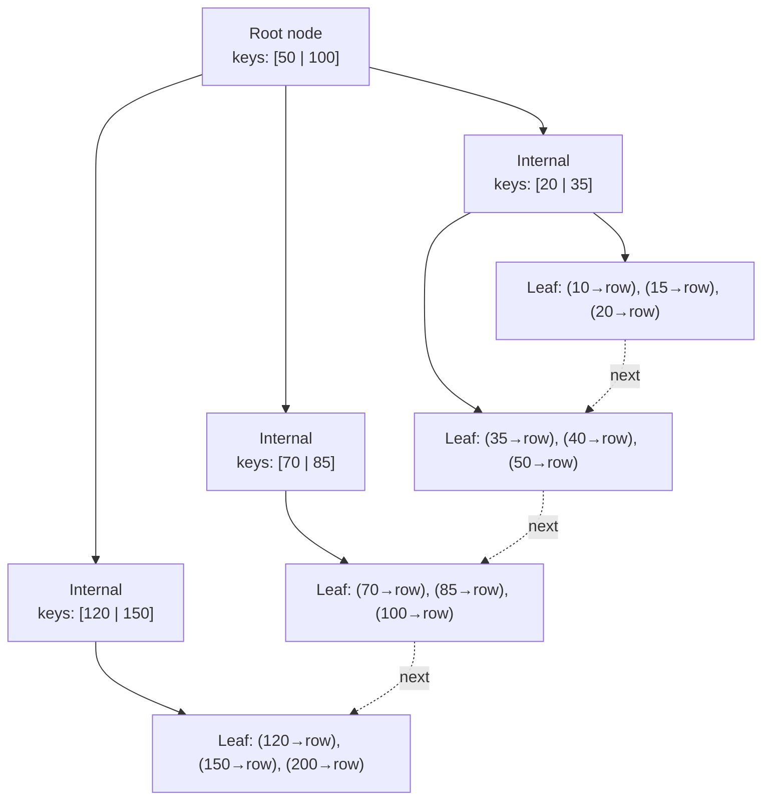
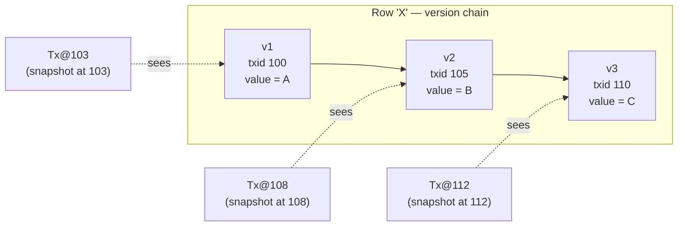

# Part 6 — Databases

> **Sprint allocation:** Week 4 (shared with start of Part 7). **Budget: ~7-8 hrs.**

## 6 Databases — topic inventory

| # | Topic | Tags | Tier | Time | Done | Partial | Grilling | Visit Again | Notes | Resources |
|---|-------|------|------|------|------|---|----------|-------------|-------|-----------|
| 1 | Normalization (1NF–3NF, BCNF) — and when to denormalize | 🔴 💼 🎯 | M | 1 hr | [x] | [ ] | [ ] | [ ] | ~13 min (ChatGPT) — 1NF–BCNF, functional/partial/transitive deps, dirty-table journey, denormalization trade-offs | 📖 `databases/normalization/Normalization.md` · 📖 `databases/sql_vs_nosql/SqlVsNosql.md` (philosophy) |
| 2 | Primary keys, foreign keys, surrogate vs natural | 🔴 💼 🎯 | M | 1 hr 5 min | [ ] | [x] | [ ] | [ ] | Partial: FK / referential integrity / orphaned records / app-vs-DB enforcement covered; surrogate vs natural keys pending | 📖 `databases/sql_vs_nosql/SqlVsNosql.md` (FK part) · 💻 Warm-up: basic CRUD on a users table from memory — CREATE TABLE / INSERT / SELECT WHERE / UPDATE / DELETE (20 min) |
| 3 | Indexes — B-tree, composite, covering, partial; INCLUDE columns | 🔴 💼 🎯 | D | 3 hrs | [ ] | [x] | [ ] | [ ] | Partial: B+ tree internals (pages, fanout, internal-vs-leaf, splits/rebalance, clustered vs secondary, dense vs sparse, NULLs, AUTO_INCREMENT vs UUID) covered; composite/covering/partial/INCLUDE columns pending. ~18 min (ChatGPT) | 📖 `databases/indexes/Indexes.md` · 📖 Use The Index, Luke! — Markus Winand (free, dip-in reference) |
| 4 | Query planner / EXPLAIN — reading plans, identifying full scans | 🔴 💼 🎯 | D | 3 hrs 20 min | [ ] | [ ] | [ ] | [ ] | | 📖 Vlad Mihalcea blog on EXPLAIN ANALYZE · 💻 Warm-up: GROUP BY + COUNT/SUM/AVG/HAVING/ORDER BY from scratch (20 min) |
| 5 | Joins — nested loop, hash, merge; when each is chosen | 🔴 💼 🎯 | D | 3 hrs | [ ] | [ ] | [ ] | [ ] | | 💻 Warm-up: write LEFT / INNER / RIGHT JOIN on orders + customers, observe result-set differences (30 min) |
| 6 | ACID — what each letter actually guarantees | 🔴 💼 🎯 | M | 1 hr | [x] | [ ] | [ ] | [ ] | ~13 min (ChatGPT) — Consistency-means-constraints (vs CAP), A/I/D recap, constraint examples | 📖 `databases/transactions/Transactions.md` · 📖 `databases/sql_vs_nosql/SqlVsNosql.md` (transactions part) |
| 7 | Isolation levels — read uncommitted, read committed, repeatable read, serializable | 🔴 💼 🎯 | D | 3 hrs | [ ] | [ ] | [ ] | [ ] | | 📖 *Designing Data-Intensive Applications* ch 7 (Kleppmann — single chapter, ~45 min) |
| 8 | Anomalies — dirty read, non-repeatable, phantom, write skew, lost update | 🔴 💼 🎯 | D | 2.5 hrs | [ ] | [ ] | [ ] | [ ] | | |
| 9 | Read replicas — async lag, read-after-write | 🔴 💼 🎯 | MP | 2 hrs | [ ] | [x] | [ ] | [ ] | Partial: read replicas + replication lag + lag-vs-app-latency covered; read-after-write mitigation strategies (sticky reads, timestamp) pending. ~18 min (ChatGPT) | 📖 `databases/replication/Replication.md` |
| 10 | Sharding — strategies (range, hash, directory), resharding pain | 🔴 💼 🎯 | D | 3 hrs | [x] | [ ] | [ ] | [ ] | ~18 min (ChatGPT) — hash/list/range/composite strategies, shard keys, app-vs-DB routing (mongos/Vitess), scatter-gather, lookup table, resharding/consistent-hashing | 📖 `databases/sharding/Sharding.md` · 📖 `databases/sql_vs_nosql/SqlVsNosql.md` (when-to-shard) |
| 11 | Key-value (Redis, DynamoDB, Memcached) | 🔴 💼 🎯 | MP | 1.5 hrs | [ ] | [ ] | [ ] | [ ] | | |
| 12 | Document (MongoDB, DynamoDB) | 🔴 💼 🎯 | MP | 1.5 hrs | [ ] | [x] | [ ] | [ ] | Partial: MongoDB schema flexibility / validation / transactions / document-modeling limits covered; DynamoDB pending | 📖 `databases/sql_vs_nosql/SqlVsNosql.md` (MongoDB parts) |
| 13 | MySQL — InnoDB internals, gap locks, replication | 🔴 💼 | D | 3 hrs | [ ] | [x] | [ ] | [ ] | Partial: replication (primary-replica, async, semi-sync, binlog) covered; InnoDB internals + gap locks pending. ~18 min (ChatGPT) | 📖 `databases/replication/Replication.md` (replication part) |
| 14 | PostgreSQL — MVCC, vacuum, indexes, extensions | 🔴 💼 | D | 3 hrs | [ ] | [ ] | [ ] | [ ] | | |
| 15 | Redis — data types, persistence, eviction, clustering, pub/sub, streams | 🔴 💼 | D | 3 hrs | [ ] | [x] | [ ] | [ ] | Partial: clustering (Redis Cluster, shards, replication, failover) covered; data types, persistence, eviction, pub/sub, streams pending. ~1.5 hr (ChatGPT) | 📖 `system_design/clustering/Clustering.md` · 📖 redis.io "Introduction to Redis" (~30 min) |
| 16 | MVCC — Postgres vs MySQL implementations | 🟠 💼 | D | 2.5 hrs | [ ] | [ ] | [ ] | [ ] | | |
| 17 | Locks — row, gap, next-key (MySQL specifically) | 🟠 💼 | MP | 2 hrs | [ ] | [ ] | [ ] | [ ] | | |
| 18 | Deadlocks — detection, prevention | 🟠 💼 | MP | 1.5 hrs | [ ] | [ ] | [ ] | [ ] | | |
| 19 | Transactions — savepoints, distributed, XA, 2PC | 🟠 💼 | MP | 2 hrs | [ ] | [x] | [ ] | [ ] | Partial: transaction states/lifecycle + distributed transactions + 2PC (prepare/commit, blocking problem, recovery) + 3PC + Saga/compensating + FLP/consensus covered; savepoints + XA pending. ~45 min (ChatGPT, 3 pastes) | 📖 `databases/distributed_transactions/DistributedTransactions.md` · 📖 `databases/transactions/Transactions.md` |
| 20 | Window functions (ROW_NUMBER, RANK, LAG, LEAD) | 🟠 💼 | MP | 1 hr 50 min | [ ] | [ ] | [ ] | [ ] | | 💻 Warm-up: ROW_NUMBER / RANK / LAG over PARTITION BY — find top-N per category, find diff between consecutive rows (20 min) |
| 21 | CTEs (WITH), recursive CTEs | 🟠 💼 | MP | 1 hr 55 min | [ ] | [ ] | [ ] | [ ] | | 💻 Warm-up: WITH non-recursive + recursive CTE for org-chart hierarchy traversal (25 min) |
| 22 | Materialized views | 🟠 💼 | M | 1 hr | [x] | [ ] | [ ] | [ ] | ~1.5 hr (ChatGPT) | 📖 `databases/views/ViewsAndMaterializedViews.md` |
| 23 | Stored procedures / triggers — and why most teams avoid them now | 🟠 💼 | M | 45 min | [ ] | [ ] | [ ] | [ ] | | |
| 24 | Schema migrations safely (Flyway, Liquibase) — backward-compatible changes | 🟠 💼 | MP | 2 hrs | [ ] | [ ] | [ ] | [ ] | | |
| 25 | Connection pooling — HikariCP, sizing math | 🟠 💼 | MP | 1.5 hrs | [ ] | [ ] | [ ] | [ ] | | 📖 HikariCP "About Pool Sizing" wiki (~15 min, gold) |
| 26 | Caching layer in front (Redis) | 🟠 💼 🎯 | MP | 1.5 hrs | [ ] | [ ] | [ ] | [ ] | | |
| 27 | Vertical vs horizontal scaling | 🟠 💼 | M | 45 min | [ ] | [ ] | [ ] | [ ] | | |
| 28 | Multi-master, conflict resolution | 🟠 💼 | MP | 1.5 hrs | [x] | [ ] | [ ] | [ ] | ~18 min (ChatGPT) — multi-leader, regional models, LWW/merge/human, OT/CRDT for collaborative editing | 📖 `databases/replication/Replication.md` |
| 29 | Wide-column (Cassandra, ScyllaDB, HBase) | 🟠 💼 🎯 | MP | 1.5 hrs | [ ] | [ ] | [ ] | [ ] | | |
| 30 | Graph (Neo4j, Neptune) | 🟠 💼 🎯 | M | 1 hr | [ ] | [x] | [ ] | [ ] | Partial: fraud-detection use cases (shared devices, cycles) covered; Neo4j/Neptune specifics pending | 📖 `databases/graph_and_graphql/GraphDbAndGraphQl.md` (use cases only) |
| 31 | Time-series (Prometheus, InfluxDB, TimescaleDB) | 🟠 💼 🎯 | M | 1 hr | [ ] | [ ] | [ ] | [ ] | | |
| 32 | Search (Elasticsearch, OpenSearch) | 🟠 💼 🎯 | MP | 1.5 hrs | [ ] | [ ] | [ ] | [ ] | | |
| 33 | DynamoDB — partition keys, GSI/LSI, hot partitions, on-demand vs provisioned | 🔴 💼 | MP | 2 hrs | [ ] | [ ] | [ ] | [ ] | | |
| 34 | Elasticsearch — inverted index, mapping, analyzers | 🟠 💼 | MP | 2 hrs | [ ] | [ ] | [ ] | [ ] | | |
| 35 | Partitioning (range, list, hash) | 🟡 | M | 1 hr | [x] | [ ] | [ ] | [ ] | ~18 min (ChatGPT) — horizontal vs vertical, hash/list/range/composite criteria | 📖 `databases/sharding/Sharding.md` |
| 36 | JSON columns | 🟡 | M | 45 min | [ ] | [ ] | [ ] | [ ] | | |
| 37 | Vector (pgvector, Pinecone, Weaviate, Milvus) — also covered in GenAI | 🟡 🆕 | M | 45 min | [ ] | [ ] | [ ] | [ ] | | |
| 38 | Cassandra — partition + clustering keys, tunable consistency | 🟡 | MP | 1.5 hrs | [ ] | [x] | [ ] | [ ] | Partial: tunable consistency (leaderless, N/W/R quorums, R+W>N, read repair) covered; partition + clustering keys pending. ~18 min (ChatGPT) | 📖 `databases/replication/Replication.md` (quorum part) |
| 39 | MongoDB — sharding, secondary indexes, aggregation pipeline | 🟡 | MP | 1.5 hrs | [ ] | [ ] | [ ] | [ ] | | |
| 40 | SQL vs NoSQL — when each fits: schemaless myth, transactions myth, relational-modeling argument, who-enforces-relationships, DB-level security (defense in depth) | 🔴 💼 🎯 | M | 1 hr | [x] | [ ] | [ ] | [ ] | ~1 hr (ChatGPT) | 📖 `databases/sql_vs_nosql/SqlVsNosql.md` |
| 41 | Database federation — federated DBs vs sharding, cross-DB join/transaction cost, modern database-per-service + Saga + BFF | 🟡 💼 🎯 | M | 1 hr | [x] | [ ] | [ ] | [ ] | ~1 hr (ChatGPT) — federation vs sharding contrast, why it faded, BFF as service-layer aggregation | 📖 `databases/federation/Federation.md` |

## Time summary

| Scope | Hours (zero baseline) | Weeks @ 10–12 hrs/wk | Actual time |
|-------|-----------------------|----------------------|-------------|
| 🔴 MUST only (Sprint priority — 3-month plan) | ~37.92 hrs | ~3.45 wk | |
| 🔴 + 🟠 HIGH (must + high — senior coverage) | ~64.92 hrs | ~5.9 wk | |
| Full Part (all items including 🟡) | ~71.17 hrs | ~6.5 wk | ~6.8 hrs so far |

> Database is foundational for most senior interviews. Isolation levels + indexes + EXPLAIN are interview-canonical and worth Mastery time.

## Key diagrams

**B-tree index structure:**

> Traversal from root to leaf is O(log n) on the branching factor. Leaves are linked horizontally so range scans (`WHERE x BETWEEN a AND b`, `ORDER BY x`) walk leaves sequentially without re-descending the tree.

**MVCC version chain:**

> Readers don't block writers; each tx sees the snapshot consistent with its start time. Old versions get reclaimed by VACUUM (Postgres) or undo log truncation (InnoDB).

## Frequently asked

1. **Q:** Walk through the 4 isolation levels and which anomalies each prevents.
   - **Why asked:** Senior-canonical. Read Uncommitted → no protection (dirty reads possible). Read Committed → no dirty reads. Repeatable Read → no non-repeatable reads (but phantom reads still possible in standard SQL; in MySQL InnoDB, gap locks prevent phantoms here too). Serializable → no anomalies. Plus the anomaly nobody mentions: write skew (only Serializable prevents it cleanly; Snapshot Isolation doesn't).
2. **Q:** EXPLAIN ANALYZE on a query shows a sequential scan on a 50M-row table. Walk through your diagnosis.
   - **Why asked:** Production-canonical bug. Check: index existence on WHERE columns, index selectivity (rows planner expects vs actual — if estimates are off, ANALYZE the table), index disqualification (functions on indexed columns, type mismatches, leading wildcard LIKE), index on wrong column order for composite indexes, planner stats stale.
3. **Q:** When does the query planner pick nested loop vs hash join vs merge join?
   - **Why asked:** Tests join algorithm understanding. Nested loop: small outer × indexed inner, or no good alternative. Hash join: medium-large unsorted tables, equality predicate, build hash on smaller side. Merge join: both inputs already sorted on the join key (often by index), large datasets.
4. **Q:** How would you handle read-after-write with async read replicas?
   - **Why asked:** Practical senior consistency problem. Options: (1) route reads for the just-updated entity to primary for X seconds (sticky session, common). (2) timestamp-versioning — client tracks write timestamp, replica refuses to serve reads older than that. (3) accept stale reads where business allows. (4) synchronous replication (perf cost). KYC platforms often pick option 1 with a short window.
5. **Q:** Compare sharding strategies: range vs hash vs directory. Which one does DynamoDB use?
   - **Why asked:** Senior scaling design. Range = sorted by key, easy range queries, but creates hot partitions on monotonic IDs. Hash = even distribution, no range queries, partition by hash(key). Directory = lookup table maps keys to shards, max flexibility, extra hop. DynamoDB = hash on partition key + optional sort key (range within partition).
6. **Q:** MVCC in Postgres vs MySQL InnoDB — what's the practical difference?
   - **Why asked:** Differentiates engineers who've read DDIA from those who haven't. Postgres: stores row versions in heap, vacuum reclaims dead tuples (vacuum lag = bloat). MySQL InnoDB: stores undo logs separately, "undo tablespace" can grow. Both implement read snapshots without read locks; vacuum vs undo log differ operationally.
7. **Q:** HikariCP sizing — your service has 8 cores. What pool size for IO-bound DB calls?
   - **Why asked:** Operational fluency. NOT 8 (that's CPU-bound rule). Pool sizing for IO-bound: Little's Law, depends on wait/compute ratio. Typical sweet spot: 10-30 for modest workloads. Counter-intuitive insight: increasing pool size past a point makes things SLOWER (DB contention). HikariCP wiki has the formula.

## Trick questions / gotchas

1. **Q:** You have a composite index on `(a, b, c)`. Will a query with WHERE `b = 5 AND c = 10` use the index?
   - **Gotcha:** No — leftmost prefix rule. The index can be used by WHERE on (a), (a,b), or (a,b,c). Skipping `a` disqualifies the index. Fix: separate index on (b, c), or reorder the composite to (b, c, a) if other queries don't need leading a.
2. **Q:** Repeatable Read in MySQL InnoDB prevents phantom reads. SQL standard says it doesn't. Why?
   - **Gotcha:** Standard says Repeatable Read prevents non-repeatable reads but NOT phantom reads. MySQL InnoDB adds *gap locks* + *next-key locks* on top, locking the gaps between rows in range queries, which incidentally prevents phantoms. So InnoDB's "Repeatable Read" is actually stronger than the standard. Postgres takes a different route — Repeatable Read implements Snapshot Isolation.
3. **Q:** You wrap two `INSERT` statements in `BEGIN; INSERT; INSERT; COMMIT;`. The first succeeds, the second deadlocks and rolls back. What's the state of the first?
   - **Gotcha:** Also rolled back. The COMMIT was never reached. A deadlock on any statement in a transaction throws an exception that, if uncaught, leaves the transaction in a rolled-back-only state — the framework typically rolls back. Common bug: catching the exception and continuing thinking the first INSERT survives.
4. **Q:** UUID as primary key on a high-insert table. What's the performance trap?
   - **Gotcha:** Random UUIDs cause B-tree index page splits all over the tree (since inserts hit random leaf pages). Sequential keys append to the end of the index — much faster. Mitigations: UUIDv7 (time-ordered), `gen_random_uuid()` with a separate sequential ID for clustering, or accept the cost for the security/distribution benefits.

## Mastery candidates (top 3–5 from this Part — suggestions, not commitments)

- **Isolation levels + anomalies matrix** (~3.5 hrs combined) — interview-canonical. Build a 4×5 matrix (4 isolation levels × 5 anomalies) showing which level prevents which. Walk through write skew specifically — the anomaly nobody mentions.
- **Indexes deep + EXPLAIN ANALYZE walkthroughs** (~5 hrs combined) — read 3-5 real query plans, diagnose each. Composite index ordering, covering indexes, partial indexes, INCLUDE columns. Use real KYC queries if available.
- **Sharding strategies walkthrough** (~3 hrs) — range/hash/directory, hot partition mitigation, resharding pain (cellular architecture, gradual migration). Connect to DynamoDB partition key design.
- **PostgreSQL or MySQL deep dive** (~3 hrs) — pick the one your platform actually uses. MVCC, vacuum (Postgres) or undo log (MySQL), index types specific to that engine, common production gotchas.

## Hands-on exercises (Practice + Advanced)

Warm-up SQL exercises are listed inline in the topic-table Resources column (counted in main Time summary). The longer exercises below are tracked separately. Use a local Postgres or MySQL via Docker.

### Practice — mid-level (~30-60 min each)

1. **Index impact via EXPLAIN ANALYZE** (~45 min) — create a `users` table with 1M rows. Run `WHERE email = ?` query — observe sequential scan + cost. Add index on email. Re-run — observe index scan. Then run `WHERE LOWER(email) = ?` — observe sequential scan returned (function disqualifies index). Fix with functional index.
2. **Composite index leftmost-prefix rule** (~30 min) — create index `(country, city, name)`. Run three queries: `WHERE country=?`, `WHERE country=? AND city=?`, `WHERE city=?`. EXPLAIN each — see which use the index and why the third doesn't (no leading `country`).
3. **Reproduce + diagnose a deadlock** (~30 min) — two transactions, two rows, update in opposite order. Watch one error with "deadlock detected." Inspect `pg_stat_activity` and Postgres logs to find the cycle.
4. **N+1 query observation + fix** (~30 min) — Hibernate/JPA query loading `Order` entities with lazy `OrderItems`. Enable SQL logging (`logging.level.org.hibernate.SQL=DEBUG`). Iterate orders accessing items. Observe N+1 SELECT statements. Fix with `JOIN FETCH` or `@EntityGraph`. Compare query counts.

### Advanced — senior-grade depth (~60+ min each)

5. **Reproduce isolation anomalies** (~60 min) — two `psql` sessions side by side, both starting a transaction. Set isolation level to `READ COMMITTED`. Demonstrate: dirty read prevented, but non-repeatable read happens. Switch to `REPEATABLE READ`. Demonstrate non-repeatable prevented. Try a phantom (range query) and observe Postgres behavior.
6. **HikariCP pool sizing experiment** (~45 min) — write a load test hitting an endpoint that does a DB call. Vary pool size: 1, 10, 50, 200. Plot throughput. Observe sweet spot (typically 10–30) and the *decrease* at higher pool sizes due to DB contention.
7. **MVCC vacuum observation** (Postgres-specific, ~45 min) — run a tight `UPDATE` loop on a small table (say 1000 rows). Watch table size grow in `pg_total_relation_size` despite row count constant. Manual `VACUUM ANALYZE` to reclaim. Observe size drop.

### Hands-on time summary (Practice + Advanced only)

| Tier | Total time | Weeks @ 10–12 hrs/wk | Actual time |
|------|------------|----------------------|-------------|
| Practice (mid-level) | ~2.25 hrs | ~0.2 wk | |
| Advanced (senior-grade) | ~2.5 hrs | ~0.25 wk | |
| **Combined hands-on (Practice + Advanced)** | **~4.75 hrs** | **~0.45 wk** | |

> Warm-up exercises (counted in main Time summary above) total ~1 hr 55 min for Part 6 across 5 in-table warm-ups.

## Quick recall

**Q. ACID — one-line each.**
A. Atomicity: all-or-nothing transaction. Consistency: DB constraints/invariants hold at transaction boundaries. Isolation: concurrent transactions don't see each other's partial state (level-dependent). Durability: committed data survives crashes.

**Q. Read Committed vs Repeatable Read — what does the second add?**
A. Read Committed prevents dirty reads (you only see committed data) but lets the same row read twice return different values if another transaction modified it between reads. Repeatable Read keeps each row's value stable for the duration of your transaction (snapshot).

**Q. B-tree vs hash index — quick rule.**
A. B-tree: range queries, ORDER BY, equality. Hash: only equality, faster for it, no ordering. Postgres has both; most workloads use B-tree by default.

**Q. MVCC in one sentence.**
A. Multi-version concurrency control — readers see a snapshot (no read locks), writers create new row versions; old versions cleaned up by vacuum (Postgres) or via undo log (InnoDB). Trade-off: storage bloat for read concurrency.

**Q. Read replica lag — three mitigation strategies.**
A. (1) Read primary after a write within a short window (sticky session). (2) Pass write timestamp on each query, refuse stale reads. (3) Use synchronous replication for critical reads (perf cost).

**Q. Sharding strategies — when each fits.**
A. Range: data has natural order, range queries common, watch hot partitions. Hash: even distribution, no range queries possible without scatter. Directory: max flexibility, extra lookup hop, central directory becomes bottleneck.

**Q. HikariCP sizing rule of thumb for IO-bound work.**
A. NOT cores. Use Little's Law: pool ≈ cores × (1 + wait/compute). Typical web service with DB calls: 10-30. Past a point, increasing pool size HURTS — DB contention dominates.
