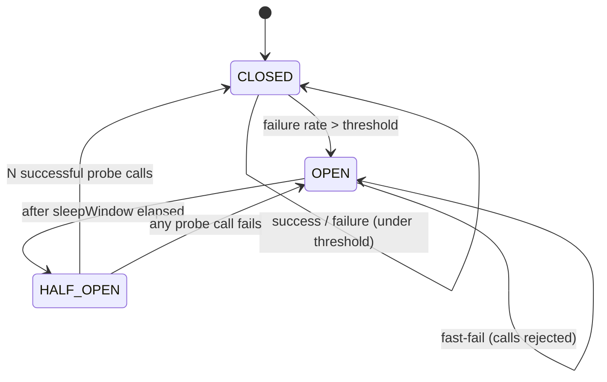

# Part 7 — System Design (HLD) & Distributed Systems

> **Sprint allocation:** Weeks 4-5 (split — starts Week 4, finishes Week 5). **Budget: ~7-8 hrs (split across Weeks 4-5).**

## 7 HLD & Distributed Systems — topic inventory

| # | Topic | Tags | Tier | Time | Done | Partial | Grilling | Visit Again | Notes | Resources |
|---|-------|------|------|------|------|---|----------|-------------|-------|-----------|
| 1 | CAP theorem — and why it's often misunderstood | 🔴 💼 🎯 | M | 1 hr 30 min | [ ] | [x] | [ ] | [ ] | Partial: Theory covered, warm-up pending. ~13 min (ChatGPT) — partition-time C-vs-A, CP/AP philosophy, why CA doesn't exist, CAP-C vs ACID-C | 📖 `system_design/cap_pacelc/CapPacelc.md` · 💻 Warm-up: place 5 well-known systems (Cassandra, DynamoDB, MongoDB, ZooKeeper, Postgres replicated) on the CAP triangle; defend each placement out loud (30 min) |
| 2 | PACELC — the practical extension | 🔴 💼 🎯 | M | 45 min | [x] | [ ] | [ ] | [ ] | ~13 min (ChatGPT) — Else branch (latency vs consistency), PA/EL vs PC/EC | 📖 `system_design/cap_pacelc/CapPacelc.md` |
| 3 | Consistency models — strong, sequential, causal, eventual, read-your-writes, monotonic reads | 🔴 💼 🎯 | D | 1.5 hrs | [ ] | [x] | [ ] | [ ] | Partial: eventual consistency (convergence) covered; strong/sequential/causal/read-your-writes/monotonic pending. ~13 min (ChatGPT) | 📖 `system_design/cap_pacelc/CapPacelc.md` (eventual only) · 📖 Jepsen "Consistency Models" page (jepsen.io/consistency — diagram + descriptions, ~30 min) |
| 4 | Replication — leader/follower, multi-leader, leaderless (Dynamo-style) | 🔴 💼 🎯 | D | 1.5 hrs | [ ] | [x] | [ ] | [ ] | Partial: leader/follower + replica promotion covered (Redis/Kafka lens); multi-leader, leaderless pending | 📖 *Designing Data-Intensive Applications* ch 5 (Kleppmann, ~45 min) · 📖 `system_design/clustering/Clustering.md` (leader/follower only) |
| 5 | Partitioning — by range, hash, consistent hashing | 🔴 💼 🎯 | MP | 1.5 hrs | [x] | [ ] | [ ] | [ ] | ~18 min (ChatGPT) — range/hash/list/composite, DB partitioning view, consistent hashing (ring + virtual nodes) | 📖 `databases/sharding/Sharding.md` · 📖 `system_design/caching/CachingAndDistributedCache.md` (cache lens) |
| 6 | Load balancers — L4 vs L7, algorithms (round-robin, least-conn, consistent hash, EWMA) | 🔴 💼 🎯 | MP | 1 hr | [x] | [ ] | [ ] | [ ] | ~4.5 hr (ChatGPT). Algorithms (RR/least-conn/EWMA) pending | 📖 `system_design/load_balancing/LoadBalancing.md` · 📖 `system_design/load_balancing/LoadBalancerSPOF.md` |
| 7 | Reverse proxy vs API gateway | 🔴 💼 🎯 | M | 1 hr | [x] | [ ] | [ ] | [ ] | ~1.5 hr total (ChatGPT). API Gateway + BFF added | 📖 `networking/proxies_vpn/ProxiesVpnFirewalls.md` · 📖 `networking/api_gateway/ApiGatewayBff.md` |
| 8 | CDN — edge caching, cache-control, invalidation, push vs pull | 🔴 💼 🎯 | MP | 1.5 hrs | [x] | [ ] | [ ] | [ ] | ~1.5 hr (ChatGPT). Cache-Control header mechanics pending (Part 11 row 8) | 📖 `system_design/cdn/Cdn.md` |
| 9 | Caching — patterns (cache-aside, read-through, write-through, write-behind, refresh-ahead) | 🔴 💼 🎯 | D | 1.5 hrs | [x] | [ ] | [ ] | [ ] | Refresh-ahead pending. Time counted in Part 9 row 1 | 📖 `system_design/caching/CachingAndDistributedCache.md` · (Cross-ref Part 9 — Caching deep dive) |
| 10 | Cache invalidation — TTL, event-based, write-through | 🔴 💼 🎯 | MP | 1.5 hrs | [ ] | [ ] | [ ] | [ ] | | |
| 11 | Message queue vs stream — semantics differences | 🔴 💼 🎯 | M | 1 hr | [x] | [ ] | [ ] | [ ] | ~9 min (ChatGPT) — broker (deliver-and-discard) vs streaming/commit-log (store + replay), offsets, RabbitMQ vs Kafka | 📖 `messaging/message_brokers/MessageBrokers.md` | 
| 12 | Pub-sub vs point-to-point | 🔴 💼 🎯 | M | 45 min | [x] | [ ] | [ ] | [ ] | ~18 min (ChatGPT, 2 pastes) — queue (competing consumers, command) vs topic (fan-out, event), filtering, durability, multi-protocol delivery, who-does-work-vs-who-wants-to-know | 📖 `messaging/queues_pubsub/MessageQueuesAndPubSub.md` |
| 13 | Rate limiting — fixed window, sliding window, token bucket, leaky bucket | 🔴 💼 🎯 | MP | 1.5 hrs | [x] | [x] | [ ] | [ ] | Theory and algorithm details covered via deep-dive conversation. | 📖 `system_design/rate_limiting/` · 💻 Warm-up: implement token bucket — tryAcquire() with periodic refill (30 min) |
| 14 | Timeouts (and why "no timeout" is the #1 prod bug) | 🔴 💼 🎯 | M | 45 min | [ ] | [ ] | [ ] | [ ] | | |
| 15 | Retries with exponential backoff + jitter | 🔴 💼 🎯 | MP | 1 hr | [ ] | [ ] | [ ] | [ ] | | 📖 AWS Architecture Blog "Exponential Backoff and Jitter" (~15 min, classic) · 💻 Warm-up: retry(maxAttempts, Supplier) with jitter against flaky Supplier (25 min) |
| 16 | Circuit breakers (closed/open/half-open) | 🔴 💼 🎯 | MP | 1 hr | [x] | [x] | [ ] | [ ] | Theory, states, timeouts vs retries, and cascade failure prevention covered via deep-dive conversation. | 📖 `system_design/resilience/CircuitBreakers.md` · 💻 Warm-up: minimal CircuitBreaker state machine in Java (CLOSED → OPEN → HALF_OPEN); 5 failures opens, probe success closes (45 min) |
| 17 | Idempotency — keys, design, replay safety | 🔴 💼 🎯 | D | 1.5 hrs | [ ] | [x] | [ ] | [ ] | Partial: idempotency keys + dedup-by-txn-id + replay safety + payment-key example + effectively-once covered; Spring middleware hands-on pending. ~13 min (ChatGPT) | 📖 `databases/distributed_transactions/DistributedTransactions.md` · 💻 Warm-up: build an Idempotency-Key middleware in Spring — TTL'd Redis store, 409 on conflict-different-body, replay original response on conflict-same-body (45 min) |
| 18 | Graceful degradation, fallback | 🔴 💼 🎯 | MP | 1.5 hrs | [ ] | [ ] | [ ] | [ ] | | |
| 19 | Horizontal vs vertical scaling — tradeoffs | 🔴 💼 🎯 | M | 45 min | [x] | [ ] | [ ] | [ ] | ~18 min (ChatGPT) — vertical vs horizontal, active redundancy, sequential vs random IO | 📖 `system_design/scalability/ScalabilityAndStorage.md` |
| 20 | Stateless service design | 🔴 💼 🎯 | M | 1 hr | [ ] | [ ] | [ ] | [ ] | | |
| 21 | Sticky sessions vs distributed session store | 🔴 💼 🎯 | M | 1 hr | [ ] | [x] | [ ] | [ ] | Partial: sticky-session concept + modern shared-store alternative covered; session-store design details pending | 📖 `system_design/load_balancing/LoadBalancing.md` (concept only) |
| 22 | Sharding — strategies and pain points (revisited from Part 6) | 🔴 💼 🎯 | M | 45 min | [x] | [ ] | [ ] | [ ] | ~18 min (ChatGPT) — strategies, shard keys, routing (mongos/Vitess), scatter-gather, cross-shard joins, rebalancing pain | 📖 `databases/sharding/Sharding.md` · (Cross-ref Part 6.10) |
| 23 | Consensus — Paxos and Raft (high-level enough to discuss) | 🟠 💼 🎯 | D | 1.5 hrs | [ ] | [ ] | [ ] | [ ] | | 📺 "Raft in 30 min" — thesecretlivesofdata.com (interactive visualization) |
| 24 | Quorum reads/writes (R + W > N) | 🟠 💼 🎯 | MP | 1.5 hrs | [ ] | [ ] | [ ] | [ ] | | |
| 25 | Vector clocks, Lamport timestamps | 🟠 💼 | MP | 1.5 hrs | [ ] | [ ] | [ ] | [ ] | | |
| 26 | Eventual consistency in practice — read repair, anti-entropy, hinted handoff | 🟠 💼 | MP | 1.5 hrs | [ ] | [ ] | [ ] | [ ] | | |
| 27 | Service mesh — sidecar pattern, Istio/Linkerd intuition | 🟠 💼 🎯 | MP | 1.5 hrs | [x] | [ ] | [ ] | [ ] | Covered service discovery, registries, gateways, and service mesh architecture tradeoffs. | 📖 `networking/api_gateway/ServiceMesh_And_Gateways.md` |
| 28 | Reverse proxies — nginx, Envoy, HAProxy | 🟠 💼 🎯 | M | 1 hr | [ ] | [x] | [ ] | [ ] | Partial: reverse-proxy concept/uses covered; nginx/Envoy/HAProxy specifics pending | 📖 `networking/proxies_vpn/ProxiesVpnFirewalls.md` (concept only) |
| 29 | Probabilistic structures — Bloom filter, Cuckoo filter, Count-Min sketch, HyperLogLog, T-Digest | 🟠 💼 🎯 | MP | 1 hr | [ ] | [ ] | [ ] | [ ] | | |
| 30 | Consistent hashing (with virtual nodes) | 🟠 💼 🎯 | MP | 1.5 hrs | [ ] | [x] | [ ] | [ ] | Partial: Theory covered, warm-up pending. ~45 min (ChatGPT) | 📖 `databases/sharding/Sharding.md` · 📖 `system_design/caching/CachingAndDistributedCache.md` · 📺 ByteByteGo "Consistent Hashing" video (~15 min) · 💻 Warm-up: implement a basic consistent-hash ring with 100 virtual nodes in Java; add/remove a node, count keys that migrate (45 min) |
| 31 | Merkle trees — Git internals, anti-entropy in Dynamo-style DBs, blockchain | 🟠 💼 🎯 | M | 1 hr | [ ] | [ ] | [ ] | [ ] | | |
| 32 | Geospatial structures — geohash, S2 (Google), H3 (Uber), R-tree, quadtree | 🟠 💼 🎯 | MP | 1.5 hrs | [x] | [ ] | [ ] | [ ] | Geohash, Quadtree, S2, and H3 fully covered through deep-dive conversation and consolidated notes. | 📖 `system_design/location_and_uber_architecture/` (docs 01-03, 07) |
| 33 | Tries — autocomplete, IP prefix matching | 🟠 💼 🎯 | MP | 1.5 hrs | [ ] | [ ] | [ ] | [ ] | | |
| 34 | Inverted index — search systems fundamental | 🟠 💼 🎯 | MP | 1.5 hrs | [ ] | [ ] | [ ] | [ ] | | |
| 35 | Bulkheads | 🟠 💼 🎯 | M | 1 hr | [ ] | [ ] | [ ] | [ ] | | |
| 36 | Dead-letter queues | 🟠 💼 🎯 | M | 45 min | [ ] | [ ] | [ ] | [ ] | | |
| 37 | Saga pattern (revisited from LLD) | 🟠 💼 🎯 | M | 45 min | [x] | [ ] | [ ] | [ ] | ~13 min (ChatGPT) — local txns + compensations, eventual consistency, compensation-failure handling (retry/pending/DLQ/idempotency), Kafka choreography | 📖 `databases/distributed_transactions/DistributedTransactions.md` · (Cross-ref Part 4.3) |
| 38 | Outbox pattern (revisited) | 🟠 💼 🎯 | M | 45 min | [ ] | [ ] | [ ] | [ ] | | (Cross-ref Part 4.3) |
| 39 | Compensating transactions | 🟠 💼 🎯 | M | 1 hr | [x] | [ ] | [ ] | [ ] | ~13 min (ChatGPT) — compensation actions, failure handling (retry/pending/DLQ/human), idempotency requirement | 📖 `databases/distributed_transactions/DistributedTransactions.md` |
| 40 | Read/write separation | 🟠 💼 🎯 | M | 45 min | [ ] | [ ] | [ ] | [ ] | | (Cross-ref Part 6.3 read replicas) |
| 41 | Geo-distribution, multi-region active-active vs active-passive | 🟠 💼 🎯 | D | 1 hr | [ ] | [ ] | [ ] | [ ] | | |
| 42 | Hot partition mitigation | 🟠 💼 🎯 | MP | 1.5 hrs | [ ] | [x] | [ ] | [ ] | Partial: hot-shard cause (low-cardinality keys like country) + good-shard-key choice + virtual nodes covered; key-salting/write-sharding mitigations pending. ~18 min (ChatGPT) | 📖 `databases/sharding/Sharding.md` |
| 43 | Async processing, queue offload | 🟠 💼 🎯 | MP | 1.5 hrs | [ ] | [ ] | [ ] | [ ] | | |
| 44 | HLD — URL shortener | 🟠 🎯 | MP | 1.5 hrs | [ ] | [ ] | [ ] | [ ] | | See `reference/PracticeProblems.md` § HLD |
| 45 | HLD — Pastebin | 🟠 🎯 | MP | 1.5 hrs | [ ] | [ ] | [ ] | [ ] | | |
| 46 | HLD — Twitter / news feed | 🟠 🎯 | MP | 2 hrs | [ ] | [ ] | [ ] | [ ] | | |
| 47 | HLD — Instagram / image-heavy feed | 🟠 🎯 | MP | 2 hrs | [ ] | [ ] | [ ] | [ ] | | |
| 48 | HLD — WhatsApp / chat | 🟠 🎯 | MP | 2 hrs | [ ] | [ ] | [ ] | [ ] | | |
| 49 | HLD — YouTube / video streaming | 🟠 🎯 | MP | 2 hrs | [ ] | [ ] | [ ] | [ ] | | |
| 50 | HLD — Uber / ride-sharing | 🟠 🎯 | MP | 2 hrs | [x] | [ ] | [ ] | [ ] | Deep-dive covered location updates, candidate discovery, state machines, ETA/Routing (A*, Dijkstra), and regional matching clusters. | 📖 `system_design/location_and_uber_architecture/` (docs 04-06) |
| 51 | HLD — Dropbox / file sync | 🟠 🎯 | MP | 2 hrs | [ ] | [ ] | [ ] | [ ] | | |
| 52 | HLD — Google Drive / collaborative editing | 🟠 🎯 | MP | 2 hrs | [ ] | [ ] | [ ] | [ ] | | |
| 53 | HLD — Notification service | 🟠 🎯 | MP | 1.5 hrs | [ ] | [ ] | [ ] | [ ] | | |
| 54 | HLD — Distributed cache (design Redis-like) | 🟠 🎯 | MP | 2 hrs | [ ] | [ ] | [ ] | [ ] | | |
| 55 | HLD — Distributed message queue (design Kafka-like) | 🟠 🎯 | MP | 2 hrs | [ ] | [ ] | [ ] | [ ] | | |
| 56 | HLD — Rate limiter (distributed) | 🟠 🎯 | MP | 1.5 hrs | [x] | [ ] | [ ] | [ ] | Covered fully along with the rate limiting concepts deep-dive. | 📖 `system_design/rate_limiting/` |
| 57 | HLD — Web crawler | 🟠 🎯 | MP | 1.5 hrs | [ ] | [ ] | [ ] | [ ] | | |
| 58 | HLD — Search autocomplete / typeahead | 🟠 🎯 | MP | 1.5 hrs | [ ] | [ ] | [ ] | [ ] | | |
| 59 | HLD — KYC / identity verification platform — your domain | 🟠 🎯 🔐 | D | 3 hrs | [ ] | [ ] | [ ] | [ ] | | Portfolio piece — polish this one |
| 60 | Backpressure, flow control | 🟡 | M | 1 hr | [x] | [ ] | [ ] | [ ] | ~9 min (ChatGPT) — producer/consumer rate mismatch, 429/503, rate limiting, bounded buffers | 📖 `messaging/queues_pubsub/MessageQueuesAndPubSub.md` |
| 61 | Chaos engineering | 🟡 | M | 1 hr | [ ] | [ ] | [ ] | [ ] | | |
| 62 | Failure mode analysis | 🟡 | M | 1 hr | [ ] | [ ] | [ ] | [ ] | | |
| 63 | HLD — Payment system (idempotency, ledger) | 🟡 🎯 | MP | 1.5 hrs | [ ] | [ ] | [ ] | [ ] | | |
| 64 | HLD — Ad-click counter at scale | 🟡 🎯 | MP | 1.5 hrs | [ ] | [ ] | [ ] | [ ] | | |
| 65 | HLD — Distributed locks | 🟡 🎯 | MP | 1.5 hrs | [ ] | [ ] | [ ] | [ ] | | |
| 66 | Availability, reliability, fault tolerance — Nines, sequence vs parallel, HA vs FT, redundancy | 🔴 💼 🎯 | M | 1 hr | [x] | [ ] | [ ] | [ ] | ~1.5 hr (ChatGPT) | 📖 `system_design/availability/AvailabilityReliabilityFaultTolerance.md` |
| 67 | Clustering fundamentals — cluster vs LB, heartbeats, failure detection, replica promotion / leader election (Redis & Kafka examples) | 🟠 💼 🎯 | M | 1 hr | [x] | [ ] | [ ] | [ ] | ~1.5 hr (ChatGPT) | 📖 `system_design/clustering/Clustering.md` |
| 68 | N-tier / layered architecture — layer vs tier, 1/2/3-tier, closed vs open layers, modern request path | 🟡 💼 | M | 45 min | [x] | [ ] | [ ] | [ ] | ~9 min (ChatGPT) — layer (logical) vs tier (physical), 3-tier gatekeeper, closed/open layers | 📖 `system_design/n_tier/NTierArchitecture.md` |
| 69 | Monolith vs microservices — modular monolith, distributed monolith (anti-pattern), SOA, cohesion/coupling, sync vs event-driven, when NOT to | 🔴 💼 🎯 | M | 1 hr | [x] | [ ] | [ ] | [ ] | ~45 min (ChatGPT) — trade-off framing, modular→micro evolution, distributed-monolith signs, loose-coupling≠EDA, when not to use | 📖 `system_design/architecture/MonolithsVsMicroservices.md` |
| 70 | Domain-Driven Design (strategic) — bounded context, domain boundaries, context ≠ DB, data duplication for independence, DDD → service boundaries | 🟠 💼 🎯 | M | 1 hr | [x] | [ ] | [ ] | [ ] | ~45 min (ChatGPT) — bounded context = meaning/ownership not DB, "no universal Customer", DDD identifies microservice seams. Tactical building blocks: Part 4 row 59 | 📖 `system_design/ddd/DomainDrivenDesign.md` |
| 71 | Disaster Recovery — RTO, RPO, backup vs replication, hot/warm/cold sites | 🔴 💼 🎯 | M | 1 hr | [x] | [ ] | [ ] | [ ] | RTO, RPO, replication vs backup, cost vs recovery tradeoffs covered. | 📖 `deep_dives/DisasterRecovery.md` |

## Time summary

| Scope | Hours (zero baseline) | Weeks @ 10–12 hrs/wk | Actual time |
|-------|-----------------------|----------------------|-------------|
| 🔴 MUST only (Sprint priority — 3-month plan) | ~37.17 hrs | ~3.4 wk | |
| 🔴 + 🟠 HIGH (must + high — senior coverage) | ~90.67 hrs | ~8.2 wk | |
| Full Part (all items including 🟡) | ~101.42 hrs | ~9.2 wk | ~17.8 hrs so far |

> Heaviest interview block at senior+. The HLD problems (rows 44-65) overlap with `reference/PracticeProblems.md` § HLD — pick 5-7 problems to walk through end-to-end, especially #59 (KYC platform — portfolio piece).

## Key diagrams

**Circuit breaker state machine:**

> Why HALF_OPEN exists: avoid hammering a recovering downstream with full traffic. Send N probe calls; if they succeed, presume recovery and reopen the gate.

## Frequently asked

1. **Q:** CAP theorem in one minute. What's the common misunderstanding?
   - **Why asked:** Senior-canonical opening. The misunderstanding: people think it's "pick 2 of CAP." Actually: during a network partition (P), you must choose Consistency or Availability. Network partitions DO happen in practice, so the trade-off is real. PACELC adds: "and during normal operation (Else), Latency vs Consistency." More accurate framing.
2. **Q:** Quorum rule R + W > N — derive it. What configuration would you pick for "writes most go through, reads almost always see them"?
   - **Why asked:** Tests Dynamo-style understanding. With N=3 replicas, W=2 and R=2 gives R+W=4>3 → guaranteed overlap. Writes need 2 acks (tolerate 1 failure). Reads need 2 acks. Tradeoff: W=3, R=1 = strong-write biased (rare); W=1, R=3 = strong-read biased (write light, read heavy).
3. **Q:** Idempotency design for a payment API. What's the key, how long do you keep it, what's the data structure?
   - **Why asked:** Production-canonical. Client sends Idempotency-Key header (UUID). Server stores `(key, request_hash, response, expires_at)` in a fast store (Redis with 24h TTL, or DB table with cleanup job). On retry: if key+hash match, return cached response. If key matches but hash differs, reject (412 Precondition Failed) — client must roll the key. KYC platforms use this for vendor calls.
4. **Q:** Circuit breaker — walk through the three states. What triggers each transition? What does the half-open state actually do?
   - **Why asked:** Operational depth. CLOSED: normal, but tracking failure rate. OPEN: failure rate exceeded threshold → fail fast for window, no actual calls. HALF-OPEN: window expired, allow N test calls. If they succeed → CLOSED. If they fail → back to OPEN. Half-open exists to avoid hammering a recovering downstream with full traffic.
5. **Q:** Consistent hashing with virtual nodes — why virtual nodes?
   - **Why asked:** Without virtual nodes, you have ~N points on the ring (one per physical node), uneven distribution + worse rebalance when adding/removing. Virtual nodes: each physical node owns 100-200 virtual positions. Much smoother distribution, less data movement on rebalance, and weighted assignments possible.
6. **Q:** Read-your-writes vs eventual consistency — when do you need stronger?
   - **Why asked:** Real-world consistency choice. After user submits an action, they expect to see it in their next read ("I just sent the KYC photos, why does my dashboard show 'no submission'?"). Mitigations: route reads for that user's session to primary, or pass write-timestamp on next read.
7. **Q:** Design idempotency for your KYC verification flow given vendors return errors in 200 OK bodies (your real problem).
   - **Why asked:** Direct application to your platform. Client-generated `partnerTrxId` as idempotency key, server stores result, retries are safe. The 200-with-error-body specifically: parse the body, treat as failure for retry decision but cache the "permanent failure" response to avoid hitting the vendor twice.

## Trick questions / gotchas

1. **Q:** Your "exponential backoff" retry loop hammers a recovering service back into overload. Why? Fix?
   - **Gotcha:** No jitter. Without random jitter, thousands of clients backoff with identical timing and all retry at the same moment → thundering herd. Fix: add full jitter (`sleep(random_between(0, backoff))`) or decorrelated jitter (`sleep(min(cap, random_between(base, prev*3)))`). AWS blog has the canonical math.
2. **Q:** Compensation step in your Saga itself fails. Now what?
   - **Gotcha:** This is the hard part nobody talks about. Options: (1) Retry compensation with backoff (most common). (2) Put it in a DLQ + human-review queue. (3) Mark state "REQUIRES_INTERVENTION" and stop. Compensation idempotency is essential — you may retry it many times. Pure Saga without operational support is naive; real systems combine Saga + DLQ + ops dashboards.
3. **Q:** Your distributed lock via Redis SETNX is "released early" sometimes. Why?
   - **Gotcha:** TTL on the lock expires before your operation completes. Another process grabs it, your old process finishes and DELs the lock — but it's now someone else's lock. You released someone else's lock. Fix: store a unique value (UUID) at lock time, DEL only if value matches (Lua script for atomicity). Or use Redlock for stronger guarantees (controversial; see Martin Kleppmann critique).
4. **Q:** CAP — under network partition, when would you pick Availability over Consistency?
   - **Gotcha:** Most consumer-facing systems pick A (better to serve stale data than show "service unavailable"). Most financial/ordering systems pick C (stale data = bug). KYC is interesting: status reads can be A (slightly stale OK), but writes must be C (can't double-charge a verification).

## Mastery candidates (top 3–5 from this Part — suggestions, not commitments)

- **Consistency models walkthrough** (~3 hrs) — strong → sequential → causal → read-your-writes → monotonic reads → eventual. Build a mental hierarchy diagram. Connect each to a real product example (Spanner = strong, S3 = eventual, your KYC status = read-your-writes).
- **Replication patterns: leader/follower vs multi-leader vs leaderless** (~3 hrs) — when each fits, failure modes of each. Connect to your DC-JKT vs AWS-SG region setup.
- **HLD: KYC / identity verification platform** (~3 hrs) — your domain portfolio piece. Walk through SDK ↔ orchestrator ↔ vendors, state machine, multi-tenant data residency, webhook delivery, idempotency. Practice every other week leading up to interviews.
- **Idempotency design end-to-end** (~2.5 hrs) — Idempotency-Key header, storage (Redis vs DB), cache window, retry semantics. Your KYC platform's bread-and-butter; tie this to vendor-call orchestration.
- **Circuit breaker + Retry + DLQ resilience stack** (~3 hrs combined items 14-18) — the production resilience patterns. Build a worked example for KYC vendor calls.

## Hands-on exercises (Practice + Advanced)

Warm-up implement-this exercises are listed inline in the topic-table Resources column (counted in main Time summary). The longer exercises below are tracked separately. Full HLD design walkthroughs live in `reference/PracticeProblems.md` § HLD.

### Practice — implementable distributed-systems patterns (~30-60 min each)

1. **Consistent hashing with virtual nodes** (~60 min) — implement a `Ring<T>` with `addNode(node, virtualNodeCount)` and `getNodeFor(key)`. Test with 1000 keys across 4 physical nodes (50 virtual each). Verify distribution is uniform. Then remove one node — verify ~25% of keys remap.
2. **Circuit breaker (closed / open / half-open) from scratch** (~60 min) — wrap a Supplier with a state machine. Open after N consecutive failures. Move to half-open after timeout. One success in half-open → closed; one failure → back to open. No Resilience4j — implement core logic.
3. **Bloom filter** (~45 min) — implement with `BitSet` + k hash functions (use different seeds for `Murmur3` or just `(hashCode * prime + i)`). Add 10k strings, check 1k positives + 1k negatives. Measure false-positive rate. Compare to theoretical formula.

### Advanced — design walkthroughs

**See `reference/PracticeProblems.md` § Section 2 — HLD / System Design problems** for 20 design walkthroughs:
- Universal canonicals: URL shortener, Twitter feed, WhatsApp, Uber, Notification service, distributed cache, distributed message queue.
- Your domain (portfolio piece): #16 KYC / identity verification platform — polish this one.

Recommended Sprint cadence: 1 HLD walkthrough per weekend during Mastery phase. Always finish #16 (KYC) before any senior interview.

### Hands-on time summary

| Tier | Total time | Weeks @ 10–12 hrs/wk | Actual time |
|------|------------|----------------------|-------------|
| Practice (implementable patterns) | ~2.75 hrs | ~0.25 wk | |
| Advanced (HLD walkthroughs — 5-7 problems) | ~10-14 hrs | ~1-1.3 wk | |
| **Combined hands-on** | **~13-17 hrs** | **~1.25-1.55 wk** | |

> Warm-up exercises (counted in main Time summary above) total ~4 hrs 40 min for Part 7 across 6 in-table warm-ups (CAP placement, consistent-hash ring, circuit breaker state machine, Idempotency-Key middleware, plus the original token-bucket + retry-jitter pair).

## Quick recall

**Q. CAP theorem in one sentence.**
A. During a network partition, a distributed system can guarantee either Consistency (every read sees the latest write) or Availability (every request gets a response) — not both. There's no choice during normal operation (no partition) — PACELC extends this with the latency-vs-consistency trade-off.

**Q. Read-your-writes consistency — when do you need it?**
A. When the user just took an action and expects their next read to reflect it. Without it, they refresh the page after a write and don't see their own change — broken UX. Often implemented by routing the user's read to the primary for a short window.

**Q. Quorum rule R + W > N — what does it guarantee?**
A. At least one node in your read set has the latest write — because read and write sets must overlap. With N=3, W=2, R=2: at least one of the 2 read replicas saw the write. Strong consistency without strong consensus.

**Q. Circuit breaker three states.**
A. CLOSED (normal, monitoring failures). OPEN (failure rate exceeded → fast-fail, no actual calls). HALF-OPEN (test window — N probe calls; success → CLOSED, failure → back to OPEN).

**Q. Cache-aside vs read-through — quick distinction.**
A. Cache-aside: app reads cache; on miss, reads DB + writes cache. App owns the logic. Read-through: cache itself fetches from DB on miss. App just queries cache. Most Redis usage is cache-aside; some libraries (Caffeine LoadingCache) implement read-through.

**Q. Idempotency-Key design — three rules.**
A. (1) Client generates, server caches. (2) Cache by `(key, request_hash) → response`. (3) Same key + different hash = client error (rejected with 412). Default TTL: 24h for payment-like operations, longer for KYC verifications.

**Q. Consistent hashing — why virtual nodes?**
A. Smoother data distribution (one physical node owns 100+ virtual positions). Less data movement on rebalance. Allows weighted assignments (powerful nodes own more virtual positions).
