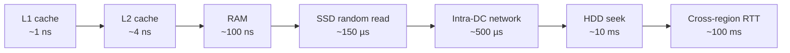

# Part 8 — High TPS, Performance & Capacity

> **Sprint allocation:** Week 5 (shared with end of Part 7 and Part 9). **Budget: ~3-4 hrs.**

## 8 High TPS, Performance & Capacity — topic inventory

| # | Topic | Tags | Tier | Time | Done | Partial | Grilling | Visit Again | Notes | Resources |
|---|-------|------|------|------|------|---|----------|-------------|-------|-----------|
| 1 | Latency numbers every programmer should know (L1 → memory → SSD → network → cross-region) | 🔴 💼 🎯 | L | 40 min | [x] | [ ] | [ ] | [ ] | | 📖 [Latency & Little's Law](/performance/latency_throughput_littles_law/) · 📖 Jeff Dean's "Latency numbers every programmer should know" · 💻 Warm-up: write latency cheat sheet from memory — L1, L2, RAM, SSD, HDD, intra-DC RTT, cross-region RTT (10 min) |
| 2 | Throughput math | 🔴 💼 🎯 | MP | 1 hr | [x] | [ ] | [ ] | [ ] | | 📖 [Latency & Little's Law](/performance/latency_throughput_littles_law/) |
| 3 | Storage estimation — daily writes × retention × replication factor | 🔴 💼 🎯 | MP | 1 hr | [x] | [ ] | [ ] | [ ] | Covered from Alex Xu pages 35-40 — powers of two, QPS, peak QPS, Twitter/media storage estimate, retention, units, rounding assumptions | 📖 [Back-of-the-Envelope Capacity Estimation](/performance/capacity_estimation/) |
| 3 | GC tuning (G1GC vs ZGC) for latency — pause times vs throughput | 🔴 💼 | D | 1.5 hrs | [ ] | [ ] | [ ] | [ ] | | |
| 5 | Profiling tools — async-profiler, JFR, flame graphs | 🔴 💼 | D | 1.5 hrs | [ ] | [ ] | [ ] | [ ] | | 💻 Warm-up: run async-profiler on a spin-loop program, generate flame graph, identify hot method (45 min) |
| 6 | Non-blocking I/O (NIO, epoll, kqueue) | 🔴 💼 | D | 1.5 hrs | [x] | [ ] | [ ] | [ ] | | 📖 [Threading & WebFlux](/spring/spring_web/webflux_threading_model/) |
| 11 | Thread pool sizing — Little's Law | 🔴 💼 | MP | 1 hr | [x] | [ ] | [ ] | [ ] | | 📖 [Latency & Little's Law](/performance/latency_throughput_littles_law/) |
| 6 | Read/write ratio reasoning | 🟠 💼 🎯 | M | 30 min | [x] | [ ] | [ ] | [ ] | Covered from Alex Xu pages 12, 15, and 95-96 — read-heavy systems use replicas/cache; write-heavy paths need partitioning/quorum tuning | 📖 [Back-of-the-Envelope Capacity Estimation](/performance/capacity_estimation/) |
| 7 | Hot vs cold data, tiering | 🟠 💼 🎯 | M | 30 min | [x] | [ ] | [ ] | [ ] | Covered from Alex Xu pages 15-16 and 89 — cache frequently read data, avoid treating volatile cache as source of truth, keep hot data in memory and colder data on disk | 📖 `system_design/components/caching/index.md` · 📖 `databases/key_value_store/index.md` |
| 8 | Peak-to-average ratio (don't size for average) | 🟠 💼 🎯 | M | 30 min | [x] | [ ] | [ ] | [ ] | Covered from Alex Xu pages 39-40 — estimate average QPS, peak QPS, and use round assumptions rather than sizing only from smooth averages | 📖 [Back-of-the-Envelope Capacity Estimation](/performance/capacity_estimation/) |
| 9 | GC tuning intuition (without going overboard) | 🟠 💼 | MP | 1.5 hrs | [ ] | [ ] | [ ] | [ ] | | |
| 10 | Connection pool sizing (HikariCP — `pool size = ((cores × 2) + effective_spindle_count)`) | 🟠 💼 | MP | 1 hr | [ ] | [ ] | [ ] | [ ] | | (Cross-ref Part 6 HikariCP) |
| 10 | Object pooling (e.g., HikariCP internals) | 🟠 💼 | MP | 1 hr | [ ] | [ ] | [ ] | [ ] | | |
| 12 | P50 / P90 / P99 / P99.9 latency — tail latency matters more than average | 🟠 💼 | M | 1 hr | [ ] | [ ] | [ ] | [ ] | | 📖 Gil Tene — "How NOT to measure latency" (~30 min, canonical) |
| 13 | Load testing — JMeter, Gatling, k6, Locust | 🟠 💼 | MP | 1.5 hrs | [ ] | [ ] | [ ] | [ ] | | 💻 Warm-up: write k6 script with 10 VUs ramping to 100 over 30s against a local endpoint, read the p95 (30 min) |
| 14 | Async I/O, non-blocking | 🟠 💼 🎯 | MP | 1.5 hrs | [x] | [ ] | [ ] | [ ] | | 📖 [Threading & WebFlux](/spring/spring_web/webflux_threading_model/) |
| 18 | Precomputation / materialization | 🟠 💼 🎯 | M | 45 min | [ ] | [ ] | [ ] | [ ] | | |
| 19 | Read-path optimization (denormalization, fan-out on write) | 🟠 💼 🎯 | MP | 1.5 hrs | [ ] | [ ] | [ ] | [ ] | | |
| 20 | Write-path optimization (LSM trees, append-only logs) | 🟠 💼 🎯 | MP | 1.5 hrs | [x] | [ ] | [ ] | [ ] | Covered from Alex Xu pages 105-106 — commit log, memory table/cache, flush to sorted SSTables, and Bloom-filter-assisted read path | 📖 `databases/key_value_store/index.md` |
| 21 | Microbenchmarking — JMH, pitfalls | 🟡 | MP | 1.5 hrs | [ ] | [ ] | [ ] | [ ] | | |
| 22 | Lock-free data structures | 🟡 | D | 1.5 hrs | [ ] | [ ] | [ ] | [ ] | | |
| 23 | Off-heap memory | 🟡 | M | 1 hr | [ ] | [ ] | [ ] | [ ] | | |

## Time summary

| Scope | Hours (zero baseline) | Weeks @ 10–12 hrs/wk | Actual time |
|-------|-----------------------|----------------------|-------------|
| 🔴 MUST only (Sprint priority — 3-month plan) | ~8.17 hrs | ~0.74 wk | |
| 🔴 + 🟠 HIGH (must + high — senior coverage) | ~20.92 hrs | ~1.9 wk | |
| Full Part (all items including 🟡) | ~24.92 hrs | ~2.27 wk | |

## Key diagrams

**Latency hierarchy (orders of magnitude):**

> Each step is roughly 10-1000× slower than the previous. Internalize: RAM is 100,000× faster than HDD seek; intra-DC network is 1000× slower than RAM.

## Frequently asked

1. **Q:** Estimate the storage requirement for a KYC platform processing 1M verifications/day, with 10KB metadata + 500KB images each, 3 replicas, 7-year retention.
   - **Why asked:** Back-of-envelope is senior-canonical. Math: 1M × (10KB + 500KB) = ~510GB/day. × 365 × 7 × 3 (replicas) = ~3.9PB. Round up for indices, indexes, audit logs: ~5PB. Tests fluency in unit conversion + planning.
2. **Q:** Your service has P99 latency of 200ms, but P50 is 30ms. Why does this matter more than the average?
   - **Why asked:** Tail latency understanding. P99 means 1% of users see 200ms — at 1M requests/day, that's 10K users with bad experience. Average hides this. Senior signal: discuss percentile-of-percentiles when fanning out (P99 of a service that fans out to 10 services = a much higher composite latency).
3. **Q:** Walk through Little's Law and apply it to size a thread pool.
   - **Why asked:** Operational depth. L = λW: concurrent requests = throughput × latency. If you want 100 RPS and each takes 200ms = 100 × 0.2 = 20 concurrent. Pool size ≈ 20 (plus headroom). Tests practical capacity reasoning.
4. **Q:** When does async I/O beat blocking I/O? When does it not?
   - **Why asked:** I/O-bound vs CPU-bound. Async wins when blocking time dominates (network calls, DB queries) — frees threads to do other work. Async loses or no-difference for CPU-bound work and for low-concurrency scenarios where blocking is simpler. Adds complexity (callback hell, harder debugging).
5. **Q:** Read this flame graph. What does the wide red bar at the bottom mean?
   - **Why asked:** Profiling literacy. Width = total samples in that stack frame; depth = call depth. A wide bar = hot path. Wide-and-red typically marks high CPU usage in that frame. Senior should identify hot paths in 30 seconds.
6. **Q:** Your endpoint hits 500 RPS but P99 jumps from 50ms to 5s above 400 RPS. What's happening?
   - **Why asked:** Capacity ceiling reasoning. Likely: thread pool saturation, queue buildup, GC pressure, or downstream rate limit. Diagnosis steps: check thread pool utilization, queue depth, GC log, downstream latency. Could be Little's Law violated (more concurrent in-flight than pool size allows → queueing).
7. **Q:** Read path vs write path optimization — give one example each from your KYC platform.
   - **Why asked:** Domain application. Read path: cache the verification status (fan-out on write to Redis cache). Write path: batch document uploads to S3 in 5MB chunks rather than per-image. Demonstrates platform-aware thinking.

## Trick questions / gotchas

1. **Q:** Pool size of `cores × 2` — when is this rule wrong?
   - **Gotcha:** The rule applies to CPU-bound work. For I/O-bound work (DB calls, HTTP calls), pool size should be MUCH higher — Little's Law dictates it. Conversely, for highly parallel CPU work, even `cores × 2` is too many (context-switching overhead). Always derive from workload, not from the rule.
2. **Q:** Your microbenchmark says `String concatenation` takes 5ns. Production says 5µs. What's the gap?
   - **Gotcha:** JMH must run benchmarks in a forked JVM with warm-up + black-hole sink to prevent dead-code elimination. Without these, the JIT optimizes away the concatenation entirely → bogus number. Production-realistic numbers require representative workload + warm JIT.
3. **Q:** P99 of 50ms feels great. But when 10 microservices each have P99=50ms and you fan out to all of them, what's the resulting P99?
   - **Gotcha:** Higher than 50ms. Approximately P99^10 — the composite request hits at least one slow path. Roughly, expected slow-path probability = 1 - (0.99)^10 ≈ 10%. So composite P99 will be much closer to P99.9 of individual services. This is why tail latency compounds badly in fan-out architectures.
4. **Q:** You added a Redis cache to your hot read path. Latency dropped, but throughput didn't improve. Why?
   - **Gotcha:** Bottleneck moved, not removed. If reads were fast but writes were the bottleneck, the cache didn't help throughput. Or: the cache itself became the bottleneck (single Redis instance with too many connections). Or: cache warming is still happening (cold cache means many misses still hit the DB).

## Mastery candidates (top 3–5 from this Part — suggestions, not commitments)

- **Profiling + flame graph walkthrough** (~3.5 hrs combined rows 4 + 5) — async-profiler in production-like setup, flame graph reading. Pair with a hot-path investigation against a real Spring Boot app.
- **Latency budget design for the KYC platform** (~2.5 hrs) — start with a 1-second SLO, decompose across SDK → orchestrator → 3 vendor calls → DB writes. Show where time goes; identify the bottleneck.
- **Tail-latency analysis end-to-end** (~2.5 hrs combined rows 12 + question about P99) — read Gil Tene's "How NOT to measure latency", compute composite P99 under fan-out, design test for it.
- **Little's Law applied to your thread pool sizing** (~2 hrs row 11) — derive pool size for KYC verification orchestrator given vendor latencies and target RPS.

## Hands-on exercises (Practice + Advanced)

Warm-up performance exercises are listed inline in the topic-table Resources column (counted in main Time summary). Longer exercises below are tracked separately.

### Practice — mid-level (~30-60 min each)

1. **Flame graph reading session** (~60 min) — capture an async-profiler flame graph of a Spring Boot app under k6 load. Identify the top 3 hot methods. Add a SQL N+1 anti-pattern intentionally — re-capture, observe the new hot frames.
2. **Little's Law calculation drill** (~30 min) — given 3 scenarios (200 RPS @ 50ms, 100 RPS @ 500ms, 1000 RPS @ 10ms), compute required concurrency. Pick a target thread pool size with 20% headroom.
3. **JMH benchmark of string concatenation styles** (~60 min) — `+`, `StringBuilder`, `String.format`, `String.join`. Run with proper JMH boilerplate (warm-up + blackhole + forks). Read the percentiles, not the average.

### Advanced — senior-grade depth (~60+ min each)

4. **Latency budget for KYC verification end-to-end** (~90 min) — write up a 1-second SLO budget broken down by SDK upload, orchestrator decision, 3 vendor calls (face-match, liveness, OCR), DB writes, callback. Identify the slowest hop. Document mitigations.
5. **Design for 10× current traffic** (~60 min) — pick your KYC platform's current scale, multiply by 10. Identify which bottlenecks appear first (vendor rate limits, DB connections, thread pool, queue depth). Outline 3 architectural changes.

### Hands-on time summary (Practice + Advanced only)

| Tier | Total time | Weeks @ 10–12 hrs/wk | Actual time |
|------|------------|----------------------|-------------|
| Practice (mid-level) | ~2.5 hrs | ~0.23 wk | |
| Advanced (senior-grade) | ~2.5 hrs | ~0.23 wk | |
| **Combined hands-on (Practice + Advanced)** | **~5 hrs** | **~0.45 wk** | |

> Warm-up exercises (counted in main Time summary above) total ~70 min for Part 8 across 3 in-table warm-ups.

## Quick recall

**Q. L1 cache vs disk seek — order of magnitude difference?**
A. ~1 ns vs ~10 ms = 10,000,000× (ten million). Most latency budget goes to network and disk.

**Q. Little's Law in one sentence.**
A. Concurrent in-flight requests (L) = throughput (λ) × average latency (W). Use it to size pools: target_pool_size = target_RPS × average_latency.

**Q. P99 vs P99.9 — why both matter?**
A. P99 = 1% of users hit the slow path. At 1M req/day, that's 10K user-visible slow experiences. P99.9 catches the next layer — 0.1% = 1000 users. Fan-out architectures see composite percentiles way worse than individual.

**Q. Why is "average latency" misleading?**
A. A few slow outliers can pull the average up (or down) while hiding the actual user experience. Latency is heavily right-skewed; use percentiles, not means.

**Q. LSM tree vs B-tree — when each?**
A. LSM (Log-Structured Merge): write-heavy workloads (Cassandra, RocksDB, LevelDB) — append-only writes are fast, reads cost extra (merge from multiple SSTables). B-tree: read-heavy + balanced (Postgres, MySQL InnoDB).

**Q. JMH gotcha — what's a microbenchmark pitfall?**
A. The JIT can dead-code-eliminate trivial code (e.g., `x + 1` without using the result) → fake fast numbers. JMH solves this with `Blackhole.consume()`, forks, and proper warm-up phases.
