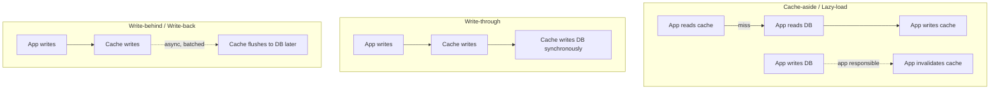
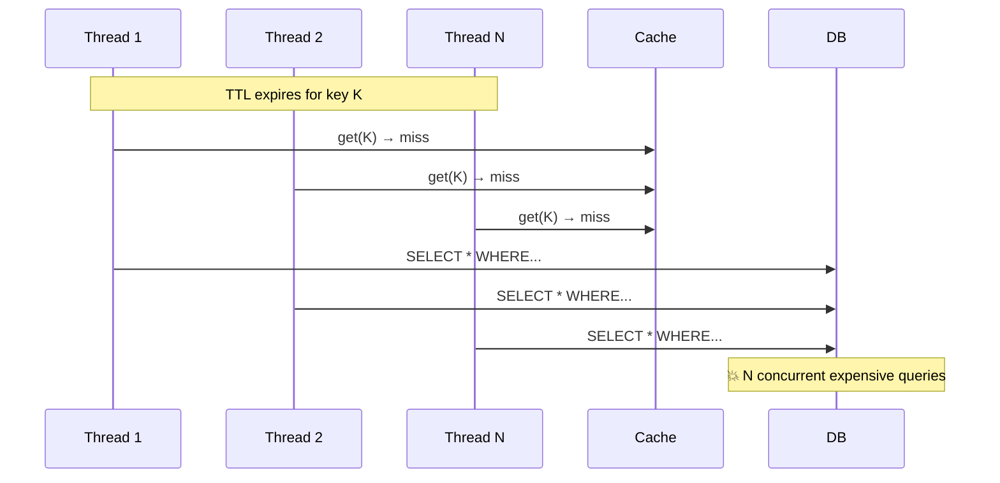

# Part 9 — Caching (deep dive)

> **Sprint allocation:** Week 5 (shared). **Budget: ~3-4 hrs.**

## 9 Caching — topic inventory

| # | Topic | Tags | Tier | Time | Done | Partial | Grilling | Visit Again | Notes | Resources |
|---|-------|------|------|------|------|---|----------|-------------|-------|-----------|
| 1 | Patterns — cache-aside, read-through, write-through, write-behind, refresh-ahead | 🔴 💼 🎯 | D | 1.5 hrs | [x] | [ ] | [ ] | [ ] | ~45 min (ChatGPT). Refresh-ahead pending; write-around covered as bonus | 📖 `system_design/components/caching/index.md` |
| 2 | Invalidation strategies — TTL, explicit, event-driven | 🔴 💼 🎯 | MP | 1.5 hrs | [ ] | [x] | [ ] | [ ] | Partial: explicit delete-vs-update on write covered; TTL + event-driven strategies pending | 📖 `system_design/components/caching/index.md` (explicit only) · 💻 Warm-up: cache-aside with TTL using Spring `@Cacheable(unless=...)` + explicit eviction via `@CacheEvict` (15 min) |
| 3 | Eviction policies — LRU, LFU, ARC, FIFO, random | 🔴 💼 🎯 | MP | 1.5 hrs | [ ] | [x] | [ ] | [ ] | Partial: LRU concept covered; LFU/ARC/FIFO details pending | 📖 `system_design/components/caching/index.md` (LRU only) |
| 4 | Cache stampede / thundering herd — single-flight, request coalescing, jittered TTLs | 🔴 💼 🎯 | D | 2.5 hrs | [ ] | [ ] | [ ] | [ ] | | |
| 5 | Spring `@Cacheable` mechanics + pitfalls — self-invocation bypass (AOP proxy), SpEL key, `sync = true` for hot keys, condition vs unless, CacheManager wiring | 🔴 💼 🎯 | MP | 1.5 hrs | [ ] | [ ] | [ ] | [ ] | | 💻 Warm-up: reproduce the self-invocation trap — service method calls another method with @Cacheable on same class, observe cache bypass; fix via self-injection or AspectJ (30 min) |
| 6 | Multi-tier caching — browser, CDN, gateway, app, distributed, DB buffer | 🟠 💼 🎯 | MP | 1.5 hrs | [ ] | [x] | [ ] | [ ] | ~45 min (ChatGPT). Partial: local→Redis→DB layering + CPU-cache analogy + CDN tier covered; full browser/gateway/DB-buffer tier walk pending | 📖 `system_design/components/caching/index.md` + `system_design/components/cdn/index.md` (partial) |
| 7 | Negative caching (caching "not found") | 🟠 💼 🎯 | M | 45 min | [ ] | [ ] | [ ] | [ ] | | |
| 8 | Cache consistency models in microservices | 🟠 💼 🎯 | MP | 1.5 hrs | [ ] | [ ] | [ ] | [ ] | | |
| 9 | Hot key problem & mitigation | 🟠 💼 🎯 | MP | 1.5 hrs | [ ] | [ ] | [ ] | [ ] | | |
| 10 | Cache key design — tenant-scoped, versioned, collision-safe (e.g., `kyc:v1:tenant:{tenantId}:doc:{docId}`); cross-tenant safety; key versioning for schema migrations | 🟠 💼 🔐 | M | 1 hr | [ ] | [ ] | [ ] | [ ] | | |
| 11 | Redis specifically — data structures, persistence (RDB/AOF), Sentinel, Cluster | 🟠 💼 | D | 2.5 hrs | [ ] | [x] | [ ] | [ ] | ~45 min (ChatGPT). Partial: Cluster (16384 hash slots, masters/replicas, failover) covered; data structures, RDB/AOF, Sentinel pending | 📖 `system_design/components/caching/index.md` (Cluster only) · 📖 redis.io intro · 💻 Warm-up: connect with `redis-cli`, exercise SET/GET/EXPIRE/TTL/HSET/LPUSH/ZADD from memory (20 min) |
| 13 | Caffeine (in-JVM cache) — for Spring apps | 🟠 | MP | 1.5 hrs | [ ] | [ ] | [ ] | [ ] | | 💻 Warm-up: Caffeine builder with maximumSize + expireAfterWrite + recordStats (20 min) |
| 12 | Memcached vs Redis tradeoffs | 🟡 | M | 45 min | [ ] | [ ] | [ ] | [ ] | | |

## Time summary

| Scope | Hours (zero baseline) | Weeks @ 10–12 hrs/wk | Actual time |
|-------|-----------------------|----------------------|-------------|
| 🔴 MUST only (Sprint priority — 3-month plan) | ~8.5 hrs | ~0.77 wk | |
| 🔴 + 🟠 HIGH (must + high — senior coverage) | ~18.75 hrs | ~1.7 wk | |
| Full Part (all items including 🟡) | ~19.5 hrs | ~1.77 wk | ~2.25 hrs so far |

## Key diagrams

**Cache patterns — write semantics:**

> Cache-aside is the most common (app owns cache logic). Write-through gives consistency at write-latency cost. Write-behind sacrifices durability for performance.

**Cache stampede — the failure mode:**

> Fix: single-flight (only one thread loads, others wait), request coalescing, or jittered TTLs so keys don't expire simultaneously.

## Frequently asked

1. **Q:** Walk through 5 cache write patterns (cache-aside, read-through, write-through, write-behind, refresh-ahead). When does each fit?
   - **Why asked:** Senior-canonical. Cache-aside (most common, app-managed); read-through (cache fetches on miss); write-through (sync write); write-behind (async, batched, durability risk); refresh-ahead (proactive renewal for hot keys before TTL).
2. **Q:** Cache stampede — what is it, what causes it, three mitigations?
   - **Why asked:** Tail-latency canonical. Cause: many threads simultaneously miss a popular key (TTL expired or first request). Mitigations: (1) single-flight / mutex around DB call, (2) jittered TTL so keys don't expire together, (3) probabilistic early refresh before TTL expires.
3. **Q:** Compare LRU vs LFU eviction. When does each win?
   - **Why asked:** Eviction-policy literacy. LRU: assumes recently-used = likely-needed; works well for sequential access patterns. LFU: assumes frequently-used = important; works well when access patterns are stable. LFU pathological case: long-tail cold items can never be evicted. ARC adapts between them.
4. **Q:** Negative caching — when do you cache "not found"?
   - **Why asked:** Common subtle optimization. When DB lookups for missing keys are expensive AND missing keys are common (e.g., bot traffic). Caveat: bounded TTL on negative entries (so a new entry isn't permanently "missing"). Don't negative-cache if keys are likely to be created soon (e.g., new user profile during onboarding).
5. **Q:** Hot key problem in Redis Cluster — what is it, mitigations?
   - **Why asked:** Real production headache. Single key gets disproportionate traffic → single shard overloaded. Mitigations: (1) replicate hot key across shards, (2) split hot key into many sub-keys (`key:shard1` ... `key:shardN`), (3) client-side caching of hot keys (Spring Caffeine in front of Redis), (4) tag-based sharding via hash tags.
6. **Q:** Multi-tier caching — design the cache layers for your KYC platform's verification status read path.
   - **Why asked:** Architecture exercise. Likely: client SDK (60s TTL) → API gateway / CloudFront (10s TTL) → app-level Caffeine (1s TTL) → Redis distributed cache → DB. Each layer has different consistency budgets.
7. **Q:** Redis persistence options — RDB vs AOF, when to use each?
   - **Why asked:** Operational depth. RDB: point-in-time snapshots, smaller files, faster restart, but data loss between snapshots. AOF: append every write, larger but more durable, slower restart. AOF + `appendfsync everysec` is a common production sweet spot.

## Trick questions / gotchas

1. **Q:** Your cache TTL is 1 hour. Why does adding "jitter" matter?
   - **Gotcha:** Without jitter, all keys written in the same minute expire in the same minute — and reload concurrently (stampede). Jitter: actual_ttl = base_ttl + random(0, 0.1 × base_ttl) (10% jitter). Spreads expiration evenly.
2. **Q:** You set up cache-aside. After a write to DB, you forget to invalidate the cache. The user sees stale data for an hour. How would you architect to avoid this?
   - **Gotcha:** Common bug. Architecture options: (1) write-through (eliminate manual invalidation), (2) event-driven invalidation (DB change events → cache eviction), (3) much shorter TTL (sacrifice cache hit rate for staleness bound), (4) cache key includes a "version" or "updated_at" that's checked on read.
3. **Q:** Redis MSET on 4 keys — is this atomic across keys?
   - **Gotcha:** Yes, MSET is atomic (single-threaded Redis). But in Redis Cluster, keys may live on different shards — MSET fails unless all keys are in the same slot. Use `{tag}` hash tags to force same-slot for related keys: `user:{42}:name`, `user:{42}:email`.
4. **Q:** You added Caffeine cache in front of an expensive operation. Cache hit rate is 95% but P99 latency is unchanged. Why?
   - **Gotcha:** The 5% misses dominate P99 because percentiles measure the slow tail. If misses are slow (say 500ms) and hits are fast (1ms), and you have 95% hits, P99 still sees the misses. Fix: reduce miss latency (cache more, eager warming, or improve the miss path itself).

## Mastery candidates (top 3–5 from this Part — suggestions, not commitments)

- **Cache stampede + mitigation strategies** (~2.5 hrs) — interview-canonical. Implement single-flight in Java (one approach: `ConcurrentHashMap<Key, CompletableFuture<Value>>`). Add jittered TTL helper.
- **Multi-tier cache design for your KYC platform** (~2 hrs) — concrete cache layer design with TTLs, consistency budgets, invalidation triggers. Becomes a portable artifact for design discussions.
- **5 cache patterns walkthrough with concrete code** (~3 hrs) — implement all 5 patterns in a small Spring service. Compare write latency, miss path, durability semantics.
- **Redis data structures + hot key mitigation** (~2.5 hrs) — strings, hashes, sorted sets, streams. Plus hot-key replication strategy with hash tags.

## Hands-on exercises (Practice + Advanced)

Warm-up cache exercises are listed inline in the topic-table Resources column (counted in main Time summary). Longer exercises below are tracked separately.

### Practice — mid-level (~30-60 min each)

1. **Reproduce cache stampede + fix** (~60 min) — Spring service with `@Cacheable` on a slow method (sleep 500ms). Load test with 100 concurrent users hitting same cache key. Observe N concurrent DB calls when TTL expires. Fix with `synchronized` or `ConcurrentHashMap<Key, CompletableFuture<Value>>`-based single-flight.
2. **Implement LRU cache from scratch** (~45 min) — `HashMap<K, Node> + Doubly Linked List`. Put / get / evict. Verify O(1) operations. Compare to `LinkedHashMap` with `accessOrder=true` + `removeEldestEntry()`.
3. **Negative caching with bounded TTL** (~30 min) — wrapper around `UserRepository.findById()` that caches `Optional.empty()` results with 10-second TTL. Verify it skips DB on cache hit. Confirm short TTL so new users aren't permanently negative-cached.

### Advanced — senior-grade depth (~60+ min each)

4. **Multi-tier cache for KYC verification status read** (~90 min) — design + implement: Caffeine in-process (TTL 1s) → Redis distributed (TTL 60s) → DB. Verify hit rates at each layer under load. Decide invalidation strategy.
5. **Redis hot key replication via hash tags** (~60 min) — simulate a hot key receiving 10× more traffic than others. Spread it across N replicas via `key:{shard1}` ... `key:{shardN}` with client-side fan-out. Measure load distribution.

### Hands-on time summary (Practice + Advanced only)

| Tier | Total time | Weeks @ 10–12 hrs/wk | Actual time |
|------|------------|----------------------|-------------|
| Practice (mid-level) | ~2.25 hrs | ~0.2 wk | |
| Advanced (senior-grade) | ~2.5 hrs | ~0.23 wk | |
| **Combined hands-on (Practice + Advanced)** | **~4.75 hrs** | **~0.45 wk** | |

> Warm-up exercises (counted in main Time summary above) total ~1 hr 25 min for Part 9 across 4 in-table warm-ups (adds the @Cacheable self-invocation reproduction).

## Quick recall

**Q. Cache-aside in one sentence.**
A. App reads cache first; on miss, app reads DB and writes cache; on write, app writes DB then invalidates (or updates) cache. Most common pattern; app owns the cache logic.

**Q. Stampede — three mitigations.**
A. (1) Single-flight / mutex so only one thread loads the missing key. (2) Jittered TTL so keys don't expire simultaneously. (3) Probabilistic early refresh before TTL expires.

**Q. LRU vs LFU — when LFU wins.**
A. LFU wins when access patterns are stable and a few hot items dominate access (the items get high frequency counts and stay in cache). Loses on access-pattern shifts (a new hot item can't beat the old high-frequency ones to stay resident).

**Q. Why use jitter on TTL?**
A. Without jitter, all keys written in the same window expire together — concurrent reload thundering herd. Jitter (10-20% random) spreads expirations evenly.

**Q. Redis hash tags syntax — what's it for?**
A. `user:{42}:name` — the `{42}` portion is the hash tag; all keys with same tag land on same Redis Cluster slot. Enables multi-key ops (MSET, MGET, MULTI/EXEC) across related keys.

**Q. Negative caching gotcha?**
A. Cache "not found" with bounded TTL (10-60 seconds), not the long TTL of positive entries. Otherwise newly-created entities appear missing for hours.
