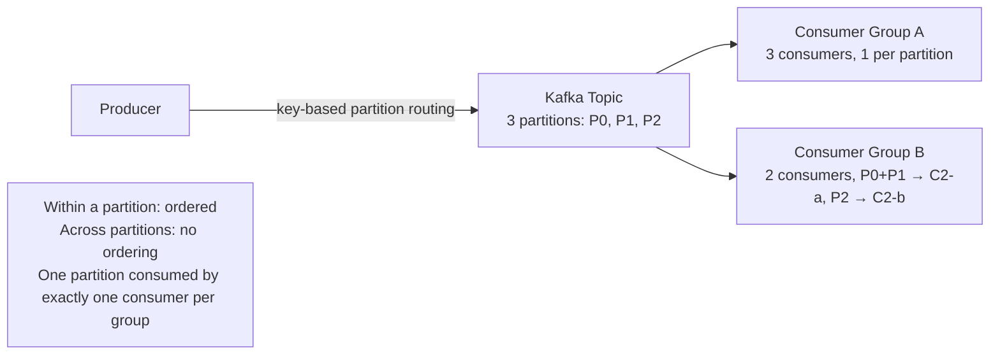
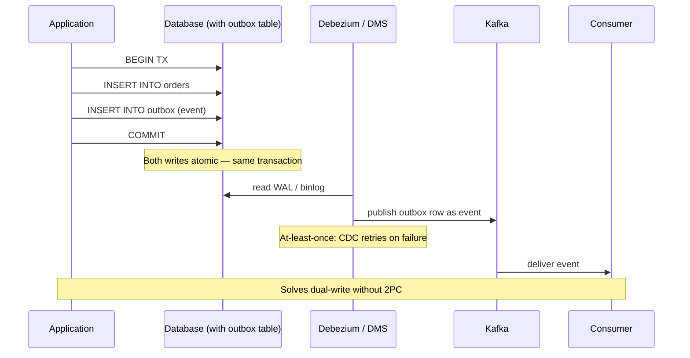

# Part 10 — Messaging & Streaming

> **Sprint allocation:** Week 6 (shared with Parts 11, 12). **Budget: ~3-4 hrs.**

## 10 Messaging & Streaming — topic inventory

| # | Topic | Tags | Tier | Time | Done | Partial | Grilling | Visit Again | Notes | Resources |
|---|-------|------|------|------|------|---|----------|-------------|-------|-----------|
| 1 | Delivery semantics — at-most-once, at-least-once, exactly-once (and why true EOS is rare) | 🔴 💼 🎯 | D | 2.5 hrs | [x] | [ ] | [ ] | [ ] | ~22 min (ChatGPT, 2 pastes) — all three semantics via ACK/process ordering, why EOS rare, effectively-once (at-least-once + idempotency + dedup) | 📖 `messaging/queues_pubsub/MessageQueuesAndPubSub.md` · 📖 `databases/distributed_transactions/DistributedTransactions.md` |
| 2 | Ordering guarantees — global vs per-partition vs none | 🔴 💼 🎯 | MP | 1.5 hrs | [ ] | [ ] | [ ] | [ ] | | |
| 3 | Producer / consumer patterns, consumer groups | 🔴 💼 🎯 | MP | 1.5 hrs | [ ] | [ ] | [ ] | [ ] | | |
| 4 | Idempotency keys | 🔴 💼 🎯 | D | 2 hrs | [ ] | [x] | [ ] | [ ] | Partial: idempotency keys + dedup-by-txn-id + payment-key example + safe-to-retry covered; hands-on dedup-table warm-up pending. ~13 min (ChatGPT) | 📖 `databases/distributed_transactions/DistributedTransactions.md` · (Cross-ref Part 7 idempotency) |
| 5 | Dead-letter queues, retries, poison messages | 🔴 💼 🎯 | MP | 1.5 hrs | [x] | [ ] | [ ] | [ ] | ~9 min (ChatGPT) — DLQ after N retries, poison pill (malformed vs STOP sentinel), ACK-driven retry | 📖 `messaging/queues_pubsub/MessageQueuesAndPubSub.md` |
| 6 | Spring Kafka — `@KafkaListener`, `ConcurrentMessageListenerContainer`, `DefaultErrorHandler`, dead-letter publishing recovery, batch listeners | 🔴 💼 | MP | 2 hrs 30 min | [ ] | [ ] | [ ] | [ ] | | 💻 Warm-up: @KafkaListener consuming from a topic, simulate exception, configure DefaultErrorHandler with 3-retry exponential backoff + DLT recoverer (30 min) |
| 7 | Kafka — partitions, replicas, ISR, offsets, compaction, exactly-once semantics | 🟠 💼 🎯 | D | 3 hrs 30 min | [ ] | [x] | [ ] | [ ] | Partial: log-not-queue model + offsets/offset-commit + consumer-crash redelivery/duplicates covered; partitions/replicas/ISR/compaction pending. ~13 min (ChatGPT) | 📖 `databases/distributed_transactions/DistributedTransactions.md` · 📖 Confluent Kafka docs "Architecture" page (~30 min) · 💻 Warm-up: produce + consume to a local Kafka topic with 3 partitions, observe consumer-group rebalance (30 min) |
| 8 | Retry topics pattern (Uber / Confluent-style) — `topic.retry.5m`, `topic.retry.30m`, `topic.dlt` chains; non-blocking retry without parking the consumer thread; Spring's `@RetryableTopic` annotation | 🟠 💼 | MP | 1.5 hrs | [ ] | [ ] | [ ] | [ ] | | |
| 9 | SQS — standard vs FIFO, visibility timeout, long polling | 🟠 💼 🎯 | MP | 2 hrs | [ ] | [x] | [ ] | [ ] | Partial: long polling + FIFO ordering concept covered; visibility timeout + standard-vs-FIFO specifics pending. ~9 min (ChatGPT) | 📖 `messaging/queues_pubsub/MessageQueuesAndPubSub.md` |
| 10 | SNS — fan-out, filtering | 🟠 💼 🎯 | M | 1 hr | [x] | [ ] | [ ] | [ ] | ~24 min (ChatGPT, 2 pastes) — fan-out, event filtering by attribute, multi-protocol delivery (queue/HTTP/Lambda), durability | 📖 `messaging/queues_pubsub/MessageQueuesAndPubSub.md` |
| 11 | Kinesis — shards, retention, consumer types | 🟠 💼 🎯 | MP | 1.5 hrs | [ ] | [ ] | [ ] | [ ] | | |
| 12 | RabbitMQ — exchanges, queues, bindings, routing keys | 🟠 💼 | MP | 1.5 hrs | [ ] | [x] | [ ] | [ ] | Partial: RabbitMQ model (queue, deliver-ACK-delete, vs Kafka log) covered; exchanges/bindings/routing-keys pending. ~9 min (ChatGPT) | 📖 `messaging/message_brokers/MessageBrokers.md` |
| 13 | Event-driven architecture — events vs commands | 🟠 💼 | MP | 1.5 hrs | [x] | [ ] | [ ] | [ ] | ~9 min (ChatGPT) — event ("this happened") vs command ("do this"), fan-out, pub/sub extensibility | 📖 `messaging/queues_pubsub/MessageQueuesAndPubSub.md` |
| 14 | Outbox pattern (revisit) | 🔴 💼 | M | 45 min | [ ] | [ ] | [ ] | [ ] | | (Cross-ref Part 4.3) |
| 15 | Change Data Capture (CDC) — Debezium, AWS DMS, MySQL binlog, Postgres logical replication | 🟠 💼 🎯 | D | 2 hrs 30 min | [ ] | [ ] | [ ] | [ ] | | 💻 Warm-up: run Debezium against local Postgres, observe a row INSERT propagate to a Kafka topic (30 min) |
| 16 | Transactional outbox + CDC — reliable event publishing without 2PC | 🟠 💼 🎯 | D | 2.5 hrs | [ ] | [ ] | [ ] | [ ] | | |
| 17 | Choreography vs orchestration in event-driven architecture | 🟠 💼 | M | 45 min | [ ] | [ ] | [ ] | [ ] | | (Cross-ref Part 4.3 Sagas) |
| 18 | Stream processing — Kafka Streams, Flink basics | 🟡 | MP | 1.5 hrs | [ ] | [ ] | [ ] | [ ] | | |
| 19 | Schema registry, Avro / Protobuf for events; schema evolution rules | 🟡 | MP | 1.5 hrs | [ ] | [ ] | [ ] | [ ] | | |

## Time summary

| Scope | Hours (zero baseline) | Weeks @ 10–12 hrs/wk | Actual time |
|-------|-----------------------|----------------------|-------------|
| 🔴 MUST only (Sprint priority — 3-month plan) | ~12.75 hrs | ~1.16 wk | |
| 🔴 + 🟠 HIGH (must + high — senior coverage) | ~34 hrs | ~3.1 wk | |
| Full Part (all items including 🟡) | ~37 hrs | ~3.36 wk | ~1.8 hr so far |

## Key diagrams

**Kafka — partitions, consumer groups, parallelism:**

> Partition is the unit of ordering AND parallelism. Two consumer groups read independently. Within a group, partitions distribute among consumers (one partition can only be consumed by one consumer in the group at a time).

**Transactional Outbox + CDC pattern:**

> The Outbox table makes event publication a *consequence* of the DB commit, not a separate action that can fail independently. CDC reads the WAL after commit and publishes to Kafka.

## Frequently asked

1. **Q:** Explain at-most-once, at-least-once, exactly-once. Why is "exactly-once" rare in practice?
   - **Why asked:** Senior-canonical messaging. At-most-once: send and forget, may lose. At-least-once: retries until ack, may duplicate. Exactly-once: theoretically achievable with idempotency + atomic commit (Kafka EOS within Kafka boundaries), but crossing system boundaries requires idempotent receivers. "True exactly-once" is asymptotic — design for at-least-once + idempotent processing.
2. **Q:** Why does Kafka guarantee ordering only per-partition, not globally?
   - **Why asked:** Architecture trade-off. Per-partition ordering allows parallel consumption (each partition consumed by one consumer in a group). Global ordering would force serial processing → no scale. If you need global ordering, use 1 partition (limits throughput) or order at the application layer using sequence numbers + reorder buffer.
3. **Q:** Walk through Outbox + CDC vs writing directly to Kafka inside a @Transactional method.
   - **Why asked:** Dual-write problem. Direct write: if DB commits and Kafka write fails, event is lost. Or vice versa. Outbox: write event to outbox table in same transaction → DB guarantees atomic commit. Separate process (CDC) reads outbox and publishes to Kafka with retries. Achieves at-least-once delivery without 2PC.
4. **Q:** Your consumer crashes after processing but before committing offset. What happens, and how do you handle it?
   - **Why asked:** Operational depth. Consumer restarts, reads from last-committed offset → re-processes messages. Requires idempotent message processing. Mitigations: (1) idempotency key on each message, (2) atomic process-and-commit pattern, (3) transactional outbox to track processed message IDs.
5. **Q:** SQS Standard vs FIFO — when does each fit?
   - **Why asked:** AWS-specific choice. Standard: at-least-once, no ordering, unlimited throughput, occasional duplicates. FIFO: exactly-once within a message group ID, strict ordering, but lower throughput (300 TPS unbatched, 3000 batched). FIFO is right when ordering matters (e.g., per-account event streams).
6. **Q:** Choreography vs orchestration in your KYC vendor flow — which would you pick?
   - **Why asked:** Architecture decision. Orchestration: KYC orchestrator decides the next step (current design). Easier to reason about, single point of complexity, easier to monitor. Choreography: each service reacts to events; looser coupling but harder to trace. KYC is naturally orchestration-friendly (single happy path with branches).
7. **Q:** What's a poison message and how do you handle it?
   - **Why asked:** Operational pattern. A message that consistently fails processing (malformed, references missing entity, hits a bug). Without handling, blocks the entire partition / queue. Fix: retry N times → move to DLQ → alert + manual inspection. Don't infinite-retry — wastes resources, blocks healthy messages behind it.

## Trick questions / gotchas

1. **Q:** Your consumer's `commitSync()` succeeds but processing failed. The message is now lost. What pattern would prevent this?
   - **Gotcha:** Process-then-commit ordering. Wrong: `consume → commit → process`. Right: `consume → process → commit`. Even better: process inside same transaction that commits offset, OR use idempotent processing so re-consumption is safe.
2. **Q:** Kafka exactly-once-semantics (EOS) is "exactly-once" — except when?
   - **Gotcha:** EOS is exactly-once *within Kafka boundaries* (producer → Kafka → consumer reading & writing back to Kafka, all atomic with transactions). It's NOT exactly-once when the consumer's downstream effect is outside Kafka (DB write, external API call). That requires idempotency on the consumer side.
3. **Q:** Your team set up SNS → SQS fan-out. You added a Lambda consumer that calls a third-party API. Now you're seeing duplicate API calls. Why?
   - **Gotcha:** SNS → SQS is at-least-once. Lambda is also at-least-once invocation. Compounded, your consumer may run twice on the same message even without failures (Lambda timeout retries, SQS visibility timeout expiry, etc.). Always design downstream API calls to be idempotent (Idempotency-Key header).
4. **Q:** You configured Kafka with `acks=1`. Why might you still lose messages?
   - **Gotcha:** `acks=1` means leader acks before replicas replicate. If leader dies before replicating to ISR followers, messages are lost. Use `acks=all` (or `-1`) for durability — wait for all in-sync replicas. Trade-off: latency cost.

## Mastery candidates (top 3–5 from this Part — suggestions, not commitments)

- **Delivery semantics deep dive + idempotency design** (~3 hrs combined rows 1 + 4) — at-least-once is the default reality; design idempotent consumers. Tie to your KYC platform's webhook delivery pattern.
- **Transactional Outbox + CDC end-to-end** (~3 hrs combined rows 12 + 14) — solves the dual-write problem cleanly. Production-grade pattern; you may already use a variant on your KYC platform.
- **Kafka partition strategy + consumer group rebalancing** (~3 hrs row 6) — partition key choice, rebalance triggers, sticky vs range vs round-robin assignment strategies.
- **DLQ + poison message handling pipeline** (~2 hrs row 5) — retry budget, exponential backoff, DLQ routing, manual reinjection flow.

## Hands-on exercises (Practice + Advanced)

Warm-up messaging exercises are listed inline in the topic-table Resources column (counted in main Time summary). Longer exercises below are tracked separately.

### Practice — mid-level (~30-60 min each)

1. **Kafka producer + consumer with partition key** (~60 min) — local Kafka via Docker. Producer with a `key` parameter (e.g., user ID). 3 partitions. Verify all messages for one key land on the same partition. Then start a 2nd consumer in same group, observe rebalance.
2. **Implement idempotent consumer** (~45 min) — consumer that reads from a queue + writes to a DB. Use unique message ID + dedup table (or `INSERT ... ON CONFLICT DO NOTHING`). Replay the same message 3 times — verify only one write.
3. **DLQ pipeline** (~45 min) — SpringBoot or local Kafka consumer with retry decorator. After 3 failed attempts, move to a DLQ topic. Verify happy-path messages aren't affected by poison messages.

### Advanced — senior-grade depth (~60+ min each)

4. **Transactional Outbox + Debezium walk-through** (~90 min) — Postgres with an `outbox` table. Spring service writes business data + outbox row in same `@Transactional`. Debezium reads Postgres WAL and emits to Kafka. Observe end-to-end flow. Document the durability story.
5. **Composite ordering — global ordering with sequence numbers** (~60 min) — Kafka topic with 4 partitions but you need global ordering. Add `sequence_number` to each message. Consumer reads from all 4 partitions, reorders by sequence number with a buffer. Document trade-offs (memory, latency).

### Hands-on time summary (Practice + Advanced only)

| Tier | Total time | Weeks @ 10–12 hrs/wk | Actual time |
|------|------------|----------------------|-------------|
| Practice (mid-level) | ~2.5 hrs | ~0.23 wk | |
| Advanced (senior-grade) | ~2.5 hrs | ~0.23 wk | |
| **Combined hands-on (Practice + Advanced)** | **~5 hrs** | **~0.45 wk** | |

> Warm-up exercises (counted in main Time summary above) total ~1 hr 30 min for Part 10 across 3 in-table warm-ups (adds the Spring Kafka @KafkaListener + DefaultErrorHandler + DLT warm-up).

## Quick recall

**Q. At-most-once vs at-least-once — fast definition.**
A. At-most-once: send and forget — never duplicates, may lose. At-least-once: retries until ack — never loses, may duplicate. Most systems are at-least-once + idempotent consumers (= effective exactly-once).

**Q. Why per-partition ordering instead of global?**
A. Per-partition allows parallel consumption. Global ordering forces single-consumer / single-partition serialization → no scale.

**Q. Outbox pattern — what problem does it solve?**
A. Dual-write: when you need to commit DB AND publish event atomically. Outbox: write event to DB table in same transaction; CDC reads outbox after commit, publishes reliably. No 2PC.

**Q. SQS Standard vs FIFO.**
A. Standard: unlimited throughput, may duplicate, no ordering. FIFO: exactly-once within message group ID, strict order, 300-3000 TPS limit. Pick FIFO when ordering matters.

**Q. What's a partition key in Kafka?**
A. The producer hashes the key to choose a partition. Same key → same partition → ordered consumption for that key. Common keys: user ID, session ID, entity ID. Skewed key distribution causes hot partition problems.

**Q. DLQ purpose?**
A. After N retries fail, route the poison message to a Dead Letter Queue. Frees up the main pipeline; surfaces problematic messages for manual triage. Always alert on DLQ depth.
