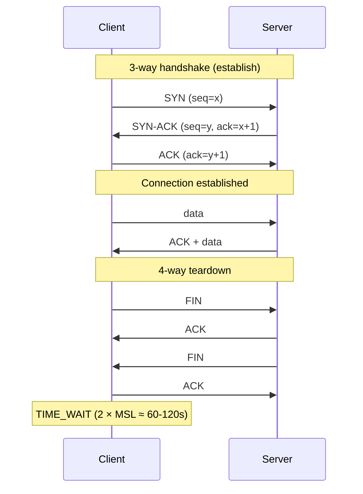

# Part 11 — Networking & Protocols

> **Sprint allocation:** Week 6 (shared). **Budget: ~3-4 hrs.**

## 11 Networking & Protocols — topic inventory

| # | Topic | Tags | Tier | Time | Done | Partial | Grilling | Visit Again | Notes | Resources |
|---|-------|------|------|------|------|---|---|-------------|-------|-----------|
| 1 | OSI vs TCP/IP model | 🔴 💼 🎯 | M | 45 min | [ ] | [x] | [ ] | [ ] | Partial: OSI-as-mental-framework framing covered; layer mapping + TCP/IP comparison pending | 📖 `networking/tcp_vs_udp/index.md` (framing only) |
| 2 | TCP — handshake, sliding window, congestion control (Reno, CUBIC, BBR) | 🔴 💼 🎯 | D | 2.5 hrs | [ ] | [x] | [ ] | [ ] | Partial: TCP guarantees (delivery/ordering/retransmit) covered; handshake, sliding window, congestion algorithms pending | 📖 `networking/tcp_vs_udp/index.md` (guarantees only) |
| 3 | UDP — when it's right (DNS, real-time, QUIC) | 🔴 💼 | M | 45 min | [x] | [ ] | [ ] | [ ] | ~45 min (ChatGPT). QUIC-specific coverage is still pending | 📖 `networking/tcp_vs_udp/index.md` |
| 4 | HTTP methods, status codes (and which to use when) | 🔴 💼 🎯 | M | 1 hr | [ ] | [x] | [ ] | [ ] | Partial: Theory covered, warm-up pending | 📖 `networking/http_basics/index.md` · 💻 Warm-up: write controller endpoints returning 200/201/204/400/401/403/404/409/422/429/500 with proper ResponseEntity (10 min) |
| 5 | HTTP caching essentials — `Cache-Control`, `ETag`, and conditional requests | 🔴 💼 🎯 | M | 45 min | [ ] | [ ] | [ ] | [ ] | Practical API and CDN interview scope. |  |
| 6 | CORS — preflight, simple requests | 🔴 💼 🎯 | MP | 1.5 hrs | [x] | [ ] | [ ] | [ ] | ~1.5 hr (ChatGPT) | 📖 `security/web_security/index.md` |
| 7 | DNS resolution flow — recursive, authoritative, caching | 🔴 💼 | MP | 1.5 hrs | [x] | [ ] | [ ] | [ ] | ~45 min (ChatGPT) | 📖 `networking/dns/index.md` |
| 8 | gRPC — Protobuf, streaming modes, deadlines | 🔴 💼 🎯 | MP | 1.5 hrs | [ ] | [x] | [ ] | [ ] | Partial: Protobuf serialization, generated code, shared contracts, versioning covered; streaming modes & deadlines pending. ~1 hr (ChatGPT) | 📖 `api_design/protobuf_grpc/index.md` |
| 9 | TCP operational details — head-of-line blocking, keepalive, TIME_WAIT | 🟠 💼 | MP | 1.5 hrs | [ ] | [ ] | [ ] | [ ] | Know these as troubleshooting concepts, not protocol-internals interview depth. |  |
| 10 | HTTP/1.1 connection behavior — persistent connections; recognize pipelining and chunked encoding | 🟠 💼 | M | 1 hr | [ ] | [ ] | [ ] | [ ] | Pipelining and chunk framing are reference knowledge. |  |
| 11 | HTTP/2 multiplexing — removes application-level request blocking on one connection | 🟠 💼 | M | 30 min | [ ] | [ ] | [ ] | [ ] | Know the benefit and its limits; TCP-level loss can still block streams. |  |
| 12 | Secondary cache validators — `Last-Modified` and `Vary` | 🟠 💼 | M | 30 min | [ ] | [ ] | [ ] | [ ] | Useful HTTP behavior, but not a must-have interview topic. |  |
| 13 | DNS record types — recognize `A`, `AAAA`, and `CNAME`; treat `MX`, `TXT`, and `SRV` as reference knowledge | 🟠 💼 | M | 30 min | [ ] | [ ] | [ ] | [ ] |  |  |
| 14 | IPv4 vs IPv6 basics — 32-bit vs 128-bit, dotted-decimal vs hex, dual-stack, where each dominates today (public internet, mobile, cloud VPCs) | 🟠 💼 | M | 45 min | [ ] | [x] | [ ] | [ ] | Partial: IPv4 scarcity (2^32) covered; IPv6 entirely pending | 📖 `networking/ip_addressing/index.md` (IPv4 scarcity only) |
| 15 | Subnetting, CIDR, RFC 1918 private ranges (10/8, 172.16-31/12, 192.168/16) — why private IPs aren't routable on the public internet | 🟠 💼 | MP | 1.5 hrs | [ ] | [x] | [ ] | [ ] | Partial: private ranges + non-routability covered; subnetting/CIDR math pending | 📖 `networking/ip_addressing/index.md` (ranges + routability only) |
| 16 | IP Address Types (Public/Private vs Static/Dynamic) — the 2x2 matrix, why databases use private static IPs, how hackers reach private IPs | 🟠 💼 | M | 45 min | [x] | [ ] | [ ] | [ ] | ~45 min (ChatGPT) | 📖 `networking/ip_addressing/index.md` |
| 17 | HTTP/3 / QUIC — over UDP, eliminates HoL blocking | 🟠 💼 🆕 | MP | 1.5 hrs | [ ] | [ ] | [ ] | [ ] |  |  |
| 18 | Content negotiation, Accept-Encoding (gzip, brotli) | 🟠 💼 | M | 45 min | [ ] | [ ] | [ ] | [ ] |  |  |
| 19 | Cookies — SameSite, Secure, HttpOnly | 🟠 💼 | M | 1 hr | [ ] | [ ] | [ ] | [ ] |  |  |
| 20 | TTL implications (DNS) | 🟠 💼 | M | 45 min | [x] | [ ] | [ ] | [ ] | ~1.5 hr (ChatGPT, including DNS hierarchy and players in the shared DNS doc) | 📖 `networking/dns/index.md` |
| 21 | Route 53 — routing policies (latency, weighted, geo, failover) | 🟠 💼 | MP | 1.5 hrs | [ ] | [x] | [ ] | [ ] | Partial: DNS-based LB / failover / CDN-steering concepts covered; Route 53 policy specifics pending | 📖 `networking/dns/index.md` (concepts only) |
| 22 | GraphQL — schema, resolvers, N+1, DataLoader | 🟠 💼 🎯 | MP | 1.5 hrs | [x] | [ ] | [ ] | [ ] | ~2 hr total (ChatGPT). N+1 problem covered | 📖 `databases/graph/index.md` · 📖 `api_design/api_technologies_summary/index.md` |
| 23 | Webhooks — design, retries, signing | 🟠 💼 🎯 | D | 2 hrs | [ ] | [x] | [ ] | [ ] | Partial: Definition and comparison to polling/WebSockets covered; design, retries, signing pending | 📖 `networking/communication_patterns/index.md` · 💻 Warm-up: write a webhook receiver that verifies HMAC-SHA256 signature against a shared secret with timestamp window (30 min) |
| 24 | NAT, port forwarding, CGNAT (carrier-grade NAT — ISPs sharing one public IP across many customers), Anycast (same IP advertised from many locations — CDNs, DNS, AWS Global Accelerator) | 🟠 💼 | MP | 1 hr | [x] | [ ] | [ ] | [ ] | ~45 min (ChatGPT). Anycast + port forwarding not covered yet | 📖 `networking/ip_addressing/index.md` |
| 25 | IP address allocation hierarchy — IANA → 5 RIRs (ARIN, RIPE NCC, APNIC, LACNIC, AFRINIC) → ISPs → end users; ICANN's coordinating role | 🟡 | M | 45 min | [ ] | [ ] | [ ] | [ ] |  |  |
| 26 | IPv4 exhaustion + secondary market — IANA 2011, RIR depletion timeline, brokers (e.g., IPv4.Global), RIR-approved transfers, why legacy /8 blocks (MIT, HP, DoD) shaped today's scarcity | 🟡 | M | 45 min | [ ] | [ ] | [ ] | [ ] |  |  |
| 27 | WebSockets — handshake, frames, use cases | 🟡 | MP | 1.5 hrs | [ ] | [x] | [ ] | [ ] | Partial: SDE2-level comparison to SSE/Webhooks covered; handshake & frames pending | 📖 `networking/communication_patterns/index.md` |
| 28 | Server-Sent Events (SSE) — including microservices fan-out pattern | 🟡 | M | 45 min | [ ] | [x] | [ ] | [ ] | Partial: Concept and comparison to WebSockets covered; microservices fan-out pattern pending | 📖 `networking/communication_patterns/index.md` |
| 29 | Long polling vs short polling | 🟡 | M | 30 min | [x] | [ ] | [ ] | [ ] | ~30 min (ChatGPT) | 📖 `networking/communication_patterns/index.md` |
| 30 | DHCP (leases, MAC→IP mapping) + MAC addresses — identity vs location, spoofing, why routing uses IP not MAC, tracing via ISP/CGNAT logs | 🟡 💼 | M | 45 min | [x] | [ ] | [ ] | [ ] | ~45 min (ChatGPT) | 📖 `networking/ip_addressing/index.md` |
| 31 | Forward vs reverse proxy, DNS/IP blocking, VPN tunneling, national firewalls (DPI, active probing) | 🟡 💼 | M | 45 min | [x] | [ ] | [ ] | [ ] | ~45 min (ChatGPT). Appended TLS/SNI + obfuscated VPNs | 📖 `networking/proxies_vpn/index.md` |
| 32 | HTTP/2 implementation details — HPACK header compression and deprecated server push | 🟢 | M | 30 min | [ ] | [ ] | [ ] | [ ] | Reference-only protocol detail. |  |

## Time summary

| Scope | Hours (zero baseline) | Weeks @ 10–12 hrs/wk | Actual time |
|-------|-----------------------|----------------------|-------------|
| 🔴 MUST only (Sprint priority — 3-month plan) | ~10.25 hrs | ~0.93 wk | |
| 🔴 + 🟠 HIGH (must + high — senior coverage) | ~27.25 hrs | ~2.48 wk | |
| Full Part (all items including 🟡 + 🟢) | ~33.5 hrs | ~3.05 wk | ~8.75 hrs so far |

## Key diagrams

**TCP 3-way handshake + connection teardown:**

> TIME_WAIT exists to absorb late-arriving packets from the closed connection. Too many TIME_WAITs on a load balancer = port exhaustion.

**HTTP/1.1 vs HTTP/2 vs HTTP/3 — concurrency model:**

```mermaid
flowchart TB
    subgraph H1["HTTP/1.1 — head-of-line blocked"]
        A1[Browser opens 6 TCP connections per origin]
        A1 --> A2[Each connection: serial request → response]
        A2 --> A3[Slow request blocks the connection's queue]
    end
    subgraph H2["HTTP/2 — multiplexed over single TCP"]
        B1[1 TCP connection]
        B1 --> B2[Multiple streams interleaved]
        B2 --> B3[App-level HoL eliminated, but TCP-level HoL remains: one lost packet stalls all streams]
    end
    subgraph H3["HTTP/3 — over QUIC over UDP"]
        C1[1 QUIC connection over UDP]
        C1 --> C2[Per-stream loss recovery — packet loss in one stream doesn't stall others]
        C2 --> C3[0-RTT resumption for known servers]
    end
```

## Frequently asked

1. **Q:** Walk through the TCP 3-way handshake. What happens if the final ACK is lost?
   - **Why asked:** Foundational. SYN → SYN-ACK → ACK. If final ACK is lost, server times out waiting for it, retransmits SYN-ACK. Client receives second SYN-ACK, re-sends ACK. (Or worse — the server gives up; client retries from scratch.) Tests understanding of stateful protocol robustness.
2. **Q:** HTTP/1.1 vs HTTP/2 — what does multiplexing solve, and what does it NOT solve?
   - **Why asked:** Senior-canonical. Solves: app-level head-of-line blocking (one slow request blocking others over the same connection). Doesn't solve: TCP-level HoL — a single lost packet stalls ALL streams on the connection because TCP guarantees ordered delivery. HTTP/3 / QUIC fixes this via per-stream loss recovery over UDP.
3. **Q:** Idempotent HTTP methods — which are idempotent, which aren't?
   - **Why asked:** RFC literacy. GET, HEAD, PUT, DELETE, OPTIONS, TRACE = idempotent (same request multiple times = same effect). POST, PATCH = NOT idempotent by default (POST creates resources; PATCH may be non-idempotent depending on impl). Add `Idempotency-Key` header to make POSTs idempotent.
4. **Q:** Walk through DNS resolution for `kyc-bank.com.my`. What's cached where?
   - **Why asked:** Operational depth. Browser cache → OS cache → recursive resolver (often ISP / 8.8.8.8) → root server → TLD server (.my) → authoritative server for kyc-bank.com.my. Each layer caches per the record's TTL. Stale records persist until TTL expires.
5. **Q:** Webhook signing — design a signature scheme for partner-bound notifications.
   - **Why asked:** KYC-canonical. HMAC-SHA256 over `timestamp + body`. Send signature in header `X-Signature`. Receiver: (1) check timestamp is within 5-min window (replay protection), (2) compute HMAC with shared secret, (3) constant-time compare. Rotate secret periodically.
6. **Q:** gRPC vs REST — when each fits?
   - **Why asked:** Modern service-to-service choice. gRPC: internal high-perf service-to-service (binary protobuf, HTTP/2 native, streaming, codegen, strict schemas, deadlines). REST: external APIs, browser clients, simpler clients, broader tooling. KYC: internal vendor adapters may use gRPC; SDK ↔ orchestrator stays REST.
7. **Q:** CORS preflight — when does it fire, what's in it?
   - **Why asked:** Frontend-backend interop. Fires for "non-simple" requests (custom headers, methods other than GET/POST/HEAD, content-type other than form/text/plain). Browser sends OPTIONS with `Access-Control-Request-Method/Headers` before the actual request. Server responds with `Access-Control-Allow-*` headers. Failing preflight blocks the actual request.

## Trick questions / gotchas

1. **Q:** Your load balancer is hitting "port exhaustion" errors. What's the most likely cause?
   - **Gotcha:** TIME_WAIT accumulation. Every closed TCP connection holds a port in TIME_WAIT for 60-120 seconds. At high connection churn, you exhaust ephemeral ports. Fixes: enable `tcp_tw_reuse` (reuse TIME_WAIT for new outgoing connections), connection pooling (don't open new connection per request), HTTP keep-alive.
2. **Q:** You send POST to create an order. Network glitch — you get a timeout. You retry. Now you have 2 orders. How do you prevent this?
   - **Gotcha:** Idempotency key. Client generates UUID, sends as `Idempotency-Key` header. Server caches `(key, response)` for 24h. Retries with same key return cached response. No more duplicate orders.
3. **Q:** You set `Cache-Control: max-age=3600` and `ETag` on a response. Why might the browser still revalidate before max-age expires?
   - **Gotcha:** Browser cache eviction (LRU under memory pressure), explicit refresh (Ctrl+R sends `Cache-Control: max-age=0`), or vary header mismatch. `ETag` is for revalidation when the cached entry is stale; max-age tells how long it's fresh.
4. **Q:** TCP keepalive every 2 hours doesn't help your "dead connection" problem. Why?
   - **Gotcha:** TCP keepalive's default interval (2 hours on Linux) is too coarse for application-level dead-connection detection. Also, NATs/firewalls drop idle connections in 5-30 min, so keepalive every 2 hours misses it. Solution: application-level heartbeat / ping at a sensible interval (30s-2min).

## Mastery candidates (top 3–5 from this Part — suggestions, not commitments)

- **TCP handshake + congestion control end-to-end** (~3 hrs) — walkthrough with Wireshark capture. Read Reno → CUBIC → BBR evolution. Understand why BBR is in modern Linux defaults.
- **HTTP/1.1 → HTTP/2 → HTTP/3 evolution** (~3 hrs) — what each fixes, what each still has. Map to your KYC platform's actual stack (likely HTTP/1.1 with load balancer + Spring Boot + HTTP/2 for outgoing gRPC).
- **Webhook signing pattern** (~2.5 hrs) — directly your KYC integration. Implement signature + replay protection + key rotation.
- **CORS troubleshooting** (~2 hrs) — preflight + simple requests + credential modes + common misconfigurations. SDK / browser integration commonly trips on this.

## Hands-on exercises (Practice + Advanced)

Warm-up networking exercises are listed inline in the topic-table Resources column (counted in main Time summary). Longer exercises below are tracked separately.

### Practice — mid-level (~30-60 min each)

1. **Inspect a TLS handshake with openssl s_client** (~45 min) — `openssl s_client -connect host:443 -servername host -tls1_3 -showcerts`. Identify ClientHello, ServerHello, certificate exchange, finished messages. (Cross-ref Part 16 TLS.)
2. **`curl -v` deep dive** (~30 min) — make requests against an endpoint with `-v` (verbose), `-w "@curl-format.txt"` (timing), `--resolve` (DNS override), `-H` headers. Practice reading the full request/response. Daily debugging fluency.
3. **Implement HMAC webhook signing receiver** (~60 min) — Spring Boot endpoint that accepts a webhook, verifies `X-Signature` against shared secret, checks timestamp window. Test with valid + expired + tampered payloads.

### Advanced — senior-grade depth (~60+ min each)

4. **TCP capture analysis with Wireshark** (~60 min) — capture traffic between local Spring Boot service and Postgres. Identify TCP handshake, data exchange, connection close. Notice TLS layered on top if applicable. Map to OSI layers.
5. **gRPC service end-to-end** (~90 min) — `.proto` definition with unary + server-streaming + bidirectional-streaming. Generate Java stubs. Implement service + client. Practice with deadlines and cancellation.

### Hands-on time summary (Practice + Advanced only)

| Tier | Total time | Weeks @ 10–12 hrs/wk | Actual time |
|------|------------|----------------------|-------------|
| Practice (mid-level) | ~2.25 hrs | ~0.2 wk | |
| Advanced (senior-grade) | ~2.5 hrs | ~0.23 wk | |
| **Combined hands-on (Practice + Advanced)** | **~4.75 hrs** | **~0.45 wk** | |

> Warm-up exercises (counted in main Time summary above) total ~55 min for Part 11 across 3 in-table warm-ups.

## Quick recall

**Q. TCP 3-way handshake — three messages?**
A. SYN → SYN-ACK → ACK. Sender sends SYN with seq=x. Server responds SYN-ACK with seq=y and ack=x+1. Sender ACKs with ack=y+1.

**Q. Which HTTP methods are idempotent?**
A. GET, HEAD, PUT, DELETE, OPTIONS, TRACE. NOT POST, PATCH (by default). Add Idempotency-Key header to make POSTs idempotent.

**Q. HTTP/2 fixes app-level HoL — but what does it NOT fix?**
A. TCP-level HoL. A single lost packet on the underlying TCP connection stalls ALL streams (because TCP guarantees ordered delivery). HTTP/3 / QUIC fixes this via per-stream loss recovery over UDP.

**Q. DNS — when is a record cached?**
A. Throughout the resolution chain: browser cache, OS cache, recursive resolver cache. Cache duration = the record's TTL. Lower TTL = faster propagation but more DNS load.

**Q. CORS preflight — when does it fire?**
A. Non-simple requests: custom headers, methods other than GET/POST/HEAD, content-type other than form/text/plain, or credentials. Browser sends OPTIONS first. Failing preflight = actual request blocked.

**Q. Webhook signing — replay protection mechanism?**
A. Include a timestamp in the signed payload. Receiver rejects requests with timestamp outside a window (typically 5 minutes). Without this, an attacker can replay a captured signed message indefinitely.
