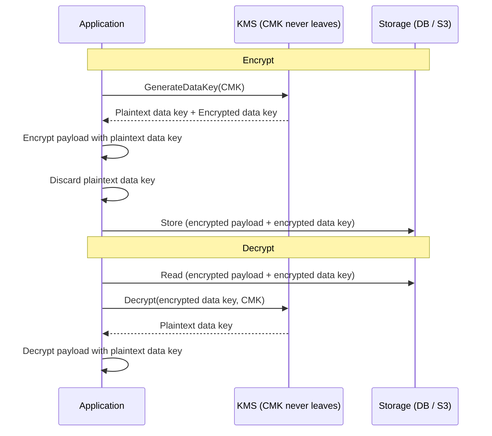

# Part 13 — AWS (the depth ladder)

> **Sprint allocation:** Week 7 (solo — dense, but you operate AWS daily so many rows likely Done already). **Budget: ~10-12 hrs.**

## 13 AWS — topic inventory

| # | Topic | Tags | Tier | Time | Done | Partial | Grilling | Visit Again | Notes | Resources |
|---|-------|------|------|------|------|---|---|-------------|-------|-----------|
| 1 | EC2 — instance families, EBS, AMIs, user data, instance metadata | 🔴 💼 | MP | 1 hr 30 min | [ ] | [ ] | [ ] | [ ] | | 💻 Warm-up: `aws ec2 describe-instances` + `aws ec2 run-instances` from CLI (15 min) |
| 2 | Auto Scaling Groups — launch templates, scaling policies, lifecycle hooks | 🔴 💼 | MP | 2 hrs | [ ] | [ ] | [ ] | [ ] | | |
| 3 | Lambda — concurrency, cold starts, layers, destinations, provisioned concurrency | 🔴 💼 | D | 2 hrs 30 min | [ ] | [ ] | [ ] | [ ] | | 💻 Warm-up: deploy a basic Java Lambda via SAM CLI + invoke (30 min) |
| 4 | S3 — storage classes, lifecycle, versioning, replication, event notifications | 🔴 💼 | D | 2.5 hrs | [ ] | [ ] | [ ] | [ ] | | |
| 5 | S3 — strong read-after-write consistency (post-2020), prefix scaling | 🔴 💼 | M | 45 min | [ ] | [ ] | [ ] | [ ] | | |
| 6 | EBS — types (gp3, io2), snapshots | 🔴 💼 | MP | 1.5 hrs | [ ] | [ ] | [ ] | [ ] | | |
| 7 | RDS — Multi-AZ vs read replicas, parameter groups, automated backups | 🔴 💼 | D | 2 hrs | [ ] | [ ] | [ ] | [ ] | | |
| 8 | Aurora — storage-decoupled architecture, replicas, Global Database | 🔴 💼 | D | 2 hrs | [ ] | [ ] | [ ] | [ ] | | |
| 9 | DynamoDB — partition keys, GSI, LSI, capacity modes, DAX | 🔴 💼 | D | 3 hrs | [ ] | [ ] | [ ] | [ ] | | |
| 10 | VPC — subnets (public/private), route tables, IGW, NAT GW | 🔴 💼 | D | 2.5 hrs | [ ] | [ ] | [ ] | [ ] | | |
| 11 | Security groups vs NACLs | 🔴 💼 | M | 1 hr | [ ] | [ ] | [ ] | [ ] | | |
| 12 | ALB vs NLB vs CLB vs Gateway LB | 🔴 💼 | MP | 1.5 hrs | [ ] | [ ] | [ ] | [ ] | | |
| 13 | Route 53 — routing policies, health checks | 🔴 💼 | MP | 1.5 hrs | [ ] | [ ] | [ ] | [ ] | | (Cross-ref Part 11 Route 53) |
| 14 | CloudFront — origins, behaviors, OAC, signed URLs / cookies | 🔴 💼 | MP | 2 hrs | [ ] | [ ] | [ ] | [ ] | | |
| 15 | IAM — users, groups, roles, policies, trust relationships | 🔴 💼 🔐 | D | 3 hrs | [ ] | [ ] | [ ] | [ ] | | 💻 Warm-up: write IAM policy granting S3 read on one bucket + use Condition for source-IP restriction (20 min) |
| 16 | IAM — policy evaluation logic, permission boundaries, SCPs | 🔴 💼 🔐 | D | 2.5 hrs | [ ] | [ ] | [ ] | [ ] | | |
| 17 | STS, AssumeRole, role chaining | 🔴 💼 🔐 | MP | 1.5 hrs | [ ] | [ ] | [ ] | [ ] | | |
| 18 | KMS — CMKs, data keys, envelope encryption, key policies, grants | 🔴 💼 🔐 | D | 3 hrs 20 min | [ ] | [ ] | [ ] | [ ] | | 💻 Warm-up: `aws kms encrypt/decrypt` via CLI on a small payload + understand the wrap-data-key flow (20 min) |
| 19 | Secrets Manager vs Parameter Store | 🔴 💼 🔐 | M | 1 hr | [ ] | [ ] | [ ] | [ ] | | |
| 20 | CloudWatch — metrics, logs (Logs Insights), alarms, dashboards | 🔴 💼 | MP | 2 hrs | [ ] | [ ] | [ ] | [ ] | | |
| 21 | X-Ray — distributed tracing, service map | 🔴 💼 | MP | 1.5 hrs | [ ] | [ ] | [ ] | [ ] | | |
| 22 | Cost Explorer, Budgets | 🔴 💼 | MP | 1.5 hrs | [ ] | [ ] | [ ] | [ ] | | |
| 23 | Reserved Instances vs Savings Plans vs Spot vs On-Demand | 🔴 💼 | MP | 1.5 hrs | [ ] | [ ] | [ ] | [ ] | | |
| 24 | SQS — queue types (Standard vs FIFO), DLQ + redrive, visibility timeout, long polling, message attributes | 🔴 💼 🎯 | MP | 2 hrs 20 min | [ ] | [ ] | [ ] | [ ] | | 💻 Warm-up: send/receive messages via AWS CLI; configure DLQ + redrive policy; observe visibility timeout (20 min) |
| 25 | SNS — topics, subscriptions, fanout, FIFO topics, message filtering | 🔴 💼 🎯 | MP | 1.5 hrs | [ ] | [ ] | [ ] | [ ] | | |
| 26 | API Gateway — REST vs HTTP API, throttling, usage plans, Lambda authorizers, request/response mapping | 🔴 💼 🎯 | D | 2.5 hrs | [ ] | [ ] | [ ] | [ ] | | |
| 27 | ECS vs EKS vs Fargate | 🟠 💼 | MP | 1.5 hrs | [ ] | [ ] | [ ] | [ ] | | |
| 28 | EFS, FSx | 🟠 💼 | M | 1 hr | [ ] | [ ] | [ ] | [ ] | | |
| 29 | S3 — pre-signed URLs, Transfer Acceleration | 🟠 💼 | MP | 1.5 hrs | [ ] | [ ] | [ ] | [ ] | | |
| 30 | ElastiCache (Redis, Memcached) | 🟠 💼 | MP | 1.5 hrs | [ ] | [ ] | [ ] | [ ] | | |
| 31 | OpenSearch (managed Elasticsearch) | 🟠 💼 | MP | 1.5 hrs | [ ] | [ ] | [ ] | [ ] | | |
| 32 | RDS Proxy (for Lambda) | 🟠 💼 | M | 45 min | [ ] | [ ] | [ ] | [ ] | | |
| 33 | VPC Peering, Transit Gateway, PrivateLink, Site-to-Site (S2S) VPN — encrypted tunnel between two networks; why internal-LB IPs are private and unreachable from outside the VPC; calling AWS LBs by `*.elb.amazonaws.com` hostname rather than raw IP | 🟠 💼 | MP | 2.5 hrs | [ ] | [ ] | [ ] | [ ] | | |
| 34 | Endpoint services (Interface vs Gateway endpoints) | 🟠 💼 | M | 1 hr | [ ] | [ ] | [ ] | [ ] | | |
| 35 | EventBridge — schema registry, rules, targets, audit / event bus pattern | 🟠 💼 | MP | 1.5 hrs | [ ] | [ ] | [ ] | [ ] | | |
| 36 | Step Functions — standard vs express workflows, state types, error handling, KYC orchestration fit | 🟠 💼 🎯 | MP | 2 hrs | [ ] | [ ] | [ ] | [ ] | | |
| 37 | ACM — public + private CAs | 🟠 💼 🔐 | MP | 1.5 hrs | [ ] | [ ] | [ ] | [ ] | | (Cross-ref Part 17 PKI) |
| 38 | CloudHSM | 🟠 💼 🔐 | M | 45 min | [ ] | [ ] | [ ] | [ ] | | |
| 39 | GuardDuty — threat detection, finding types | 🟠 💼 🔐 | M | 45 min | [ ] | [ ] | [ ] | [ ] | | |
| 40 | Security Hub — aggregator + compliance standards (CIS, PCI) | 🟠 💼 🔐 | M | 45 min | [ ] | [ ] | [ ] | [ ] | | |
| 41 | Inspector — vulnerability assessment for EC2/ECR | 🟠 💼 🔐 | M | 45 min | [ ] | [ ] | [ ] | [ ] | | |
| 42 | Macie — S3 data classification, PII discovery | 🟠 💼 🔐 | M | 45 min | [ ] | [ ] | [ ] | [ ] | | |
| 43 | WAF, Shield (Standard vs Advanced) | 🟠 💼 🔐 | MP | 1.5 hrs | [ ] | [ ] | [ ] | [ ] | | |
| 44 | Cognito — User Pools vs Identity Pools, federated identity | 🟠 💼 🔐 | MP | 2 hrs | [ ] | [ ] | [ ] | [ ] | | |
| 45 | CloudTrail — management & data events, multi-region trail | 🟠 💼 | MP | 1.5 hrs | [ ] | [ ] | [ ] | [ ] | | |
| 46 | CloudFormation — templates, stacks, change sets, drift | 🟠 💼 | MP | 2 hrs | [ ] | [ ] | [ ] | [ ] | | |
| 47 | CDK (TypeScript / Python) | 🟠 💼 | MP | 2 hrs | [ ] | [ ] | [ ] | [ ] | | |
| 48 | Systems Manager (SSM) — Session Manager, Patch Manager, Run Command | 🟠 💼 | MP | 1.5 hrs | [ ] | [ ] | [ ] | [ ] | | |
| 49 | AppConfig — feature flags, configuration profiles, gradual rollout, validators | 🟠 💼 | M | 1 hr | [ ] | [ ] | [ ] | [ ] | | |
| 50 | Organizations — OUs, SCPs, consolidated billing | 🟠 💼 | MP | 1.5 hrs | [ ] | [ ] | [ ] | [ ] | | |
| 51 | Tagging strategy for cost allocation | 🟠 💼 | M | 45 min | [ ] | [ ] | [ ] | [ ] | | |
| 52 | IAM Identity Center (formerly SSO) | 🟡 🔐 | M | 1 hr | [ ] | [ ] | [ ] | [ ] | | |
| 53 | Detective, Audit Manager | 🟡 🔐 | M | 45 min | [ ] | [ ] | [ ] | [ ] | | |
| 54 | Managed Grafana, Managed Prometheus | 🟡 | M | 45 min | [ ] | [ ] | [ ] | [ ] | | |
| 55 | Batch | 🟡 | M | 45 min | [ ] | [ ] | [ ] | [ ] | | |

## Time summary

| Scope | Hours (zero baseline) | Weeks @ 10–12 hrs/wk | Actual time |
|-------|-----------------------|----------------------|-------------|
| 🔴 MUST only (Sprint priority — 3-month plan) | ~51.25 hrs | ~4.7 wk | |
| 🔴 + 🟠 HIGH (must + high — senior coverage) | ~85.5 hrs | ~7.8 wk | |
| Full Part (all items including 🟡) | ~88.75 hrs | ~8.1 wk | |

> AWS is dense — you already operate much of it daily, so expect significant ✅ Done at Survey time. Actual study likely 30-50% of zero-baseline estimates.

## Key diagrams

**KMS envelope encryption flow:**

> Envelope encryption = encrypt data with a fast symmetric DEK; encrypt the DEK with KMS CMK. Lets you encrypt huge payloads without sending them to KMS. CMK never leaves KMS.

## Frequently asked

1. **Q:** Walk through KMS envelope encryption. Why not encrypt the data directly with the CMK?
   - **Why asked:** KYC-canonical security. CMK is for small data (< 4KB) and key-wrapping. Envelope: generate data key, encrypt big payload locally with data key, encrypt only the data key with CMK. Solves: (1) bulk data encryption cost, (2) CMK throughput limits, (3) data key rotation independent of CMK rotation.
2. **Q:** Multi-AZ vs read replicas in RDS — when do you use each?
   - **Why asked:** Senior architecture. Multi-AZ: synchronous standby for HA (automatic failover, ~60-120s). Same region, different AZ. Read replicas: async replication for read scaling. Same or different region. You can have both: Multi-AZ for failover, replicas for read offload. KYC platform likely uses both: Multi-AZ for primary, replicas for analytics queries.
3. **Q:** Walk through IAM policy evaluation when a user has both an Allow and a Deny.
   - **Why asked:** Senior IAM literacy. Explicit Deny wins. Order: (1) start with implicit Deny, (2) check for explicit Deny → if found, stop, denied. (3) check for explicit Allow → if found, allowed. (4) otherwise, implicit Deny. Plus: SCPs at org level can restrict even if account-level allows. Permission boundaries cap maximum permissions.
4. **Q:** S3 prefix scaling — what's the trap with high-velocity uploads?
   - **Why asked:** Operational knowledge. S3 supports 3500 PUT/COPY/POST/DELETE and 5500 GET/HEAD per second *per prefix*. If you upload with prefix `2026/05/16/HH/MM/...`, you're hot-spotting on the date prefix. Solution: random prefix (hash of object name) or partition keys evenly.
5. **Q:** Design KMS key rotation for your KYC document encryption.
   - **Why asked:** Practical security design. CMK with automatic annual rotation. Old DEKs remain decryptable (KMS keeps key versions). Re-encryption of stored data is a separate decision. For high-compliance: rotate CMK every 90 days, re-encrypt old documents as background job.
6. **Q:** VPC design for your KYC platform — public vs private subnets, NAT GW placement?
   - **Why asked:** Architecture. Public subnets: ALB, NAT Gateway. Private subnets: EC2/ECS workloads (no direct internet, NAT GW for egress). Database subnets: RDS, even more isolated. NAT GW per AZ for HA. Use VPC endpoints for AWS services to skip NAT (cost saving).
7. **Q:** ALB vs NLB — pick one for your KYC platform, defend.
   - **Why asked:** Practical LB choice. ALB: L7, path-based routing, WebSocket, gRPC, HTTPS termination. NLB: L4, ultra-low-latency, static IP, TCP/UDP, source IP preservation. KYC: probably ALB for the SDK ingress (HTTPS termination + path routing); NLB for any TCP-based internal services.
8. **Q:** SQS Standard vs FIFO — when each?
   - **Why asked:** Messaging-canonical decision. Standard: at-least-once delivery, best-effort ordering, virtually unlimited throughput, possible duplicates. FIFO: strict ordering per message-group-id, exactly-once-processing (via deduplication ID, 5-min window), 300 msg/s default per API action (3000 with batching, higher with high-throughput mode). FIFO costs more and throttles harder. KYC use case: FIFO when a partner expects strict event order (e.g., document lifecycle events per applicant — `UPLOADED` → `OCR_DONE` → `VERIFIED` must arrive in order). Standard when out-of-order is OK and consumers are idempotent (e.g., webhook fanout, telemetry, audit ingestion). Default to Standard + idempotent consumers; reach for FIFO only when ordering is actually a contract.
9. **Q:** Step Functions for KYC orchestration — when does it fit vs your existing Java orchestrator?
   - **Why asked:** Senior architecture call. Step Functions wins for: visual workflow (state machine diagram), built-in retry / catch / backoff per state, long-running waits (up to 1 year for Standard, including human-approval `WaitForTaskToken`), serverless cost (pay per state transition), native AWS service integrations, automatic execution history. Loses for: vendor lock-in (rewriting in another cloud is painful), debugging complexity (state machine JSON is verbose, errors live in the execution console not your logs), language constraint (Amazon States Language is JSON, not Java — Lambda steps do the real work but glue is JSON), per-state-transition cost at scale. KYC fit: probably overkill for the synchronous SDK happy-path (sub-second p99, in-process Java orchestration is faster and debuggable). Good fit for async compliance review queues (manual reviewer steps, multi-day SLAs, retries on partner outages, branching by risk score).

## Trick questions / gotchas

1. **Q:** Your Lambda has a hot-path that occasionally takes 5 seconds. P50 is 100ms. What's likely happening?
   - **Gotcha:** Cold starts. JVM Lambdas can take 3-5s on cold start. Mitigations: (1) provisioned concurrency (pre-warmed instances), (2) smaller runtime (Java → Node/Python), (3) SnapStart for Java 11+, (4) keep functions warm with scheduled invocations (less recommended).
2. **Q:** Your S3 bucket policy allows `s3:GetObject` from "*". A bucket-level ACL also blocks public access. Who wins?
   - **Gotcha:** Public access block wins. AWS introduced "Block Public Access" settings at bucket and account level that OVERRIDE bucket policies. Even an Allow policy can't bypass them. Common confusion source.
3. **Q:** You attached `AdministratorAccess` policy to a role. The role can do everything... except what?
   - **Gotcha:** SCPs at organization level can restrict. Permission boundaries on the role can cap. So `AdministratorAccess` can still be denied by SCP (e.g., "no us-east-1 operations" at the org level). Explicit Deny anywhere wins.
4. **Q:** You're using NAT Gateway for private subnet egress. Why is your bill so high?
   - **Gotcha:** NAT GW charges per GB processed ($0.045/GB) PLUS hourly. High-throughput services through NAT (e.g., large file uploads to a non-AWS API) get expensive fast. Mitigations: (1) VPC endpoints for AWS services, (2) per-AZ NAT GW to skip cross-AZ data transfer.
5. **Q:** Your SQS queue has visibility timeout = 30s. Your consumer takes 60s to process each message. What happens?
   - **Gotcha:** After 30s the message becomes visible again → a second consumer picks it up → the same message is processed twice (at minimum). The first consumer's eventual `DeleteMessage` succeeds, but the second consumer's processing has already happened. Result: silent duplicate processing, hard to spot without metrics. Fixes (pick by constraint): (a) reduce processing time below the timeout, (b) increase visibility timeout to comfortably exceed P99 processing latency, (c) call `ChangeMessageVisibility` periodically from the consumer (heartbeat pattern) so long-running messages stay invisible, (d) accept that duplicates can happen and make the consumer idempotent (deduplication key, upsert semantics, conditional writes). Idempotency (d) is the only fix that survives consumer crashes and partial failures — the others reduce the probability but don't eliminate it.

## Mastery candidates (top 3–5 from this Part — suggestions, not commitments)

- **IAM policy evaluation + permission boundaries** (~3 hrs combined rows 15+16) — senior-canonical AWS topic. Build a worked example with multiple policies, SCPs, boundaries; walk through evaluation.
- **KMS envelope encryption end-to-end** (~3 hrs row 18) — directly your KYC platform. Encrypt KYC documents with envelope encryption, walk through key rotation, audit access via CloudTrail.
- **VPC design for KYC platform** (~3 hrs combined rows 10+11+12+13+14) — public/private subnets, security groups vs NACLs, ALB/NLB choice, Route 53 routing. Document for cross-region (DC-JKT vs AWS-SG).
- **DynamoDB partition key design + hot partition mitigation** (~2.5 hrs row 9) — directly common architecture decision. Tie to your KYC vendor result storage if applicable.

## Hands-on exercises (Practice + Advanced)

Warm-up AWS exercises are listed inline in the topic-table Resources column (counted in main Time summary). Longer exercises below are tracked separately.

### Practice — mid-level (~30-60 min each)

1. **IAM policy review** (~45 min) — given 3 policies (one with `Allow`, one with `Deny`, one as SCP), walk through evaluation for 5 sample API calls. Build the mental model for IAM evaluation order.
2. **CloudFormation / CDK stack from scratch** (~60 min) — write a CDK app (Python or TS) that provisions: VPC + 2 public subnets + 2 private subnets + 1 NAT Gateway. Deploy + tear down. Compare to writing the same in CloudFormation YAML.
3. **Lambda cold start observation** (~45 min) — deploy a Java Lambda with `Runtime.JAVA_17`. Invoke 10x consecutively. Capture P99 vs P50 from CloudWatch. Enable provisioned concurrency. Re-test.

### Advanced — senior-grade depth (~60+ min each)

4. **Design KMS key strategy for KYC documents** (~90 min) — per-customer-tenant CMK, envelope encryption for documents, key policy granting access only to specific IAM roles, automatic rotation every year, CloudTrail audit. Write it up as if briefing security team.
5. **VPC design for multi-region KYC** (~90 min) — DC-JKT + AWS-SG regions, public/private subnets, NAT per AZ, VPC peering or Transit Gateway for cross-region, RDS Multi-AZ, ALB with health checks. Document subnet CIDRs, security group rules, Route 53 failover.

### Hands-on time summary (Practice + Advanced only)

| Tier | Total time | Weeks @ 10–12 hrs/wk | Actual time |
|------|------------|----------------------|-------------|
| Practice (mid-level) | ~2.5 hrs | ~0.23 wk | |
| Advanced (senior-grade) | ~3 hrs | ~0.27 wk | |
| **Combined hands-on (Practice + Advanced)** | **~5.5 hrs** | **~0.5 wk** | |

> Warm-up exercises (counted in main Time summary above) total ~105 min for Part 13 across 5 in-table warm-ups.

## Quick recall

**Q. IAM policy evaluation — what wins, Allow or Deny?**
A. Explicit Deny wins. Evaluation order: implicit Deny → explicit Deny (stop if found) → explicit Allow → otherwise implicit Deny. SCPs further restrict at org level. Permission boundaries cap the maximum.

**Q. Multi-AZ vs read replicas?**
A. Multi-AZ = sync standby for HA (automatic failover, ~60-120s). Read replicas = async copies for read scaling. Not the same purpose — often use both.

**Q. Envelope encryption — one-line summary?**
A. Encrypt payload locally with a fast symmetric data key. Encrypt the data key with KMS CMK. Store both. CMK never sees the payload, allowing efficient bulk encryption.

**Q. S3 prefix scaling — what's the limit?**
A. 3500 PUT/POST/DELETE and 5500 GET/HEAD per prefix per second. Hot-spotting on a common prefix (e.g., date-based) causes throttling. Distribute writes across prefixes for high throughput.

**Q. NAT Gateway cost gotcha?**
A. Per-GB data charges ($0.045/GB) plus hourly. High-throughput egress through NAT bills heavily. Use VPC endpoints for AWS services, per-AZ NAT for cross-AZ avoidance.

**Q. ALB vs NLB — pick one for HTTPS termination + path routing.**
A. ALB (L7). NLB is L4 (TCP/UDP), preserves source IP, ultra-low latency, but no path routing or HTTPS termination beyond TLS passthrough.
