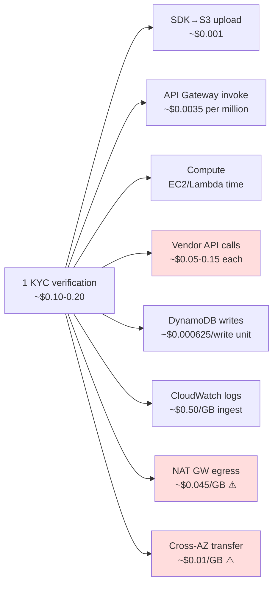
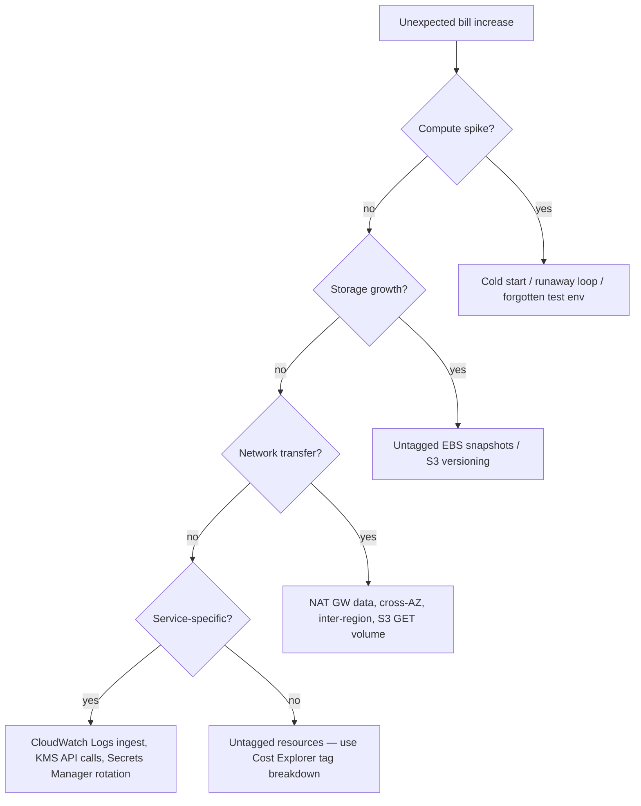

# Part 14 — Cost Calculation & Capacity Planning

> **Sprint allocation:** Light touch — fold into spare slots, or defer to Consolidation. **Budget: ~1-2 hrs (overflow slot).**

## 14 Cost Calculation & Capacity Planning — topic inventory

| # | Topic | Tags | Tier | Time | Done | Partial | Grilling | Visit Again | Notes | Resources |
|---|-------|------|------|------|------|---|---|-------------|-------|-----------|
| 1 | Pricing intuition for top 10 AWS services you use | 🔴 💼 🎯 | MP | 1.5 hrs | [ ] | [ ] | [ ] | [ ] | | 💻 Warm-up: open AWS Pricing Calculator, model the cost of a 1M-req/day API (Lambda + DynamoDB + S3) — note where the bulk of cost lives (20 min) |
| 2 | The silent killers — NAT Gateway data transfer, cross-AZ traffic, inter-region traffic, NLB cross-zone | 🔴 💼 🎯 | MP | 1.5 hrs | [ ] | [ ] | [ ] | [ ] | | |
| 3 | S3 cost breakdown — storage + requests + transfer + lifecycle transitions | 🔴 💼 🎯 | M | 45 min | [ ] | [ ] | [ ] | [ ] | | |
| 4 | DynamoDB — on-demand vs provisioned math, GSI cost multiplier | 🔴 💼 🎯 | MP | 1.5 hrs | [ ] | [ ] | [ ] | [ ] | | 💻 Warm-up: compute monthly cost for a DDB table at 1000 WCU / 5000 RCU provisioned vs on-demand at 30M req/month (15 min) |
| 5 | Per-request cost model — useful for product-level decisions | 🔴 💼 🎯 | MP | 1.5 hrs | [ ] | [ ] | [ ] | [ ] | | |
| 6 | Capacity planning — peak QPS, growth headroom, scaling lead time | 🔴 💼 🎯 | MP | 1.5 hrs | [ ] | [ ] | [ ] | [ ] | | |
| 7 | Lambda — duration × memory × invocations, plus integration costs (API Gateway, etc.) | 🟠 💼 🎯 | MP | 1.5 hrs | [ ] | [ ] | [ ] | [ ] | | |
| 8 | RDS — instance + storage + IOPS + backups + Multi-AZ doubling | 🟠 💼 🎯 | MP | 1.5 hrs | [ ] | [ ] | [ ] | [ ] | | |
| 9 | TCO model — infra + data egress + ops overhead + license | 🟠 💼 🎯 | MP | 1.5 hrs | [ ] | [ ] | [ ] | [ ] | | |
| 10 | FinOps practices — cost allocation tags, chargeback / showback, Cost Anomaly Detection | 🟠 💼 🎯 | MP | 1.5 hrs | [ ] | [ ] | [ ] | [ ] | | |
| 11 | Cost vs performance tradeoffs — gp3 vs io2, Multi-AZ vs single-AZ for non-prod, Graviton vs Intel | 🟠 💼 🎯 | M | 1 hr | [ ] | [ ] | [ ] | [ ] | | |
| 12 | Egress cost optimization — CloudFront for outbound, S3 Transfer Acceleration cost-benefit, VPC endpoints | 🟠 💼 🎯 | M | 1 hr | [ ] | [ ] | [ ] | [ ] | | |
| 13 | Spot strategy for batch workloads | 🟡 | M | 1 hr | [ ] | [ ] | [ ] | [ ] | | |

## Time summary

| Scope | Hours (zero baseline) | Weeks @ 10–12 hrs/wk | Actual time |
|-------|-----------------------|----------------------|-------------|
| 🔴 MUST only (Sprint priority — 3-month plan) | ~8.75 hrs | ~0.8 wk | |
| 🔴 + 🟠 HIGH (must + high — senior coverage) | ~17.25 hrs | ~1.6 wk | |
| Full Part (all items including 🟡) | ~18.25 hrs | ~1.7 wk | |

## Key diagrams

**Per-verification cost breakdown (KYC platform — model your own):**

> The shaded boxes (vendor calls, NAT egress, cross-AZ) typically dominate. Optimize there first.

**Where AWS bill surprises come from:**

## Frequently asked

1. **Q:** Top 5 cost surprises in AWS — what bites first?
   - **Why asked:** Operational fluency. (1) NAT Gateway data transfer (per-GB charges add up under high egress). (2) Cross-AZ data transfer (~$0.01/GB each way; multi-AZ DB sync doubles). (3) S3 PUT/COPY/POST requests at high volume. (4) CloudWatch Logs ingestion + retention. (5) Inter-region data transfer (~$0.02/GB, varies).
2. **Q:** Per-request cost for your KYC verification. Estimate it.
   - **Why asked:** Product-cost decision. Walk-through: SDK upload (S3 PUT + transfer), API Gateway invoke, Lambda or EC2 compute time, 3 vendor API calls (external — possibly costs $$ per call), DynamoDB writes (status updates), CloudWatch logs. Rough number per verification: $0.05-0.20 depending on vendor pricing.
3. **Q:** DynamoDB on-demand vs provisioned math — when does each fit?
   - **Why asked:** Capacity choice. On-demand: pay per request, no capacity planning, but ~7× provisioned price per request. Right for unpredictable traffic. Provisioned: cheaper per request, requires forecasting, plus auto-scaling. Right for stable workloads. Hybrid: provision for baseline + on-demand burst.
4. **Q:** Walk through TCO for adding a new region (e.g., AWS-SG → AWS-MY for KYC compliance).
   - **Why asked:** Architecture cost. Infra: new VPC + subnets, RDS Multi-AZ, S3 buckets, ALB, NAT GW. Data egress: cross-region replication for compliance + customer traffic. Ops overhead: new monitoring, new alerts, new on-call considerations. License: any per-region software costs.
5. **Q:** Reserved Instances vs Savings Plans — when each?
   - **Why asked:** Procurement choice. RIs: instance-family specific, 1- or 3-year, up to 75% discount, less flexible. Savings Plans: commitment to spend $/hr, applies across services (Compute SP), more flexible, ~70% discount typical. Modern best practice: Savings Plans for compute + RIs for specific high-utilization services (RDS, ElastiCache).
6. **Q:** Capacity planning for 5× traffic spike from a new partner go-live.
   - **Why asked:** Operational. Steps: (1) compute peak QPS at 5×, (2) check current headroom (CPU, memory, DB connections, downstream rate limits), (3) identify bottleneck (often DB connection pool or vendor rate limit), (4) request pre-scaling, (5) capacity reservation for the launch window, (6) load test 7-10 days prior.
7. **Q:** Lambda cost vs ECS Fargate vs EC2 — when does Lambda's pricing make sense?
   - **Why asked:** Compute choice. Lambda wins for spiky / low-volume / unpredictable: pay per ms × MB. Lambda loses for high steady-state RPS (where reserved EC2 or Fargate is cheaper) or long-running operations (15-min Lambda timeout). Compute the break-even point: Lambda is typically cheaper below ~10% utilization.
8. **Q:** How would you implement chargeback / showback across teams?
   - **Why asked:** FinOps maturity. Tagging strategy: every resource has `team`, `env`, `product` tags enforced via SCP. Cost Allocation Report (Cost Explorer) grouped by tag. Showback: surface the data without billing teams. Chargeback: actually move budget from team A to platform team. Anomaly Detection alerts on team-level spikes.

## Trick questions / gotchas

1. **Q:** Your monthly bill jumped 30% with no traffic change. CloudWatch alarms fired but didn't catch it. Where do you look first?
   - **Gotcha:** Cost Explorer + tag breakdown. Common silent culprits: (1) CloudWatch Logs ingestion (DEBUG logging accidentally enabled), (2) GP2 storage bloat (DB free space alarm not firing), (3) cross-AZ data transfer increase (load balancer re-routing), (4) untagged resources spinning up.
2. **Q:** You bought 1-year RIs for `m6i.large`. AWS releases `m7i.large` next month. What's the cost trap?
   - **Gotcha:** Locked into old generation for the RI term. Convertible RIs let you swap to newer generations; Standard RIs don't. Always use Convertible unless you're certain the workload won't migrate. Newer generations often cost less per vCPU.
3. **Q:** DynamoDB GSI cost — what's the multiplier?
   - **Gotcha:** Each GSI doubles your write cost (1 write to base + 1 write to GSI). Add 5 GSIs to a table → 6× write cost. Common KYC mistake: querying multiple attributes by adding GSIs without thinking about write amplification.
4. **Q:** Your team rotates IAM credentials monthly. Why does this cost you money?
   - **Gotcha:** Credential rotation often involves Secrets Manager → KMS Decrypt API calls per service invocation. KMS API calls cost $0.03 per 10K. At high request volume × many services × manual rotation churn, this adds up. Cache decrypted secrets in-memory with refresh interval.
5. **Q:** You moved from gp2 to gp3 to save money. Cost stayed the same. Why?
   - **Gotcha:** gp3 charges separately for IOPS + throughput above baseline (3000 IOPS / 125 MB/s). If you're provisioning extra IOPS on top, the savings vanish. Right approach: measure actual IOPS first, then size gp3 baseline + only provision extras where data justifies it.

## Mastery candidates (top 3–5 from this Part — suggestions, not commitments)

- **Per-verification cost model for KYC platform** (~2.5 hrs row 5) — break down a single KYC verification end-to-end. Compute cost per. Useful for product pricing + cost-optimization decisions.
- **Silent killers audit** (~1.5 hrs row 2) — NAT GW, cross-AZ, inter-region, LB cross-zone. Walk through your current architecture identifying which apply, estimate savings from VPC endpoints / per-AZ NAT.
- **TCO + capacity planning for new partner / region** (~2.5 hrs combined rows 6+9) — practical exercise. Estimate cost + capacity headroom for a 5× partner launch or new region.
- **FinOps tagging + chargeback rollout** (~2 hrs row 10) — define tagging policy, enforce via SCP, build a Cost Explorer dashboard surfacing per-team spend.

## Hands-on exercises (Practice + Advanced)

Warm-up cost exercises are listed inline in the topic-table Resources column (counted in main Time summary). Longer exercises below are tracked separately.

### Practice — mid-level (~30-60 min each)

1. **Per-request cost calculator spreadsheet** (~60 min) — build a Google Sheet / Excel with rows per AWS service used in one KYC verification. Inputs: monthly verifications. Outputs: per-verification cost + monthly spend by service. Share with a peer for sanity-check.
2. **NAT GW data transfer audit** (~45 min) — open Cost Explorer, filter to NAT Gateway, group by AZ. Identify which AZs / services drive the bill. Estimate savings from VPC Gateway endpoints (S3, DynamoDB).
3. **Cost Anomaly Detection setup** (~45 min) — enable AWS Cost Anomaly Detection, configure a service-level monitor for "Lambda + CloudWatch Logs", set up SNS alert. Document expected false-positive rate.

### Advanced — senior-grade depth (~60+ min each)

4. **New-region TCO model** (~90 min) — pick a target region (e.g., ap-southeast-3 Jakarta). Build a 12-month TCO model: infra, data egress, ops overhead, cross-region replication, licensing. Compare to current AWS-SG region. Surface the breakeven point.
5. **Capacity planning for 5× partner go-live** (~75 min) — for a real or hypothetical partner. Compute peak QPS, walk every bottleneck (DB connection pool, vendor rate limits, NAT GW throughput, Lambda concurrency), document the runbook including pre-scaling steps, load-test plan, and rollback criteria.

### Hands-on time summary (Practice + Advanced only)

| Tier | Total time | Weeks @ 10–12 hrs/wk | Actual time |
|------|------------|----------------------|-------------|
| Practice (mid-level) | ~2.5 hrs | ~0.23 wk | |
| Advanced (senior-grade) | ~2.75 hrs | ~0.25 wk | |
| **Combined hands-on (Practice + Advanced)** | **~5.25 hrs** | **~0.5 wk** | |

> Warm-up exercises (counted in main Time summary above) total ~35 min for Part 14 across 2 in-table warm-ups.

## Quick recall

**Q. NAT Gateway pricing model?**
A. Per-GB data processed ($0.045/GB) + per-hour ($0.045/hr). High-egress workloads bill heavily. Mitigate with VPC endpoints for AWS services.

**Q. Cross-AZ data transfer cost?**
A. ~$0.01/GB each direction. Multi-AZ RDS replication doubles your storage I/O cost. Significant in high-throughput KYC workloads.

**Q. DynamoDB on-demand vs provisioned cost ratio?**
A. On-demand is ~7× provisioned per request. Cheaper for predictable workloads to provision + auto-scale.

**Q. Reserved Instances vs Savings Plans — pick one for compute.**
A. Savings Plans (Compute) — more flexible across services and regions. Same ~70% discount as RIs but you commit to $/hr spend, not specific instance.

**Q. Lambda break-even with EC2?**
A. Lambda is typically cheaper below ~10-20% utilization. Above that, reserved EC2 or Fargate is more economical. Compute: Lambda price × invocations × avg duration vs EC2 reserved monthly cost.

**Q. Top silent cost killer?**
A. NAT Gateway data transfer. Followed by: cross-AZ data transfer, CloudWatch Logs ingestion, inter-region transfer, S3 GET request volume at scale.

**Q. FinOps minimum maturity signals?**
A. Resource tagging enforced (every resource has team/env/product tags); Cost Explorer used regularly with tag breakdowns; Cost Anomaly Detection enabled with alerts; per-team chargeback or showback dashboard.

**Q. gp3 vs io2 — pick one for RDS production.**
A. gp3 for general-purpose workloads (predictable IOPS up to 16K), much cheaper. io2 for >16K IOPS or low-latency mission-critical (financial trading, real-time KYC scoring). 90% of KYC workloads stay on gp3.
