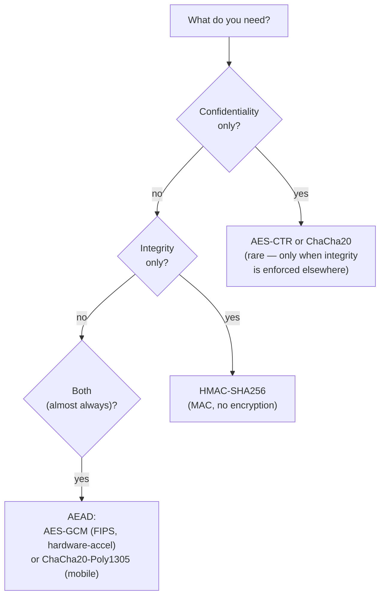
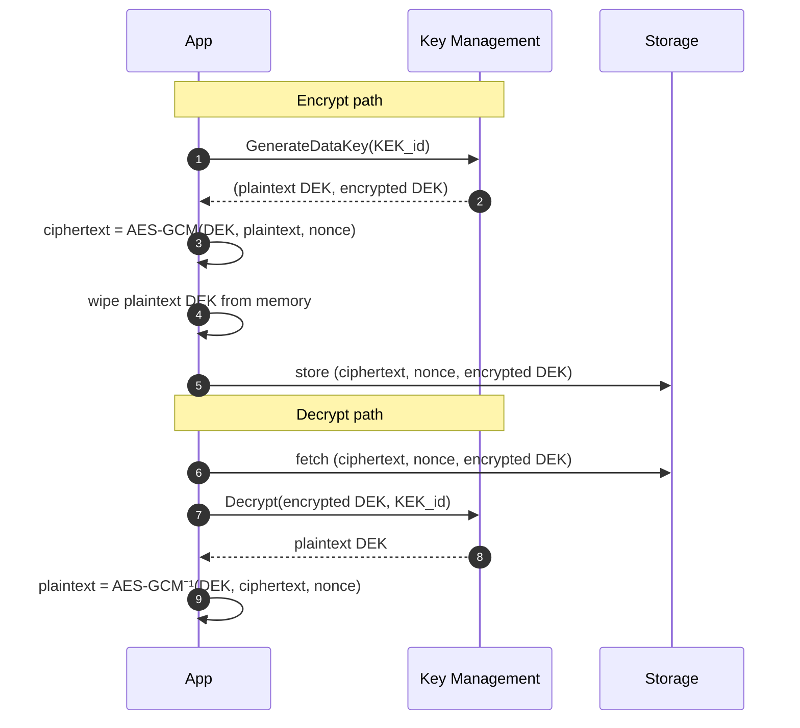

# Part 15 — Cryptography & Security Primitives

> **Sprint allocation:** Week 8 (shared with Parts 16, 17). **Budget: ~3-4 hrs.**

## 15 Cryptography & Security Primitives — topic inventory

| # | Topic | Tags | Tier | Time | Done | Partial | Grilling | Visit Again | Notes | Resources |
|---|-------|------|------|------|------|---|---|-------------|-------|-----------|
| 1 | Symmetric encryption — AES (modes: GCM, CBC, CTR), ChaCha20-Poly1305 | 🔴 💼 🔐 | D | 1.5 hrs | [ ] | [ ] | [ ] | [ ] | | |
| 2 | Asymmetric encryption — RSA, ECC, key sizes | 🔴 💼 🔐 | MP | 1.5 hrs | [ ] | [x] | [ ] | [ ] | Partial: RSA/ECC concept mentioned, key sizes pending | 📖 `security/cryptography/tls_https_pki/index.md` |
| 3 | Hash functions — SHA-2 family, SHA-3, properties (preimage, collision) | 🔴 💼 🔐 | MP | 1.5 hrs | [ ] | [ ] | [ ] | [ ] | | 💻 Warm-up: SHA-256 a string via Java MessageDigest from memory + verify with `echo -n "hello" \| shasum -a 256` (10 min) |
| 4 | MAC — HMAC, vs digital signature | 🔴 💼 🔐 | MP | 1.5 hrs | [ ] | [ ] | [ ] | [ ] | | 💻 Warm-up: Java HMAC-SHA256 over a payload with shared secret + verify equality timing-safely (10 min) |
| 5 | Authenticated encryption (AEAD) — AES-GCM, why not raw CBC | 🔴 💼 🔐 | MP | 1.5 hrs | [ ] | [ ] | [ ] | [ ] | | |
| 6 | Key derivation — PBKDF2, scrypt, Argon2, HKDF | 🔴 💼 🔐 | MP | 1.5 hrs | [ ] | [ ] | [ ] | [ ] | | |
| 7 | SQL injection, parameterized queries | 🔴 💼 🔐 | M | 45 min | [ ] | [ ] | [ ] | [ ] | | |
| 8 | XSS — reflected, stored, DOM | 🔴 💼 🔐 | MP | 1.5 hrs | [x] | [ ] | [ ] | [ ] | ~1.5 hr (ChatGPT) | 📖 `security/web_security/XSS_CORS_SOP.md` |
| 9 | CSRF | 🔴 💼 🔐 | M | 45 min | [ ] | [ ] | [ ] | [ ] | | |
| 10 | Replay attacks — timestamps, nonces | 🔴 💼 🔐 | M | 45 min | [ ] | [ ] | [ ] | [ ] | | |
| 11 | Timing attacks, constant-time comparison | 🔴 💼 🔐 | MP | 1.5 hrs | [ ] | [ ] | [ ] | [ ] | | |
| 12 | Random number generation — CSPRNG, /dev/urandom, SecureRandom | 🟠 💼 🔐 | M | 1 hr | [ ] | [ ] | [ ] | [ ] | | |
| 13 | Password hashing — never SHA-256 plain, use Argon2 / bcrypt | 🟠 💼 🔐 | MP | 1.5 hrs | [ ] | [ ] | [ ] | [ ] | | 💻 Warm-up: Argon2id hash + verify in Java (Spring Security's BCryptPasswordEncoder + Argon2 via Bouncy Castle); compare hash output (20 min) |
| 14 | Nonce, IV — reuse pitfalls (catastrophic for GCM) | 🟠 💼 🔐 | MP | 1.5 hrs | [ ] | [ ] | [ ] | [ ] | | |
| 15 | SSRF | 🟠 💼 🔐 | M | 45 min | [ ] | [ ] | [ ] | [ ] | | |
| 18 | Insecure deserialization | 🟠 💼 🔐 | MP | 1.5 hrs | [ ] | [ ] | [ ] | [ ] | | |
| 20 | Diffie-Hellman, ECDH key exchange | 🟡 🔐 | MP | 1.5 hrs | [ ] | [x] | [ ] | [ ] | Partial: Concept mentioned as handshake mechanism, details pending | 📖 `security/cryptography/tls_https_pki/index.md` |
| 21 | OWASP Top 10 — full list | 🟠 🔐 | M | 1 hr | [ ] | [ ] | [ ] | [ ] | | |

## Time summary

| Scope | Hours (zero baseline) | Weeks @ 10–12 hrs/wk | Actual time |
|-------|-----------------------|----------------------|-------------|
| 🔴 MUST only (Sprint priority — 3-month plan) | ~17.5 hrs | ~1.6 wk | |
| 🔴 + 🟠 HIGH (must + high — senior coverage) | ~28.85 hrs | ~2.6 wk | |
| Full Part (all items including 🟡) | ~30.35 hrs | ~2.75 wk | |

## Key diagrams

**AEAD decision tree:**

> Encrypt-then-MAC is the safe composition; AEAD does this for you. If you're typing `Cipher.getInstance("AES/CBC/...")` in 2026, stop — use GCM.

**Envelope encryption (cryptographic primitive view):**

> The KEK never leaves the KMS boundary. Only the per-object DEK touches the application heap, and only briefly. Rotation = re-wrap the DEK with a new KEK; no payload re-encryption needed.

## Frequently asked

1. **Q:** AES-GCM vs AES-CBC — why is GCM preferred for new code?
   - **Why asked:** Senior crypto choice. GCM is AEAD — authenticated encryption with associated data. Provides both confidentiality AND integrity in one primitive. CBC alone is unauthenticated → vulnerable to padding oracle, manipulation. Using CBC requires HMAC on top (encrypt-then-MAC, easy to get wrong). GCM does it correctly by design.
2. **Q:** Why is password hashing different from generic hashing? What makes Argon2 better than SHA-256?
   - **Why asked:** Senior security. SHA-256 is fast — too fast (GPUs can crack billions/sec). Password hashing must be SLOW + memory-hard. Argon2id is the modern winner: configurable time, memory, parallelism cost. bcrypt is older but still acceptable. PBKDF2 is fallback (FIPS-compliant). Never SHA-256 alone for passwords.
3. **Q:** HMAC vs digital signature — when does each fit?
   - **Why asked:** Crypto primitive choice. HMAC: shared secret, symmetric, fast. Both parties hold the key. Use: webhook signing, JWT (HS256), API request signing. Digital signature: private key signs, public key verifies. Asymmetric. Use: code signing, document signing, JWT (RS256), TLS certificates.
4. **Q:** What's a timing attack? Show me an example where you'd use constant-time comparison.
   - **Why asked:** Subtle senior gotcha. Comparing secrets byte-by-byte (Java `String.equals()` or `Arrays.equals()`) leaks timing info — attacker measures how many bytes match. Use `MessageDigest.isEqual(a, b)` or `Arrays.equals(...)` of fixed-length data in constant time. Critical for: HMAC verification, password comparison, token comparison.
5. **Q:** Walk through a CSRF attack and how to prevent it.
   - **Why asked:** Web security basics. Attacker tricks user's browser to send a request to a target site where the user is authenticated (via session cookie). Prevention: (1) SameSite=Strict cookies (modern browsers), (2) CSRF tokens (random token per session, validated server-side), (3) Origin / Referer header checks, (4) require explicit re-auth for sensitive operations.
6. **Q:** Padding oracle attack — what's the prerequisite, and how do you defeat it?
   - **Why asked:** Senior security. Prerequisite: server uses CBC without authentication AND reveals padding-validity info (e.g., 400 for bad padding, 500 for decryption error). Attacker can decrypt ciphertext byte-by-byte by submitting modified ciphertexts. Defeat: use AEAD (AES-GCM) → no padding oracle possible.
7. **Q:** Nonce reuse in AES-GCM — how catastrophic, and how do you prevent it?
   - **Why asked:** Specific landmine. Catastrophic — reusing a nonce with the same key in GCM leaks the authentication key, letting attackers forge messages. Prevention: random 96-bit nonces (collision probability ≈ 2^-48 after 2^32 encryptions), OR strictly monotonic counter, OR derive nonce from session ID.

## Trick questions / gotchas

1. **Q:** You used `String.equals(suppliedToken, expectedToken)` to verify an API token. What's the security issue?
   - **Gotcha:** Timing leak. `String.equals` short-circuits on first mismatched byte. Attacker can guess tokens byte-by-byte by measuring response time. Fix: `MessageDigest.isEqual(supplied.getBytes(), expected.getBytes())` for constant-time comparison.
2. **Q:** You hashed passwords with `MessageDigest.SHA256` + a salt. Why is this still insecure?
   - **Gotcha:** SHA-256 is computationally cheap. With salt, you defeat rainbow tables, but a determined attacker with GPUs can still try billions of guesses/sec. Use Argon2id (or bcrypt minimum) — designed to be intentionally slow + memory-hard.
3. **Q:** You generated a 256-bit AES key from `new Random().nextBytes(...)`. What's wrong?
   - **Gotcha:** `java.util.Random` is a PRNG (predictable). Use `SecureRandom` (CSPRNG) for any cryptographic material. Worse: don't seed `SecureRandom` from `Random` — that defeats the purpose.
4. **Q:** Why does AES-GCM require unique nonces, but AES-CBC doesn't (mostly)?
   - **Gotcha:** GCM uses counter mode internally — reusing nonce reveals XOR of plaintexts AND leaks authentication key. CBC reusing IV reveals XOR equality of first blocks (a weakness, but recoverable). GCM nonce reuse is catastrophic; CBC IV reuse is bad-but-survivable.

## Mastery candidates (top 3–5 from this Part — suggestions, not commitments)

- **AEAD + AES-GCM end-to-end** (~3 hrs rows 1 + 5 + 14) — when to use, why GCM beat CBC, nonce hygiene, key rotation strategy. Connect to Part 13 KMS envelope encryption.
- **Password hashing with Argon2id** (~2 hrs row 13) — directly application security. Spring Security's encoder factory pattern + parameter tuning (memory, time, parallelism).
- **Webhook signing pattern** (~2.5 hrs row 4 + row 10 + row 11) — HMAC + timestamp + constant-time comparison. Production-grade implementation for your KYC partner integration.
- **Common attack catalog** (~3 hrs combined rows 7-19) — walk through each attack with example + defense. Pair with code review of your KYC platform for these issues.

## Hands-on exercises (Practice + Advanced)

Warm-up crypto exercises are listed inline in the topic-table Resources column (counted in main Time summary). Longer exercises below are tracked separately.

### Practice — mid-level (~30-60 min each)

1. **AES-GCM encrypt + decrypt + verify integrity** (~60 min) — Java `Cipher.getInstance("AES/GCM/NoPadding")` with `SecureRandom` nonce + 256-bit key. Encrypt a payload, decrypt successfully, then flip a bit of ciphertext and observe `AEADBadTagException`.
2. **HMAC-SHA256 webhook signer + verifier** (~60 min) — sender computes HMAC over `timestamp + body` using shared secret, attaches as `X-Signature` header. Receiver verifies in constant time + checks timestamp window. Tests: tampered body, expired timestamp, swapped signature.
3. **Argon2id password hash with adjustable parameters** (~45 min) — Spring Security's `Argon2PasswordEncoder`. Hash a password with default + with stronger params (more memory + iterations). Measure hashing time. Verify rejected match.

### Advanced — senior-grade depth (~60+ min each)

4. **Build an envelope-encryption scheme** (~90 min) — generate 256-bit DEK per file, encrypt file with AES-GCM, encrypt DEK with a "master key" (locally for the exercise, KMS in prod). Store `(encrypted_payload + encrypted_dek + nonce + iv)`. Implement decrypt path. Document the threat model.
5. **Reproduce a timing attack on token comparison** (~60 min) — service that compares API tokens with `equals()`. Write a client that measures response time for guesses. Plot timing differences. Then swap to `MessageDigest.isEqual` and confirm timing flat.

### Hands-on time summary (Practice + Advanced only)

| Tier | Total time | Weeks @ 10–12 hrs/wk | Actual time |
|------|------------|----------------------|-------------|
| Practice (mid-level) | ~2.75 hrs | ~0.25 wk | |
| Advanced (senior-grade) | ~2.5 hrs | ~0.23 wk | |
| **Combined hands-on (Practice + Advanced)** | **~5.25 hrs** | **~0.48 wk** | |

> Warm-up exercises (counted in main Time summary above) total ~40 min for Part 15 across 3 in-table warm-ups.

## Quick recall

**Q. AEAD — what does it guarantee?**
A. Authenticated Encryption with Associated Data — confidentiality (encrypted) + integrity (tampering detected) + authenticity (came from key-holder) + optional bound metadata. AES-GCM is the standard AEAD.

**Q. AES-GCM nonce reuse — how bad?**
A. Catastrophic. Reuse leaks authentication key, allowing forgery. Always use unique nonces — random 96-bit or strict counter.

**Q. Password hashing — why not SHA-256?**
A. SHA-256 is fast. Attackers crack billions of guesses per second on GPUs. Password hashing must be slow + memory-hard — use Argon2id (or bcrypt minimum).

**Q. HMAC vs digital signature — one-line distinction.**
A. HMAC: symmetric (shared secret), both sides hold the same key. Digital signature: asymmetric (private signs, public verifies); useful when verifier shouldn't be able to forge.

**Q. Constant-time comparison — when required?**
A. Comparing secrets: HMAC verification, token comparison, password verification. Standard string `equals()` short-circuits → timing leak. Use `MessageDigest.isEqual()`.

**Q. CSRF — three defenses.**
A. (1) `SameSite=Strict` cookies (modern default). (2) CSRF tokens per session (validated server-side). (3) Verify Origin / Referer header for state-changing requests.
