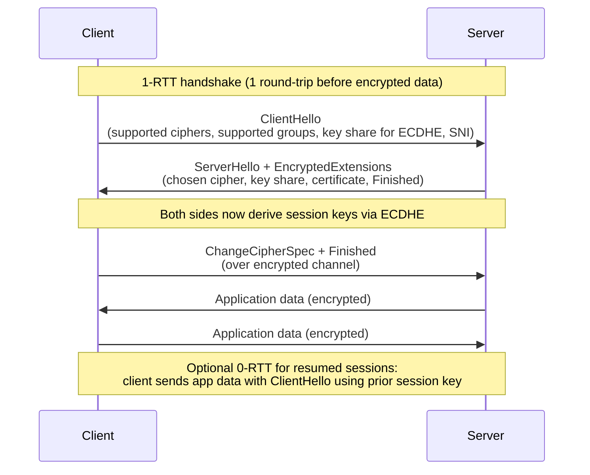

# Part 16 — TLS / SSL

> **Sprint allocation:** Week 8 (shared). **Budget: ~3-4 hrs.**

## 16 TLS / SSL — topic inventory

| # | Topic | Tags | Tier | Time | Done | Partial | Grilling | Visit Again | Notes | Resources |
|---|-------|------|------|------|------|---|---|-------------|-------|-----------|
| 1 | TLS 1.2 vs TLS 1.3 — handshake differences (1-RTT, 0-RTT) | 🔴 💼 🔐 🎯 | D | 3 hrs | [ ] | [ ] | [ ] | [ ] | | 💻 Warm-up: capture a TLS 1.2 handshake and a TLS 1.3 handshake with tcpdump or Wireshark; count RTTs to first byte (30 min) |
| 2 | Full handshake walkthrough — ClientHello, ServerHello, key exchange | 🔴 💼 🔐 🎯 | D | 2 hrs 30 min | [ ] | [ ] | [ ] | [ ] | | 📖 `security/cryptography/TLS_HTTPS_PKI.md` · 💻 Warm-up: `openssl s_client -connect google.com:443 -tls1_3 -trace` — identify ClientHello, ServerHello, key exchange in the trace output (30 min) |
| 3 | Cipher suites — naming convention, what each component does | 🔴 💼 🔐 🎯 | MP | 2 hrs | [ ] | [ ] | [ ] | [ ] | | 💻 Warm-up: run `nmap --script ssl-enum-ciphers -p 443 yourdomain.com` against your service; identify which suites are weak and how to disable them in Spring Boot (30 min) |
| 4 | Perfect Forward Secrecy — why DHE / ECDHE matters | 🔴 💼 🔐 🎯 | MP | 1.5 hrs | [ ] | [ ] | [ ] | [ ] | | |
| 5 | SNI — Server Name Indication, ESNI / ECH | 🔴 💼 🔐 🎯 | MP | 1.5 hrs | [ ] | [ ] | [ ] | [ ] | | |
| 6 | ALPN — protocol selection (HTTP/2 negotiation) | 🟠 💼 🔐 | M | 1 hr | [ ] | [ ] | [ ] | [ ] | | |
| 7 | Session resumption — session IDs, session tickets | 🟠 💼 🔐 | MP | 1.5 hrs | [ ] | [ ] | [ ] | [ ] | | |
| 8 | OCSP stapling | 🟠 💼 🔐 | M | 1 hr | [ ] | [ ] | [ ] | [ ] | | |
| 9 | HSTS, preload lists | 🟠 💼 🔐 | M | 45 min | [ ] | [ ] | [ ] | [ ] | | |
| 10 | Mutual TLS (mTLS) — when, how, cert rotation | 🟠 💼 🔐 | D | 3 hrs | [ ] | [ ] | [ ] | [ ] | | (Cross-ref Part 17 PKI) · 💻 Warm-up: configure Spring Boot with server.ssl.client-auth=need; generate client cert with openssl; curl with --cert/--key; observe rejection without cert (30 min) |
| 11 | Common attacks — BEAST, CRIME, POODLE, Heartbleed, downgrade attacks | 🟠 💼 🔐 | MP | 1.5 hrs | [ ] | [ ] | [ ] | [ ] | | |
| 12 | TLS terminator placement (LB, sidecar, app) | 🟠 🔐 | MP | 1.5 hrs | [ ] | [ ] | [ ] | [ ] | | |
| 13 | SSL Labs grading criteria | 🟡 🔐 | M | 45 min | [ ] | [ ] | [ ] | [ ] | | |
| 14 | Wireshark TLS inspection | 🟢 🔐 | M | 45 min | [ ] | [ ] | [ ] | [ ] | | |

## Time summary

| Scope | Hours (zero baseline) | Weeks @ 10–12 hrs/wk | Actual time |
|-------|-----------------------|----------------------|-------------|
| 🔴 MUST only (Sprint priority — 3-month plan) | ~10.5 hrs | ~0.95 wk | |
| 🔴 + 🟠 HIGH (must + high — senior coverage) | ~20.75 hrs | ~1.9 wk | |
| Full Part (all items including 🟡 + 🟢) | ~22.25 hrs | ~2 wk | |

## Key diagrams

**TLS 1.3 handshake (1-RTT):**

> TLS 1.2 needed 2 round-trips. TLS 1.3 collapses to 1 (or 0 for resumed sessions). The savings matter for high-latency mobile networks and KYC SDK ↔ backend handshakes over poor connections.

## Frequently asked

1. **Q:** Walk through a TLS 1.3 full handshake. How is it different from TLS 1.2?
   - **Why asked:** Senior canonical. TLS 1.3: 1-RTT — ClientHello includes key share guess (ECDHE), ServerHello includes server's key share + chosen cipher + cert + Finished. App data starts after 1 round trip. TLS 1.2: 2-RTT — ClientHello/ServerHello establish ciphers, then key exchange messages, then ChangeCipherSpec, then Finished. TLS 1.3 also removed RSA key exchange, MD5, SHA-1, weak ciphers — much smaller attack surface.
2. **Q:** What is Perfect Forward Secrecy, why does it matter, and how does ECDHE achieve it?
   - **Why asked:** Senior crypto-knowledge. PFS: even if server's long-term private key is compromised later, past session keys remain safe. With RSA key exchange (old), compromised server key lets attacker decrypt all past captured sessions. ECDHE: ephemeral keys per session — server's long-term key only authenticates, doesn't encrypt. Past sessions stay private.
3. **Q:** SNI — what problem does it solve, and what's the privacy issue?
   - **Why asked:** Modern TLS. SNI: client tells server which hostname it wants (in plaintext ClientHello) — needed for shared-IP hosting (one IP, many TLS certs). Privacy issue: SNI leaks the destination hostname even over TLS. ESNI / ECH (Encrypted Client Hello) encrypts SNI using a DNS-published public key — fixes the leak but deploys slowly.
4. **Q:** Cipher suite `TLS_AES_256_GCM_SHA384` — what does each component mean?
   - **Why asked:** Tests fluency. TLS_ = TLS-specific. AES_256_GCM = symmetric encryption (AES, 256-bit, GCM mode for AEAD). SHA384 = hash for key derivation + Finished message HMAC. TLS 1.3 simplified naming: no more key exchange + signature algorithm in the name (those are negotiated separately via key shares + signature_algorithms extension).
5. **Q:** Your KYC platform's mTLS to a regulated bank fails after their cert rotation. Walk through your debug.
   - **Why asked:** Operational depth. (1) `openssl s_client -connect bank:443 -showcerts` to see what the bank presents. (2) Verify your truststore has the bank's new CA. (3) Check your client cert is current + signed by a CA the bank trusts. (4) Check SAN matches the hostname. (5) Check OCSP / CRL — if revocation lookup fails, some clients reject. Your error message should narrow it: SSLHandshakeException variants.
6. **Q:** Session resumption — session IDs vs session tickets.
   - **Why asked:** Performance + scaling. Session IDs: server stores session state, indexed by ID. Works for single-server. Doesn't scale across load-balanced fleets without sticky sessions. Session tickets: server gives client an encrypted "ticket" containing the session state. Stateless on server. Scales horizontally. TLS 1.3 simplified to PSK (Pre-Shared Key) for resumption.
7. **Q:** What does OCSP stapling solve?
   - **Why asked:** TLS performance + privacy. Without stapling: client queries OCSP responder during handshake to check cert revocation status. Adds latency, leaks visit to CA, fails-closed when responder is down. With stapling: server pre-fetches OCSP response, attaches to handshake. No extra client RTT, no leak to CA, more robust.

## Trick questions / gotchas

1. **Q:** Your TLS connection negotiates TLS 1.0 even though you have TLS 1.3 configured. Why?
   - **Gotcha:** Likely a client doesn't support TLS 1.3 OR a downgrade attack (modern TLS has downgrade protection via the random in ClientHello). Other causes: TLS terminator (LB) configuration, intermediate proxy. Diagnose: `openssl s_client -tls1_3 -connect host:443` and check protocol used.
2. **Q:** Your client successfully connects to `kyc-bank.com` but fails to `staging.kyc-bank.com`. Both have valid certs. What's wrong?
   - **Gotcha:** SNI. Without SNI, server returns default cert. If staging is on shared IP, default cert is for kyc-bank.com → cert mismatch on staging request. Fix: client must send SNI = staging.kyc-bank.com. Most modern clients do this automatically; ancient clients (Java 7) don't.
3. **Q:** You enabled HSTS with `max-age=31536000`. After a routine cert mistake (wrong cert deployed), users complain they can't bypass the cert error. Why?
   - **Gotcha:** HSTS = strict transport security. Browsers cache the HSTS policy and refuse plaintext HTTP and refuse to bypass cert errors for the duration of `max-age`. Mistake-rollback requires fixing the cert (or rotating to a known-good one) — users can't bypass. Set `max-age=600` initially to test, then ramp.
4. **Q:** Your security team scans found "weak cipher" warning for `TLS_RSA_WITH_AES_256_GCM_SHA384`. But AES-256-GCM is strong. What's the issue?
   - **Gotcha:** `TLS_RSA_WITH_*` uses RSA key exchange (not ECDHE). No Perfect Forward Secrecy — past sessions vulnerable if server's long-term key is compromised. Fix: disable RSA key exchange cipher suites; use only `TLS_ECDHE_*` (or `TLS_AES_*` in TLS 1.3, which is implicit ECDHE).

## Mastery candidates (top 3–5 from this Part — suggestions, not commitments)

- **End-to-end TLS handshake walk-through** (~3 hrs rows 1 + 2 combined) — Mastery item across Parts 16 + 17. Capture with Wireshark or openssl s_client trace. Identify each handshake message. Interview-canonical.
- **mTLS rotation for KYC bank integration** (~3 hrs row 10) — directly your platform. Dual-cert overlap window, rotation procedure, monitoring, alerting. Becomes STAR-story material.
- **Cipher suite policy + audit** (~2.5 hrs rows 3 + 4 + 11) — define a modern cipher suite policy for your KYC platform. Test against current setup with SSL Labs. Address any non-PFS ciphers, weak hashes.

## Hands-on exercises (Practice + Advanced)

Warm-up TLS exercises are listed inline in the topic-table Resources column (counted in main Time summary). Longer exercises below are tracked separately.

### Practice — mid-level (~30-60 min each)

1. **TLS handshake inspection with openssl s_client** (~45 min) — `openssl s_client -connect google.com:443 -tls1_3 -trace -msg`. Identify ClientHello, ServerHello, certificate, Finished. Repeat with `-tls1_2`. Compare round-trip count.
2. **Spring Boot HTTPS server with custom keystore** (~60 min) — generate self-signed cert (cross-ref Part 17 warm-ups). Configure `server.ssl.*` in application.yml. Hit with curl `--cacert`. Test client without cacert (cert error).
3. **Cipher suite scanning** (~30 min) — `nmap --script ssl-enum-ciphers -p 443 your-host`. Identify supported suites. Cross-check against a "good" recommendation (Mozilla TLS config generator). Note any weak / deprecated.

### Advanced — senior-grade depth (~60+ min each)

4. **End-to-end mTLS Spring Boot setup** (~90 min) — server with `server.ssl.client-auth=need` + truststore. Java client using `SSLContext` + client cert from p12. Test happy path, client without cert, client with revoked cert. Document full setup.
5. **TLS terminator placement decision** (~60 min) — given your KYC platform's architecture (SDK → CloudFront → ALB → app), document where TLS terminates at each hop, what protocol between hops, key/cert management. Where would you do TLS pass-through vs re-encryption?

### Hands-on time summary (Practice + Advanced only)

| Tier | Total time | Weeks @ 10–12 hrs/wk | Actual time |
|------|------------|----------------------|-------------|
| Practice (mid-level) | ~2.25 hrs | ~0.2 wk | |
| Advanced (senior-grade) | ~2.5 hrs | ~0.23 wk | |
| **Combined hands-on (Practice + Advanced)** | **~4.75 hrs** | **~0.45 wk** | |

> Warm-up exercises (counted in main Time summary above) total ~2 hrs for Part 16 across 4 in-table warm-ups (tcpdump TLS 1.2 vs 1.3 handshake capture, nmap cipher-suite scan + Spring Boot disablement, mTLS Spring Boot `client-auth=need` setup, plus the original `openssl s_client -trace` walkthrough).

## Quick recall

**Q. TLS 1.3 vs 1.2 — round-trip difference?**
A. TLS 1.2: 2-RTT before encrypted app data. TLS 1.3: 1-RTT (or 0-RTT for resumed sessions). TLS 1.3 also dropped RSA key exchange, weak ciphers, MD5, SHA-1.

**Q. Perfect Forward Secrecy in one sentence.**
A. Compromising the server's long-term private key does NOT let an attacker decrypt past captured sessions, because session keys are derived from ephemeral (per-session) ECDHE keys.

**Q. SNI — what's it for, what's its privacy issue?**
A. Client tells server which hostname it wants (plaintext in ClientHello) — needed for shared-IP hosting. Privacy issue: hostname is leaked even over TLS. ESNI / ECH fixes by encrypting SNI.

**Q. mTLS in one sentence.**
A. Mutual TLS — both server AND client present + verify certificates during handshake. Used for service-to-service auth (no JWT/password) and regulated B2B integrations.

**Q. Cipher suite components (TLS 1.2 style)?**
A. `TLS_<keyexchange>_<authentication>_WITH_<bulk_cipher>_<MAC>`. E.g., `TLS_ECDHE_RSA_WITH_AES_256_GCM_SHA384`: ECDHE key exchange, RSA cert auth, AES-256-GCM bulk, SHA384 PRF. TLS 1.3 simplified to just bulk + MAC.

**Q. OCSP stapling — why use it?**
A. Server pre-fetches OCSP response from CA and attaches to TLS handshake. Avoids client-side OCSP lookup (latency, privacy leak to CA, failure when CA is down).
