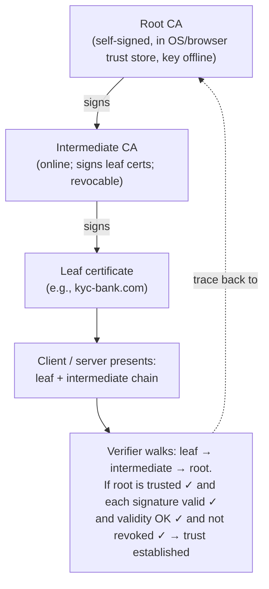

# Part 17 — PKI & Certificates

> **Sprint allocation:** Week 8 (shared — gets a meaningful chunk). **Budget: ~4-5 hrs.**

## 17 PKI & Certificates — topic inventory

| # | Topic | Tags | Tier | Time | Done | Partial | Grilling | Visit Again | Notes | Resources |
|---|-------|------|------|------|------|---|---|-------------|-------|-----------|
| 1 | X.509 certificate anatomy — Subject, Issuer, SANs, key usage, EKU, validity | 🔴 💼 🔐 🎯 | MP | 1.5 hrs | [ ] | [ ] | [ ] | [ ] | | 💻 Warm-up: generate self-signed cert with `openssl req -x509...`, inspect with `openssl x509 -text -noout` (15 min) |
| 2 | Chain of trust — root → intermediate → leaf | 🔴 💼 🔐 🎯 | M | 1 hr | [x] | [x] | [ ] | [ ] | | 📖 `security/cryptography/tls_certificates_diffie_hellman/index.md` · 📖 `security/cryptography/tls_https_pki/index.md` · 📺 Hussein Nasser — TLS chain of trust (YouTube, ~30 min) · 💻 Warm-up: `openssl s_client -connect google.com:443 -servername google.com -showcerts` — identify leaf/intermediate/root (20 min) |
| 3 | Why you never use a root directly — intermediates, ability to revoke | 🔴 💼 🔐 🎯 | M | 30 min | [ ] | [ ] | [ ] | [ ] | | |
| 5 | CSR — what's in it, key generation flow | 🔴 💼 🔐 | MP | 1 hr | [ ] | [ ] | [ ] | [ ] | | |
| 6 | Certificate lifecycle — issuance, renewal, revocation, rotation | 🔴 💼 🔐 | MP | 1.5 hrs | [ ] | [ ] | [ ] | [ ] | | 📖 [BPTLS 2ed free sample PDF](https://www.feistyduck.com/books/bulletproof-tls-and-pki/bulletproof-tls-and-pki-2ed-sample.pdf) (60 pages but ~30 min effective if you skip preface + basics you already know) · 📖 smallstep "Everything about certs" blog (~30 min alternative) |
| 7 | CRL vs OCSP vs short-lived certs | 🟠 💼 🔐 | MP | 1.5 hrs | [ ] | [ ] | [ ] | [ ] | | |
| 10 | Public vs private PKI — when each fits | 🟠 💼 🔐 | M | 45 min | [ ] | [ ] | [ ] | [ ] | | |
| 12 | ACME protocol — Let's Encrypt automation | 🟠 💼 🔐 | MP | 1.5 hrs | [ ] | [ ] | [ ] | [ ] | | |
| 13 | Certificate pinning — public-key pinning, problems | 🟠 💼 🔐 | MP | 1 hr | [ ] | [ ] | [ ] | [ ] | | |
| 14 | keytool, openssl — daily-use commands | 🟠 💼 🔐 | MP | 2 hrs | [ ] | [ ] | [ ] | [ ] | | 🎓 OpenSSL Cookbook (Ristić, free online) · 💻 Warm-up: PEM → PKCS#12 → JKS conversion + reverse (20 min) |
| 15 | Java truststores, keystores — JKS, PKCS12 | 🟠 💼 🔐 | MP | 1.5 hrs | [ ] | [ ] | [ ] | [ ] | | |

## Time summary

| Scope | Hours (zero baseline) | Weeks @ 10–12 hrs/wk | Actual time |
|-------|-----------------------|----------------------|-------------|
| 🔴 MUST only (Sprint priority — 3-month plan) | ~6.33 hrs | ~0.6 wk | |
| 🔴 + 🟠 HIGH (must + high — senior coverage) | ~19.42 hrs | ~1.8 wk | |
| Full Part (all items including 🟡 MED) | ~22.42 hrs | ~2 wk | |

> Time estimates assume zero baseline (you've never seen the topic). Subtract whatever you already know.
> Fill in "Actual time" after finishing the Part — useful for calibrating future Parts.

## Key diagrams

**Chain of trust:**

> The root is what's pre-trusted (lives in OS / browser cert store). The leaf is what you actually deploy. The intermediate exists so a compromise can be revoked without invalidating every leaf under the root.

## Frequently asked

1. **Q:** Walk through how TLS server authentication works end-to-end, starting from the browser receiving the server's certificate.
   - **Why asked:** Tests chain-of-trust understanding + how trust stores work + certificate validation steps (signature, validity, hostname/SAN match, revocation).
2. **Q:** If a CA gets compromised, what happens? How do clients learn the CA is no longer trusted?
   - **Why asked:** Tests revocation knowledge — CRL distribution, OCSP, why short-lived certs are increasingly the answer, CA pinning at OS/browser level.
3. **Q:** When would you choose private PKI over public CAs like Let's Encrypt?
   - **Why asked:** Architecture decision — internal service-to-service mTLS, regulated environments, name constraints, no public exposure of service topology.
4. **Q:** What's the difference between a CSR and a certificate? What's actually inside each?
   - **Why asked:** Tests basic understanding of the issuance flow + which side holds which key.
5. **Q:** How does ACME automate certificate issuance? What's the challenge mechanism?
   - **Why asked:** Modern operational knowledge — HTTP-01 vs DNS-01, validation flow. Let's Encrypt has changed the industry; senior should know this cold.
6. **Q:** You have a certificate in PKCS#12 format and need it in PEM for nginx. How?
   - **Why asked:** Daily ops fluency with `openssl pkcs12 -in cert.p12 -out cert.pem -nodes`.
7. **Q:** Your KYC platform talks to a regulated bank via mTLS. The bank's cert rotates next week. Walk through your rotation strategy.
   - **Why asked:** KYC-specific senior signal — connects PKI knowledge to real production work; tests dual-cert overlap windows, monitoring, customer comms.

## Trick questions / gotchas

1. **Q:** A certificate has expired but production traffic still works fine. What's going on?
   - **Gotcha:** TLS client validates expiry — *unless* your code disables certificate validation (`InsecureSkipVerify`, `TrustAllStrategy`, custom `HostnameVerifier` returning true). Common in misconfigured internal services where the dev "fixed" a TLS error by skipping validation.
2. **Q:** You added a SAN to a cert but clients still reject the connection. Why?
   - **Gotcha:** Three common reasons: (1) intermediate chain wasn't re-bundled with the new leaf; (2) clients cached the old cert and need a reload; (3) the new cert wasn't deployed to all backend instances behind the load balancer, so requests hit a stale cert.
3. **Q:** What's wrong with `openssl s_client -connect host:443`?
   - **Gotcha:** Missing `-servername host` (SNI). Without SNI, the server returns its *default* certificate, not the cert for the intended hostname. You may be inspecting the wrong cert and not realize.
4. **Q:** Why is certificate pinning often called a footgun?
   - **Gotcha:** Pinning ties the client to a specific public key. When that key needs to rotate (compromise, expiry, CA migration), pinned clients break until they ship an update. Mobile SDKs have bricked deployed apps doing this. Pin to a CA or use TACK/HPKP-style multi-pin with backup keys, or don't pin at all and rely on the trust store.

## Mastery candidates (top 3–5 from this Part — suggestions, not commitments)

- **End-to-end TLS handshake walk-through with cert validation steps** (~3 hrs) — connects Part 16 + 17, interview-canonical, also a Mastery candidate listed in Part 16.
- **mTLS rotation flow for a regulated KYC bank integration** (~3 hrs) — KYC-specific, immediately becomes a STAR-story narrative.
- **OpenSSL + keytool command fluency for cert formats + inspection** (~2 hrs) — daily-ops senior signal; muscle memory matters in interviews.
- **Private CA setup with HashiCorp Vault** (~3 hrs) — stretch goal; only if you also touch K8s service mesh.

## Hands-on exercises (Practice + Advanced)

Warm-up OpenSSL exercises are listed inline in the topic-table Resources column (counted in main Time summary). The longer exercises below are tracked separately.

### Practice — CSR + private CA workflows (~30-60 min each)

1. **CSR generation + manual signing** (~45 min) — generate a CSR with `openssl req -new -key client.key -out client.csr`. Sign it with your self-signed CA. Verify the resulting cert chain validates: `openssl verify -CAfile cert.pem client-signed.pem`.
2. **Spring Boot mTLS server + Java client** (~60 min) — Spring Boot `server.ssl.client-auth=need` with your truststore. Java client using `SSLContext` with the issued client cert. Hit endpoint, verify auth via cert subject.

### Advanced — private CA + rotation (~60+ min each)

3. **smallstep private CA setup** (~90 min) — `step ca init` for a 2-tier CA. Issue a leaf cert. Wire it into a local nginx serving HTTPS. Document the rotation flow you'd use to renew the leaf in production.
4. **Cert rotation with zero downtime** (~60 min) — Spring Boot service trusting two CA certs in its truststore. Rotate the upstream cert from CA-1-issued to CA-2-issued without restarting. Validates the "dual cert window" rotation pattern relevant to your KYC bank integrations.

### Hands-on time summary (Practice + Advanced only)

| Tier | Total time | Weeks @ 10–12 hrs/wk | Actual time |
|------|------------|----------------------|-------------|
| Practice (CSR + mTLS workflows) | ~1.75 hrs | ~0.16 wk | |
| Advanced (private CA + rotation) | ~2.5 hrs | ~0.23 wk | |
| **Combined hands-on (Practice + Advanced)** | **~4.25 hrs** | **~0.4 wk** | |

> Warm-up exercises (counted in main Time summary above) total ~55 min for Part 17 across 3 in-table warm-ups.

## Quick recall

**Q. Why use intermediate certificates instead of issuing leaf certs directly from the root?**
A. Root key stays offline. If an intermediate gets compromised, you revoke and replace it without invalidating every leaf cert under that root.

**Q. What's the difference between a certificate and a CSR?**
A. CSR (Certificate Signing Request) is what you send to a CA — contains your public key + identity info + signature made with your private key. The cert is what the CA returns after signing — same content plus the CA's signature.

**Q. CRL vs OCSP — when does each fit?**
A. CRL = full revocation list downloaded periodically (heavy, stale). OCSP = real-time per-cert check (fresh but adds a network call). OCSP stapling has the server pre-fetch the OCSP response and attach it to the TLS handshake (best of both).

**Q. What does the chain of trust verify?**
A. Each certificate is signed by the next one up. Walks from leaf to a trusted root in the local trust store. If any link is missing, invalid, expired, or revoked, the chain breaks and the connection fails.

**Q. What does a typical certificate rotation flow look like in production?**
A. Generate new key + CSR → CA issues new cert → deploy new cert alongside old (dual-cert window) → clients reconnect picking up new cert → monitor for any rejections → remove old cert after confidence window.

**Q. Why is hardcoded cert pinning a fragile pattern?**
A. Pinning ties the client to the current public key. If you rotate (compromise / expiry / CA migration), every pinned client breaks until they update. SDKs that pinned aggressively have bricked themselves during emergency rotations.
