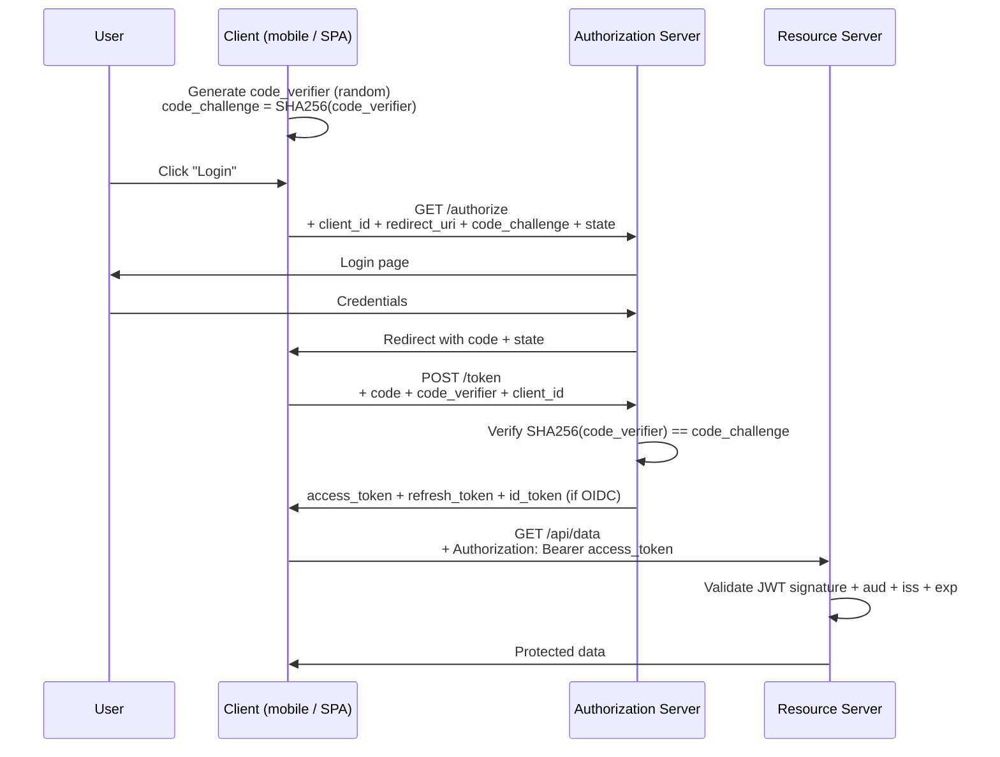

# Part 18 — Authentication

> **Sprint allocation:** Week 9 (shared with Parts 19, 20). **Budget: ~3-4 hrs.**

## 18 Authentication — topic inventory

| # | Topic | Tags | Tier | Time | Done | Partial | Grilling | Visit Again | Notes | Resources |
|---|-------|------|------|------|------|---|---|-------------|-------|-----------|
| 2 | Session vs token-based auth — tradeoffs | 🔴 💼 🔐 🎯 | MP | 1.5 hrs | [x] | [x] | [ ] | [ ] | ~1 hr (ChatGPT) | 📖 `api_design/api_technologies_summary/index.md` |
| 3 | OAuth 2.0 — roles (resource owner, client, AS, RS), all grant types | 🔴 💼 🔐 🎯 | D | 3 hrs | [x] | [x] | [ ] | [ ] | ~1.5 hr (ChatGPT) | 📖 `security/authentication/index.md` |
| 4 | Authorization Code flow + PKCE (the right default) | 🔴 💼 🔐 🎯 | D | 2 hrs | [x] | [x] | [ ] | [ ] | | 📖 `security/authentication/index.md` · 💻 Warm-up: walk through the 5 messages of Auth Code + PKCE from memory — `/authorize` → `/token` exchange + code_verifier (20 min) |
| 5 | OIDC layered on top of OAuth2 — ID token vs access token | 🔴 💼 🔐 🎯 | MP | 2 hrs | [x] | [x] | [ ] | [ ] | ~1 hr (ChatGPT) | 📖 `security/authentication/index.md` |
| 6 | JWT — structure (header.payload.signature), JWS vs JWE | 🔴 💼 🔐 🎯 | D | 1.5 hrs | [x] | [x] | [ ] | [ ] | Partial: Theory covered, warm-up pending. ~1.5 hr (ChatGPT) | 📖 `api_design/api_technologies_summary/index.md` · 💻 Warm-up: craft an HS256 JWT manually (header + payload base64url + HMAC), verify on jwt.io (30 min) |
| 7 | JWT signing algorithms — HS256 vs RS256 vs ES256; alg=none vulnerability | 🔴 💼 🔐 🎯 | D | 1.5 hrs | [x] | [x] | [ ] | [ ] | Partial: HS256 vs RS256 covered; ES256 & alg=none pending. ~1 hr (ChatGPT) | 📖 `api_design/api_technologies_summary/index.md` |
| 8 | JWT pitfalls — algorithm confusion, missing aud / iss / exp validation, key confusion | 🔴 💼 🔐 🎯 | D | 1.5 hrs | [x] | [x] | [x] | [ ] | | 📖 `security/authentication/index.md` |
| 9 | Refresh token rotation, reuse detection | 🔴 💼 🔐 🎯 | D | 1.5 hrs | [x] | [x] | [x] | [ ] | | 📖 `security/authentication/index.md` |
| 10 | SAML — assertions, IdP / SP, when SAML vs OIDC | 🟠 💼 🔐 | MP | 1.5 hrs | [x] | [x] | [ ] | [ ] | | 📖 `security/sso_saml_oidc_identity_brokers/index.md` |
| 12 | MFA — TOTP (RFC 6238), WebAuthn / FIDO2, push, SMS (and why SMS is weak) | 🟠 💼 🔐 | MP | 1.5 hrs | [x] | [x] | [x] | [ ] | | 📖 `security/authentication/index.md` · 💻 Warm-up: implement TOTP generator (HMAC-SHA1 over time-counter) from RFC 6238 — verify against Google Authenticator (20 min) |
| 13 | Magic links, passwordless flows | 🟠 💼 🔐 | M | 1 hr | [x] | [x] | [x] | [ ] | | 📖 `security/authentication/index.md` |
| 14 | SSO patterns | 🟠 💼 🔐 | M | 1 hr | [x] | [x] | [ ] | [ ] | | 📖 `security/sso_saml_oidc_identity_brokers/index.md` |
| 15 | API keys — when to use, rotation strategy | 🟠 💼 🔐 | M | 1 hr | [x] | [x] | [ ] | [ ] | ~1.5 hr (ChatGPT) | 📖 `security/authentication/index.md` |
| 16 | HMAC request signing (AWS SigV4 pattern) | 🟡 🔐 | MP | 1.5 hrs | [x] | [x] | [x] | [ ] | | 📖 `security/authentication/index.md` |

## Time summary

| Scope | Hours (zero baseline) | Weeks @ 10–12 hrs/wk | Actual time |
|-------|-----------------------|----------------------|-------------|
| 🔴 MUST only (Sprint priority — 3-month plan) | ~14.5 hrs | ~1.32 wk | |
| 🔴 + 🟠 HIGH (must + high — senior coverage) | ~20.5 hrs | ~1.86 wk | |
| Full Part (all items including 🟡) | ~22 hrs | ~2 wk | ~3.5 hrs so far |

## Key diagrams

**OAuth 2.0 Authorization Code + PKCE flow:**

> PKCE prevents code-interception attacks. The code_verifier never leaves the client; only its hash is sent in step 1. An attacker who steals the code can't redeem it without the verifier.

## Frequently asked

1. **Q:** Walk through Authorization Code + PKCE. Why PKCE, when did it become "the right default"?
   - **Why asked:** Senior canonical. PKCE: client generates random code_verifier, sends SHA256 hash in /authorize. Token exchange sends raw code_verifier. AS verifies. Prevents code-interception attacks where mobile/SPA's redirect URI can be hijacked. Originally for public clients (mobile); now recommended for ALL clients (RFC 9700, 2024).
2. **Q:** JWT structure. What can be in each section? What's a common pitfall?
   - **Why asked:** Senior daily. Header: alg, kid, typ. Payload: iss, sub, aud, exp, iat, jti + custom claims. Signature: HMAC or RSA/ECDSA. Pitfalls: (1) accepting `alg=none`, (2) algorithm confusion (RS256 → HS256 with public key as HMAC secret), (3) not validating aud/iss/exp, (4) storing sensitive data in payload (it's base64-encoded, not encrypted — use JWE if you need encryption).
3. **Q:** Refresh token rotation — design + reuse detection.
   - **Why asked:** Modern best practice. Rotation: each refresh issues a new refresh_token, invalidates the old one. Reuse detection: if the old (used) refresh_token is presented again, ALL tokens for that user are revoked (probable token theft). Tracks refresh_token "family" — entire chain revocable.
4. **Q:** Session vs token auth — when does each fit?
   - **Why asked:** Architecture decision. Session: server-side state, fast revocation, requires sticky sessions OR shared session store. Token (JWT): stateless, scales horizontally, but slow to revoke (must wait for exp or use a blocklist). Hybrid common: short-lived JWT + refresh token + server-side refresh-token tracking.
5. **Q:** SAML vs OIDC — when do you encounter SAML in modern systems?
   - **Why asked:** Real-world heterogeneity. SAML: XML-based, enterprise-heavy (B2B SSO with corporate IdPs), older, verbose. OIDC: JSON, mobile/SPA friendly, modern. KYC platform integration with banks may need SAML for the bank's IdP; consumer-facing should use OIDC.
6. **Q:** MFA — why is SMS considered weak now?
   - **Why asked:** Modern security. SIM swap attacks: attacker convinces telco to port victim's number → receives SMS codes → defeats MFA. Push (with phishing-resistant cert pinning) or TOTP (offline) are stronger. WebAuthn / FIDO2 is strongest — phishing-resistant by design.
7. **Q:** API key — when to use, and how to rotate without downtime?
   - **Why asked:** Operational depth. API key for: server-to-server, partner integrations, programmatic API access. Rotation: (1) issue new key, (2) accept BOTH old + new for overlap window (24-72h), (3) deprecate old key, (4) revoke. Communicate with partners. Better: use OAuth Client Credentials instead — built-in rotation via short-lived tokens.

## Trick questions / gotchas

1. **Q:** Your JWT validator accepts a token signed with the public key as HMAC secret. Why?
   - **Gotcha:** Algorithm confusion attack. Server expects RS256; attacker crafts token with `alg=HS256` and signs with the *public RSA key* as the HMAC secret. Naive validators that read `alg` from the header and use the same key blindly fail. Fix: pin the expected algorithm; never trust the `alg` header from the token.
2. **Q:** You set JWT `exp=24h`. User reports being logged out after 1 hour. Why?
   - **Gotcha:** Possible: server clock skew (token rejected because `iat` or `nbf` is "in the future"). Or: refresh token had shorter TTL than access token. Or: server-side blocklist. Tip: include 1-2 min clock-skew tolerance in `exp` validation.
3. **Q:** Your refresh token is `Bearer xyz` in a cookie. Why is HttpOnly + SameSite=Strict not enough?
   - **Gotcha:** Without explicit binding to client (PKCE or DPoP for proof-of-possession), if XSS leaks the token, attacker can use it. HttpOnly stops JS reading the cookie, but XSS can still call your authenticated endpoints from the user's browser. Mitigations: short refresh TTL, refresh token rotation with reuse detection, IP/UA binding (cautiously — breaks legitimate roaming).
4. **Q:** Your JWT validation passes even though the token was issued by a different OIDC provider. Why?
   - **Gotcha:** Missing `iss` validation. Token-validator must check `iss` matches the expected authority AND `aud` matches your service. Without these, ANY valid JWT (signed by any key in your trust store / JWK set) is accepted. Critical for OIDC where many tokens float around.

## Mastery candidates (top 3–5 from this Part — suggestions, not commitments)

- **OAuth + OIDC + PKCE end-to-end** (~3 hrs rows 3+4+5) — senior canonical. Walk through the full flow with concrete request/response examples. Code a client + AS toy.
- **JWT pitfalls + algorithm confusion deep-dive** (~3 hrs rows 6+7+8) — interview gold. The 5 common JWT bugs. How to validate correctly.
- **Refresh token rotation + reuse detection** (~2.5 hrs row 9) — modern best practice. Implement a refresh-token "family" tracker. Auto-revoke on detected reuse.
- **JWT design for KYC partner SDK** (~2.5 hrs combined) — short-lived access tokens for SDK, refresh tokens with rotation, key rotation strategy, JWK Set endpoint. Maps directly to your platform.

## Hands-on exercises (Practice + Advanced)

Warm-up auth exercises are listed inline in the topic-table Resources column (counted in main Time summary). Longer exercises below are tracked separately.

### Practice — mid-level (~30-60 min each)

1. **Craft + validate JWTs in three algorithms** (~45 min) — HS256, RS256, ES256. For each: header, payload, signature. Use Java + Nimbus library. Verify against jwt.io. Then deliberately break each (wrong signature, expired exp, missing aud) and confirm rejection.
2. **Reproduce the algorithm-confusion vulnerability** (~60 min) — vulnerable validator that reads `alg` from token + verifies with the key in trust store. Send RS256 token with `alg=HS256` and public key as HMAC secret. Observe acceptance. Then fix by pinning expected algorithm.
3. **OAuth Authorization Code + PKCE with Keycloak (local)** (~60 min) — run Keycloak via Docker. Register a client. From `curl` perform `/authorize` → callback → `/token` exchange with code_verifier. Receive access_token. Decode + inspect.

### Advanced — senior-grade depth (~60+ min each)

4. **Refresh-token rotation with reuse detection** (~90 min) — design DB schema for refresh-token family (parent_id, used_at, revoked_at). On each refresh: rotate token, mark old as used. On reuse attempt: revoke entire family + alert. Test happy path + theft scenario.
5. **JWT design for KYC SDK** (~75 min) — short-lived access token (15 min), refresh token (7 days, rotated on each use, reuse-detected). JWK Set endpoint for key rotation. Validate `aud`, `iss`, `exp`, `sub`. Sign with ES256 (small token, fast verify).

### Hands-on time summary (Practice + Advanced only)

| Tier | Total time | Weeks @ 10–12 hrs/wk | Actual time |
|------|------------|----------------------|-------------|
| Practice (mid-level) | ~2.75 hrs | ~0.25 wk | |
| Advanced (senior-grade) | ~2.75 hrs | ~0.25 wk | |
| **Combined hands-on (Practice + Advanced)** | **~5.5 hrs** | **~0.5 wk** | |

> Warm-up exercises (counted in main Time summary above) total ~70 min for Part 18 across 3 in-table warm-ups.

## Quick recall

**Q. PKCE — what does it prevent?**
A. Code-interception attacks. The client proves it initiated the auth flow by sending the code_verifier at token exchange (server verifies SHA256 matches the code_challenge it received at /authorize).

**Q. JWT alg=none vulnerability?**
A. Unsigned tokens. Vulnerable validators accept tokens with `alg=none` as valid without signature check. Fix: pin expected algorithm server-side; never trust `alg` header from the token.

**Q. JWT signing — RS256 vs HS256?**
A. HS256: HMAC with shared secret (symmetric). Both parties hold the key. RS256: RSA private signs, public verifies (asymmetric). Use HS256 only when issuer == validator. Use RS256 when issuer ≠ validator (most OIDC).

**Q. Refresh token rotation with reuse detection.**
A. Each refresh issues new refresh_token, marks old as used. If old (used) token presented again, revoke entire family. Detects + mitigates token theft.

**Q. SMS MFA — why weak?**
A. SIM swap attacks. Attacker convinces telco to port victim's number, intercepts SMS codes. TOTP (offline) or WebAuthn (phishing-resistant) are stronger.

**Q. What's the difference between OAuth and OIDC?**
A. OAuth = authorization (what you can do). OIDC = authentication layered on top (who you are). OIDC adds the ID token (JWT containing user identity claims) and the userinfo endpoint.
