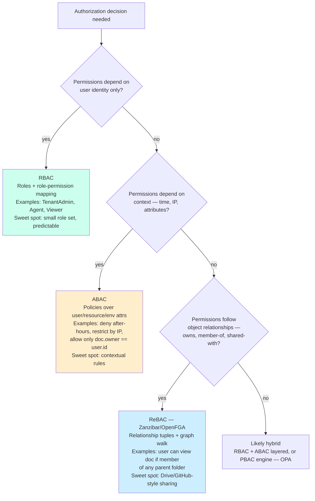

# Part 19 — Authorization

> **Sprint allocation:** Week 9 (shared). **Budget: ~3-4 hrs.**

## 19 Authorization — topic inventory

| # | Topic | Tags | Tier | Time | Done | Partial | Grilling | Visit Again | Notes | Resources |
|---|-------|------|------|------|------|---|---|-------------|-------|-----------|
| 1 | RBAC — roles, permissions, hierarchies | 🔴 💼 🔐 🎯 | MP | 1.5 hrs | [x] | [ ] | [ ] | [ ] | | 📖 `spring/spring_security/authorization/index.md` · 💻 Warm-up: model TenantAdmin/Agent/Viewer roles + write @PreAuthorize annotations on 3 endpoints (20 min) |
| 2 | ABAC — attribute-based, policies | 🔴 💼 🔐 🎯 | MP | 1.5 hrs | [x] | [ ] | [ ] | [ ] | | 📖 `spring/spring_security/authorization/index.md` |
| 3 | Spring Security architecture — filter chain, SecurityContext, @PreAuthorize internals | 🔴 💼 🎯 | MP | 2.5 hrs | [x] | [ ] | [ ] | [ ] | | 📖 `spring/spring_security/authorization/index.md` · 💻 Warm-up: trace one request through SecurityFilterChain — DEBUG log + identify the 5 default filters in order (30 min) |
| 4 | JWT claim → GrantedAuthority mapping in Spring Security | 🔴 💼 🎯 | MP | 1.5 hrs | [x] | [ ] | [ ] | [ ] | | 📖 `spring/spring_security/authorization/index.md` |
| 6 | OAuth scopes vs roles vs permissions — the distinction | 🔴 💼 🔐 | M | 1 hr | [x] | [ ] | [ ] | [ ] | ~1 hr (ChatGPT) | 📖 `security/authentication/index.md` |
| 7 | ReBAC — Google Zanzibar model, SpiceDB, OpenFGA | 🟠 💼 🔐 | MP | 2 hrs | [x] | [ ] | [ ] | [ ] | | |
| 8 | PBAC (policy-based) — OPA / Rego, Cedar | 🟠 💼 🔐 | MP | 2.5 hrs | [x] | [ ] | [ ] | [ ] | | 💻 Warm-up: write a Rego policy that denies cross-tenant access (30 min) |
| 9 | Multi-tenant authorization — tenant isolation | 🟠 💼 🔐 | D | 2.5 hrs | [x] | [ ] | [ ] | [ ] | | 📖 `spring/spring_security/authorization/index.md` |
| 11 | Method-level + URL-level + data-level authorization — defense in depth | 🟠 💼 🔐 | MP | 1.5 hrs | [x] | [ ] | [ ] | [ ] | | 📖 `spring/spring_security/authorization/index.md` |
| 13 | Permission caching + TTL — authz checks per request are expensive; how to cache safely | 🟠 💼 | M | 1 hr | [ ] | [ ] | [ ] | [ ] | | |

## Time summary

| Scope | Hours (zero baseline) | Weeks @ 10–12 hrs/wk | Actual time |
|-------|-----------------------|----------------------|-------------|
| 🔴 MUST only (Sprint priority — 3-month plan) | ~9 hrs | ~0.82 wk | |
| 🔴 + 🟠 HIGH (must + high — senior coverage) | ~22 hrs | ~2 wk | |
| Full Part (all items — no 🟡 in this Part) | ~22 hrs | ~2 wk | |

## Key diagrams

**RBAC vs ABAC vs ReBAC — which model fits the problem:**



> Most production systems layer RBAC (coarse role gate) + ABAC (contextual rules) + ReBAC (relationship graph) — pick the dominant model first, layer the others where needed.

**Defense-in-depth authorization layers — which bug each layer catches:**

```mermaid
flowchart LR
    Req[Request] --> URL[URL filter<br/>SecurityFilterChain<br/>Coarse: logged in? has role?]
    URL --> Method[Method-level<br/>@PreAuthorize<br/>Fine: permission for this op?]
    Method --> Svc[Service logic<br/>Business rule check<br/>e.g., order.user == currentUser]
    Svc --> Data[Data-level<br/>RLS / WHERE tenant_id<br/>Last-line safety net]
    Data --> DB[(DB)]

    URL -.catches.-> B1[Anonymous access<br/>to protected URL]
    Method -.catches.-> B2[Logged-in user<br/>calling wrong-role op]
    Svc -.catches.-> B3[IDOR — accessing<br/>another user's resource]
    Data -.catches.-> B4[Bug in code above<br/>leaking cross-tenant rows]
    style B1 fill:#fdd
    style B2 fill:#fdd
    style B3 fill:#fdd
    style B4 fill:#fdd
```

> No single layer is sufficient. URL filter alone fails open on IDOR; method-level alone fails open on cross-tenant queries. Each layer is a different class of guarantee.

## Frequently asked

1. **Q:** RBAC vs ABAC vs ReBAC — when does each fit?
   - **Why asked:** Architecture decision. RBAC: small set of roles, predictable permissions per role. Simple, scales for most apps. ABAC: attribute-based, more expressive — fits when permissions depend on context (time, IP, resource owner). ReBAC: relationship-based, fits when permissions follow object graphs (e.g., "can view document if member of any folder containing it"). Multi-tenant SaaS often layers RBAC + ABAC + ReBAC.
2. **Q:** OAuth scope vs role — same thing or different?
   - **Why asked:** Common confusion. Scope: what the *token* is authorized for (e.g., `read:profile`, `write:orders`). Granted at token-issue time. Role: what the *user* is (e.g., admin, customer). Persistent. Token scopes are typically a subset of user's permissions (least-privilege per session). Permissions are the fine-grained capabilities at the resource level.
3. **Q:** Multi-tenant authorization — how do you guarantee Tenant A never sees Tenant B's data?
   - **Why asked:** SaaS-canonical. Defense in depth: (1) tenant_id in every query (WHERE clause), enforced by repository abstraction or RLS, (2) tenant_id derived from JWT claim, not request param, (3) audit logging of cross-tenant access attempts, (4) per-tenant DB / schema for highest-tier customers (cellular isolation).
4. **Q:** Where do you enforce authorization — at the controller, service, or DB?
   - **Why asked:** Defense in depth. All three: (1) URL-level (filter / middleware) — coarse-grained "logged in, has role". (2) Method-level (`@PreAuthorize` in Spring) — fine-grained "this method needs permission X". (3) Data-level (RLS or `WHERE tenant_id=...`) — last line, catches bugs in code above. One layer can't be trusted alone.
5. **Q:** OPA / Rego — when does PBAC make sense?
   - **Why asked:** Modern authorization. PBAC: externalized policy engine, declarative rules. Worth it when (1) policies change frequently (without redeploy), (2) policies span multiple services (consistent across), (3) compliance / audit needs explicit policy documents. Caveats: latency (network hop), policy debugging complexity.
7. **Q:** Your KYC platform has tenant + agent users + admin users. Design the RBAC model.
   - **Why asked:** Domain application. Tenant (bank): users who belong to a partner bank. Roles: TenantAdmin (manage bank settings), TenantAgent (process verifications), TenantViewer (read-only). Cross-tenant: PlatformAdmin (your team). Implementation: JWT carries `tenant_id` + `roles[]` claims. Authorization checks both.

## Trick questions / gotchas

1. **Q:** Your method `getOrder(orderId)` checks `if order.userId == currentUser`. A bug allows passing any orderId. What's the fix?
   - **Gotcha:** This is IDOR (Insecure Direct Object Reference). Even with the check, the attacker can probe other order IDs to find ones they own. Or worse: the check uses `equals()` instead of comparing the user ID server-side. Fix: (1) always derive resource owner from server-side context (DB lookup), (2) consider opaque resource IDs (UUIDs instead of sequential), (3) add audit logging of access failures.
2. **Q:** Your @PreAuthorize("hasRole('ADMIN')") on a public method works in production. But @PreAuthorize on a private method silently doesn't enforce. Why?
   - **Gotcha:** Spring AOP proxy gotcha. Method security is proxy-based; private method calls bypass the proxy. Always public methods. Or use AspectJ weaving. Same trap as @Transactional, @Async, @Cacheable.
3. **Q:** You implemented RLS in Postgres. Queries from your app return all rows anyway. Why?
   - **Gotcha:** Likely connecting as a superuser (bypasses RLS), or RLS policy isn't applied (CREATE POLICY but didn't ENABLE), or `current_setting('app.tenant_id')` is not being set per-session. Fix: connect with a non-superuser role that has RLS, set the session variable per request via Hibernate interceptor.
4. **Q:** Cross-tenant data leak — you found a bug where Tenant A's user can see Tenant B's data. What's the post-mortem checklist?
   - **Gotcha:** Critical incident. (1) Contain: disable the affected endpoint/method. (2) Audit: query logs to identify exposure scope. (3) Notify: regulators (GDPR breach notification within 72h), affected tenants, customers. (4) Fix: code + tests + RLS guardrail. (5) Document: post-mortem with action items.

## Mastery candidates (top 3–5 from this Part — suggestions, not commitments)

- **Multi-tenant authorization for your KYC platform** (~2.5 hrs row 7) — directly job-relevant. Walk through tenant_id derivation, RLS guard, audit trail, breach detection.
- **Defense-in-depth authorization layers** (~2.5 hrs combined rows 7+8+9) — URL, method, data. Show how each catches a different class of bug.
- **ReBAC + Zanzibar model** (~2 hrs row 5) — modern, hot topic at scale. Understand the relationship-graph approach. Compare to RBAC for KYC's document-access scenarios.

## Hands-on exercises (Practice + Advanced)

Warm-up authz exercises are listed inline in the topic-table Resources column (counted in main Time summary). Longer exercises below are tracked separately.

### Practice — mid-level (~30-60 min each)

1. **Spring Security multi-role @PreAuthorize demo** (~60 min) — Spring Boot controller with 3 endpoints (admin-only, agent+admin, public). 3 roles wired from JWT claims via a custom `JwtAuthenticationConverter`. Test matrix: each role calling each endpoint, assert 200 / 403 / 401 as expected. Surface the `AccessDeniedException` path.
2. **Postgres RLS with tenant_id session variable** (~60 min) — `CREATE POLICY tenant_isolation ON orders USING (tenant_id = current_setting('app.tenant_id')::uuid)`. Wire a Hibernate interceptor (or `@PostConstruct` connection initializer) that runs `SET app.tenant_id = '...'` per request from JWT. Test cross-tenant query → 0 rows returned even when WHERE clause is omitted.
3. **IDOR vulnerability + fix** (~45 min) — write the buggy `getOrder(@RequestParam Long orderId)` that trusts the param. Demonstrate the exploit (curl with another tenant's order id). Then write the fix: derive owner from `SecurityContextHolder`, server-side ownership check via repo lookup, deny with audit log on mismatch.

### Advanced — senior-grade depth (~90+ min each)

4. **OPA sidecar evaluating Rego policy** (~90 min) — run OPA as a sidecar (Docker). Spring service calls OPA over HTTP for each authz decision. Rego policy enforces multi-tenant + role rules (e.g., "allow if input.user.tenant == input.resource.tenant AND 'agent' in input.user.roles"). Compare latency + flexibility against equivalent in-process `@PreAuthorize`. Document when externalizing policy is worth the network hop.
5. **ReBAC with OpenFGA** (~120 min) — model document-access relationships ("user can view doc if member of any parent folder, recursively"). Write the FGA schema (`type document`, `relations { viewer, parent }`), seed tuples for a 3-level folder tree, query authorization (`check` API). Compare expressiveness vs equivalent RBAC/ABAC modeling. Note the graph-walk cost characteristics.

### Hands-on time summary (Practice + Advanced only)

| Tier | Total time | Weeks @ 10–12 hrs/wk | Actual time |
|------|------------|----------------------|-------------|
| Practice (mid-level) | ~2.75 hrs | ~0.25 wk | |
| Advanced (senior-grade) | ~3.5 hrs | ~0.32 wk | |
| **Combined hands-on (Practice + Advanced)** | **~6.25 hrs** | **~0.57 wk** | |

> Warm-up exercises (counted in main Time summary above) total ~100 min for Part 19 across 4 in-table warm-ups.

## Quick recall

**Q. RBAC vs ABAC vs ReBAC — pick when each fits.**
A. RBAC: predictable roles. ABAC: contextual rules (time, IP, attributes). ReBAC: relationship-graph permissions (e.g., "user can read doc if in any parent folder").

**Q. Scope vs role — one-line distinction.**
A. Scope: what *this token* is permitted to do (per-session subset of user permissions). Role: what *this user* is, persistent identity attribute.

**Q. Defense-in-depth authorization layers?**
A. URL-level (filter) → method-level (@PreAuthorize) → data-level (RLS or WHERE tenant_id). All three; one alone is brittle.

**Q. IDOR (Insecure Direct Object Reference) — what is it?**
A. Authorization bypass where the request includes a resource ID and the server doesn't verify ownership. Attacker enumerates IDs to access others' data.

**Q. @PreAuthorize on private method — does it work?**
A. No — same Spring AOP proxy gotcha as @Transactional/@Async. Private method calls bypass the proxy. Use public methods or AspectJ weaving.


**Q. Spring SecurityFilterChain — order of the key default filters?**
A. `SecurityContextPersistenceFilter` → `BearerTokenAuthenticationFilter` (or `UsernamePasswordAuthenticationFilter`) → `ExceptionTranslationFilter` → `AuthorizationFilter` (formerly `FilterSecurityInterceptor`). Authentication populates `SecurityContext`; authorization reads from it. `@PreAuthorize` runs *after* the filter chain via method-level AOP proxy, not inside the chain.

