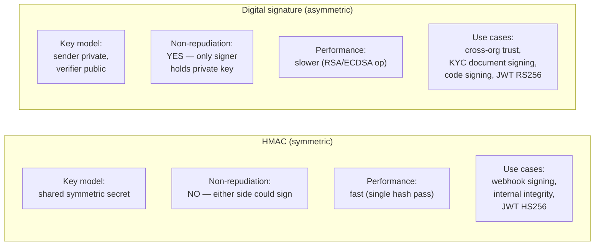
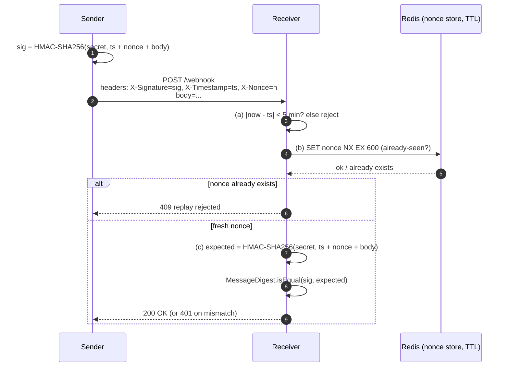

# Part 20 — Signing & Verification

> **Sprint allocation:** Week 9 (shared). **Budget: ~3-4 hrs.**

## 20 Signing & Verification — topic inventory

| # | Topic | Tags | Tier | Time | Done | Partial | Grilling | Visit Again | Notes | Resources |
|---|-------|------|------|------|------|---|---|-------------|-------|-----------|
| 1 | Digital signature vs MAC — different threat models | 🔴 💼 🔐 🎯 | MP | 1.5 hrs | [ ] | [ ] | [ ] | [ ] | | (Cross-ref Part 15) |
| 2 | Sign-then-encrypt vs encrypt-then-sign — choose carefully | 🔴 💼 🔐 🎯 | MP | 1.5 hrs | [ ] | [ ] | [ ] | [ ] | | |
| 3 | HMAC for symmetric scenarios (webhook signing) | 🔴 💼 🔐 🎯 | MP | 1.5 hrs | [ ] | [ ] | [ ] | [ ] | | 💻 Warm-up: HMAC-SHA256 over a JSON payload + base64-encode + constant-time verify (15 min) |
| 4 | RSA-PSS, ECDSA, EdDSA — modern signature algorithms | 🔴 💼 🔐 🎯 | MP | 1.5 hrs | [ ] | [ ] | [ ] | [ ] | | |
| 5 | Webhook signing — Stripe-style HMAC, replay protection with timestamps | 🔴 💼 🔐 🎯 | D | 2 hrs 30 min | [ ] | [ ] | [ ] | [ ] | | 💻 Warm-up: build a webhook receiver that verifies HMAC over `timestamp + body` with 5-min replay window (30 min) |
| 6 | Detached signatures — for documents, JARs | 🟠 💼 🔐 | M | 1 hr | [ ] | [ ] | [ ] | [ ] | | |
| 7 | JWS detached payloads | 🟠 💼 🔐 | M | 1 hr | [ ] | [ ] | [ ] | [ ] | | |
| 8 | Code signing | 🟠 💼 🔐 | MP | 1.5 hrs | [ ] | [ ] | [ ] | [ ] | | |
| 9 | Document signing — PDF signatures, eIDAS (Europe), relevant to KYC | 🟠 💼 🔐 | MP | 1.5 hrs | [ ] | [ ] | [ ] | [ ] | | |

## Time summary

| Scope | Hours (zero baseline) | Weeks @ 10–12 hrs/wk | Actual time |
|-------|-----------------------|----------------------|-------------|
| 🔴 MUST only (Sprint priority — 3-month plan) | ~9.25 hrs | ~0.85 wk | |
| 🔴 + 🟠 HIGH (must + high — senior coverage) | ~14.75 hrs | ~1.35 wk | |
| Full Part (all items) | ~14.75 hrs | ~1.35 wk | |

## Key diagrams

**HMAC vs digital signature (side-by-side):**

> Pick HMAC when both sides are trusted; pick digital signature when the verifier should never be able to forge.

**Webhook signing + replay defense:**

> Three checks: timestamp window stops ancient captures; nonce store stops in-window replays; constant-time HMAC compare stops timing leaks.

## Frequently asked

1. **Q:** HMAC vs digital signature — different threat models, when each fits?
   - **Why asked:** Senior-canonical. HMAC: shared secret, symmetric, both sides can sign + verify. Use when issuer and verifier are the same party (or tightly coupled). Digital signature: asymmetric, signer has private key, anyone with public key verifies. Use when verifier shouldn't be able to forge (cross-org webhooks, code signing, document signing).
2. **Q:** Design a webhook signing scheme for KYC partner notifications.
   - **Why asked:** Your KYC platform pattern. HMAC-SHA256 over `timestamp + ':' + body`. Send as `X-Signature: t=<timestamp>,v1=<hex_hmac>` header (Stripe style). Receiver: (1) parse timestamp + signature, (2) check |now - timestamp| < 5 min (replay window), (3) recompute HMAC over `timestamp + ':' + raw_body`, (4) constant-time compare. Rotate secret periodically.
3. **Q:** Sign-then-encrypt vs encrypt-then-sign — which is right?
   - **Why asked:** Subtle senior crypto. Encrypt-then-sign is generally safer: the verifier can validate the signature WITHOUT decrypting (failure-fast, no oracle attacks). Sign-then-encrypt: verifier must decrypt first → attacker can manipulate ciphertext, forcing decryption attempts. For most use cases, prefer encrypt-then-sign (or AEAD primitive that does both).
4. **Q:** RSA-PSS vs RSA-PKCS#1 v1.5 — why prefer PSS?
   - **Why asked:** Modern crypto. PKCS#1 v1.5 padding has known weaknesses (Bleichenbacher attack on RSA encryption, various signature forgery side channels). RSA-PSS uses random salting + provable security reduction. Modern code: prefer PSS for RSA signatures, or better, switch to ECDSA / EdDSA.
5. **Q:** EdDSA (Ed25519) vs ECDSA — modern best practice?
   - **Why asked:** Crypto trend. Ed25519: deterministic (no nonce reuse), faster, smaller signatures, simpler implementation, no malleability. Recommended by current crypto guidance (e.g., RFC 8032). ECDSA: more deployed historically, requires careful nonce handling (Sony PS3 was hacked due to nonce reuse). New systems: use Ed25519.
6. **Q:** What's a detached signature, when used?
   - **Why asked:** Practical pattern. Signature stored separately from the signed data (e.g., `data.zip` + `data.zip.sig`). Use cases: signing existing artifacts without modifying them (released JARs, deployment bundles), audit logs (signature is appended without changing the data). Maven uses detached `.asc` signatures.
7. **Q:** Document signing for KYC — eIDAS requirements?
   - **Why asked:** Domain regulatory. eIDAS (EU regulation): three levels — Simple (clicked agreement), Advanced (verified identity + linked to signer), Qualified (Advanced + qualified certificate from Trust Service Provider, equivalent to handwritten signature). Different KYC use-cases require different levels.

## Trick questions / gotchas

1. **Q:** Your webhook signature verification fails because of JSON serialization order.
   - **Gotcha:** Canonical serialization. Two semantically-equivalent JSONs (`{"a":1,"b":2}` vs `{"b":2,"a":1}`) hash differently. Solution: (1) sign the raw body bytes (not the re-serialized JSON), (2) document the exact serialization on both ends, (3) use a canonical JSON form (RFC 8785 JSON Canonicalization Scheme).
2. **Q:** You verified an HMAC successfully but a customer disputes their signed transaction. What's missing?
   - **Gotcha:** HMAC = "either party could have signed" (symmetric secret). Doesn't provide non-repudiation. For non-repudiation, use digital signature (asymmetric). Customer can't claim "your team signed on my behalf" because only they have the private key.
3. **Q:** ECDSA with deterministic nonces (RFC 6979) vs random nonces — same security?
   - **Gotcha:** RFC 6979 (deterministic) is safer in practice — eliminates nonce reuse class of bugs (Sony PS3). Same theoretical security. Most modern libraries default to RFC 6979 (Bouncy Castle, libsodium). EdDSA is deterministic by design.
4. **Q:** Your replay-protection window is 5 min. An attacker captures a webhook and replays it 4 minutes later. What happens?
   - **Gotcha:** It succeeds. Replay window protects against ancient captures, not recent ones. Defense in depth: (1) add a nonce / message-ID, reject duplicates (requires server-side state), (2) require monotonic timestamp per source.

## Mastery candidates (top 3–5 from this Part — suggestions, not commitments)

- **Webhook signing end-to-end for KYC partners** (~3 hrs combined rows 3+5) — Stripe-style HMAC over `timestamp + body`, replay protection, key rotation. Implement sender + receiver, test both happy and attack paths.
- **HMAC vs digital signature decision** (~2 hrs row 1) — practical decision tree. When non-repudiation matters → asymmetric. When only integrity within an org → HMAC.
- **Document signing for KYC compliance** (~2.5 hrs row 9) — eIDAS levels, PDF signatures (PAdES), workflow integration with Privy.id or similar. Maps to your KYC platform's document handling.

## Hands-on exercises (Practice + Advanced)

Warm-up signing exercises are listed inline in the topic-table Resources column (counted in main Time summary). Longer exercises below are tracked separately.

### Practice — mid-level (~30-60 min each)

1. **Stripe-style webhook signing implementation** (~60 min) — sender computes `HMAC-SHA256(timestamp + ":" + body)` with shared secret. Header: `X-Signature: t=<ts>,v1=<hex>`. Receiver: parse, verify timestamp window (5 min), verify HMAC constant-time. Test: tampered body, expired timestamp, wrong secret.
2. **ECDSA Ed25519 sign + verify** (~45 min) — generate keypair, sign a message, verify with public key. Then flip a bit of the message, observe verification fails. Compare with RSA-PSS for the same operation (timing + signature size).
3. **JWS detached signature** (~45 min) — create a JWS with detached payload (signature only). Use case: signing existing files without re-encoding. Verify the signature against the original file.

### Advanced — senior-grade depth (~60+ min each)

4. **Webhook signing key rotation** (~75 min) — design: accept signatures from BOTH old + new keys during overlap window. After cutover, reject old. Implement with a key-set provider that returns active + previous keys. Test rotation without downtime.
5. **Reproduce ECDSA nonce-reuse attack** (~90 min) — educational only. Sign two different messages with the SAME nonce (manually, breaking the deterministic-nonce best practice). Show how the private key can be recovered from the two signatures. Then switch to RFC 6979 deterministic nonces; observe the attack no longer applies.

### Hands-on time summary (Practice + Advanced only)

| Tier | Total time | Weeks @ 10–12 hrs/wk | Actual time |
|------|------------|----------------------|-------------|
| Practice (mid-level) | ~2.5 hrs | ~0.23 wk | |
| Advanced (senior-grade) | ~2.75 hrs | ~0.25 wk | |
| **Combined hands-on (Practice + Advanced)** | **~5.25 hrs** | **~0.48 wk** | |

> Warm-up exercises (counted in main Time summary above) total ~45 min for Part 20 across 2 in-table warm-ups.

## Quick recall

**Q. HMAC vs digital signature — one-line distinction.**
A. HMAC: shared secret, symmetric, no non-repudiation. Digital signature: asymmetric, signer has private key, provides non-repudiation (signer can't deny later).

**Q. Webhook signing — what's in the signed payload?**
A. `timestamp + ':' + raw_body`. Plus a replay window (typically 5 min) to reject ancient captures. Plus shared-secret rotation.

**Q. Encrypt-then-sign vs sign-then-encrypt — preferred order?**
A. Encrypt-then-sign. Verifier can validate signature WITHOUT decrypting → fail-fast, no decryption oracle exposure. AEAD primitives like AES-GCM bundle both.

**Q. RSA-PSS vs PKCS#1 v1.5 — why prefer PSS?**
A. PSS uses random salt + provable security. PKCS#1 v1.5 has known weakness classes. New code: PSS or, better, switch to ECDSA / EdDSA.

**Q. EdDSA (Ed25519) advantages over ECDSA?**
A. Deterministic nonces (no nonce-reuse class of bugs), faster verify, smaller signatures (64 bytes), simpler implementation. Modern recommendation for new systems.

**Q. eIDAS signature levels?**
A. Simple (clicked), Advanced (verified identity, linked to signer), Qualified (Advanced + qualified cert from Trust Service Provider, legally equivalent to handwritten signature).
