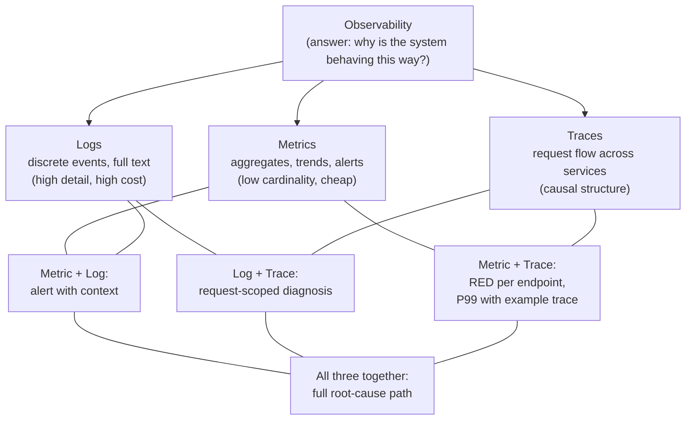

# Part 21 — Observability

> **Sprint allocation:** Light touch — fold into spare slots; you already do this daily. **Budget: ~1-2 hrs (overflow slot).**

## 21 Observability — topic inventory

| # | Topic | Tags | Tier | Time | Done | Partial | Grilling | Visit Again | Notes | Resources |
|---|-------|------|------|------|------|---|---|-------------|-------|-----------|
| 1 | Logs — structured (JSON), levels, correlation IDs | 🔴 💼 🎯 | MP | 1.5 hrs | [x] | [ ] | [ ] | [ ] | | 📖 `system_design/concepts/observability/index.md` · 💻 Warm-up: configure Logback / Logstash encoder for JSON output with correlationId via MDC, hit endpoint, inspect log shape (15 min) |
| 2 | Metrics — counters, gauges, histograms, summaries; RED & USE methods | 🔴 💼 🎯 | D | 2 hrs | [x] | [ ] | [ ] | [ ] | | 📖 `system_design/concepts/observability/index.md` |
| 3 | Traces — spans, context propagation, OpenTelemetry | 🔴 💼 🎯 | D | 2 hrs | [x] | [ ] | [ ] | [ ] | | 📖 `system_design/concepts/observability/index.md` |
| 4 | Prometheus + Grafana | 🔴 💼 | MP | 1.5 hrs | [x] | [ ] | [ ] | [ ] | | 📖 `system_design/concepts/observability/index.md` |
| 5 | Datadog (you use it daily) — APM, logs, metrics, monitors | 🔴 💼 | MP | 1.5 hrs | [x] | [ ] | [ ] | [ ] | | 📖 `system_design/concepts/observability/index.md` · 💻 Warm-up: define a Datadog custom metric via dd-trace-java + verify in Datadog UI (20 min) |
| 6 | Alerts — symptom-based not cause-based; runbooks per alert | 🔴 💼 | MP | 1.5 hrs | [x] | [ ] | [ ] | [ ] | | 📖 `system_design/concepts/observability/index.md` |
| 7 | On-call hygiene, incident response | 🔴 💼 | MP | 1.5 hrs | [x] | [ ] | [ ] | [ ] | | 📖 `system_design/concepts/observability/index.md` |
| 8 | Events — discrete vs metric aggregation | 🟠 💼 | M | 45 min | [x] | [ ] | [ ] | [ ] | | |
| 12 | OpenTelemetry — collector, SDKs, instrumentation | 🟠 💼 | D | 2 hrs | [x] | [ ] | [ ] | [ ] | | 📖 `system_design/concepts/observability/index.md` · 💻 Warm-up: wire OpenTelemetry Java agent into a Spring Boot app + export to OTLP collector (30 min) |
| 13 | Postmortems, blameless culture, 5 whys | 🟠 💼 | MP | 1.5 hrs | [x] | [ ] | [ ] | [ ] | | 📖 `system_design/concepts/observability/index.md` |

## Time summary

| Scope | Hours (zero baseline) | Weeks @ 10–12 hrs/wk | Actual time |
|-------|-----------------------|----------------------|-------------|
| 🔴 MUST only (Sprint priority — 3-month plan) | ~15.08 hrs | ~1.4 wk | |
| 🔴 + 🟠 HIGH (must + high — senior coverage) | ~24.33 hrs | ~2.2 wk | |
| Full Part (all items including 🟡) | ~25.83 hrs | ~2.35 wk | |

## Key diagrams

**Three pillars and their overlap:**



> Each pillar answers a different question. The intersections are where real debugging happens — a metric alert that links to an example trace that links to the offending logs.

**Trace waterfall (one request, four services):**

```mermaid
sequenceDiagram
    autonumber
    participant A as Service A (300ms total)
    participant B as Service B
    participant C as Service C
    participant D as Service D
    A->>B: call (50ms)
    B-->>A: response
    A->>C: call (200ms — dominates!)
    C-->>A: response
    A->>D: call (40ms)
    D-->>A: response
    Note over A,D: Span tree exposes where time is spent.<br/>Service C is the latency culprit; A's own work is ~10ms.
```

> The waterfall reveals what a flat metric can't: which downstream call is dominating P99. Without traces, you'd be guessing.

## Frequently asked

1. **Q:** Three pillars of observability — what does each give you, and when does each fall short?
   - **Why asked:** Senior-canonical. Logs: full text events, debugging "what happened on this specific request". Falls short for aggregates. Metrics: aggregates with low overhead, "what's the rate of failures over time". Falls short for individual diagnosis. Traces: end-to-end request flow across services, "where did time go". Falls short on cost at high cardinality.
2. **Q:** RED vs USE methods — what does each focus on?
   - **Why asked:** Modern monitoring standard. RED (for services): Request rate, Errors, Duration. USE (for resources): Utilization, Saturation, Errors. RED for "is my service serving traffic well", USE for "is my host healthy". Use both — overlapping but different angles.
3. **Q:** Design alerts for your KYC platform's verification endpoint.
   - **Why asked:** Operational thinking. Symptom-based: (1) Error rate > 1% over 5 min, (2) P99 latency > 2s over 5 min, (3) Throughput drops > 50% from baseline. Avoid cause-based alerts ("CPU > 80%" — symptom of what?). Each alert has a runbook with clear next-action.
4. **Q:** SLO + error budget — pick numbers for KYC verification and justify.
   - **Why asked:** SRE-canonical. Example: 99.5% success SLO over 30 days = 3.6 hours / month allowed failure. Tie to customer experience — partner bank tolerates X failures per million. Budget consumption: if you burn 50% in week 1, freeze risky changes until next month.
5. **Q:** OpenTelemetry — what problem does it solve over vendor SDKs (Datadog, X-Ray)?
   - **Why asked:** Modern vendor-neutrality. OTel: vendor-neutral instrumentation. Same code outputs to Datadog OR Jaeger OR X-Ray OR Tempo via collector + exporter swap. Avoid vendor lock-in on instrumentation. Caveat: vendor SDKs may have richer features (e.g., DD's continuous profiling).
6. **Q:** Correlation IDs — how do you propagate across async boundaries?
   - **Why asked:** Practical observability. Context propagation: MDC for sync code, ContextSnapshot or Scoped Values for virtual threads, propagation header (W3C `traceparent`) across HTTP/gRPC, message header in Kafka. The hardest case: `CompletableFuture.supplyAsync` to a default ForkJoinPool — manually wrap with MDC.transfer or use Micrometer's ContextSnapshot.
7. **Q:** Your P99 alert fires nightly at 3am. What's the canonical fix?
   - **Why asked:** Operational maturity. Likely a batch job. Options: (1) silence the alert window, (2) split SLO into "interactive" vs "batch", (3) move the batch off the user-facing service, (4) accept periodic slow path. The right answer depends on whether the batch is intentional or a regression.

## Trick questions / gotchas

1. **Q:** Your CloudWatch alarm fired but Datadog didn't. Both monitor the same metric. Why?
   - **Gotcha:** Different aggregation windows or data sources. CloudWatch may see EC2-level metrics; Datadog may see app-level. Also: aggregation method (max vs avg over window). Always check the actual data series used by each alert.
2. **Q:** You added `correlationId` to every log line. But traces don't tie together across services. Why?
   - **Gotcha:** You didn't propagate the correlationId to downstream calls. Need to: (1) set in MDC at request entry, (2) include in outgoing headers (e.g., `X-Correlation-ID` or W3C `traceparent`), (3) downstream service extracts on entry, sets in its MDC. Spring Cloud Sleuth / Micrometer Tracing handles this automatically.
3. **Q:** Your synthetic monitor probes your KYC endpoint every minute. You don't have real traffic at 3am. The probe goes from 100ms to 5s. Did your service degrade?
   - **Gotcha:** Maybe — or the probe itself moved (e.g., AWS Synthetics rotating regions, DNS change). Synthetic checks need careful baselining: track the probe path, not just response time. Cross-reference with real-traffic metrics during the same window.
4. **Q:** Your service emits 10,000 logs/sec. Your bill jumps. What's the optimization?
   - **Gotcha:** Common cost trap. (1) Drop DEBUG logs in prod. (2) Sample log lines if appropriate (1 in N for high-volume info logs). (3) Use metrics for things that don't need full text (request count). (4) Aggregate first, log second (avoid per-request audit logs if a counter would suffice).

## Mastery candidates (top 3–5 from this Part — suggestions, not commitments)

- **Correlation ID + context propagation end-to-end** (~3 hrs row 1 + 12) — across MDC, threads, async, downstream HTTP. Directly job-relevant (you use Datadog daily).
- **Alerts + runbook design** (~2.5 hrs rows 6+7) — symptom-based alerts, runbook structure (steps, escalation, mitigations). Build a runbook for KYC verification failures.
- **SLO + error budget for KYC platform** (~2 hrs row 9) — pick numbers, justify, document budget-consumption logic. SRE-style.
- **OpenTelemetry instrumentation** (~3 hrs row 12) — vendor-neutral instrumentation. Wire OTel agent into a Spring Boot service. Export to Datadog AND Jaeger via OTLP collector.

## Hands-on exercises (Practice + Advanced)

Warm-up observability exercises are listed inline in the topic-table Resources column (counted in main Time summary). Longer exercises below are tracked separately.

### Practice — mid-level (~30-60 min each)

1. **Structured JSON logging with correlationId** (~45 min) — Spring Boot + Logstash encoder. HandlerInterceptor generates correlationId at request entry, puts into MDC, clears at exit. Output JSON logs with embedded correlationId, traceId, spanId. Hit endpoint, search by correlationId in stdout.
2. **Custom Datadog metric via Micrometer** (~45 min) — Spring Boot + Micrometer + dd-trace-java. Define a Counter for verification_attempts + a Timer for verification_duration. Verify metrics appear in Datadog UI. Add a tag for tenant_id.
3. **OpenTelemetry tracing across two services** (~60 min) — two Spring Boot services. Service A calls Service B. OTel Java agent instruments both. Export to local Jaeger via OTLP collector. Verify trace spans connect across the call.

### Advanced — senior-grade depth (~60+ min each)

4. **Alert + runbook design** (~75 min) — pick 3 metrics that matter for KYC verification (success rate, P99 latency, throughput). Define symptom-based alerts (not cause-based). Write a runbook for each: triage steps, mitigations, escalation. Document expected MTTA + MTTR.
5. **SLO + error budget calculation** (~60 min) — pick a 30-day window. Compute current SLO baseline. Define error budget. Walk through "if we burn 50% of budget in week 1, what does that mean for risky deploys?". Document the policy.

### Hands-on time summary (Practice + Advanced only)

| Tier | Total time | Weeks @ 10–12 hrs/wk | Actual time |
|------|------------|----------------------|-------------|
| Practice (mid-level) | ~2.5 hrs | ~0.23 wk | |
| Advanced (senior-grade) | ~2.25 hrs | ~0.2 wk | |
| **Combined hands-on (Practice + Advanced)** | **~4.75 hrs** | **~0.43 wk** | |

> Warm-up exercises (counted in main Time summary above) total ~65 min for Part 21 across 3 in-table warm-ups.

## Quick recall

**Q. Three pillars of observability?**
A. Logs (text events, debugging), Metrics (low-cost aggregates, trends), Traces (request flow across services). Each excels at different questions; use all three.

**Q. RED method for services?**
A. Rate (requests/sec), Errors (count or %), Duration (latency p50/p99). The three numbers that tell you if a service is serving traffic well.

**Q. USE method for resources?**
A. Utilization (% in use), Saturation (queue depth, wait), Errors (HW or driver errors). For host-level health monitoring.

**Q. Symptom-based vs cause-based alerts.**
A. Symptom: user-visible (error rate, latency). Cause: internal (CPU, memory). Alert on symptoms (those page humans); use cause metrics for diagnosis. Cause-based alerts cause alert fatigue.

**Q. SLO vs SLA vs SLI?**
A. SLI: indicator (the actual metric you measure, e.g., success rate). SLO: objective (target you set, e.g., 99.5%). SLA: agreement (contractual promise to customer; usually weaker than internal SLO).

**Q. Correlation ID propagation — minimum stack?**
A. (1) Set in MDC at request entry (HandlerInterceptor). (2) Include in outgoing headers (Feign interceptor or RestTemplate ClientHttpRequestInterceptor). (3) Receiving service reads header and sets in its MDC. (4) Clear MDC at request exit.
