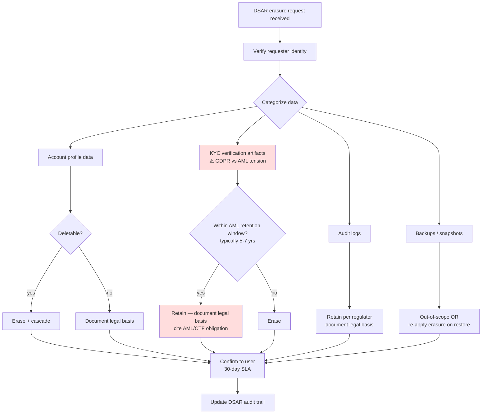
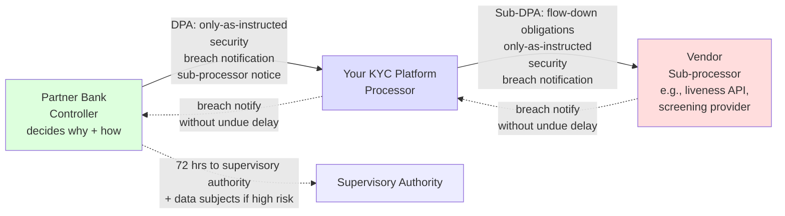

# Part 28 — Compliance, Privacy & Regulatory

> **Sprint allocation:** Light touch — fold into spare slots; large but mostly readable. **Budget: ~1-2 hrs (overflow slot).**

## 28 Compliance, Privacy & Regulatory — topic inventory

| # | Topic | Tags | Tier | Time | Done | Partial | Grilling | Visit Again | Notes | Resources |
|---|-------|------|------|------|------|---|---|-------------|-------|-----------|
| 1 | GDPR — lawful basis, consent, data subject rights (access, erasure, portability, rectification), DPO | 🔴 💼 🔐 | D | 2 hrs 50 min | [ ] | [ ] | [ ] | [ ] | | 💻 Warm-up: read your company's privacy policy; map each clause to a GDPR right; identify any gaps (20 min) |
| 2 | GDPR — processor vs controller, DPA agreements | 🔴 💼 🔐 | MP | 1.5 hrs | [ ] | [ ] | [ ] | [ ] | | |
| 3 | OJK regulations — POJK 11/03/2022 (digital banking), POJK 12/03/2018 (KYC/CDD), data localization for Indonesian financial data | 🔴 💼 🔐 | D | 3 hrs | [ ] | [ ] | [ ] | [ ] | | 💻 Warm-up: read POJK 11/03/2022 executive summary; map 3 platform requirements to KYC features you ship (30 min) |
| 4 | Bank Indonesia (BI) — cross-border data + payment systems rules; PBI 23/6/PBI/2021 for payment system providers | 🔴 💼 🔐 | MP | 1.5 hrs | [ ] | [ ] | [ ] | [ ] | | |
| 5 | MAS Technology Risk Management (TRM) Guidelines — Singapore; cyber hygiene rules for financial institutions, incident reporting | 🔴 💼 🔐 | MP | 1.5 hrs | [ ] | [ ] | [ ] | [ ] | | |
| 6 | Singapore PDPA — consent, notification, DPO requirement, transfer limitations | 🔴 💼 🔐 | MP | 1.5 hrs | [ ] | [ ] | [ ] | [ ] | | |
| 7 | Malaysia PDPA — Personal Data Protection Act 2010 + 2024 amendments, transfer restrictions, DPO | 🔴 💼 🔐 | MP | 1.5 hrs | [ ] | [ ] | [ ] | [ ] | | |
| 8 | CCPA / CPRA (California) | 🔴 💼 🔐 | M | 45 min | [ ] | [ ] | [ ] | [ ] | | |
| 9 | KYC / AML regulations — CDD / EDD, sanctions screening, STR (Suspicious Transaction Report), SAR | 🔴 💼 🔐 | D | 3 hrs | [ ] | [ ] | [ ] | [ ] | | 💻 Warm-up: read FATF 40 Recommendations executive summary; identify the 5 most relevant for KYC platforms (30 min) |
| 10 | PII classification & tagging (data inventory is the first step) | 🔴 💼 🔐 | MP | 1.5 hrs | [ ] | [ ] | [ ] | [ ] | | |
| 11 | Data minimization — collect only what's needed; question every field | 🔴 💼 🔐 | M | 1 hr | [ ] | [ ] | [ ] | [ ] | | |
| 12 | Encryption at rest, in transit (every hop, not just edge) | 🔴 💼 🔐 | MP | 1.5 hrs | [ ] | [ ] | [ ] | [ ] | | |
| 13 | Audit logs — what / when / who; tamper-evident storage | 🔴 💼 🔐 | MP | 2.5 hrs | [ ] | [ ] | [ ] | [ ] | | 💻 Warm-up: sketch an append-only audit-log schema with hash-chain column; write the SQL CREATE + the hash-chain insert function (30 min) |
| 14 | Right-to-be-forgotten implementation — soft delete vs hard delete, cascade design | 🔴 💼 🔐 | D | 2 hrs 50 min | [ ] | [ ] | [ ] | [ ] | | 💻 Warm-up: write a one-pager balancing GDPR erasure with 5-7 year AML retention; document which data is erased vs retained (20 min) |
| 15 | Retention policies enforced in code, not just in docs | 🔴 💼 🔐 | MP | 1.5 hrs | [ ] | [ ] | [ ] | [ ] | | |
| 16 | DSAR (Data Subject Access Request) operational workflow — intake queue, identity verification of requester, 30-day SLA, fulfillment pipeline, audit trail | 🔴 💼 🔐 | MP | 1.5 hrs | [ ] | [ ] | [ ] | [ ] | | |
| 17 | Cross-border data transfer — SCCs, adequacy, Schrems II | 🔴 💼 🔐 | MP | 1.5 hrs | [ ] | [ ] | [ ] | [ ] | Promoted 🟠→🔴: EU partner banks. | |
| 18 | SOC 2 — Type I vs II, Trust Service Criteria | 🔴 💼 🔐 | MP | 1.5 hrs | [ ] | [ ] | [ ] | [ ] | Promoted 🟠→🔴: B2B KYC default expectation. | |
| 19 | Breach notification obligations — GDPR 72-hour rule, OJK incident reporting, MAS reporting timeline; processor-controller notification chain | 🔴 💼 🔐 | MP | 1.5 hrs | [ ] | [ ] | [ ] | [ ] | | 💻 Warm-up: write a one-page incident-response playbook with notification deadlines per regulator (30 min) |
| 20 | Data localization & residency requirements | 🟠 💼 🔐 | MP | 1.5 hrs | [ ] | [ ] | [ ] | [ ] | | |
| 21 | PCI-DSS — if you touch card data; cardholder data environment, scope reduction | 🟠 💼 🔐 | MP | 1.5 hrs | [ ] | [ ] | [ ] | [ ] | | |
| 22 | ISO 27001 — ISMS, controls, certification flow | 🟠 💼 🔐 | MP | 1.5 hrs | [ ] | [ ] | [ ] | [ ] | | |
| 23 | Tokenization vs encryption — when each fits | 🟠 💼 🔐 | MP | 1.5 hrs | [ ] | [ ] | [ ] | [ ] | | |
| 24 | Field-level encryption for highly sensitive columns | 🟠 💼 🔐 | MP | 1.5 hrs | [ ] | [ ] | [ ] | [ ] | | |
| 25 | Pseudonymization, anonymization, k-anonymity | 🟠 💼 🔐 | MP | 1.5 hrs | [ ] | [ ] | [ ] | [ ] | | |
| 26 | Consent management platforms | 🟠 💼 🔐 | M | 1 hr | [ ] | [ ] | [ ] | [ ] | | |
| 27 | Privacy by design, DPIA | 🟠 💼 🔐 | MP | 1.5 hrs | [ ] | [ ] | [ ] | [ ] | | |
| 28 | Sanctions screening lists in depth — OFAC SDN, UN consolidated, EU consolidated, UK HMT; name-matching algorithms (Soundex, Levenshtein); false-positive tuning | 🟠 💼 🔐 | MP | 1.5 hrs | [ ] | [ ] | [ ] | [ ] | Cross-ref Part 29 sanctions row. | |
| 29 | PEP screening — politically exposed person definitions, adverse media monitoring, vendor APIs (World-Check, ComplyAdvantage) | 🟠 💼 🔐 | M | 1 hr | [ ] | [ ] | [ ] | [ ] | | |
| 30 | Travel Rule (FATF Recommendation 16) — applies to VASPs / payment touches; originator-beneficiary information exchange | 🟠 💼 🔐 | M | 1 hr | [ ] | [ ] | [ ] | [ ] | | |
| 31 | Vendor risk management — sub-processor assessment, DPA template, ongoing monitoring | 🟠 💼 🔐 | M | 1 hr | [ ] | [ ] | [ ] | [ ] | | |
| 32 | Data lineage / provenance tracking — for compliance audits; what touched what, when | 🟠 💼 🔐 | M | 1 hr | [ ] | [ ] | [ ] | [ ] | | |
| 33 | BSP regulations (Philippines) — Bangko Sentral ng Pilipinas circulars relevant for KYC | 🟠 💼 🔐 | M | 1 hr | [ ] | [ ] | [ ] | [ ] | | |
| 34 | eIDAS — EU electronic ID and trust services regulation | 🟡 🔐 | M | 1 hr | [ ] | [ ] | [ ] | [ ] | | (Cross-ref Part 20 signing) |

## Time summary

| Scope | Hours (zero baseline) | Weeks @ 10–12 hrs/wk | Actual time |
|-------|-----------------------|----------------------|-------------|
| 🔴 MUST only (Sprint priority — 3-month plan) | ~36.5 hrs | ~3.3 wk | |
| 🔴 + 🟠 HIGH (must + high — senior coverage) | ~55 hrs | ~5 wk | |
| Full Part (all items including 🟡) | ~56 hrs | ~5.1 wk | |

## Key diagrams

**Right-to-be-forgotten decision flow (the GDPR-vs-AML tension):**

> The shaded path is the KYC-specific tension: erasure rights bump against AML retention. Resolution is scope-by-category, not a blanket yes/no.

**Controller → processor → sub-processor data flow with DPA obligations:**

> The dashed arrows are the breach-notification chain: discovery flows up from sub-processor → processor → controller, and the controller is the one accountable to the supervisory authority within 72 hours (GDPR).

## Frequently asked

1. **Q:** GDPR data subject rights — name 4 and explain what each requires.
   - **Why asked:** KYC platform must support these. (1) Right to access: user can request copy of their data — typically <30 days. (2) Right to erasure (right to be forgotten): delete on request — except where retention is legally required. (3) Right to portability: machine-readable export. (4) Right to rectification: correct inaccurate data. (5) Right to object: opt out of certain processing.
2. **Q:** Walk through right-to-be-forgotten implementation in a KYC context.
   - **Why asked:** Hard real-world implementation. KYC has tension: GDPR right to erasure vs AML retention requirement (typically 5-7 years). Resolution: erasure scope is limited to non-required data. Document categories: account data (deletable), KYC verification artifacts (retained for AML), audit logs (retained per regulator). Document the legal basis for retention. Right pattern: soft-delete + cascade + audit trail.
3. **Q:** Encryption at rest — where exactly?
   - **Why asked:** Defense-in-depth check. (1) Object store (S3) — SSE-KMS. (2) DB volumes — RDS encryption. (3) DB column-level for super-sensitive (PII like SSN, document images). (4) Backups — encrypted snapshots. (5) Logs — if they contain PII (and they shouldn't, but if). Tip: every hop, every store, with envelope encryption + KMS.
4. **Q:** Processor vs controller — your KYC platform is which?
   - **Why asked:** Senior-canonical GDPR distinction. Controller: decides why + how data is processed (your partner bank is controller). Processor: processes on behalf of controller (your KYC platform is processor for the bank). DPA (Data Processing Agreement) defines the relationship. Processor obligations: only process as instructed, security, sub-processor notice, breach notification.
5. **Q:** PCI-DSS scope reduction strategies.
   - **Why asked:** If KYC touches card data. The CDE (Cardholder Data Environment) attracts compliance scope. Reduction strategies: (1) Tokenization — replace PAN with token, isolating the CDE to the tokenizer. (2) Outsource to PCI-compliant payment processor (Stripe, Adyen) — they're CDE, you're not. (3) Network segmentation — CDE in isolated subnet, strict ACLs. (4) Don't store card data at all.
6. **Q:** SOC 2 Type I vs Type II — what's the difference?
   - **Why asked:** B2B SaaS canonical. Type I: point-in-time audit — controls are in place AT this moment. Type II: extended audit (6-12 months) — controls are in place AND operating effectively over time. Type II is more rigorous + more valuable to enterprise customers. Most KYC platforms aim for Type II.
7. **Q:** Audit logs — what makes them tamper-evident?
   - **Why asked:** Compliance hard requirement. Tamper-evident options: (1) Append-only storage (no DELETE / UPDATE permissions on the log table). (2) Hash chain — each log entry includes hash of previous (Merkle-tree-ish). (3) Write to immutable storage (S3 Object Lock, CloudTrail with log file integrity validation). (4) Separate-system witness (sign each entry with a different system's key).

## Trick questions / gotchas

1. **Q:** Your retention policy says "delete after 7 years." 7 years later, you have records still in the DB. What's the bug?
   - **Gotcha:** "Enforced in code, not just in docs." Without a scheduled job actively deleting (or archiving + deleting), old records linger. Compliance audit failure. Fix: scheduled cleanup job, weekly run, alerts on any record > policy age.
2. **Q:** User requests data erasure. You delete from your DB. 30 days later, you discover backup snapshots still contain them. What's the violation?
   - **Gotcha:** Backups must be in scope of erasure too — OR you must commit to not restoring those records back into prod. Common approaches: (1) re-apply erasure after restore, (2) rolling backup retention (older backups expire automatically), (3) document the technical limitation in your privacy notice.
3. **Q:** Your audit log records "user X read document Y at time Z." Compliance asks for "who deleted document Y." You can't answer. Why?
   - **Gotcha:** Audit log was only on reads, not writes. Mistake. Audit logs need to cover ALL state-changing operations, with who/what/when/why. Senior signal: design the audit log requirements at feature inception, not retrofitted after compliance asks.
4. **Q:** Your KYC platform stores Indonesian KYC data in AWS-SG. OJK auditor asks why data isn't in Indonesia. What's your defense?
   - **Gotcha:** Data localization. OJK requires Indonesian KYC data to stay in Indonesia. AWS-SG is Singapore, NOT Indonesia. Defense: there isn't one if you're storing it there. Mitigations: move to DC-JKT or AWS Jakarta region (when it became available), accept the regulatory finding. Document the architectural change.

## Mastery candidates (top 3–5 from this Part — suggestions, not commitments)

- **GDPR data subject rights end-to-end for KYC** (~3 hrs rows 1+14) — directly job-relevant. Implementation patterns for each right within KYC retention constraints.
- **Audit log design for KYC platform** (~2.5 hrs row 13) — tamper-evident, regulator-queryable, performance-aware. Critical for KYC.
- **Data residency enforcement in code** (~2 hrs row 20) — KYC platform across DC-JKT + AWS-SG. How code prevents cross-region data leak. Tenant-pinning logic.
- **SOC 2 + ISO 27001 readiness** (~3 hrs combined rows 18+22) — for B2B partner contracts. Control mappings, evidence collection, audit prep.
- **SEA regulator coverage map** (~3 hrs combined rows 3+4+5+6+7) — OJK + BI + MAS + Singapore PDPA + Malaysia PDPA. Build a single matrix mapping each regulator to: data localization, retention, breach notification, DPO requirement, transfer rules.

## Hands-on exercises (Practice + Advanced)

Warm-up exercises are listed inline in the topic-table Resources column (counted in main Time summary). Longer exercises below are tracked separately.

### Practice — mid-level (~30-60 min each)

1. **JPA soft-delete + cascade for retention** (~60 min) — model `User` with `deleted_at` + `retain_until` columns; `@Where` clause filters out active queries; a scheduled job hard-deletes after `retain_until`; verify cascade across related entities (`KycVerification`, `AuditLog`) honours each entity's own retention rule.
2. **Append-only audit log table** (~60 min) — Postgres table with `prev_hash`, `current_hash` columns + insert trigger that computes the hash chain (`sha256(prev_hash || row_payload)`); INSERT 5 rows, verify chain unbroken; attempt to UPDATE a past row and observe trigger or RLS-based failure (tamper-evident).
3. **Tenant data-residency interceptor** (~45 min) — Spring `HandlerInterceptor` that reads tenant from the JWT, loads the tenant's region from config, rejects the request if the server's region doesn't match the tenant's. Test cross-region rejection with an Indonesian-tenant token hitting an AWS-SG node.

### Advanced — senior-grade depth (~60+ min each)

4. **DSAR fulfillment pipeline end-to-end** (~120 min) — REST endpoint accepts a DSAR, verifies requester identity (mock OTP), kicks off an async job (Spring `@Async` or Kafka) that gathers all data for the user from 5 services (account, KYC, audit, support tickets, marketing), packages a JSON export, emails it (mocked), logs every step to the audit trail with 30-day SLA tracking + breach alert if SLA at risk.
5. **PII scanner over your codebase** (~90 min) — ArchUnit or regex-based scanner that flags fields named like `ssn`, `passport`, `nik`, `dob` that aren't annotated with `@Sensitive`; integrate into CI as a failing check; demonstrate catching a regression PR that adds an unsanctioned PII field.

### Hands-on time summary (Practice + Advanced only)

| Tier | Total time | Weeks @ 10–12 hrs/wk | Actual time |
|------|------------|----------------------|-------------|
| Practice (mid-level) | ~2.75 hrs | ~0.25 wk | |
| Advanced (senior-grade) | ~3.5 hrs | ~0.32 wk | |
| **Combined hands-on (Practice + Advanced)** | **~6.25 hrs** | **~0.57 wk** | |

> Warm-up exercises (counted in main Time summary above) total ~2 hrs 30 min for Part 28 across 6 in-table warm-ups.

## Quick recall

**Q. GDPR data subject rights — name 4.**
A. Access (copy of data), erasure (right to be forgotten), portability (machine-readable export), rectification (correct inaccurate). Plus: object to processing, restrict processing.

**Q. Processor vs controller?**
A. Controller decides why + how data is processed. Processor processes on the controller's behalf per a DPA. Your KYC platform is processor for partner banks (controllers).

**Q. Right-to-be-forgotten in KYC — tension?**
A. GDPR erasure vs AML retention (typically 5-7 years). Resolution: erase non-required data, retain regulatory-required data, document legal basis.

**Q. Encryption at rest — where exactly?**
A. Object store (S3 + SSE-KMS), DB volumes (RDS encryption), DB column-level for super-sensitive, backups (encrypted snapshots), logs (if they contain PII).

**Q. SOC 2 Type I vs Type II?**
A. Type I: controls in place at a point in time. Type II: controls in place AND operating effectively over 6-12 months. Type II is more valuable to enterprise customers.

**Q. Audit log — what makes it tamper-evident?**
A. Append-only (no DELETE/UPDATE perms), hash chain linking entries, immutable storage (S3 Object Lock), or external witness signing each entry. Defense in depth.

**Q. SEA regulators most relevant to a KYC platform?**
A. OJK (Indonesia banking), BI (Indonesia payment systems), MAS (Singapore financial), PDPC (Singapore data protection), Personal Data Protection Department (Malaysia), BSP (Philippines).

**Q. Breach notification timelines?**
A. GDPR: 72 hours to supervisory authority + without undue delay to data subjects (if high risk). OJK: typically 1×24 hours for material incidents. MAS: 1 hour for critical incidents.
