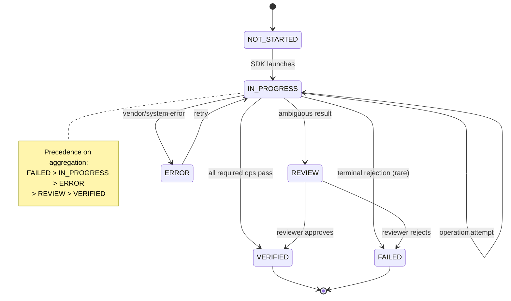
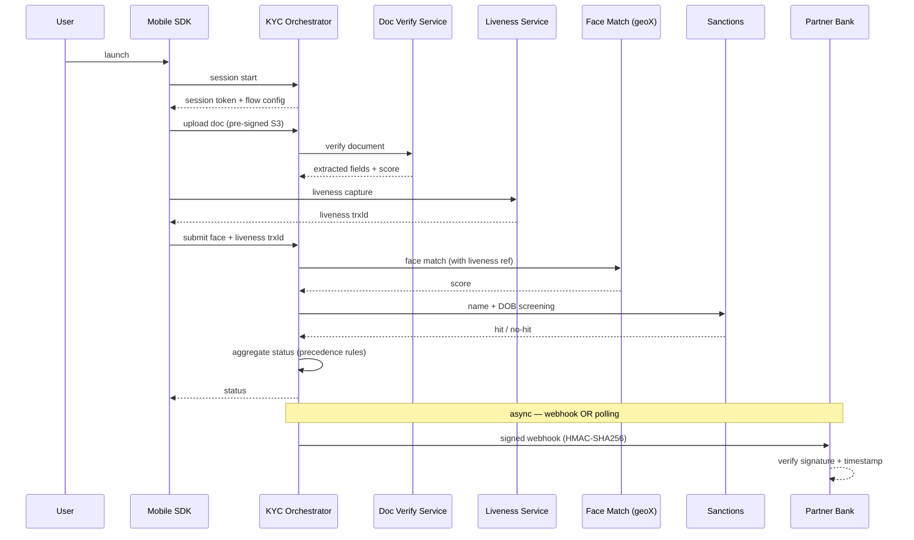
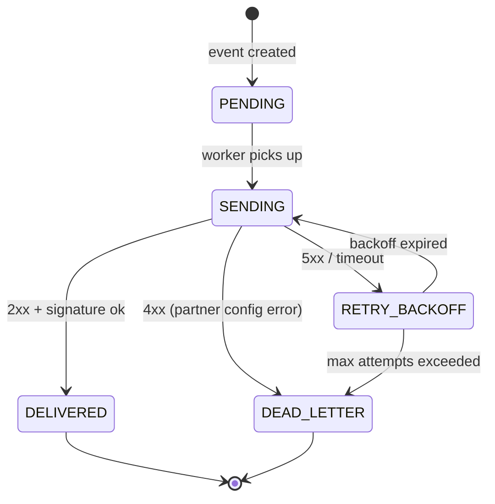

# Part 29 — Domain Patterns (KYC Deep Dive)

> Your literal job is the identity slice — this Part exists to make it your moat. The adjacent slices (payments, fraud, ledger) compound your senior-ness. Section "Cross-questions (self-audit)" below is a list of likely interview-style questions about your current system; if you can't answer them fluently out loud, those are your study targets.

> **Sprint allocation:** Weeks 10-11 (your domain — two-week focus). **Budget: ~16-22 hrs (across Weeks 10-11).**

## 29 Domain Patterns (KYC Deep Dive) — topic inventory

| # | Topic | Tags | Tier | Time | Done | Partial | Grilling | Visit Again | Notes | Resources |
|---|-------|------|------|------|------|---|---|-------------|-------|-----------|
| 1 | KYC flow archetypes — collection → verification → screening → decision | 🔴 💼 🔐 | M | 1 hr | [ ] | [ ] | [ ] | [ ] | | |
| 2 | Identity proofing levels — NIST 800-63 IAL 1/2/3 and what each requires | 🔴 💼 🔐 | MP | 1.5 hrs | [ ] | [ ] | [ ] | [ ] | | |
| 3 | Authentication assurance — AAL 1/2/3 | 🔴 💼 🔐 | M | 1 hr | [ ] | [ ] | [ ] | [ ] | | |
| 4 | eKYC vs in-person vs hybrid flows | 🔴 💼 🔐 | M | 45 min | [ ] | [ ] | [ ] | [ ] | | |
| 5 | CDD vs EDD — Customer Due Diligence vs Enhanced Due Diligence | 🔴 💼 🔐 | M | 45 min | [ ] | [ ] | [ ] | [ ] | | |
| 6 | ICAO 9303 — international passport standard | 🔴 💼 🔐 | MP | 1.5 hrs | [ ] | [ ] | [ ] | [ ] | | |
| 7 | MRZ parsing — Machine-Readable Zone, fields, check digits, format variants | 🔴 💼 🔐 | MP | 1.5 hrs | [ ] | [ ] | [ ] | [ ] | | 💻 Warm-up: parse a sample MRZ string by hand — split TD1/TD3 fields, validate check digit (15 min) |
| 8 | NFC chip reading on e-passports — BAC, PACE, Passive/Active/Chip Authentication | 🔴 💼 🔐 | D | 2.5 hrs | [ ] | [ ] | [ ] | [ ] | | |
| 9 | Data Groups DG1–DG16 — what each contains; which are most useful for KYC | 🔴 💼 🔐 | MP | 1.5 hrs | [ ] | [ ] | [ ] | [ ] | | |
| 10 | ISO 30107 — Presentation Attack Detection (PAD) standard | 🔴 💼 🔐 | MP | 1.5 hrs | [ ] | [ ] | [ ] | [ ] | | |
| 11 | Active vs passive liveness — UX vs security tradeoff | 🔴 💼 🔐 | MP | 1.5 hrs | [ ] | [ ] | [ ] | [ ] | | |
| 12 | Attack taxonomy — 2D photo, video replay, paper print, 3D mask, deepfake, injection attack | 🔴 💼 🔐 | MP | 1.5 hrs | [ ] | [ ] | [ ] | [ ] | | |
| 13 | PAD metrics — APCER (attacks accepted), BPCER (bona-fide rejected), ACER (average) | 🔴 💼 🔐 | MP | 1.5 hrs | [ ] | [ ] | [ ] | [ ] | | |
| 14 | 1:1 verification (KYC) vs 1:N identification (dedup, watchlists) | 🔴 💼 🔐 | M | 1 hr | [ ] | [ ] | [ ] | [ ] | | |
| 15 | Face embeddings — FaceNet, ArcFace (concept, not implementation) | 🔴 💼 🔐 | MP | 1.5 hrs | [ ] | [ ] | [ ] | [ ] | | |
| 16 | Matching metrics — FAR (False Accept), FRR (False Reject), ROC, EER | 🔴 💼 🔐 | MP | 1.5 hrs | [ ] | [ ] | [ ] | [ ] | | |
| 17 | Threshold tuning — KYC operating point (strict) vs phone-unlock (lenient) | 🔴 💼 🔐 | MP | 1.5 hrs | [ ] | [ ] | [ ] | [ ] | | |
| 18 | NIST FRVT — public face-recognition benchmark; how vendor results are read | 🔴 💼 🔐 | M | 1 hr | [ ] | [ ] | [ ] | [ ] | | |
| 19 | Sanctions lists — OFAC, UN, EU, HMT, country-specific | 🔴 💼 🔐 | M | 1 hr | [ ] | [ ] | [ ] | [ ] | | |
| 20 | PEP lists — domestic, foreign, family members, close associates | 🔴 💼 🔐 | M | 45 min | [ ] | [ ] | [ ] | [ ] | | |
| 21 | Adverse media screening | 🔴 💼 🔐 | M | 45 min | [ ] | [ ] | [ ] | [ ] | | |
| 22 | Multi-step verification state machine — operations × components × statuses | 🔴 💼 🔐 | D | 2.5 hrs | [ ] | [ ] | [ ] | [ ] | | 💻 Warm-up: sketch your current `kyc_status` state machine on paper — states, transitions, terminal vs non-terminal (30 min) |
| 23 | Step ordering — strict vs non-linear; tradeoffs (you chose non-linear) | 🔴 💼 🔐 | MP | 1.5 hrs | [ ] | [ ] | [ ] | [ ] | | |
| 24 | Status aggregation — precedence rules (FAILED > IN_PROGRESS > ERROR > REVIEW > VERIFIED) | 🔴 💼 🔐 | MP | 1.5 hrs | [ ] | [ ] | [ ] | [ ] | | |
| 25 | Source-of-truth separation — required ops from flow config, history from attempts table | 🔴 💼 🔐 | MP | 1.5 hrs | [ ] | [ ] | [ ] | [ ] | | |
| 26 | Component mapping for backward compatibility (CARD_BOTH ↔ CARD_FRONT/BACK) | 🔴 💼 🔐 | MP | 1.5 hrs | [ ] | [ ] | [ ] | [ ] | | |
| 27 | Latest-attempt-wins vs full attempt history (you tracked both) | 🔴 💼 🔐 | MP | 1.5 hrs | [ ] | [ ] | [ ] | [ ] | | |
| 28 | Native SDKs — iOS (Swift), Android (Kotlin) architecture | 🔴 💼 🔐 | MP | 1.5 hrs | [ ] | [ ] | [ ] | [ ] | | |
| 29 | Web / JS SDK — MediaDevices, getUserMedia, secure contexts | 🔴 💼 🔐 | MP | 1.5 hrs | [ ] | [ ] | [ ] | [ ] | | |
| 30 | Webhook delivery semantics — at-least-once (and why exactly-once is impractical) | 🔴 💼 🔐 | MP | 1.5 hrs | [ ] | [ ] | [ ] | [ ] | | (Cross-ref Part 13 messaging) |
| 31 | Webhook signing — HMAC-SHA256 (Stripe-style), key rotation flow | 🔴 💼 🔐 | MP | 1.5 hrs | [ ] | [ ] | [ ] | [ ] | | 💻 Warm-up: implement HMAC-SHA256 webhook signer + verifier in Java; include timestamp + nonce (45 min) |
| 32 | Replay protection — timestamp + tolerance window + nonce | 🔴 💼 🔐 | MP | 1.5 hrs | [ ] | [ ] | [ ] | [ ] | | |
| 33 | Retry with exponential backoff + jitter, max attempts, dead-letter | 🔴 💼 🔐 | MP | 1.5 hrs | [ ] | [ ] | [ ] | [ ] | | |
| 34 | Tenant identification — header, subdomain, API-key-derived, JWT claim | 🔴 💼 🔐 | MP | 1.5 hrs | [ ] | [ ] | [ ] | [ ] | | |
| 35 | Tenant isolation — shared DB + tenant_id, schema-per-tenant, DB-per-tenant; pros/cons | 🔴 💼 🔐 | D | 2 hrs | [ ] | [ ] | [ ] | [ ] | | |
| 36 | Per-tenant configuration — flow_type, enabled operations, document types, thresholds | 🔴 💼 🔐 | MP | 1.5 hrs | [ ] | [ ] | [ ] | [ ] | | |
| 37 | Per-tenant data residency — region pinning (DC-JKT vs AWS-SG, your reality) | 🔴 💼 🔐 | MP | 1.5 hrs | [ ] | [ ] | [ ] | [ ] | | |
| 38 | Per-tenant rate limits & quotas — burst vs sustained | 🔴 💼 🔐 | MP | 1.5 hrs | [ ] | [ ] | [ ] | [ ] | | |
| 39 | Re-KYC, periodic refresh, expiry triggers | 🟠 💼 🔐 | MP | 1.5 hrs | [ ] | [ ] | [ ] | [ ] | | |
| 40 | Federated / national ID schemes — Aadhaar (IN), MyKad (MY), KTP + Dukcapil (ID), Singpass (SG), PhilSys (PH) | 🟠 💼 🔐 | MP | 1.5 hrs | [ ] | [ ] | [ ] | [ ] | | |
| 41 | eIDAS qualified e-signatures (EU), Privy.id (Indonesia), DocuSign-class trust services | 🟠 💼 🔐 | M | 45 min | [ ] | [ ] | [ ] | [ ] | | |
| 42 | Regional ID templates — MyKad, KTP, NRIC, Aadhaar/PAN/Voter ID, driver's licenses | 🟠 💼 🔐 | MP | 1.5 hrs | [ ] | [ ] | [ ] | [ ] | | |
| 43 | OCR — text detection vs recognition, confidence scoring, post-processing | 🟠 💼 🔐 | MP | 1.5 hrs | [ ] | [ ] | [ ] | [ ] | | |
| 44 | Field extraction — template-based vs ML-based; pros/cons | 🟠 💼 🔐 | M | 45 min | [ ] | [ ] | [ ] | [ ] | | |
| 45 | Image quality assessment — blur (Laplacian variance), glare, lighting, resolution, motion | 🟠 💼 🔐 | MP | 1.5 hrs | [ ] | [ ] | [ ] | [ ] | | |
| 46 | Document boundary detection, perspective correction | 🟠 💼 🔐 | M | 45 min | [ ] | [ ] | [ ] | [ ] | | |
| 47 | Forgery detection — copy-move, splicing, recapture (screen reshoot), digital tampering | 🟠 💼 🔐 | MP | 1.5 hrs | [ ] | [ ] | [ ] | [ ] | | |
| 48 | Hologram, kinegram, OVD (Optically Variable Device) detection | 🟠 💼 🔐 | M | 45 min | [ ] | [ ] | [ ] | [ ] | | |
| 49 | Cross-validation — MRZ vs visual zone consistency | 🟠 💼 🔐 | M | 45 min | [ ] | [ ] | [ ] | [ ] | | |
| 50 | iBeta certification — Level 1 vs Level 2 attack tooling, what each tests | 🟠 💼 🔐 | M | 1 hr | [ ] | [ ] | [ ] | [ ] | | |
| 51 | Challenge-response (active) — head turn, blink, smile, randomized prompts | 🟠 💼 🔐 | M | 1 hr | [ ] | [ ] | [ ] | [ ] | | |
| 52 | Texture / micro-texture analysis, monocular depth cues | 🟠 💼 🔐 | M | 45 min | [ ] | [ ] | [ ] | [ ] | | |
| 53 | Video liveness vs single-frame liveness | 🟠 💼 🔐 | M | 45 min | [ ] | [ ] | [ ] | [ ] | | |
| 54 | Adversarial robustness — defending against deepfakes and GAN-generated faces | 🟠 💼 🔐 | MP | 1.5 hrs | [ ] | [ ] | [ ] | [ ] | | |
| 55 | Cosine similarity vs Euclidean distance for embeddings | 🟠 💼 🔐 | M | 45 min | [ ] | [ ] | [ ] | [ ] | | |
| 56 | Demographic bias — race, age, gender; how it shows up, mitigation strategies | 🟠 💼 🔐 | MP | 1.5 hrs | [ ] | [ ] | [ ] | [ ] | | |
| 57 | Age estimation vs age verification flows | 🟠 💼 🔐 | M | 45 min | [ ] | [ ] | [ ] | [ ] | | |
| 58 | Template storage — irreversible embeddings vs raw images; encryption + retention rules | 🟠 💼 🔐 | MP | 1.5 hrs | [ ] | [ ] | [ ] | [ ] | | |
| 59 | ISO 19794 — biometric data interchange formats | 🟠 💼 🔐 | M | 45 min | [ ] | [ ] | [ ] | [ ] | | |
| 60 | Name matching — phonetic (Soundex, Metaphone, NYSIIS), edit distance, transliteration | 🟠 💼 🔐 | MP | 1.5 hrs | [ ] | [ ] | [ ] | [ ] | | |
| 61 | Date-of-birth and country tolerance windows | 🟠 💼 🔐 | M | 45 min | [ ] | [ ] | [ ] | [ ] | | |
| 62 | False-positive triage — analyst queue design, audit trail | 🟠 💼 🔐 | MP | 1.5 hrs | [ ] | [ ] | [ ] | [ ] | | |
| 63 | Continuous re-screening on list updates | 🟠 💼 🔐 | M | 45 min | [ ] | [ ] | [ ] | [ ] | | |
| 64 | Idempotency keys for verification operations | 🟠 💼 🔐 | MP | 1.5 hrs | [ ] | [ ] | [ ] | [ ] | | 💻 Warm-up: design an Idempotency-Key header contract — TTL, conflict semantics, storage strategy (30 min) |
| 65 | Partial completion, resume, abandon semantics | 🟠 💼 🔐 | MP | 1.5 hrs | [ ] | [ ] | [ ] | [ ] | | |
| 66 | Retry budget — frontend-enforced vs backend-enforced vs hybrid; pros/cons | 🟠 💼 🔐 | MP | 1.5 hrs | [ ] | [ ] | [ ] | [ ] | | |
| 67 | Document capture modes — BOTH_SIDE, FRONT_ONLY, FRONT_BACK_SEPARATE | 🟠 💼 🔐 | M | 1 hr | [ ] | [ ] | [ ] | [ ] | | |
| 68 | Document switching mid-flow — historical preservation, latest-context computation | 🟠 💼 🔐 | MP | 1.5 hrs | [ ] | [ ] | [ ] | [ ] | | |
| 69 | Sync (decision-now) vs async (decision-later) verification | 🟠 💼 🔐 | M | 45 min | [ ] | [ ] | [ ] | [ ] | | |
| 70 | Manual review queues for ambiguous cases | 🟠 💼 🔐 | M | 1 hr | [ ] | [ ] | [ ] | [ ] | | |
| 71 | Hybrid SDK distribution — React Native, Flutter, Cordova bridges | 🟠 💼 🔐 | M | 45 min | [ ] | [ ] | [ ] | [ ] | | |
| 72 | SDK security — root/jailbreak detection, anti-frida, anti-tamper, code obfuscation | 🟠 💼 🔐 | MP | 1.5 hrs | [ ] | [ ] | [ ] | [ ] | | |
| 73 | Device attestation — Play Integrity (Android), App Attest / DeviceCheck (iOS) | 🟠 💼 🔐 | MP | 1.5 hrs | [ ] | [ ] | [ ] | [ ] | | |
| 74 | SDK auth — API key vs short-lived JWT vs server-issued session token | 🟠 💼 🔐 | MP | 1.5 hrs | [ ] | [ ] | [ ] | [ ] | | |
| 75 | Camera capture quality — autofocus, exposure, ISO; capture guidance UX | 🟠 💼 🔐 | M | 45 min | [ ] | [ ] | [ ] | [ ] | | |
| 76 | On-device pre-checks — blur, framing, glare before upload (save backend cycles) | 🟠 💼 🔐 | M | 1 hr | [ ] | [ ] | [ ] | [ ] | | |
| 77 | SDK telemetry — what's safe to send, PII redaction at source | 🟠 💼 🔐 | M | 45 min | [ ] | [ ] | [ ] | [ ] | | |
| 78 | SDK distribution channels — Maven Central, CocoaPods, SPM, npm | 🟠 💼 🔐 | M | 45 min | [ ] | [ ] | [ ] | [ ] | | |
| 79 | SDK versioning, deprecation policy, backward compatibility windows | 🟠 💼 🔐 | M | 45 min | [ ] | [ ] | [ ] | [ ] | | |
| 80 | Ordering — per-resource ordering vs "out-of-order safe" event design | 🟠 💼 🔐 | MP | 1.5 hrs | [ ] | [ ] | [ ] | [ ] | | |
| 81 | Per-partner endpoint health tracking, per-partner circuit breaker | 🟠 💼 🔐 | MP | 1.5 hrs | [ ] | [ ] | [ ] | [ ] | | |
| 82 | SSRF protection — URL allowlist, blocked IP ranges, no-follow redirects | 🟠 💼 🔐 | MP | 1.5 hrs | [ ] | [ ] | [ ] | [ ] | | |
| 83 | Partner replay tool — self-serve event re-delivery | 🟠 💼 🔐 | M | 45 min | [ ] | [ ] | [ ] | [ ] | | |
| 84 | mTLS to partner endpoints (regulated banking) | 🟠 💼 🔐 | MP | 1.5 hrs | [ ] | [ ] | [ ] | [ ] | | (Cross-ref Part 17 PKI) |
| 85 | Polling fallback (`GET /verify/status`, your current model) for partners who can't accept webhooks | 🟠 💼 🔐 | M | 45 min | [ ] | [ ] | [ ] | [ ] | | |
| 86 | Webhook event schema versioning | 🟠 💼 🔐 | M | 45 min | [ ] | [ ] | [ ] | [ ] | | |
| 87 | Per-tenant SLAs, monitoring, alerting | 🟠 💼 🔐 | MP | 1.5 hrs | [ ] | [ ] | [ ] | [ ] | | |
| 88 | Noisy-neighbor isolation — connection pools, thread budgets, downstream quotas | 🟠 💼 🔐 | MP | 1.5 hrs | [ ] | [ ] | [ ] | [ ] | | |
| 89 | Billing & metering — per-transaction, per-API-call, tiered; reconciliation against audit logs | 🟠 💼 🔐 | MP | 2 hrs | [ ] | [ ] | [ ] | [ ] | | |
| 90 | Per-tenant audit logs — billing dispute resolution + compliance | 🟠 💼 🔐 | MP | 1.5 hrs | [ ] | [ ] | [ ] | [ ] | | |
| 91 | White-label / co-brand SDK — theming, custom domains, branded UX | 🟠 💼 🔐 | M | 45 min | [ ] | [ ] | [ ] | [ ] | | |
| 92 | Tenant onboarding automation — provision keys, configure flow, sample requests | 🟠 💼 🔐 | M | 1 hr | [ ] | [ ] | [ ] | [ ] | | |
| 93 | Model placement — server-side GPU/CPU, on-device (SDK), hybrid | 🟠 💼 🔐 | MP | 1.5 hrs | [ ] | [ ] | [ ] | [ ] | | |
| 94 | Model serving — TensorFlow Serving, Triton Inference Server, KServe, BentoML | 🟠 💼 🔐 | M | 1 hr | [ ] | [ ] | [ ] | [ ] | | |
| 95 | Model registry — MLflow, SageMaker Model Registry | 🟠 💼 🔐 | M | 45 min | [ ] | [ ] | [ ] | [ ] | | |
| 96 | Model versioning, shadow deployment, blue-green for models | 🟠 💼 🔐 | MP | 1.5 hrs | [ ] | [ ] | [ ] | [ ] | | |
| 97 | A/B testing model versions safely | 🟠 💼 🔐 | MP | 1.5 hrs | [ ] | [ ] | [ ] | [ ] | | |
| 98 | Canary releases for ML — failure modes silent (no exception, just bad scores) | 🟠 💼 🔐 | MP | 1.5 hrs | [ ] | [ ] | [ ] | [ ] | | |
| 99 | Model drift monitoring — data drift, concept drift, label drift | 🟠 💼 🔐 | MP | 1.5 hrs | [ ] | [ ] | [ ] | [ ] | | |
| 100 | Bias monitoring — demographic parity, equal opportunity metrics | 🟠 💼 🔐 | MP | 1.5 hrs | [ ] | [ ] | [ ] | [ ] | | |
| 101 | Feedback loops — manual-review labels back into training; label leakage hazards | 🟠 💼 🔐 | MP | 1.5 hrs | [ ] | [ ] | [ ] | [ ] | | |
| 102 | Adversarial robustness, red-teaming face/liveness models | 🟠 💼 🔐 | MP | 1.5 hrs | [ ] | [ ] | [ ] | [ ] | | |
| 103 | Double-entry ledger basics — debits and credits always balance | 🟠 💼 | MP | 1.5 hrs | [ ] | [ ] | [ ] | [ ] | | |
| 104 | Idempotency in payments — Idempotency-Key header, dedup window, retry safety | 🟠 💼 | MP | 1.5 hrs | [ ] | [ ] | [ ] | [ ] | | |
| 105 | Eventual consistency in money flows — applied carefully | 🟠 💼 | M | 45 min | [ ] | [ ] | [ ] | [ ] | | |
| 106 | Saga / compensating transactions for multi-step payments | 🟠 💼 | MP | 1.5 hrs | [x] | [ ] | [ ] | [ ] | ~13 min (ChatGPT) | 📖 `databases/distributed_transactions/DistributedTransactions.md` |
| 107 | Reconciliation — periodic + per-transaction | 🟠 💼 | MP | 1.5 hrs | [ ] | [ ] | [ ] | [ ] | | |
| 108 | Authorization vs capture vs settlement | 🟠 💼 | M | 45 min | [ ] | [ ] | [ ] | [ ] | | |
| 109 | Refunds, chargebacks, disputes flow | 🟠 💼 | M | 45 min | [ ] | [ ] | [ ] | [ ] | | |
| 110 | Payment state machines | 🟠 💼 | M | 1 hr | [ ] | [ ] | [ ] | [ ] | | |
| 111 | Velocity checks (X attempts in Y seconds, per device / IP / ID number) | 🟠 💼 🔐 | MP | 1.5 hrs | [ ] | [ ] | [ ] | [ ] | | |
| 112 | Device fingerprinting — canvas, fonts, audio context, hardware signals | 🟠 💼 🔐 | M | 45 min | [ ] | [ ] | [ ] | [ ] | | |
| 113 | IP intelligence — proxy / VPN / Tor / ASN lookup | 🟠 💼 🔐 | M | 45 min | [ ] | [x] | [ ] | [ ] | Partial: Proxies and VPNs covered conceptually; KYC specific intelligence application pending. | 📖 `networking/proxies_vpn/ProxiesVpnFirewalls.md` |
| 114 | Behavioral biometrics | 🟠 💼 🔐 | M | 45 min | [ ] | [ ] | [ ] | [ ] | | |
| 115 | Risk scoring — feature engineering, rules + ML hybrid | 🟠 💼 🔐 | MP | 1.5 hrs | [ ] | [ ] | [ ] | [ ] | | |
| 116 | Step-up authentication triggered on risk signals | 🟠 💼 🔐 | M | 45 min | [ ] | [ ] | [ ] | [ ] | | |
| 117 | Double-entry bookkeeping in code | 🟠 💼 | MP | 1.5 hrs | [ ] | [ ] | [ ] | [ ] | | |
| 118 | Ledger immutability — append-only, no updates to past entries | 🟠 💼 | M | 45 min | [ ] | [ ] | [ ] | [ ] | | |
| 119 | Ledger balance computation — running balance vs reconstruct-from-events | 🟠 💼 | M | 45 min | [ ] | [ ] | [ ] | [ ] | | |
| 120 | Transactional integrity across ledger entries | 🟠 💼 | MP | 1.5 hrs | [ ] | [ ] | [ ] | [ ] | | |
| 121 | Verifiable Credentials (W3C VC) — decentralized identity primer | 🟡 🔐 | M | 45 min | [ ] | [ ] | [ ] | [ ] | | |
| 122 | Self-sovereign identity (SSI) concepts | 🟡 🔐 | M | 45 min | [ ] | [ ] | [ ] | [ ] | | |
| 123 | Multi-language OCR — Latin, Arabic, Chinese, Tamil, Devanagari, Jawi | 🟡 🔐 | M | 45 min | [ ] | [ ] | [ ] | [ ] | | |
| 124 | OCR engines — Tesseract, PaddleOCR, AWS Textract, commercial APIs | 🟡 🔐 | M | 45 min | [ ] | [ ] | [ ] | [ ] | | |
| 125 | Hardware-aided liveness — IR sensor, depth camera (Face ID style) | 🟡 🔐 | M | 45 min | [ ] | [ ] | [ ] | [ ] | | |
| 126 | Audio liveness for voice flows | 🟡 🔐 | M | 30 min | [ ] | [ ] | [ ] | [ ] | | |
| 127 | Cancelable / revocable biometrics | 🟡 🔐 | M | 45 min | [ ] | [ ] | [ ] | [ ] | | |
| 128 | Face quality scoring — ICAO portrait standard | 🟡 🔐 | M | 45 min | [ ] | [ ] | [ ] | [ ] | | |
| 129 | UBO (Ultimate Beneficial Ownership) screening for corporates | 🟡 🔐 | M | 45 min | [ ] | [ ] | [ ] | [ ] | | |
| 130 | Vendor awareness — World-Check, Dow Jones, ComplyAdvantage | 🟡 🔐 | M | 30 min | [ ] | [ ] | [ ] | [ ] | | |
| 131 | Replay / re-verification flows triggered on suspicion | 🟡 🔐 | M | 45 min | [ ] | [ ] | [ ] | [ ] | | |
| 132 | On-device ML inference — TensorFlow Lite, Core ML, ONNX Runtime Mobile | 🟡 🔐 | M | 45 min | [ ] | [ ] | [ ] | [ ] | | |
| 133 | Crash reporting — Crashlytics, Sentry — with PII safety | 🟡 🔐 | M | 30 min | [ ] | [ ] | [ ] | [ ] | | |
| 134 | Outbox + CDC for reliable webhook publishing | 🟡 🔐 | MP | 1.5 hrs | [ ] | [ ] | [ ] | [ ] | | (Cross-ref Part 13) |
| 135 | EventBridge / SNS as fan-out hub for multi-subscriber events | 🟡 🔐 | M | 45 min | [ ] | [ ] | [ ] | [ ] | | |
| 136 | Tenant offboarding — data export, deletion guarantees | 🟡 🔐 | M | 45 min | [ ] | [ ] | [ ] | [ ] | | |
| 137 | Tenant-scoped feature flags (different rollouts per partner) | 🟡 🔐 | M | 45 min | [ ] | [ ] | [ ] | [ ] | | |
| 138 | Cell-based architecture (advanced isolation pattern) | 🟡 🔐 | MP | 1.5 hrs | [ ] | [ ] | [ ] | [ ] | | |
| 139 | ONNX for model interoperability | 🟡 🔐 | M | 30 min | [ ] | [ ] | [ ] | [ ] | | |
| 140 | GPU vs CPU inference economics; batching strategies | 🟡 🔐 | M | 45 min | [ ] | [ ] | [ ] | [ ] | | |
| 141 | Wire formats — ACH, SWIFT, RTP, UPI, FPS (high level) | 🟡 | M | 45 min | [ ] | [ ] | [ ] | [ ] | | |
| 142 | Stablecoin / crypto rails awareness | 🟡 | M | 30 min | [ ] | [ ] | [ ] | [ ] | | |
| 143 | Synthetic identity fraud — detection patterns | 🟡 🔐 | M | 45 min | [ ] | [ ] | [ ] | [ ] | | |
| 144 | Multi-currency ledgers | 🟡 | M | 45 min | [ ] | [ ] | [ ] | [ ] | | |
| 145 | TigerBeetle (purpose-built ledger DB) — awareness | 🟡 | M | 30 min | [ ] | [ ] | [ ] | [ ] | | |

## Time summary

| Scope | Hours (zero baseline) | Weeks @ 10–12 hrs/wk | Actual time |
|-------|-----------------------|----------------------|-------------|
| 🔴 MUST only (Sprint priority — 3-month plan) | ~55 hrs | ~5 wk | |
| 🔴 + 🟠 HIGH (must + high — senior coverage) | ~155 hrs | ~14 wk | |
| Full Part (all items including 🟡) | ~178 hrs | ~16 wk | |

> This is **by far the largest Part** because it's your literal job. The Sprint plan does NOT aim for full 🔴 coverage in 3 months — Part 29 is a 9-month investment. Sprint priority: rows 1–14 (fundamentals + biometrics) + rows 22–27 (orchestration patterns — what you already live with). The rest is post-Sprint deepening.

## Key diagrams

### KYC flow state machine (your current system, abstracted)

### End-to-end KYC flow (SDK → orchestrator → vendors → partner)

### Webhook delivery state machine

## Frequently asked

1. **Q:** Walk through the end-to-end KYC flow from SDK launch to partner notification.
   - **Why asked:** Most senior-canonical KYC question. Sequence: session start (token + flow config) → document capture + upload → OCR / quality / forgery checks → liveness capture → face match (often piggybacked with liveness reference) → sanctions / PEP screening → status aggregation → partner notification (webhook or polling). Each hop has its own failure mode and retry semantics.
2. **Q:** IAL2 vs IAL3 — what's the difference?
   - **Why asked:** NIST 800-63 standard. IAL2: remote identity proofing with strong evidence (e.g., gov-issued ID + biometric match) — your eKYC sits here. IAL3: in-person or supervised remote, with stronger evidence verification — rarely used in B2C SaaS. AAL (authentication assurance) is the runtime-auth sibling: AAL1 single-factor, AAL2 MFA, AAL3 hardware-backed.
3. **Q:** What's PACE in passport NFC reading and why was it introduced over BAC?
   - **Why asked:** Document-verification depth. BAC (Basic Access Control) derives keys from MRZ — weak entropy, brute-forceable offline. PACE (Password Authenticated Connection Establishment) is a stronger key-agreement protocol — resistant to offline attacks. ICAO mandates PACE on newer e-passports; BAC remains for backward compatibility.
4. **Q:** APCER vs BPCER vs ACER — define each and which you optimize.
   - **Why asked:** PAD literacy. APCER (Attack Presentation Classification Error Rate): % of attacks accepted as bona-fide — security risk. BPCER (Bona-fide Presentation Classification Error Rate): % of real users rejected — UX risk. ACER: average of the two. KYC optimizes for low APCER first (security), then tunes BPCER for UX.
5. **Q:** Why non-linear step ordering? When would you make it strict?
   - **Why asked:** Your literal architectural decision. Non-linear: lets user retry liveness after a doc switch without redoing OCR — better UX, idempotent ops. Strict: necessary when one step's output is required input to the next (e.g., DOB extracted from doc feeds age verification). Tradeoff: strict is simpler to reason about but worse UX on retry.
6. **Q:** Walk through the status precedence (FAILED > IN_PROGRESS > ERROR > REVIEW > VERIFIED).
   - **Why asked:** Your aggregation contract. FAILED wins because it's terminal — never silently upgrade to verified. IN_PROGRESS wins over ERROR because the user isn't done. ERROR wins over REVIEW because system-level failure is a stronger signal than ambiguity. REVIEW wins over VERIFIED because human review hasn't concluded. VERIFIED only when all required ops resolve successfully.
7. **Q:** Webhook signing — why HMAC-SHA256 + timestamp + nonce?
   - **Why asked:** Stripe-canonical pattern. HMAC: integrity + authenticity (partner verifies they didn't get a forged request). Timestamp + tolerance window (e.g., 5 min): replay protection (attacker can't re-send a captured webhook a week later). Nonce: defense against in-window replay. Key rotation: support multiple active signing keys, partners verify against any active key.

## Trick questions / gotchas

1. **Q:** SDK crashes between liveness completion and face match submission. The liveness trxId is gone. What's the failure mode and how do you defend?
   - **Gotcha:** Orphan correlation. The liveness service billed you, but the face match never references it — you can't reconcile, and the user re-does liveness needlessly. Defense: write-ahead the correlation ID to a server-side resumable session BEFORE the vendor call, not just in SDK memory. On SDK restart, recover from server. Bonus: idempotency key on the liveness call itself, so re-attempt returns the same trxId.
2. **Q:** Partner sends webhook to your endpoint. They retry on timeout. You process it twice. What's the bug?
   - **Gotcha:** No idempotency on receiver side. Webhooks are at-least-once. Mitigation: receiver MUST dedupe on event ID. Store processed event IDs (Redis with TTL, or DB unique constraint). At-least-once delivery + receiver-side dedup = effectively exactly-once-processing.
3. **Q:** Sanctions screening returns a name match with 92% similarity. Your threshold is 90%. You block the user. Why is this likely wrong?
   - **Gotcha:** Phonetic name matching produces high false-positive rates, especially for common names and transliterated SEA names. Right design: 92% triggers REVIEW queue (not block), analyst confirms with DOB + country before blocking. Pure-automated sanctions blocks anger real customers.
4. **Q:** Vendor returns HTTP 200 with body `{"status": "error", "message": "..."}`. Your code treats it as success. What's the lesson?
   - **Gotcha:** Never trust HTTP status alone for vendor responses. Parse the body. Define normalized success criteria per vendor (e.g., `vendorResult.code == "OK"` AND `vendorResult.score >= threshold`). You've lived this — formalize it as a vendor-adapter rule.
5. **Q:** Face-match threshold tuned to FAR = 1-in-100,000. A user with an identical twin is rejected as imposter. Why?
   - **Gotcha:** Threshold is a probability over a population, not a guarantee. Identical twins fall inside any reasonable face-match threshold — they ARE biometrically near-identical. Designing for it: fallback to alternate verification (manual review, document-only, additional factor). Don't pretend face match is infallible.

## Mastery candidates (top 3–5 from this Part — suggestions, not commitments)

- **KYC orchestration state machine end-to-end** (~6 hrs rows 22–27) — your literal architecture. Be able to whiteboard it, defend every state/precedence/component-mapping decision in 20 minutes.
- **Webhook delivery + signing + replay defense** (~5 hrs rows 30–33 + 80–86) — Stripe-grade reliability. Implement the signer/verifier in code; document the rotation flow.
- **Liveness + face-match metrics & threshold tuning** (~5 hrs rows 10–17) — PAD + matching deep dive. Explain APCER/BPCER/FAR/FRR to a non-expert; defend your operating-point choice.
- **Multi-tenant isolation + data residency** (~6 hrs rows 34–38) — DC-JKT vs AWS-SG enforcement, per-tenant config, billing reconciliation. Senior-eng-defensible.
- **ICAO 9303 + NFC + DG parsing** (~5 hrs rows 6–9) — document-verification depth. Few competitors will have this; it's a moat topic.

## Hands-on exercises (Practice + Advanced)

Warm-up KYC exercises are listed inline in the topic-table Resources column (counted in main Time summary). Longer exercises below are tracked separately.

### Practice — mid-level (~30-60 min each)

1. **MRZ parser** (~60 min) — parse TD1 (3-line ID-card) and TD3 (2-line passport) MRZ strings in Java. Validate check digits. Surface inconsistencies as warnings. Use sample MRZ strings from ICAO 9303 spec.
2. **Webhook signer + verifier** (~60 min) — Spring service exposes `POST /webhook`. Signs outgoing with HMAC-SHA256, includes `X-Timestamp` and `X-Nonce` headers. Build a separate verifier service that consumes + validates. Test replay rejection.
3. **Sanctions name-matcher** (~60 min) — input: name + DOB + country. Index: small in-memory sample (10 names from public OFAC list). Implement: edit distance + Soundex + DOB-tolerance window. Output: list of hits with similarity scores. Tune threshold.

### Advanced — senior-grade depth (~90+ min each)

4. **Multi-vendor orchestrator** (~120 min) — Spring service routes face-match requests to one of two mock vendors based on country + cost. Adapter pattern normalizes responses to one internal schema. Add per-vendor circuit breaker. Implement vendor failover on 5xx.
5. **KYC status aggregator with precedence** (~120 min) — DB tables: `kyc_status`, `kyc_operation_attempts`. Implement the aggregation: query latest attempt per operation, apply precedence rules (FAILED > IN_PROGRESS > ERROR > REVIEW > VERIFIED), return overall status. Test: doc-switch scenario where old attempts must NOT influence current status.
6. **Webhook delivery worker with retry + DLQ** (~150 min) — DB-backed outbox. Worker polls, sends, retries with exponential backoff + jitter (1s, 2s, 4s, 8s, 16s). After 5 attempts → dead letter. Manual replay endpoint. Surface per-partner success rate metrics.

### Hands-on time summary (Practice + Advanced only)

| Tier | Total time | Weeks @ 10–12 hrs/wk | Actual time |
|------|------------|----------------------|-------------|
| Practice (mid-level) | ~3 hrs | ~0.3 wk | |
| Advanced (senior-grade) | ~6.5 hrs | ~0.6 wk | |
| **Combined hands-on (Practice + Advanced)** | **~9.5 hrs** | **~0.9 wk** | |

> Warm-up exercises (counted in main Time summary above) total ~2 hrs for Part 29 across 4 in-table warm-ups.

## Cross-questions (self-audit — interview rehearsal)

Practice answering these out loud, fluently, in under 2 minutes each. If you stumble, that's the topic to dig into next. Group these into review sessions of 5–10 at a time. These are also tracked in `reference/PracticeProblems.md`.

### On your current KYC system architecture

1. Walk through the end-to-end KYC flow, from SDK launch to partner notification.
2. Why two backend services (geoX/My-Verify vs Liveness Service)? What's the coupling risk you identified?
3. If the SDK crashes between liveness completion and Face Match, what happens to the liveness transaction IDs — and how did the design fail or succeed there?
4. Why is liveness piggybacked onto the Face Match request to geoX? What's the alternative architecture?
5. Walk through the status precedence (FAILED > IN_PROGRESS > ERROR > REVIEW > VERIFIED). Why does each level win over the next?
6. Why no backend-enforced attempt limits? What's the risk profile, and when would you add them?
7. Why non-linear step ordering? When would you make it strict?
8. Walk through `document_capture_mode` — why is it on `kyc_status`, and how does the document-switch update interact with historical attempts?
9. Why did you drop `attempt_no` from `kyc_operation_attempts`? What problem did it solve, and what new ordering rule replaced it?
10. Component mapping (CARD_BOTH ↔ CARD_FRONT + CARD_BACK) — why is this backward-compatibility layer needed?
11. How would you redesign the system for 10× current TPS? Where do bottlenecks appear first?
12. Active-active vs active-passive across DC-JKT and AWS-SG — which would you choose and why?
13. How does your status API stay performant if a partner polls every 500ms?

### Scaling, performance, ML deploys

14. Where does latency dominate in the flow — OCR, face match, liveness, network, DB? How would you measure?
15. How would you scale CPU/GPU-intensive ML services independently of the orchestrator?
16. Where do the ML models live (server vs SDK)? Tradeoffs?
17. How would you canary-roll a new face-matching model? What metrics gate progression?
18. How would you handle a 10× spike from a new bank onboarding?
19. How do you detect model drift in production for face matching?

### Reliability and consistency

20. How do you ensure idempotency in verification operations?
21. How do you ensure exactly-once billing per verification, given at-least-once message delivery?
22. What's your reconciliation strategy with partners — catching missing or duplicated transactions?
23. How would you design webhooks if a partner's endpoint is down for 6 hours?
24. If the Liveness Service is down, do you fail-closed or fail-open? How is this communicated to the partner?
25. How do you handle a duplicate `partnerTrxId`?

### Compliance, data, regions

26. How does the system support GDPR right-to-be-forgotten given biometric templates?
27. Indonesian data residency (OJK + Bank Indonesia) — how is it enforced technically?
28. Malaysian PDPA — what's different for MY data vs ID data?
29. How long do you retain document images, biometric templates, liveness videos? Why those numbers?
30. What's the audit-trail design — who saw what, when, why? Is it immutable?
31. How do you handle an OFAC match — block, review, escalate, notify whom?
32. How do you reduce false positives in PEP screening without missing real hits?

### Security

33. How is data encrypted at rest? In transit? Where do keys live (KMS, HSM)?
34. Where does TLS terminate — LB, sidecar, service? Is it end-to-end?
35. How does the SDK authenticate to backend — API key, JWT, mTLS? What's the lifetime?
36. How do you prevent SDK tampering and replay?
37. Do you use device attestation (Play Integrity / App Attest)? Why or why not?
38. If a partner's API key leaks, what's the blast radius and how do you remediate?
39. How would you sign webhook payloads, and how would you rotate the signing key without breaking partners?

### Domain depth — what interviewers want to hear from a senior

40. Difference between IAL2 and IAL3?
41. What's APCER vs BPCER? Why is ACER reported?
42. What's PACE in passport NFC reading, and why was it introduced over BAC?
43. What's a face embedding? How does the matcher actually compare two faces?
44. What's FAR / FRR? What operating point is appropriate for KYC vs phone-unlock?
45. Common liveness spoofing attacks, and how PAD defends against each?
46. How would you defend against a high-quality deepfake at scale?
47. What's ICAO 9303 and why does it matter?
48. 1:1 vs 1:N face matching — when does your product need each?

### System design cross-questions in your domain

49. Design a face-matching service handling 10M comparisons/day.
50. Design a webhook delivery system with retries, signing, ordering.
51. Design a multi-tenant API gateway with per-tenant quotas.
52. Design a fraud detection system combining rules and ML.
53. Design a document-verification orchestrator using multiple third-party providers as fallback.
54. Design a global biometric authentication service with sub-second p99.
55. Design a sanctions-screening service with millions of names and continuous list updates.

## Quick recall

**Q. IAL2 vs IAL3?**
A. IAL2 is remote identity proofing with strong evidence (gov ID + biometric) — your eKYC sits here. IAL3 is in-person or supervised-remote with stronger evidence verification. AAL is the runtime-auth sibling.

**Q. PACE vs BAC?**
A. BAC derives keys from MRZ — weak, offline-brute-forceable. PACE is a stronger key-agreement protocol — offline-attack-resistant. ICAO mandates PACE on newer e-passports.

**Q. APCER / BPCER / ACER?**
A. APCER = attacks accepted (security risk). BPCER = bona-fide rejected (UX risk). ACER = average. KYC optimizes APCER first, tunes BPCER for UX.

**Q. Status precedence on aggregation?**
A. FAILED > IN_PROGRESS > ERROR > REVIEW > VERIFIED. Terminal failure wins; user-incomplete wins over system error; system error wins over ambiguity; ambiguity wins over success.

**Q. Webhook signing — three pieces beyond HMAC?**
A. Timestamp (in-tolerance-window check), nonce (in-window replay defense), key rotation (multiple active keys with version header).

**Q. 1:1 vs 1:N face matching — when each?**
A. 1:1 = verification (KYC: "is this person who they claim?"). 1:N = identification (dedup, watchlists: "who is this person?"). Your platform is overwhelmingly 1:1.

**Q. SDK crash between liveness and face match — defense?**
A. Write-ahead correlation IDs server-side BEFORE vendor call. On SDK restart, recover from server-side session. Idempotency keys on vendor calls so re-attempt returns the same trxId.
