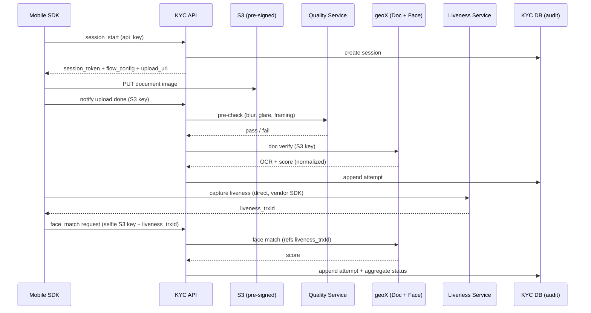
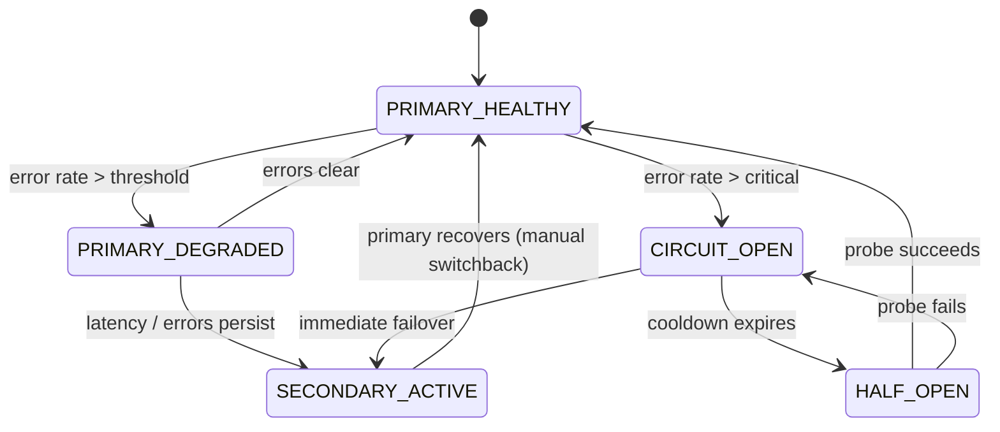
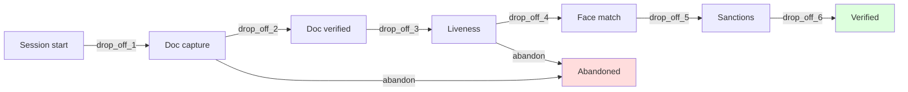

# Part 31 — Your Platform Deep Cuts (KYC / Identity Verification)

> **Scope rule:** Part 29 covers the **general theory** of KYC (ICAO, MRZ, PAD, face matching, sanctions, webhook signing, multi-tenant). This Part covers **your platform's specific implementation** — the vendor orchestration layer, the war stories, the KYC funnel observability, the per-partner decisions you've actually made. If you find yourself reading something here that's not platform-specific, it belongs in Part 29.
>
> Several items below reflect failure modes you've already lived with (SDK crash losing liveness correlation IDs, document switching mid-flow, `Duplicate partnerTrxId`, vendors returning errors in 200-bodies); formalize them — they're your war stories.

> **Sprint allocation:** Week 11 (your platform — paired with Part 29 finish). **Budget: ~10-12 hrs.**

## 31 Platform Deep Cuts — topic inventory

| # | Topic | Tags | Tier | Time | Done | Partial | Grilling | Visit Again | Notes | Resources |
|---|-------|------|------|------|------|---|---|-------------|-------|-----------|
| 1 | SEA ID schemes you actually verify — KTP / e-KTP (Indonesia), MyKad (Malaysia), NRIC / FIN (Singapore), PhilSys (Philippines), Thai national ID | 🔴 💼 🔐 | MP | 1.5 hrs | [ ] | [ ] | [ ] | [ ] | | 💻 Warm-up: tabulate the 5 SEA IDs — field layout, capture mode (front/back/both), unique gotcha per scheme (30 min) |
| 2 | Document capture modes (BOTH_SIDE, FRONT_ONLY, FRONT_BACK_SEPARATE) — your taxonomy and which doc requires what | 🔴 💼 🔐 | M | 1 hr | [ ] | [ ] | [ ] | [ ] | | |
| 3 | Document switching mid-flow — historical attempts vs effective context (your design) | 🔴 💼 🔐 | MP | 1.5 hrs | [ ] | [ ] | [ ] | [ ] | | |
| 4 | SDK ↔ backend coordination — short-lived session tokens, refresh semantics, scoped permissions | 🔴 💼 🔐 | MP | 1.5 hrs | [ ] | [ ] | [ ] | [ ] | | 💻 Warm-up: design SDK auth contract — token lifetime, refresh trigger, scope claims, revocation (30 min) |
| 5 | Pre-signed URL upload — SDK uploads directly to S3; backend never proxies binary | 🔴 💼 🔐 | MP | 1.5 hrs | [ ] | [ ] | [ ] | [ ] | | |
| 6 | Crash resilience — write-ahead correlation IDs BEFORE vendor calls; recovery / replay flows (your exact liveness-piggyback risk) | 🔴 💼 🔐 | D | 2 hrs | [ ] | [ ] | [ ] | [ ] | | |
| 7 | Idempotency on retry — never duplicate transactions when SDK retries blindly | 🔴 💼 🔐 | MP | 1.5 hrs | [ ] | [ ] | [ ] | [ ] | | |
| 8 | SDK versioning, backward compatibility, force-upgrade mechanism | 🔴 💼 🔐 | MP | 1.5 hrs | [ ] | [ ] | [ ] | [ ] | | |
| 9 | Vendor abstraction layer — adapter pattern; normalize different score scales and field names | 🔴 💼 🎯 | D | 2.5 hrs | [ ] | [ ] | [ ] | [ ] | | 💻 Warm-up: sketch the `VendorClient` interface + 2 concrete adapters (geoX, ASG-NEO) — score normalization, field mapping (45 min) |
| 10 | Vendor capability matrix — which provider supports which document × country × operation | 🔴 💼 🎯 | MP | 1.5 hrs | [ ] | [ ] | [ ] | [ ] | | |
| 11 | Vendor failover — primary + secondary; consistency cost of failing over mid-flow | 🔴 💼 🎯 | D | 2 hrs | [ ] | [ ] | [ ] | [ ] | | |
| 12 | Vendor result normalization — different vendors return different shapes; one internal schema | 🔴 💼 🎯 | MP | 1.5 hrs | [ ] | [ ] | [ ] | [ ] | | |
| 13 | Capture → upload → quality check → vendor submission pipeline | 🔴 💼 🔐 | MP | 1.5 hrs | [ ] | [ ] | [ ] | [ ] | | |
| 14 | Quality assessment pre-vendor (your ImageQualityService pattern) — reject early, save money | 🔴 💼 🔐 | MP | 1.5 hrs | [ ] | [ ] | [ ] | [ ] | | |
| 15 | Image retention policy — purge after N days; right-to-be-forgotten cascade | 🔴 💼 🔐 | MP | 1.5 hrs | [ ] | [ ] | [ ] | [ ] | | |
| 16 | Per-partner configuration — accepted documents, vendor preferences, score thresholds, capture modes | 🔴 💼 🎯 | MP | 1.5 hrs | [ ] | [ ] | [ ] | [ ] | | |
| 17 | Flow types — what operations are required per product (your `flow_type` field is this) | 🔴 💼 🎯 | MP | 1.5 hrs | [ ] | [ ] | [ ] | [ ] | | |
| 18 | KYC funnel metrics — start → document_capture → liveness → face_match → verified | 🔴 💼 🎯 | MP | 1.5 hrs | [ ] | [ ] | [ ] | [ ] | | 💻 Warm-up: define 5 funnel metrics + Datadog query for each (drop-off per step) (30 min) |
| 19 | Drop-off per step (which step loses users — usually liveness) | 🔴 💼 🎯 | M | 1 hr | [ ] | [ ] | [ ] | [ ] | | |
| 20 | Verification success rate, broken down by partner / country / document type | 🔴 💼 🎯 | MP | 1.5 hrs | [ ] | [ ] | [ ] | [ ] | | |
| 21 | FRR / FAR at your production threshold — competing concerns on your specific operating point | 🔴 💼 🎯 | MP | 1.5 hrs | [ ] | [ ] | [ ] | [ ] | | (See Part 29 row 16 for FAR/FRR theory) |
| 22 | SDK crash before vendor call → correlation IDs orphaned (your liveness-piggyback risk, formalized) | 🔴 💼 | MP | 1.5 hrs | [ ] | [ ] | [ ] | [ ] | | |
| 23 | Document switching mid-flow → status computation uses only latest doc context (your design) | 🔴 💼 | MP | 1.5 hrs | [ ] | [ ] | [ ] | [ ] | | |
| 24 | Historical-attempt schema evolution without breaking back-compat (CARD_FRONT vs CARD_BOTH legacy handling) | 🔴 💼 | MP | 1.5 hrs | [ ] | [ ] | [ ] | [ ] | | |
| 25 | Duplicate transaction IDs from partners (the `Duplicate partnerTrxId` errors in your logs) | 🔴 💼 | MP | 1.5 hrs | [ ] | [ ] | [ ] | [ ] | | |
| 26 | Vendor returning errors in 200 OK bodies — you've filtered these in Datadog | 🔴 💼 | MP | 1.5 hrs | [ ] | [ ] | [ ] | [ ] | | |
| 27 | Java `TimeoutException` propagating from vendor calls — what you do at the boundary | 🔴 💼 | MP | 1.5 hrs | [ ] | [ ] | [ ] | [ ] | | |
| 28 | Government ID gateways — Dukcapil (Indonesia), JPN (Malaysia), MyInfo / Singpass (Singapore) — your integrations | 🟠 💼 🔐 | MP | 1.5 hrs | [ ] | [ ] | [ ] | [ ] | | |
| 29 | NFC chip reading from e-passports — DSC, CSCA, country signing certs (your integration, not theory) | 🟠 💼 🔐 | D | 2 hrs | [ ] | [ ] | [ ] | [ ] | | (Cross-ref Part 29 row 8 + Part 17 PKI) |
| 30 | App attestation — Play Integrity (Android), App Attest (iOS) — your decisions, your rollout | 🟠 💼 🔐 | MP | 1.5 hrs | [ ] | [ ] | [ ] | [ ] | | |
| 31 | Root / jailbreak detection — and the arms race with bypass tooling (your stance) | 🟠 💼 🔐 | M | 1 hr | [ ] | [ ] | [ ] | [ ] | | |
| 32 | SSL / certificate pinning on mobile — rotate without bricking deployed apps | 🟠 💼 🔐 | MP | 1.5 hrs | [ ] | [ ] | [ ] | [ ] | | |
| 33 | SDK obfuscation, anti-tampering, anti-debugging — what your team chose, what you skipped | 🟠 💼 🔐 | M | 1 hr | [ ] | [ ] | [ ] | [ ] | | |
| 34 | SDK telemetry without leaking PII — what's safe to log in your pipeline | 🟠 💼 🔐 | M | 45 min | [ ] | [ ] | [ ] | [ ] | | |
| 35 | SDK bundle size — banks care about app weight; your size budget | 🟠 💼 | M | 30 min | [ ] | [ ] | [ ] | [ ] | | |
| 36 | Offline-first capture, queue-and-sync upload, time-skew handling | 🟠 💼 | MP | 1.5 hrs | [ ] | [ ] | [ ] | [ ] | | |
| 37 | Cost-aware routing — cheapest first, fall back on failure (vs accuracy-weighted) | 🟠 💼 🎯 | MP | 1.5 hrs | [ ] | [ ] | [ ] | [ ] | | |
| 38 | Shadow / A/B testing across vendors — accuracy comparison without affecting customers | 🟠 💼 🎯 | MP | 1.5 hrs | [ ] | [ ] | [ ] | [ ] | | |
| 39 | Per-vendor circuit breakers and rate limits | 🟠 💼 🎯 | MP | 1.5 hrs | [ ] | [ ] | [ ] | [ ] | | |
| 40 | Vendor credential rotation, secret hygiene | 🟠 💼 | M | 45 min | [ ] | [ ] | [ ] | [ ] | | |
| 41 | Vendor mock-mode for staging and load testing | 🟠 💼 | M | 1 hr | [ ] | [ ] | [ ] | [ ] | | |
| 42 | Vendor result caching — when safe, when dangerous (face match: never; OCR: maybe) | 🟠 💼 | M | 45 min | [ ] | [ ] | [ ] | [ ] | | |
| 43 | Billing reconciliation with vendors (the Bank Sampoerna scenario — your war story) | 🟠 💼 | MP | 1.5 hrs | [ ] | [ ] | [ ] | [ ] | | |
| 44 | Image access controls — who can view portraits? (you correctly excluded them from transaction API) | 🟠 💼 🔐 | MP | 1.5 hrs | [ ] | [ ] | [ ] | [ ] | | |
| 45 | Sensitive content redaction in logs (filtering OCR/quality responses from Datadog) | 🟠 💼 🔐 | M | 45 min | [ ] | [ ] | [ ] | [ ] | | |
| 46 | EXIF stripping — metadata leaks location and device | 🟠 💼 🔐 | M | 30 min | [ ] | [ ] | [ ] | [ ] | | |
| 47 | Chunked / resumable uploads for poor connectivity | 🟠 💼 🔐 | M | 1 hr | [ ] | [ ] | [ ] | [ ] | | |
| 48 | Per-partner data residency — Malaysian partner data stays in MY region, enforced in code | 🟠 💼 🎯 | MP | 1.5 hrs | [ ] | [ ] | [ ] | [ ] | | |
| 49 | Per-partner SLA tiers — premium vs standard | 🟠 💼 🎯 | M | 1 hr | [ ] | [ ] | [ ] | [ ] | | |
| 50 | Per-partner branding / white-label | 🟠 💼 🎯 | M | 45 min | [ ] | [ ] | [ ] | [ ] | | |
| 51 | Tenant isolation strategies for your platform — schema-per-tenant, row-level, separate DB for high-tier | 🟠 💼 🎯 | MP | 1.5 hrs | [ ] | [ ] | [ ] | [ ] | | (Cross-ref Part 29 row 35 for general theory) |
| 52 | Partner onboarding flow — credentials, sandbox, go-live checklist | 🟠 💼 | M | 1 hr | [ ] | [ ] | [ ] | [ ] | | |
| 53 | Sandbox vs production environments per partner | 🟠 💼 | M | 45 min | [ ] | [ ] | [ ] | [ ] | | |
| 54 | Per-partner audit / compliance reporting | 🟠 💼 | MP | 1.5 hrs | [ ] | [ ] | [ ] | [ ] | | |
| 55 | Per-vendor latency, error rate, cost — your Datadog dashboards | 🟠 💼 🎯 | M | 1 hr | [ ] | [ ] | [ ] | [ ] | | |
| 56 | Per-partner conversion rate | 🟠 💼 🎯 | M | 45 min | [ ] | [ ] | [ ] | [ ] | | |
| 57 | Time-to-verified (P50 / P90 / P99) | 🟠 💼 🎯 | M | 45 min | [ ] | [ ] | [ ] | [ ] | | |
| 58 | Operations dashboards for compliance team (cases under review, aging) | 🟠 💼 | M | 1 hr | [ ] | [ ] | [ ] | [ ] | | |
| 59 | Manual review queue depth, reviewer throughput | 🟠 💼 | M | 45 min | [ ] | [ ] | [ ] | [ ] | | |
| 60 | Vendor accuracy regression without notice (silent quality drop after their model update) | 🟠 💼 | MP | 1.5 hrs | [ ] | [ ] | [ ] | [ ] | | |
| 61 | Cross-region replication lag during partner read-after-write | 🟠 💼 | MP | 1.5 hrs | [ ] | [ ] | [ ] | [ ] | | |
| 62 | Partial verification completion — user finishes some ops, abandons, returns days later | 🟠 💼 | MP | 1.5 hrs | [ ] | [ ] | [ ] | [ ] | | |
| 63 | Time skew between SDK and backend in offline-then-sync flows | 🟠 💼 | M | 45 min | [ ] | [ ] | [ ] | [ ] | | |
| 64 | Vendor SLA breach during peak — graceful-degradation strategy | 🟠 💼 | MP | 1.5 hrs | [ ] | [ ] | [ ] | [ ] | | |
| 65 | Compliance reviewer override breaking automated state-machine assumptions | 🟠 💼 | M | 45 min | [ ] | [ ] | [ ] | [ ] | | |
| 66 | Invalid base64 image strings from SDK (in your filtered errors) — defensive parsing | 🟠 💼 | M | 30 min | [ ] | [ ] | [ ] | [ ] | | |
| 67 | ASG-NEO response not parseable as JSON — schema versioning between services | 🟠 💼 | M | 45 min | [ ] | [ ] | [ ] | [ ] | | |
| 68 | Hardware-backed key storage — Android Keystore, iOS Secure Enclave (your usage) | 🟡 🔐 | M | 45 min | [ ] | [ ] | [ ] | [ ] | | |
| 69 | Federated vendor SLAs / quotas — government gateways (Dukcapil, JPN) need special handling | 🟡 | M | 45 min | [ ] | [ ] | [ ] | [ ] | | |
| 70 | Image watermarking / fingerprinting for audit forensics | 🟡 🔐 | M | 30 min | [ ] | [ ] | [ ] | [ ] | | |
| 71 | Per-partner quota / fair-use enforcement | 🟡 | M | 45 min | [ ] | [ ] | [ ] | [ ] | | |

## Time summary

| Scope | Hours (zero baseline) | Weeks @ 10–12 hrs/wk | Actual time |
|-------|-----------------------|----------------------|-------------|
| 🔴 MUST only (Sprint priority — 3-month plan) | ~42 hrs | ~3.8 wk | |
| 🔴 + 🟠 HIGH (must + high — senior coverage) | ~85 hrs | ~7.7 wk | |
| Full Part (all items including 🟡) | ~88 hrs | ~8 wk | |

> Trimmed from 88 rows down to 71 by removing items that duplicated Part 29 fundamentals (doc anatomy, ICAO, MRZ theory, 1:1 vs 1:N, FAR/FRR theory, PAD theory, NIST FRVT, biometric template generic, deepfake-defense generic, driver's-licence generic, iris/fingerprint/voice). Anything left here is **your platform's actual implementation, decision, or war story**. For the general theory, refer to Part 29.

## Key diagrams

### SDK ↔ orchestrator ↔ vendor flow (your actual platform shape)

### Vendor failover state

### KYC funnel (your observability shape)

## Frequently asked

1. **Q:** Walk me through what happens from the moment a user opens the SDK to "Verified."
   - **Why asked:** Most senior-canonical question for your platform. Cover: session start (token + flow config), document upload (pre-signed S3), quality pre-check (server-side), doc verify vendor call, liveness capture (vendor SDK direct), face match (orchestrator call with liveness ref), sanctions screening, status aggregation, partner notification. State each hop's failure mode briefly.
2. **Q:** Your liveness service is independent of geoX. How do you guarantee billing reconciliation across both, given the SDK might crash between them?
   - **Gotcha-style question.** Two independent billing events. Mitigation: server-side write-ahead of the liveness trxId BEFORE returning to SDK; on SDK restart, recover from server. For reconciliation: periodic job comparing your `kyc_operation_attempts` against each vendor's billing report; surface mismatches as compliance/finance tickets. Accept some unreconciled cases as cost-of-doing-business; cap with monitoring.
3. **Q:** How would you redesign to support a new vendor with 30% better accuracy but 2× latency?
   - **Why asked:** Vendor-tradeoff judgment. Options: (1) Route by tenant — high-stakes partners get higher-accuracy vendor, low-stakes get faster. (2) Two-stage: fast vendor first, if score is in ambiguous band, re-check with accurate vendor. (3) Async result delivery: SDK doesn't block on the slow vendor, partner gets webhook later. Decision depends on per-tenant latency SLA.
4. **Q:** When does a partner want sync (polling) vs async (webhook)? Where does each break?
   - **Why asked:** Your literal architecture choice. Sync (polling `GET /verify/status`): simpler for partner, no webhook infra needed, but you bear polling load. Async (webhook): partner needs HTTPS endpoint, signature verification, replay defense. Webhook breaks if partner's endpoint is down (need retry + DLQ + manual replay). Polling breaks if partner polls too aggressively (per-tenant rate limit needed).
5. **Q:** Walk through the design for `/verify/status` — why precedence ordering, why no FAILED state, what happens with stale historical attempts.
   - **Why asked:** Your literal API contract. Precedence: FAILED > IN_PROGRESS > ERROR > REVIEW > VERIFIED — terminal wins, user-incomplete next, system error, ambiguity, success. No FAILED in practice: most rejections are REVIEW (analyst decides), only true terminal blocks (e.g., sanctions confirmed hit) reach FAILED. Stale historical attempts: filtered by `document_capture_mode` + latest document context — old attempts on a since-switched document don't influence current status.
6. **Q:** Explain your state machine. Why is FAILED not reliably reachable, and what does that mean for clients?
   - **Why asked:** State-machine literacy. FAILED is terminal-rejection, but operationally most rejections route through REVIEW (analyst). So FAILED is rare. Client implication: don't poll for FAILED as the rejection signal — poll for REVIEW or check field-level rejection codes. Document this in your partner contract.
7. **Q:** Your face-match P99 latency just doubled. Walk me through your debug.
   - **Why asked:** SRE judgment. Order: (1) Datadog P99 trace — which span dominates? (2) Per-vendor latency — is geoX slow, or your wrapper? (3) Connection pool exhaustion? (4) DB query slow on attempt-write? (5) Cache miss / cold start? (6) Network — cross-region hop suddenly? Hypothesis order matters: cheap checks first.
8. **Q:** geoX goes down for 2 hours during peak. What's the customer experience? What's your fallback?
   - **Why asked:** Resilience design. Options: (1) Hard fail with clear error code; partner retries later. (2) Failover to secondary vendor (if onboarded). (3) Queue for async processing; SDK shows "processing — you'll get notified." (4) Graceful degradation: skip face match, mark as REVIEW for manual decision. Tradeoff: customer trust (errors are bad) vs. accuracy (manual review is slow). Document the choice; align with partner SLAs.

## Trick questions / gotchas

1. **Q:** A partner reports a leaked API key. Walk me through detection, rotation, customer comms, blast-radius limiting.
   - **Gotcha:** Multi-step incident response. Detection: anomalous traffic pattern from new IPs, or partner self-report. Rotation: provision new key (don't immediately revoke old — co-existence period). Comms: partner-private channel with rotation deadline. Blast radius: while keys co-exist, monitor old key usage; after deadline, revoke. Audit: scan logs for misuse during exposure window. Post-mortem: how did it leak? Was it in source code, CI logs, Slack?
2. **Q:** Indonesian regulators ask you to prove no Indonesian KYC data ever left Indonesia. What evidence do you produce?
   - **Gotcha:** Data residency proof. Evidence: (1) Architecture diagram showing per-tenant region pinning. (2) Code-level enforcement — tenant config has region claim, request router rejects cross-region routing. (3) Audit logs proving no cross-region API calls for Indonesian tenants. (4) Backup region policy (Indonesian data → Indonesian backups). (5) Vendor contracts confirming sub-processors are in-region. (6) Penetration test result confirming no leakage path. Documentary + technical evidence both required.
3. **Q:** Your kill switch is in code: `if (KILL_SWITCH_ENABLED) return; ...`. The bug is in code BEFORE the kill switch. What's the gap?
   - **Gotcha:** Kill switch placement. If bug is upstream of the switch check, switch doesn't save you. Defense-in-depth: kill switch should be FIRST-LINE in controller, ideally even at the API gateway. Plus a circuit breaker for downstream calls. Plus a feature-flag-controlled rollback path.
4. **Q:** You discover Vendor B is silently 5% less accurate than Vendor A but 40% cheaper. How do you decide what to route?
   - **Gotcha:** Cost vs accuracy tradeoff. Per-tenant decision: high-stakes (banking onboarding) → accuracy wins. Low-stakes (re-verification) → cost wins. Measurement: shadow-test Vendor B on real traffic without acting on its score; compare against Vendor A ground truth. Decision matrix per partner. Document. Make the configuration visible to partner (some partners will pay more for accuracy).
5. **Q:** What stops an attacker replaying a successful liveness video they captured once?
   - **Gotcha:** Liveness replay defense. (1) Single-use challenge tokens — server issues nonce; SDK includes nonce in capture submission; token is consumed. (2) Server-side liveness binding — liveness session is tied to a specific user/device/session; can't be replayed across sessions. (3) Time-bound — captures older than N minutes are rejected. (4) Vendor-side replay detection (some vendors fingerprint videos). Defense-in-depth, no single defense is sufficient.

## Mastery candidates (top 3–5 from this Part — suggestions, not commitments)

- **SDK ↔ orchestrator architecture deep dive** (~8 hrs rows 4–8 + 22–23) — your literal half-system. Whiteboard from memory; defend every choice; cover SDK crash recovery, idempotency, force-upgrade.
- **Vendor orchestration end-to-end** (~10 hrs rows 9–12 + 37–43) — adapter pattern, failover, capability matrix, cost-aware routing, billing reconciliation. The Bank Sampoerna scenario is your interview anecdote.
- **Multi-tenant + data residency enforcement** (~6 hrs rows 16–17 + 48 + 51) — code-level enforcement of region pinning. DC-JKT vs AWS-SG. Document the proof you'd produce for a regulator.
- **KYC funnel + observability** (~5 hrs rows 18–21 + 55–59) — Datadog queries, drop-off detection, P99 latency debug runbook. Senior-eng-grade observability.
- **Failure-mode war stories formalized** (~6 hrs rows 22–27) — write each as a STAR-shaped story for behavioral interviews. SDK crash, doc switch, duplicate trxId, 200-OK-with-error, TimeoutException boundary handling.

## Hands-on exercises (Practice + Advanced)

Warm-up platform exercises are listed inline in the topic-table Resources column (counted in main Time summary). Longer exercises below are tracked separately.

### Practice — mid-level (~60-90 min each)

1. **VendorClient adapter pair** (~90 min) — Spring service with `VendorClient` interface + 2 concrete adapters (mock geoX, mock ASG-NEO). Each adapter normalizes a different response shape to one internal `VerificationResult` schema. Unit-test the normalization.
2. **Per-tenant config + region pinning** (~75 min) — DB table `tenant_config` with `tenant_id`, `region`, `enabled_ops`, `flow_type`. Request filter reads `X-Tenant-ID` header, loads config, rejects request if region doesn't match server's region. Test cross-region rejection.
3. **Pre-signed S3 upload flow** (~60 min) — Spring endpoint issues pre-signed URL (AWS SDK). SDK (curl in this exercise) uploads directly. Server-side callback `POST /upload-complete` verifies object exists in S3. Test happy path + missing object.

### Advanced — senior-grade depth (~90+ min each)

4. **Vendor failover with circuit breaker** (~120 min) — Resilience4j circuit breaker around two vendor clients. Primary fails (mock 5xx after N requests), circuit opens, requests route to secondary. On primary recovery (probe succeeds), switch back. Surface per-vendor success metrics.
5. **KYC status aggregator with doc-switch handling** (~150 min) — DB tables `kyc_status` (with `document_capture_mode`), `kyc_operation_attempts` (linked to a specific doc context). Implement aggregation: load latest attempt per operation, filter by current doc context, apply precedence (FAILED > IN_PROGRESS > ERROR > REVIEW > VERIFIED). Test: user switches doc mid-flow; old attempts must NOT influence current status.
6. **Webhook delivery + replay defense end-to-end** (~150 min) — outbox table + worker. Sign with HMAC-SHA256, include timestamp + nonce. Build a receiver simulator that validates signature, rejects replays (nonce table with TTL), accepts valid. Retry with exponential backoff + jitter; max 5 attempts → DLQ. Manual replay endpoint.

### Hands-on time summary (Practice + Advanced only)

| Tier | Total time | Weeks @ 10–12 hrs/wk | Actual time |
|------|------------|----------------------|-------------|
| Practice (mid-level) | ~3.75 hrs | ~0.35 wk | |
| Advanced (senior-grade) | ~7 hrs | ~0.65 wk | |
| **Combined hands-on (Practice + Advanced)** | **~10.75 hrs** | **~1 wk** | |

> Warm-up exercises (counted in main Time summary above) total ~2.5 hrs for Part 31 across 4 in-table warm-ups.

## Cross-questions (self-audit — interview rehearsal)

Practice answering these out loud, fluently, in under 2 minutes each. These are also tracked in `reference/PracticeProblems.md`.

### Architecture & flow

1. Walk me through what happens from the moment a user opens the SDK to "Verified". Where does each piece of state live, and what fails if any single hop goes down?
2. Your liveness service is independent of geoX. How do you guarantee billing reconciliation across both, given that the SDK might crash between them?
3. How would you redesign to support a new vendor with 30% better accuracy but 2× latency?
4. When does a partner want sync (polling) vs async (webhook)? Where does each break?
5. Walk me through your design for the `/verify/status` API — why precedence ordering, why no FAILED state, what happens with stale historical attempts.

### Data & state

6. Explain your state machine. Why these states? Why is FAILED not reliably reachable, and what does that mean for clients?
7. How do you handle a partner asking for a transaction from 2 years ago after a schema change?
8. Why didn't you use event sourcing for KYC cases? What would change if you did?
9. How do you implement right-to-be-forgotten when verification data is also audit data the regulator needs?
10. How does `document_capture_mode` evolve as a user switches documents, and what invariants do you protect?

### Scale & performance

11. Design for 10× current TPS across 3 SEA regions. What changes structurally?
12. Your face-match P99 latency just doubled. Walk me through your debug — what dashboards, what tooling, what hypothesis order?
13. Estimate per-transaction cost (compute + storage + vendor + transfer). Where would you cut 30% without hurting accuracy?
14. A partner's go-live spikes you to 5× normal traffic. What gives first? What's your runbook?

### Security & SDK

15. How is the SDK ↔ backend channel secured? What stops a forged session token?
16. What stops an attacker replaying a successful liveness video they captured once?
17. A partner reports a leaked API key. Walk me through detection, rotation, customer comms, blast-radius limiting.
18. How is image data protected from a rogue insider with DB access?
19. How would you implement SDK certificate pinning and rotate the pin without bricking older app versions?

### Compliance & ops

20. Indonesian regulators ask you to prove no Indonesian KYC data ever left Indonesia. What evidence do you produce?
21. A bank requests an audit log of every internal user who accessed customer X's portrait image. Can you produce it? How quickly?
22. Architect compliance reporting that doesn't grind production OLTP to a halt.
23. What's your retention policy and how is it *enforced* in code (not just docs)?

### Vendor

24. geoX goes down for 2 hours during peak. What's the customer experience? What's your fallback?
25. You discover Vendor B is silently 5% less accurate than Vendor A but 40% cheaper. How do you decide what to route, and how do you measure it without exposing customers to bad outcomes?
26. A new vendor offers face match at half the price. Walk me through onboarding them — accuracy validation, shadow testing, gradual rollout, kill switch.

## Quick recall

**Q. End-to-end SDK flow — major hops?**
A. Session start (token + flow config) → doc upload (pre-signed S3) → quality pre-check → doc verify (vendor) → liveness (separate vendor) → face match (orchestrator, refs liveness) → sanctions → status aggregation → partner notification (webhook OR polling).

**Q. SDK crash between liveness and face match — defense?**
A. Write-ahead correlation IDs server-side BEFORE vendor call. On SDK restart, recover from server. Idempotency keys on vendor calls so re-attempt returns the same trxId.

**Q. Vendor returns 200 OK with error body — lesson?**
A. Never trust HTTP status alone. Parse body. Define normalized success criteria per vendor in the adapter layer. Filter false-200s in Datadog.

**Q. Document switch mid-flow — invariant?**
A. Historical attempts preserved (audit) but excluded from current status computation. `document_capture_mode` on `kyc_status` tracks current doc; aggregation filters by latest doc context.

**Q. Per-tenant data residency — how enforced in code?**
A. Tenant config has region claim. Request router reads tenant ID from API key / JWT / header, loads config, rejects if request hits a region that doesn't match tenant's region. Backup policy mirrors region. Audit logs prove no cross-region traffic.

**Q. Liveness video replay defense?**
A. Single-use challenge nonce, server-bound liveness session, time-bound capture window, vendor-side replay detection. Defense in depth — no single defense is sufficient.

**Q. FAILED is rare — why?**
A. Most rejections route through REVIEW (analyst decides). Only terminal blocks (e.g., confirmed sanctions hit) reach FAILED. Clients should poll REVIEW + field-level codes, not just FAILED.

**Q. What did Part 31 STOP covering after the trim?**
A. General theory rows that duplicated Part 29: doc anatomy, ICAO 9303 spec, 1:1 vs 1:N theory, FAR/FRR theory, PAD/ISO 30107 theory, NIST FRVT, biometric template generic, deepfake-defense generic. For those, read Part 29.
